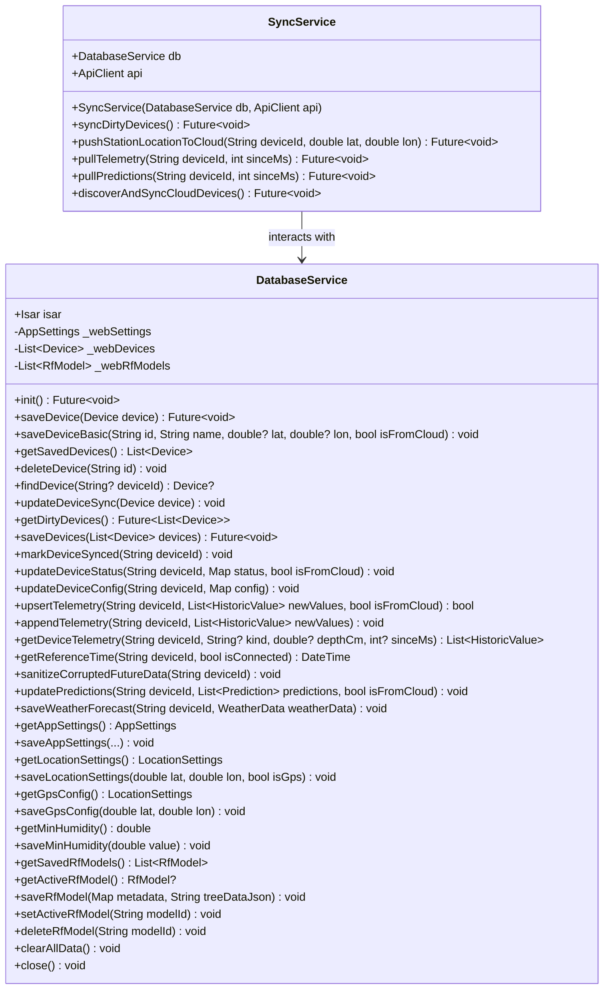
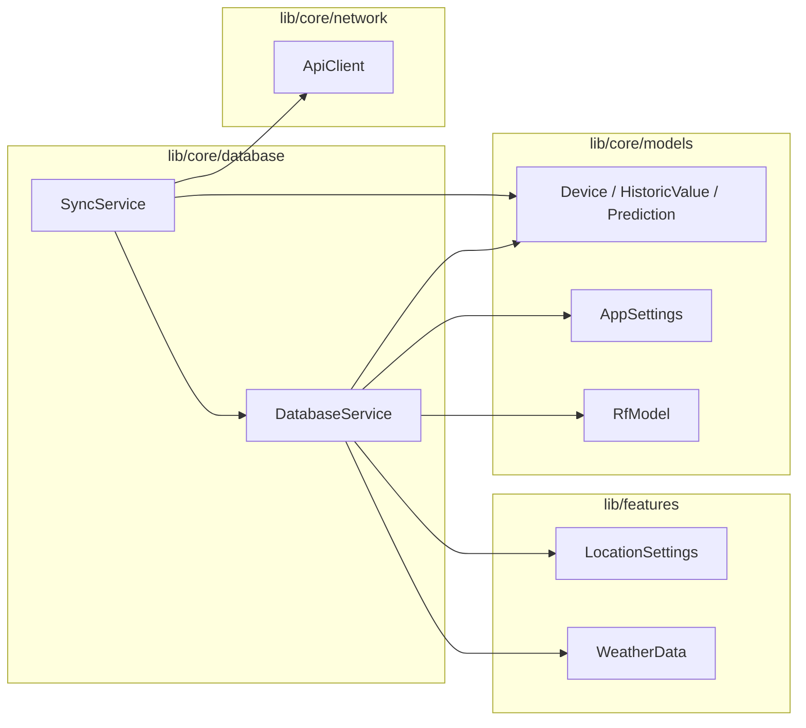
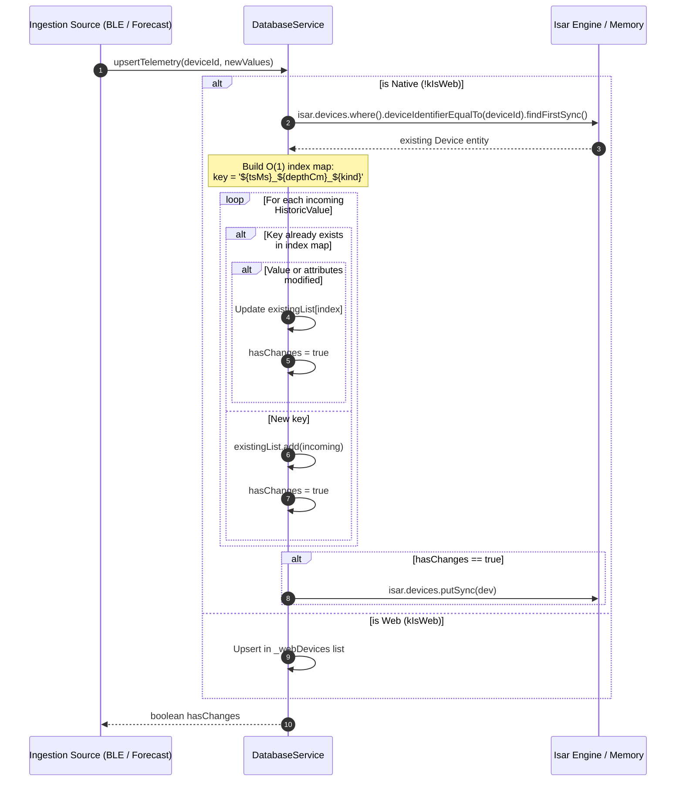
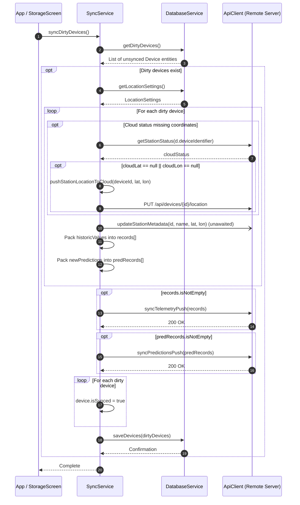
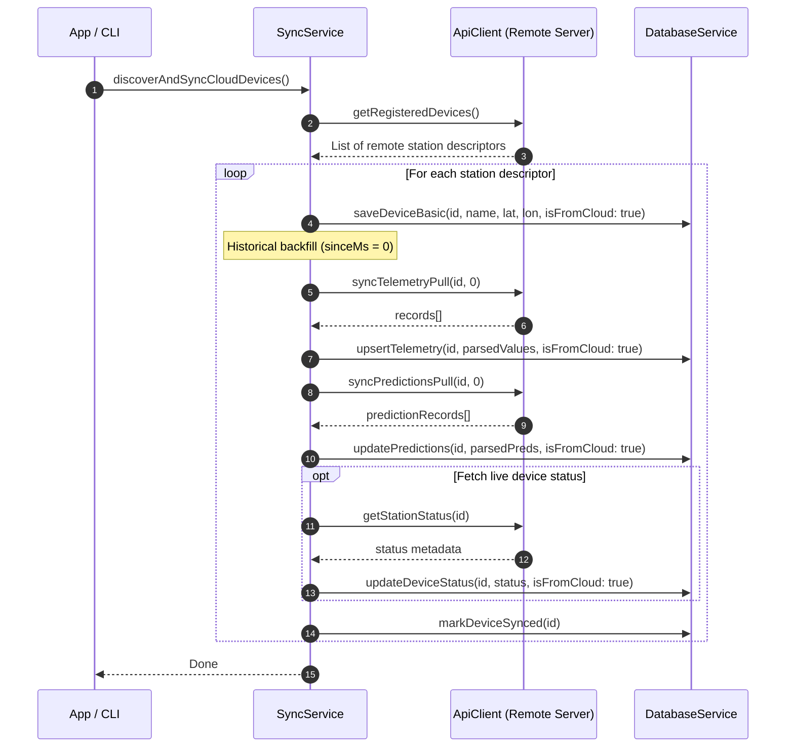

# C4 Code-Level Architecture Documentation: `lib/core/database`

This document provides a detailed C4 Code-level (Component & Code) architectural description of the database and data synchronization subsystem located in [`lib/core/database`](file:///C:/Users/CrackoPattt88/Proyectos/tfm_app/lib/core/database).

---

## 1. Overview Section

The `lib/core/database` module serves as the primary persistence, caching, and cloud-synchronization engine for the application. It manages local persistence across mobile, desktop, and web environments, isolates database transactions from upper UI and business-logic layers, and synchronizes station telemetry, predictions, and operational configuration with the remote cloud infrastructure.

```
┌────────────────────────────────────────────────────────────────────────────┐
│                             lib/core/database                              │
│                                                                            │
│   ┌───────────────────────────────┐     ┌──────────────────────────────┐   │
│   │        DatabaseService        │◄────┤         SyncService          │   │
│   │      (app_database.dart)      │     │        (db_sync.dart)        │   │
│   └───────────────┬───────────────┘     └──────────────┬───────────────┘   │
└───────────────────┼────────────────────────────────────┼───────────────────┘
                    ▼                                    ▼
       ┌────────────────────────┐              ┌──────────────────┐
       │   Isar NoSQL Engine    │              │    ApiClient     │
       │ (or In-Memory Web Map) │              │  (Cloud REST API)│
       └────────────────────────┘              └──────────────────┘
```

### Key Architectural Characteristics
- **Dual Persistence Strategy (Native vs. Web)**:
  - **Native Platforms (Android, iOS, Linux, macOS, Windows)**: Backed by the high-performance, embedded ACID-compliant NoSQL engine [`Isar`](https://github.com/isar/isar) via [`isar_community`](https://pub.dev/packages/isar_community), using schemas generated from Dart models (`DeviceSchema`, `AppSettingsSchema`, `RfModelSchema`).
  - **Web Platform (`kIsWeb`)**: Pure in-memory fallback collections (`_webDevices`, `_webSettings`, `_webRfModels`), bypassing Isar FFI / native C binaries to maintain web compatibility without crashing.
- **Deduplication and Idempotent Telemetry Upsert**:
  - Telemetry series are ingested via an $O(1)$ composite index key hash table (`${tsMs}_${depthCm}_${kind}`) ensuring duplicate timestamps and sensor values are updated in place rather than cloned.
- **Temporal Sanitization and Drift Correction**:
  - Contains pruning routines to discard invalid future timestamps (`tsMs > DateTime.now()`) resulting from real-time clock (RTC) synchronization glitches on edge devices (Raspberry Pi Pico / ESP32).
- **Two-Way Synchronization**:
  - Coordinates dirty record extraction, coordinates propagation, batch telemetry/prediction pushes, and remote historical backfills via [`SyncService`](file:///C:/Users/CrackoPattt88/Proyectos/tfm_app/lib/core/database/db_sync.dart#L8-L256).

---

## 2. Code Elements Section

The module is comprised of two core Dart source files:
1. [`app_database.dart`](file:///C:/Users/CrackoPattt88/Proyectos/tfm_app/lib/core/database/app_database.dart): Houses [`DatabaseService`](file:///C:/Users/CrackoPattt88/Proyectos/tfm_app/lib/core/database/app_database.dart#L10-L911).
2. [`db_sync.dart`](file:///C:/Users/CrackoPattt88/Proyectos/tfm_app/lib/core/database/db_sync.dart): Houses [`SyncService`](file:///C:/Users/CrackoPattt88/Proyectos/tfm_app/lib/core/database/db_sync.dart#L8-L256).



---

### 2.1 File: `app_database.dart`

**Path**: [`lib/core/database/app_database.dart`](file:///C:/Users/CrackoPattt88/Proyectos/tfm_app/lib/core/database/app_database.dart)  
**Main Class**: [`DatabaseService`](file:///C:/Users/CrackoPattt88/Proyectos/tfm_app/lib/core/database/app_database.dart#L10-L911)

#### Responsibilities
- Initializes the embedded Isar NoSQL database schemas or configures web in-memory collections.
- Provides CRUD operations and transactions for [`Device`](file:///C:/Users/CrackoPattt88/Proyectos/tfm_app/lib/core/models/device.dart#L6-L38), [`AppSettings`](file:///C:/Users/CrackoPattt88/Proyectos/tfm_app/lib/core/models/app_settings.dart#L5-L39), and [`RfModel`](file:///C:/Users/CrackoPattt88/Proyectos/tfm_app/lib/core/models/app_rf_model.dart#L5-L20).
- Implements high-throughput telemetry ingestion with deduplication and historical merging.
- Performs temporal validation and pruning on corrupted future timestamps.
- Manages Random Forest machine learning tree representations and metadata.

#### Fields & Properties
| Member | Type | Accessibility | Description |
| :--- | :--- | :--- | :--- |
| [`isar`](file:///C:/Users/CrackoPattt88/Proyectos/tfm_app/lib/core/database/app_database.dart#L11) | `late final Isar` | `public` | The underlying native Isar database instance. Not used when running in web mode. |
| [`_webSettings`](file:///C:/Users/CrackoPattt88/Proyectos/tfm_app/lib/core/database/app_database.dart#L14) | `late AppSettings` | `private` | In-memory singleton settings instance used when `kIsWeb == true`. |
| [`_webDevices`](file:///C:/Users/CrackoPattt88/Proyectos/tfm_app/lib/core/database/app_database.dart#L15) | `final List<Device>` | `private` | In-memory list simulating the device collection under web runtime. |
| [`_webRfModels`](file:///C:/Users/CrackoPattt88/Proyectos/tfm_app/lib/core/database/app_database.dart#L16) | `final List<RfModel>` | `private` | In-memory list storing parsed Random Forest model trees under web runtime. |

#### Methods Breakdown

##### Database Lifecycle & Setup
- [`init()`](file:///C:/Users/CrackoPattt88/Proyectos/tfm_app/lib/core/database/app_database.dart#L18-L45)
  - **Return**: `Future<void>`
  - **Description**: Bootstraps the database engine. If running on native platforms (`!kIsWeb`), triggers `Isar.initializeIsarCore(download: true)`, locates the documents directory via `getApplicationDocumentsDirectory()`, opens collections (`DeviceSchema`, `AppSettingsSchema`, `RfModelSchema`), and bootstraps default [`AppSettings`](file:///C:/Users/CrackoPattt88/Proyectos/tfm_app/lib/core/models/app_settings.dart#L5-L39) if empty. If running on web, initializes `_webSettings`.
- [`close()`](file:///C:/Users/CrackoPattt88/Proyectos/tfm_app/lib/core/database/app_database.dart#L772-L775)
  - **Return**: `void`
  - **Description**: Safely disposes and closes the native Isar instance (no-op on web).
- [`clearAllData()`](file:///C:/Users/CrackoPattt88/Proyectos/tfm_app/lib/core/database/app_database.dart#L762-L770)
  - **Return**: `void`
  - **Description**: Clears all persisted devices from Isar (`isar.devices.clearSync()`) or clears `_webDevices`.

##### Station & Device Operations
- [`saveDevice(Device device)`](file:///C:/Users/CrackoPattt88/Proyectos/tfm_app/lib/core/database/app_database.dart#L48-L70)
  - **Return**: `Future<void>`
  - **Description**: Asynchronously inserts or updates a [`Device`](file:///C:/Users/CrackoPattt88/Proyectos/tfm_app/lib/core/models/device.dart#L6-L38), marking `isSynced = false` and refreshing `updatedAt`. Executes within an asynchronous write transaction `isar.writeTxn()`.
- [`saveDeviceBasic(String id, String name, {double? lat, double? lon, bool isFromCloud = false})`](file:///C:/Users/CrackoPattt88/Proyectos/tfm_app/lib/core/database/app_database.dart#L72-L135)
  - **Return**: `void`
  - **Description**: Synchronously provisions a device stub or updates its basic metadata. If the station already exists with a customized/BLE name, it preserves that name instead of overwriting it with generic cloud labels (e.g. "Unknown Station", "Pico ...").
- [`getSavedDevices()`](file:///C:/Users/CrackoPattt88/Proyectos/tfm_app/lib/core/database/app_database.dart#L268-L271)
  - **Return**: `List<Device>`
  - **Description**: Retrieves all saved devices synchronously.
- [`deleteDevice(String id)`](file:///C:/Users/CrackoPattt88/Proyectos/tfm_app/lib/core/database/app_database.dart#L273-L285)
  - **Return**: `void`
  - **Description**: Finds the device matching `deviceIdentifier` and removes it within a synchronous write transaction.
- [`findDevice(String? deviceId)`](file:///C:/Users/CrackoPattt88/Proyectos/tfm_app/lib/core/database/app_database.dart#L850-L864)
  - **Return**: `Device?`
  - **Description**: Synchronously searches for a device by its identifier. If `deviceId` is null, returns the first available device or null.
- [`updateDeviceSync(Device device)`](file:///C:/Users/CrackoPattt88/Proyectos/tfm_app/lib/core/database/app_database.dart#L866-L879)
  - **Return**: `void`
  - **Description**: Direct synchronous write of a modified [`Device`](file:///C:/Users/CrackoPattt88/Proyectos/tfm_app/lib/core/models/device.dart#L6-L38) entity to storage.
- [`getDirtyDevices()`](file:///C:/Users/CrackoPattt88/Proyectos/tfm_app/lib/core/database/app_database.dart#L881-L886)
  - **Return**: `Future<List<Device>>`
  - **Description**: Queries for all devices where `isSynced == false` to prepare payloads for cloud push.
- [`saveDevices(List<Device> devices)`](file:///C:/Users/CrackoPattt88/Proyectos/tfm_app/lib/core/database/app_database.dart#L888-L910)
  - **Return**: `Future<void>`
  - **Description**: Batch asynchronous upsert of multiple [`Device`](file:///C:/Users/CrackoPattt88/Proyectos/tfm_app/lib/core/models/device.dart#L6-L38) instances inside a single transaction.
- [`markDeviceSynced(String deviceId)`](file:///C:/Users/CrackoPattt88/Proyectos/tfm_app/lib/core/database/app_database.dart#L552-L585)
  - **Return**: `void`
  - **Description**: Sets `isSynced = true`, stamps `latestSynchronizedTime = DateTime.now()`, and updates the device record.
- [`updateDeviceStatus(String deviceId, Map<String, dynamic> status, {bool isFromCloud = false})`](file:///C:/Users/CrackoPattt88/Proyectos/tfm_app/lib/core/database/app_database.dart#L587-L638)
  - **Return**: `void`
  - **Description**: Parses latitude and longitude from dynamic map payloads, updating geolocation and sync timestamps.
- [`updateDeviceConfig(String deviceId, Map<String, dynamic> config)`](file:///C:/Users/CrackoPattt88/Proyectos/tfm_app/lib/core/database/app_database.dart#L640-L681)
  - **Return**: `void`
  - **Description**: Updates hardware and algorithmic flags (`localInferenceCapabilities`, `loraEnabled`) from a configuration map.

##### Telemetry & Forecasting Management
- [`upsertTelemetry(String deviceId, List<HistoricValue> newValues, {bool isFromCloud = false})`](file:///C:/Users/CrackoPattt88/Proyectos/tfm_app/lib/core/database/app_database.dart#L291-L403)
  - **Return**: `bool` (returns `true` if any new points or value changes were stored)
  - **Description**: Performs deduplication against existing telemetry in $O(1)$ lookup time using a hash index:
    $$\text{Key} = \text{tsMs} \parallel \text{"\_"} \parallel \text{depthCm} \parallel \text{"\_"} \parallel \text{kind}$$
    If an existing telemetry record matches the composite key, its numeric value, sensor port, and kind are updated if changed; otherwise, the new value is appended.
- [`appendTelemetry(String deviceId, List<HistoricValue> newValues)`](file:///C:/Users/CrackoPattt88/Proyectos/tfm_app/lib/core/database/app_database.dart#L405-L407)
  - **Return**: `void`
  - **Description**: Convenience wrapper for local telemetry ingestion with `isFromCloud: false`.
- [`getDeviceTelemetry(String deviceId, {String? kind, double? depthCm, int? sinceMs})`](file:///C:/Users/CrackoPattt88/Proyectos/tfm_app/lib/core/database/app_database.dart#L409-L440)
  - **Return**: `List<HistoricValue>`
  - **Description**: Queries historical sensor records filtered in-memory by sensor `kind`, `depthCm`, and minimum timestamp `sinceMs`.
- [`saveWeatherForecast(String deviceId, WeatherData weatherData)`](file:///C:/Users/CrackoPattt88/Proyectos/tfm_app/lib/core/database/app_database.dart#L730-L760)
  - **Return**: `void`
  - **Description**: Deconstructs [`WeatherData`](file:///C:/Users/CrackoPattt88/Proyectos/tfm_app/lib/features/weather/weather_data.dart#L1-L29) arrays (`temperature2m`, `relativeHumidity2m`, `shortwaveRadiation`, `precipitation`) into individual [`HistoricValue`](file:///C:/Users/CrackoPattt88/Proyectos/tfm_app/lib/core/models/device.dart#L40-L47) telemetry entries and routes them into `upsertTelemetry`.

##### Temporal Integrity & Sanitization
- [`getReferenceTime(String deviceId, {bool isConnected = false})`](file:///C:/Users/CrackoPattt88/Proyectos/tfm_app/lib/core/database/app_database.dart#L446-L509)
  - **Return**: `DateTime`
  - **Description**: Resolves the accurate baseline timestamp for the station. Ignores corrupt future timestamps ($t > \text{now}$), finds the maximum valid past telemetry timestamp, or defaults to live time if currently connected / recently synchronized within 2 hours.
- [`sanitizeCorruptedFutureData(String deviceId)`](file:///C:/Users/CrackoPattt88/Proyectos/tfm_app/lib/core/database/app_database.dart#L512-L550)
  - **Return**: `void`
  - **Description**: Detects and purges rogue telemetry entries with timestamps ahead of local device clock (`tsMs > DateTime.now().millisecondsSinceEpoch`), logging the count of pruned records.

##### Predictions Storage
- [`updatePredictions(String deviceId, List<Prediction> predictions, {bool isFromCloud = false})`](file:///C:/Users/CrackoPattt88/Proyectos/tfm_app/lib/core/database/app_database.dart#L683-L728)
  - **Return**: `void`
  - **Description**: Archives active `newPredictions` into `previousPredictions`, stores the incoming predictions list, updates `latestInferenceTriggerDate`, and updates sync flags.

##### Settings & Configuration
- [`getAppSettings()`](file:///C:/Users/CrackoPattt88/Proyectos/tfm_app/lib/core/database/app_database.dart#L137-L140)
  - **Return**: `AppSettings`
  - **Description**: Retrieves the singleton settings entity (Isar ID 1).
- [`saveAppSettings(...)`](file:///C:/Users/CrackoPattt88/Proyectos/tfm_app/lib/core/database/app_database.dart#L142-L208)
  - **Return**: `void`
  - **Description**: Atomically updates configuration parameters: UI theme, server URL/port/scheme/API key, sync interval, ML model selections, agronomic day window (`agronomicDayStart`, `agronomicDayEnd`), and inference flags.
- [`getLocationSettings()`](file:///C:/Users/CrackoPattt88/Proyectos/tfm_app/lib/core/database/app_database.dart#L210-L213) & [`saveLocationSettings(...)`](file:///C:/Users/CrackoPattt88/Proyectos/tfm_app/lib/core/database/app_database.dart#L215-L230)
  - **Description**: Manages manual coordinates and GPS activation toggle as [`LocationSettings`](file:///C:/Users/CrackoPattt88/Proyectos/tfm_app/lib/features/location/location_settings.dart#L1-L7).
- [`getGpsConfig()`](file:///C:/Users/CrackoPattt88/Proyectos/tfm_app/lib/core/database/app_database.dart#L232-L235) & [`saveGpsConfig(...)`](file:///C:/Users/CrackoPattt88/Proyectos/tfm_app/lib/core/database/app_database.dart#L237-L250)
  - **Description**: Persists last recorded device GPS coordinates.
- [`getMinHumidity()`](file:///C:/Users/CrackoPattt88/Proyectos/tfm_app/lib/core/database/app_database.dart#L252-L254) & [`saveMinHumidity(...)`](file:///C:/Users/CrackoPattt88/Proyectos/tfm_app/lib/core/database/app_database.dart#L256-L266)
  - **Description**: Configures agronomic soil moisture trigger point.

##### Random Forest ML Model Storage
- [`getSavedRfModels()`](file:///C:/Users/CrackoPattt88/Proyectos/tfm_app/lib/core/database/app_database.dart#L778-L781)
  - **Return**: `List<RfModel>`
  - **Description**: Synchronously returns all stored Random Forest model schemas.
- [`getActiveRfModel()`](file:///C:/Users/CrackoPattt88/Proyectos/tfm_app/lib/core/database/app_database.dart#L783-L791)
  - **Return**: `RfModel?`
  - **Description**: Returns the single active model (`isActive == true`) or null.
- [`saveRfModel(Map<String, dynamic> metadata, String treeDataJson)`](file:///C:/Users/CrackoPattt88/Proyectos/tfm_app/lib/core/database/app_database.dart#L793-L818)
  - **Return**: `void`
  - **Description**: Creates or updates a [`RfModel`](file:///C:/Users/CrackoPattt88/Proyectos/tfm_app/lib/core/models/app_rf_model.dart#L5-L20) record storing JSON serializations of decision trees.
- [`setActiveRfModel(String modelId)`](file:///C:/Users/CrackoPattt88/Proyectos/tfm_app/lib/core/database/app_database.dart#L820-L835)
  - **Return**: `void`
  - **Description**: Toggles active status so that only the specified model ID has `isActive = true`.
- [`deleteRfModel(String modelId)`](file:///C:/Users/CrackoPattt88/Proyectos/tfm_app/lib/core/database/app_database.dart#L837-L846)
  - **Return**: `void`
  - **Description**: Deletes model records matching `modelId`.

---

### 2.2 File: `db_sync.dart`

**Path**: [`lib/core/database/db_sync.dart`](file:///C:/Users/CrackoPattt88/Proyectos/tfm_app/lib/core/database/db_sync.dart)  
**Main Class**: [`SyncService`](file:///C:/Users/CrackoPattt88/Proyectos/tfm_app/lib/core/database/db_sync.dart#L8-L256)

#### Responsibilities
- Coordinates bi-directional data flow between local persistence ([`DatabaseService`](file:///C:/Users/CrackoPattt88/Proyectos/tfm_app/lib/core/database/app_database.dart#L10-L911)) and the backend server ([`ApiClient`](file:///C:/Users/CrackoPattt88/Proyectos/tfm_app/lib/core/network/cloud_api.dart#L7-L334)).
- Pushes dirty locally-collected telemetry and predictions to the cloud server.
- Ensures station geolocation metadata is in sync with the remote server.
- Pulls historical telemetry and ML predictions from the cloud server and merges them into the local store.
- Performs discovery of all registered IoT stations/picos and populates local database state during cold start or full sync.

#### Fields & Properties
| Member | Type | Accessibility | Description |
| :--- | :--- | :--- | :--- |
| [`db`](file:///C:/Users/CrackoPattt88/Proyectos/tfm_app/lib/core/database/db_sync.dart#L9) | `final DatabaseService` | `public` | Reference to the local database abstraction. |
| [`api`](file:///C:/Users/CrackoPattt88/Proyectos/tfm_app/lib/core/database/db_sync.dart#L10) | `final ApiClient` | `public` | Reference to the HTTP network client for cloud API requests. |

#### Methods Breakdown

- [`syncDirtyDevices()`](file:///C:/Users/CrackoPattt88/Proyectos/tfm_app/lib/core/database/db_sync.dart#L14-L100)
  - **Return**: `Future<void>`
  - **Workflow**:
    1. Fetches dirty devices via `db.getDirtyDevices()`. If empty, returns immediately.
    2. Ensures latitude and longitude coordinates exist on each device (falling back to user `LocationSettings`).
    3. Checks remote cloud status via `api.getStationStatus(...)`. If cloud coordinates are missing, calls `pushStationLocationToCloud(...)`.
    4. Triggers background update of station name and coordinates via `api.updateStationMetadata(...)` using `unawaited()`.
    5. Converts `d.historicValues` into telemetry payload list: `{deviceIdentifier, name, lat, lon, tsMs, value, depthCm}`.
    6. Converts `d.newPredictions` into prediction payload list: `{deviceIdentifier, tsMs, value, depthCm, kind, model, confidence}`.
    7. Pushes telemetry batches via `api.syncTelemetryPush(records)` and predictions via `api.syncPredictionsPush(predRecords)`.
    8. Upon successful remote HTTP responses, marks devices as `isSynced = true` and updates local records via `db.saveDevices(...)`.
- [`pushStationLocationToCloud(String deviceId, double lat, double lon)`](file:///C:/Users/CrackoPattt88/Proyectos/tfm_app/lib/core/database/db_sync.dart#L103-L133)
  - **Return**: `Future<void>`
  - **Description**: Directly executes an HTTP PUT request to `${tfmServerScheme}://${tfmServerUrl}:${tfmServerPort}/api/devices/$deviceId/location` with Bearer API authorization header, persisting coordinate updates to the cloud.
- [`pullTelemetry(String deviceId, int sinceMs)`](file:///C:/Users/CrackoPattt88/Proyectos/tfm_app/lib/core/database/db_sync.dart#L136-L171)
  - **Return**: `Future<void>`
  - **Description**: Requests telemetry from `api.syncTelemetryPull(deviceId, sinceMs)`. Handles second-to-millisecond epoch normalization (`ts < 1e11`), maps incoming entries to [`HistoricValue`](file:///C:/Users/CrackoPattt88/Proyectos/tfm_app/lib/core/models/device.dart#L40-L47), and passes them to `db.upsertTelemetry(..., isFromCloud: true)`.
- [`pullPredictions(String deviceId, int sinceMs)`](file:///C:/Users/CrackoPattt88/Proyectos/tfm_app/lib/core/database/db_sync.dart#L174-L206)
  - **Return**: `Future<void>`
  - **Description**: Requests ML inference predictions from `api.syncPredictionsPull(deviceId, sinceMs)`. Converts records into [`Prediction`](file:///C:/Users/CrackoPattt88/Proyectos/tfm_app/lib/core/models/device.dart#L49-L58) objects, then invokes `db.updatePredictions(..., isFromCloud: true)`.
- [`discoverAndSyncCloudDevices()`](file:///C:/Users/CrackoPattt88/Proyectos/tfm_app/lib/core/database/db_sync.dart#L210-L255)
  - **Return**: `Future<void>`
  - **Description**: Discovery routine for stations registered on the server.
    1. Invokes `api.getRegisteredDevices()` to fetch all known pico stations.
    2. Iterates across stations, extracting identifier, name, and GPS coordinates.
    3. Calls `db.saveDeviceBasic(id, name, lat, lon, isFromCloud: true)`.
    4. Triggers historical backfills `pullTelemetry(id, 0)` and `pullPredictions(id, 0)`.
    5. Retrieves runtime station status via `api.getStationStatus(id)` and updates device metadata via `db.updateDeviceStatus(id, status, isFromCloud: true)`.
    6. Calls `db.markDeviceSynced(id)` to finalize the station's synchronization state.

---

## 3. Dependencies Section

### 3.1 Internal Dependencies

The `lib/core/database` module imports and interacts with the following internal application elements:



| Dependency | Location | Used By | Purpose |
| :--- | :--- | :--- | :--- |
| [`Device`](file:///C:/Users/CrackoPattt88/Proyectos/tfm_app/lib/core/models/device.dart#L6-L38) | `lib/core/models/device.dart` | [`DatabaseService`](file:///C:/Users/CrackoPattt88/Proyectos/tfm_app/lib/core/database/app_database.dart#L10), [`SyncService`](file:///C:/Users/CrackoPattt88/Proyectos/tfm_app/lib/core/database/db_sync.dart#L8) | Primary entity model representing an IoT station and its telemetry / prediction history. |
| [`HistoricValue`](file:///C:/Users/CrackoPattt88/Proyectos/tfm_app/lib/core/models/device.dart#L40-L47) | `lib/core/models/device.dart` | [`DatabaseService`](file:///C:/Users/CrackoPattt88/Proyectos/tfm_app/lib/core/database/app_database.dart#L10), [`SyncService`](file:///C:/Users/CrackoPattt88/Proyectos/tfm_app/lib/core/database/db_sync.dart#L8) | Embedded entity storing timestamped sensor readings (moisture, temperature, radiation, etc.). |
| [`Prediction`](file:///C:/Users/CrackoPattt88/Proyectos/tfm_app/lib/core/models/device.dart#L49-L58) | `lib/core/models/device.dart` | [`DatabaseService`](file:///C:/Users/CrackoPattt88/Proyectos/tfm_app/lib/core/database/app_database.dart#L10), [`SyncService`](file:///C:/Users/CrackoPattt88/Proyectos/tfm_app/lib/core/database/db_sync.dart#L8) | Embedded entity storing ML inference results and confidence scores. |
| [`AppSettings`](file:///C:/Users/CrackoPattt88/Proyectos/tfm_app/lib/core/models/app_settings.dart#L5-L39) | `lib/core/models/app_settings.dart` | [`DatabaseService`](file:///C:/Users/CrackoPattt88/Proyectos/tfm_app/lib/core/database/app_database.dart#L10), [`SyncService`](file:///C:/Users/CrackoPattt88/Proyectos/tfm_app/lib/core/database/db_sync.dart#L8) | Singleton configuration entity for server endpoints, API tokens, agronomic settings, and themes. |
| [`RfModel`](file:///C:/Users/CrackoPattt88/Proyectos/tfm_app/lib/core/models/app_rf_model.dart#L5-L20) | `lib/core/models/app_rf_model.dart` | [`DatabaseService`](file:///C:/Users/CrackoPattt88/Proyectos/tfm_app/lib/core/database/app_database.dart#L10) | Isar collection storing Random Forest decision tree structures and metadata. |
| [`LocationSettings`](file:///C:/Users/CrackoPattt88/Proyectos/tfm_app/lib/features/location/location_settings.dart#L1-L7) | `lib/features/location/location_settings.dart` | [`DatabaseService`](file:///C:/Users/CrackoPattt88/Proyectos/tfm_app/lib/core/database/app_database.dart#L10), [`SyncService`](file:///C:/Users/CrackoPattt88/Proyectos/tfm_app/lib/core/database/db_sync.dart#L8) | Value object conveying latitude, longitude, and GPS enable status. |
| [`WeatherData`](file:///C:/Users/CrackoPattt88/Proyectos/tfm_app/lib/features/weather/weather_data.dart#L1-L29) | `lib/features/weather/weather_data.dart` | [`DatabaseService`](file:///C:/Users/CrackoPattt88/Proyectos/tfm_app/lib/core/database/app_database.dart#L10) | Weather forecast data model unpacked into historical sensor records. |
| [`ApiClient`](file:///C:/Users/CrackoPattt88/Proyectos/tfm_app/lib/core/network/cloud_api.dart#L7-L334) | `lib/core/network/cloud_api.dart` | [`SyncService`](file:///C:/Users/CrackoPattt88/Proyectos/tfm_app/lib/core/database/db_sync.dart#L8) | HTTP client handling remote cloud endpoints (`/api/sync`, `/api/predictions`, `/api/picos`, etc.). |

---

### 3.2 External Package Dependencies

| Package | Import Path | Purpose in Module |
| :--- | :--- | :--- |
| `isar_community` | `package:isar_community/isar.dart` | Fast, embedded NoSQL database engine providing native ACID transactions, indexing, and schema queries. |
| `path_provider` | `package:path_provider/path_provider.dart` | Resolves target platform file directory paths (`getApplicationDocumentsDirectory()`) for Isar database files. |
| `flutter/foundation.dart` | `package:flutter/foundation.dart` | Provides platform identification flags (`kIsWeb`) used to switch between Isar and in-memory storage. |
| `http` | `package:http/http.dart` | Used by [`SyncService`](file:///C:/Users/CrackoPattt88/Proyectos/tfm_app/lib/core/database/db_sync.dart#L8) to issue direct PUT requests for station location updates. |
| `dart:async` | `dart:async` | Provides asynchronous abstractions (`Future`, `unawaited`). |
| `dart:convert` | `dart:convert` | Serializes and deserializes JSON payloads (`jsonEncode`, `jsonDecode`). |

---

## 4. Relationships Section

### 4.1 Inbound Consumers

The database and synchronization components are consumed across multiple subsystems:

```mermaid
graph TD
    CLI[AppRoutines (cli_routines.dart)] -->|Manages lifecycle, invokes sync| DB[DatabaseService]
    CLI -->|Initializes with db and api| SYNC[SyncService]
    BLE[BleController (ble_controller.dart)] -->|Saves stations & writes telemetry| DB
    ML_INF[InferenceEngine (inference_engine.dart)] -->|Reads telemetry, writes predictions| DB
    LSTM[LstmInferenceEngine (lstm_inference.dart)] -->|Fetches telemetry series| DB
    UI_STORE[StorageScreen (storage_screen.dart)] -->|Triggers sync & displays device counts| SYNC
    UI_STORE -->|Reads devices & settings| DB
```

1. [`AppRoutines`](file:///C:/Users/CrackoPattt88/Proyectos/tfm_app/lib/cli_routines.dart#L23) (`lib/cli_routines.dart`):
   - Initializes [`DatabaseService`](file:///C:/Users/CrackoPattt88/Proyectos/tfm_app/lib/core/database/app_database.dart#L10) on startup (`db.init()`).
   - Instantiates [`SyncService`](file:///C:/Users/CrackoPattt88/Proyectos/tfm_app/lib/core/database/db_sync.dart#L8) during routine executions to run device discovery and sync dirty data.
2. [`BleController`](file:///C:/Users/CrackoPattt88/Proyectos/tfm_app/lib/features/ble/ble_controller.dart#L8) (`lib/features/ble/ble_controller.dart`):
   - Ingests telemetry received over Bluetooth Low Energy characteristics directly into [`DatabaseService`](file:///C:/Users/CrackoPattt88/Proyectos/tfm_app/lib/core/database/app_database.dart#L10).
   - Sanitizes station clock data via `sanitizeCorruptedFutureData` and checks reference time via `getReferenceTime`.
3. [`InferenceEngine`](file:///C:/Users/CrackoPattt88/Proyectos/tfm_app/lib/features/ml_inference/inference_engine.dart#L27) & [`LstmInferenceEngine`](file:///C:/Users/CrackoPattt88/Proyectos/tfm_app/lib/features/ml_inference/lstm_inference.dart#L64) (`lib/features/ml_inference/`):
   - Retrieve historical soil moisture and meteorological telemetry via `getDeviceTelemetry`.
   - Query the active decision tree via `getActiveRfModel`.
   - Write computed predictions and confidence intervals back via `updatePredictions`.
4. [`StorageScreen`](file:///C:/Users/CrackoPattt88/Proyectos/tfm_app/lib/screens/storage_screen.dart#L209) (`lib/screens/storage_screen.dart`):
   - Instantiates [`SyncService`](file:///C:/Users/CrackoPattt88/Proyectos/tfm_app/lib/core/database/db_sync.dart#L8) on demand when the user triggers manual cloud synchronization or data purge.

---

### 4.2 Sequence Workflows

#### Sequence 1: Telemetry Ingestion and Deduplication Workflow
This sequence demonstrates how incoming sensor data (from BLE or weather APIs) is processed, deduplicated using the index map, and persisted.



---

#### Sequence 2: Cloud Synchronization Workflow (`syncDirtyDevices`)
This sequence depicts how [`SyncService`](file:///C:/Users/CrackoPattt88/Proyectos/tfm_app/lib/core/database/db_sync.dart#L8) scans for locally modified data, coordinates metadata alignment with the cloud, and uploads batches.



---

#### Sequence 3: Station Discovery and Repopulation Workflow (`discoverAndSyncCloudDevices`)
This sequence illustrates the automatic recovery process where remote stations and their telemetry history are pulled and reconstructed into the local database.


