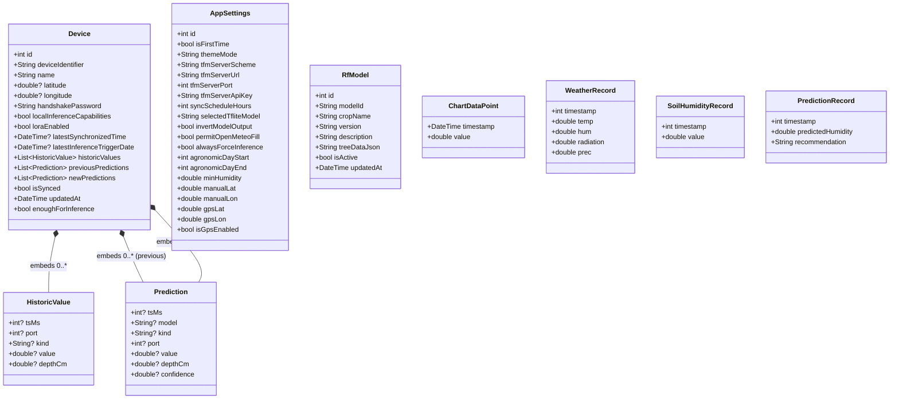
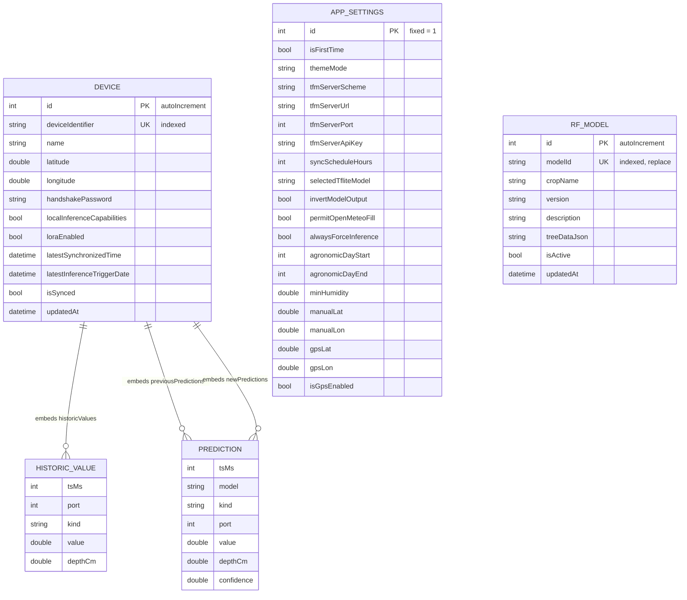
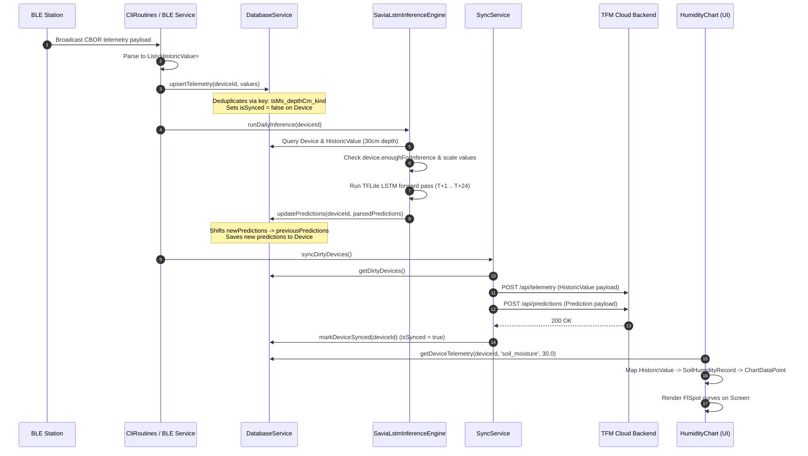

# C4 Code-Level Documentation: `lib/core/models`

This document provides comprehensive C4 Code-level architectural documentation for the domain models located in [`lib/core/models`](file:///C:/Users/CrackoPattt88/Proyectos/tfm_app/lib/core/models). It details the structural design, data dictionaries, entity-relationship structures, lifecycle semantics, and inbound dependency contracts within the `tfm_app` Flutter/Dart application.

---

## 1. Overview Section

### 1.1 Scope and Architectural Purpose

The [`lib/core/models`](file:///C:/Users/CrackoPattt88/Proyectos/tfm_app/lib/core/models) package constitutes the core domain and persistence foundation of the **TFM Predictive Irrigation Application** (`tfm_app`). Designed as a foundational leaf layer conforming to Clean Architecture principles, this package defines:
1. **Persistent Database Entities**: Schemas managed by the embedded NoSQL object database ([`isar_community`](https://pub.dev/packages/isar_community)), representing physical IoT sensor stations ([`Device`](file:///C:/Users/CrackoPattt88/Proyectos/tfm_app/lib/core/models/device.dart#L6-L38)), time-series environmental telemetry ([`HistoricValue`](file:///C:/Users/CrackoPattt88/Proyectos/tfm_app/lib/core/models/device.dart#L41-L47)), machine learning forecasting outputs ([`Prediction`](file:///C:/Users/CrackoPattt88/Proyectos/tfm_app/lib/core/models/device.dart#L50-L58)), dynamic agronomic Random Forest models ([`RfModel`](file:///C:/Users/CrackoPattt88/Proyectos/tfm_app/lib/core/models/app_rf_model.dart#L6-L20)), and global system configuration ([`AppSettings`](file:///C:/Users/CrackoPattt88/Proyectos/tfm_app/lib/core/models/app_settings.dart#L6-L39)).
2. **Data Transfer Objects (DTOs) & Presentation Records**: Specialized lightweight records designed for high-performance chart visualization ([`ChartDataPoint`](file:///C:/Users/CrackoPattt88/Proyectos/tfm_app/lib/core/models/chart_data_point.dart#L1-L6), [`WeatherRecord`](file:///C:/Users/CrackoPattt88/Proyectos/tfm_app/lib/core/models/device.dart#L60-L67), [`SoilHumidityRecord`](file:///C:/Users/CrackoPattt88/Proyectos/tfm_app/lib/core/models/device.dart#L69-L73), and [`PredictionRecord`](file:///C:/Users/CrackoPattt88/Proyectos/tfm_app/lib/core/models/device.dart#L75-L80)).

### 1.2 Architectural Role & Boundaries

The models act as the canonical contract shared across disparate architectural boundaries:
- **IoT / Hardware Ingestion**: Bluetooth Low Energy (BLE) and LoRa services decode raw CBOR payloads and populate [`HistoricValue`](file:///C:/Users/CrackoPattt88/Proyectos/tfm_app/lib/core/models/device.dart#L41-L47) entities bound to a [`Device`](file:///C:/Users/CrackoPattt88/Proyectos/tfm_app/lib/core/models/device.dart#L6-L38).
- **Embedded Persistence Layer**: [`DatabaseService`](file:///C:/Users/CrackoPattt88/Proyectos/tfm_app/lib/core/database/app_database.dart#L10-L911) utilizes generated Isar schemas (`*.g.dart`) for ACID native transactions on mobile/desktop and in-memory lists for Flutter Web.
- **Machine Learning Inference**: The [`InferenceBridge`](file:///C:/Users/CrackoPattt88/Proyectos/tfm_app/lib/features/ml_inference/inference_engine.dart#L26-L344) and [`SaviaLstmInferenceEngine`](file:///C:/Users/CrackoPattt88/Proyectos/tfm_app/lib/features/ml_inference/lstm_inference.dart) inspect [`Device.enoughForInference`](file:///C:/Users/CrackoPattt88/Proyectos/tfm_app/lib/core/models/device.dart#L32-L37), query telemetry, execute dynamic decision trees via [`RfModel`](file:///C:/Users/CrackoPattt88/Proyectos/tfm_app/lib/core/models/app_rf_model.dart#L6-L20), and store outputs in [`Prediction`](file:///C:/Users/CrackoPattt88/Proyectos/tfm_app/lib/core/models/device.dart#L50-L58).
- **Cloud Synchronization**: [`SyncService`](file:///C:/Users/CrackoPattt88/Proyectos/tfm_app/lib/core/database/db_sync.dart#L8-L257) marshals dirty [`Device`](file:///C:/Users/CrackoPattt88/Proyectos/tfm_app/lib/core/models/device.dart#L6-L38) state, records, and predictions to remote REST endpoints while pulling cloud telemetry.
- **Visual Analytics**: Charting engines (`fl_chart` wrappers in `lib/features/charts/`) consume [`ChartDataPoint`](file:///C:/Users/CrackoPattt88/Proyectos/tfm_app/lib/core/models/chart_data_point.dart#L1-L6) and record objects to render interactive soil moisture and radiation curves.

```mermaid
flowchart TB
    subgraph Core_Models ["Package: lib/core/models"]
        direction TB
        subgraph Isar_Entities ["Isar Collections & Embedded Objects"]
            DEV["Device\n(@collection)"]
            HV["HistoricValue\n(@embedded)"]
            PRED["Prediction\n(@embedded)"]
            RF["RfModel\n(@collection)"]
            APP["AppSettings\n(@collection)"]
        end
        subgraph DTOs ["Presentation Records & DTOs"]
            CDP["ChartDataPoint"]
            WR["WeatherRecord"]
            SHR["SoilHumidityRecord"]
            PR["PredictionRecord"]
        end
    end

    subgraph Producers_Consumers ["Core Architectural Consumers"]
        BLE["BLE / Hardware Service\n(features/ble)"]
        DB["DatabaseService\n(core/database/app_database.dart)"]
        SYNC["SyncService & Cloud API\n(core/database & network)"]
        ML["ML Inference Engines\n(features/ml_inference)"]
        UI["UI Screens & Routines\n(screens & cli_routines.dart)"]
        CHARTS["Chart Visualization Widgets\n(features/charts)"]
    end

    BLE -->|Instantiates telemetry| HV
    DB -->|Persists & Queries| DEV
    DB -->|Persists & Queries| RF
    DB -->|Persists & Queries| APP
    SYNC -->|Syncs telemetry & predictions| DEV
    SYNC -->|Marshals| PRED
    SYNC -->|Downloads| RF
    ML -->|Inspects inference readiness| DEV
    ML -->|Executes dynamic trees| RF
    ML -->|Generates forecasts| PRED
    CHARTS -->|Transforms to FlSpot| CDP
    CHARTS -->|Visualizes history & forecast| WR
    CHARTS -->|Visualizes history & forecast| SHR
    CHARTS -->|Visualizes history & forecast| PR
    UI -->|Reads state & configurations| APP
    UI -->|Renders devices & stations| DEV
```



---

## 2. Code Elements Section

The model layer contains four Dart source files declaring nine distinct classes. The table below outlines their categories and roles:

| Class | Source File | Paradigm / Decoration | Primary Responsibility |
| :--- | :--- | :--- | :--- |
| [`RfModel`](file:///C:/Users/CrackoPattt88/Proyectos/tfm_app/lib/core/models/app_rf_model.dart#L6-L20) | [`app_rf_model.dart`](file:///C:/Users/CrackoPattt88/Proyectos/tfm_app/lib/core/models/app_rf_model.dart) | `@collection` (Isar) | Persists dynamic Random Forest models and tree JSON payloads. |
| [`AppSettings`](file:///C:/Users/CrackoPattt88/Proyectos/tfm_app/lib/core/models/app_settings.dart#L6-L39) | [`app_settings.dart`](file:///C:/Users/CrackoPattt88/Proyectos/tfm_app/lib/core/models/app_settings.dart) | `@collection` (Isar) | Persistent singleton storing application and agronomic parameters. |
| [`ChartDataPoint`](file:///C:/Users/CrackoPattt88/Proyectos/tfm_app/lib/core/models/chart_data_point.dart#L1-L6) | [`chart_data_point.dart`](file:///C:/Users/CrackoPattt88/Proyectos/tfm_app/lib/core/models/chart_data_point.dart) | POJO / Value Object | Generic timestamp-value pair for Cartesian time-series plotting. |
| [`Device`](file:///C:/Users/CrackoPattt88/Proyectos/tfm_app/lib/core/models/device.dart#L6-L38) | [`device.dart`](file:///C:/Users/CrackoPattt88/Proyectos/tfm_app/lib/core/models/device.dart) | `@collection` (Isar) | Aggregate root for an IoT agro-station and its telemetry/predictions. |
| [`HistoricValue`](file:///C:/Users/CrackoPattt88/Proyectos/tfm_app/lib/core/models/device.dart#L41-L47) | [`device.dart`](file:///C:/Users/CrackoPattt88/Proyectos/tfm_app/lib/core/models/device.dart) | `@embedded` (Isar) | Single raw or synthetic sensor reading (temperature, moisture, etc.). |
| [`Prediction`](file:///C:/Users/CrackoPattt88/Proyectos/tfm_app/lib/core/models/device.dart#L50-L58) | [`device.dart`](file:///C:/Users/CrackoPattt88/Proyectos/tfm_app/lib/core/models/device.dart) | `@embedded` (Isar) | Forecasted soil moisture value generated by LSTM or edge models. |
| [`WeatherRecord`](file:///C:/Users/CrackoPattt88/Proyectos/tfm_app/lib/core/models/device.dart#L60-L67) | [`device.dart`](file:///C:/Users/CrackoPattt88/Proyectos/tfm_app/lib/core/models/device.dart) | Immutable DTO | Multi-variable weather snapshot (temp, hum, radiation, prec). |
| [`SoilHumidityRecord`](file:///C:/Users/CrackoPattt88/Proyectos/tfm_app/lib/core/models/device.dart#L69-L73) | [`device.dart`](file:///C:/Users/CrackoPattt88/Proyectos/tfm_app/lib/core/models/device.dart) | Immutable DTO | Historical soil moisture reading for specialized humidity charts. |
| [`PredictionRecord`](file:///C:/Users/CrackoPattt88/Proyectos/tfm_app/lib/core/models/device.dart#L75-L80) | [`device.dart`](file:///C:/Users/CrackoPattt88/Proyectos/tfm_app/lib/core/models/device.dart) | Immutable DTO | Forecast tuple (humidity + irrigation recommendation) for UI charts. |

---

### 2.1 File: `app_rf_model.dart`

Source file: [`lib/core/models/app_rf_model.dart`](file:///C:/Users/CrackoPattt88/Proyectos/tfm_app/lib/core/models/app_rf_model.dart)  
Companion generated schema: [`lib/core/models/app_rf_model.g.dart`](file:///C:/Users/CrackoPattt88/Proyectos/tfm_app/lib/core/models/app_rf_model.g.dart)

#### Class: [`RfModel`](file:///C:/Users/CrackoPattt88/Proyectos/tfm_app/lib/core/models/app_rf_model.dart#L6-L20)
Annotated with `@collection`, this class models dynamic Random Forest classifiers downloaded from the cloud server. Rather than relying solely on hardcoded static decision trees compiled into bytecode, `tfm_app` enables downloading crop-specific, retrained JSON tree models at runtime.

```dart
@collection
class RfModel {
  Id id = Isar.autoIncrement;
  
  @Index(unique: true, replace: true)
  late String modelId;
  
  late String cropName;
  late String version;
  late String description;
  
  late String treeDataJson; // The serialized JSON payload
  
  bool isActive = false;
  late DateTime updatedAt;
}
```

#### Field Dictionary

| Field | Type | Annotations / Constraints | Default Value | Description |
| :--- | :--- | :--- | :--- | :--- |
| `id` | `Id` (`int`) | Primary Key (Isar) | `Isar.autoIncrement` | Auto-incrementing internal 64-bit integer identifier for Isar. |
| `modelId` | `String` | `@Index(unique: true, replace: true)` | `late` | Unique remote server identifier (e.g., `'rf_corn_v2'`). Replaces existing records on conflict. |
| `cropName` | `String` | None | `late` | The agronomic crop species targeted by this model (e.g., `'Maize'`, `'Vineyard'`). |
| `version` | `String` | None | `late` | Semantic version string for the model artifact (e.g., `'1.2.0'`). |
| `description` | `String` | None | `late` | Human-readable documentation or hyperparameter notes. |
| `treeDataJson`| `String` | None | `late` | Serialized JSON string encoding the forest ensemble nodes, thresholds, and leaf probabilities. |
| `isActive` | `bool` | None | `false` | Flag indicating whether this model is actively selected to perform daily inference. |
| `updatedAt` | `DateTime` | None | `late` | Timestamp of when the model was downloaded or activated. |

---

### 2.2 File: `app_settings.dart`

Source file: [`lib/core/models/app_settings.dart`](file:///C:/Users/CrackoPattt88/Proyectos/tfm_app/lib/core/models/app_settings.dart)  
Companion generated schema: [`lib/core/models/app_settings.g.dart`](file:///C:/Users/CrackoPattt88/Proyectos/tfm_app/lib/core/models/app_settings.g.dart)

#### Class: [`AppSettings`](file:///C:/Users/CrackoPattt88/Proyectos/tfm_app/lib/core/models/app_settings.dart#L6-L39)
Annotated with `@collection`, this class implements the **Singleton Document** pattern within the database. It is hardcoded to `Id id = 1`, ensuring exactly one settings state row exists across the application lifecycle.

```dart
@collection
class AppSettings {
  Id id = 1; // Singleton

  // App settings
  bool isFirstTime = true;
  String themeMode = 'system'; // 'system', 'light', 'dark'
  
  // Server settings
  String tfmServerScheme = 'http';
  String tfmServerUrl = 'localhost';
  int tfmServerPort = 3000;
  String tfmServerApiKey = 'secret_tfm_token';
  int syncScheduleHours = 24; // auto sync schedule

  // Inference & behavior settings
  String selectedTfliteModel = 'random_forest.dart';
  bool invertModelOutput = false;
  bool permitOpenMeteoFill = true;
  bool alwaysForceInference = false;

  // Agronomic configuration
  int agronomicDayStart = 19; // Default 19hrs
  int agronomicDayEnd = 10; // Default 10hrs
  double minHumidity = 60.0;

  // Location settings (Manual)
  double manualLat = 40.4168;
  double manualLon = -3.7038;

  // Location settings (GPS)
  double gpsLat = 40.4168;
  double gpsLon = -3.7038;
  bool isGpsEnabled = true;
}
```

#### Field Dictionary by Subdomain

##### App UI & Onboarding
| Field | Type | Default Value | Description |
| :--- | :--- | :--- | :--- |
| `id` | `Id` (`int`) | `1` | Singleton row key in Isar. Always fixed to `1`. |
| `isFirstTime` | `bool` | `true` | Indicates if onboarding walkthrough should display. |
| `themeMode` | `String` | `'system'` | Active theme setting (`'system'`, `'light'`, `'dark'`). |

##### Server & Cloud Synchronization
| Field | Type | Default Value | Description |
| :--- | :--- | :--- | :--- |
| `tfmServerScheme` | `String` | `'http'` | Network protocol (`'http'` or `'https'`). |
| `tfmServerUrl` | `String` | `'localhost'` | Hostname or IP address of the TFM backend server. |
| `tfmServerPort` | `int` | `3000` | Port of the TFM backend server. |
| `tfmServerApiKey` | `String` | `'secret_tfm_token'` | Bearer/API token for backend authentication. |
| `syncScheduleHours` | `int` | `24` | Recurrence interval in hours for background cloud syncing. |

##### ML Inference & Simulation Overrides
| Field | Type | Default Value | Description |
| :--- | :--- | :--- | :--- |
| `selectedTfliteModel`| `String` | `'random_forest.dart'` | Fallback model filename or identifier. |
| `invertModelOutput` | `bool` | `false` | Testing override flag to swap irrigation classification outputs. |
| `permitOpenMeteoFill`| `bool` | `true` | Allows synthetic radiation/weather backfilling when hardware sensors lack radiation data. |
| `alwaysForceInference`| `bool` | `false` | Bypasses the 48-hour data readiness checks and day/night window restrictions. |

##### Agronomic Strategy & Windows
| Field | Type | Default Value | Description |
| :--- | :--- | :--- | :--- |
| `agronomicDayStart` | `int` | `19` | 24h hour (19:00) marking start of nocturnal irrigation evaluation window. |
| `agronomicDayEnd` | `int` | `10` | 24h hour (10:00) marking end of nocturnal window and start of diurnal telemetry gathering. |
| `minHumidity` | `double` | `60.0` | Volumetric soil moisture threshold (%) below which irrigation is flagged as needed. |

##### Geographic Location Coordinates
| Field | Type | Default Value | Description |
| :--- | :--- | :--- | :--- |
| `manualLat` | `double` | `40.4168` | Fallback latitude coordinates (Madrid default: 40.4168° N). |
| `manualLon` | `double` | `-3.7038` | Fallback longitude coordinates (Madrid default: 3.7038° W). |
| `gpsLat` | `double` | `40.4168` | Cached hardware GPS latitude coordinates. |
| `gpsLon` | `double` | `-3.7038` | Cached hardware GPS longitude coordinates. |
| `isGpsEnabled` | `bool` | `true` | Boolean flag switching between GPS sensor and manual fallback coordinates. |

---

### 2.3 File: `chart_data_point.dart`

Source file: [`lib/core/models/chart_data_point.dart`](file:///C:/Users/CrackoPattt88/Proyectos/tfm_app/lib/core/models/chart_data_point.dart)

#### Class: [`ChartDataPoint`](file:///C:/Users/CrackoPattt88/Proyectos/tfm_app/lib/core/models/chart_data_point.dart#L1-L6)
A clean, immutable Presentation DTO. This class decouples domain persistence models from the graphic rendering system (`fl_chart`).

```dart
class ChartDataPoint {
  final DateTime timestamp;
  final double value;

  ChartDataPoint({required this.timestamp, required this.value});
}
```

#### Field Dictionary
| Field | Type | Mutability | Description |
| :--- | :--- | :--- | :--- |
| `timestamp` | `DateTime` | `final` | Time coordinate mapped to the chart's horizontal X-axis. |
| `value` | `double` | `final` | Scalar metric value mapped to the chart's vertical Y-axis. |

---

### 2.4 File: `device.dart`

Source file: [`lib/core/models/device.dart`](file:///C:/Users/CrackoPattt88/Proyectos/tfm_app/lib/core/models/device.dart)  
Companion generated schema: [`lib/core/models/device.g.dart`](file:///C:/Users/CrackoPattt88/Proyectos/tfm_app/lib/core/models/device.g.dart)

This file contains the primary aggregate root [`Device`](file:///C:/Users/CrackoPattt88/Proyectos/tfm_app/lib/core/models/device.dart#L6-L38), its embedded value objects ([`HistoricValue`](file:///C:/Users/CrackoPattt88/Proyectos/tfm_app/lib/core/models/device.dart#L41-L47) and [`Prediction`](file:///C:/Users/CrackoPattt88/Proyectos/tfm_app/lib/core/models/device.dart#L50-L58)), and specialized presentation records ([`WeatherRecord`](file:///C:/Users/CrackoPattt88/Proyectos/tfm_app/lib/core/models/device.dart#L60-L67), [`SoilHumidityRecord`](file:///C:/Users/CrackoPattt88/Proyectos/tfm_app/lib/core/models/device.dart#L69-L73), and [`PredictionRecord`](file:///C:/Users/CrackoPattt88/Proyectos/tfm_app/lib/core/models/device.dart#L75-L80)).

#### 2.4.1 Class: [`Device`](file:///C:/Users/CrackoPattt88/Proyectos/tfm_app/lib/core/models/device.dart#L6-L38)
An Isar collection representing an autonomous physical telemetry station (e.g., ESP32/Raspberry Pi Pico based agro-station).

```dart
@collection
class Device {
  Id id = Isar.autoIncrement;

  @Index(unique: true)
  late String deviceIdentifier; 

  String name = "Unknown Station";

  double? latitude;
  double? longitude;
  late String handshakePassword;

  bool localInferenceCapabilities = false;
  bool loraEnabled = false;

  DateTime? latestSynchronizedTime;
  DateTime? latestInferenceTriggerDate;

  List<HistoricValue> historicValues = [];
  List<Prediction> previousPredictions = [];
  List<Prediction> newPredictions = [];

  bool isSynced = false;
  DateTime updatedAt = DateTime.now();

  @ignore
  bool get enoughForInference {
    final now = DateTime.now();
    if (now.hour >= 10 && now.hour < 19) return false;
    final cutoff = now.subtract(const Duration(hours: 48)).millisecondsSinceEpoch;
    return historicValues.any((v) => v.depthCm == 30.0 && v.tsMs != null && v.tsMs! >= cutoff);
  }
}
```

##### Field Dictionary

| Field | Type | Annotations / Constraints | Default Value | Description |
| :--- | :--- | :--- | :--- | :--- |
| `id` | `Id` (`int`) | Primary Key (Isar) | `Isar.autoIncrement` | Auto-incrementing internal Isar database ID. |
| `deviceIdentifier` | `String` | `@Index(unique: true)` | `late` | Hardware MAC address or unique station UUID (e.g. `'24:62:AB:F1:C0:04'`). |
| `name` | `String` | None | `"Unknown Station"` | Friendly station display name. |
| `latitude` | `double?` | Nullable | `null` | Geospatial GPS latitude coordinate for weather forecasts. |
| `longitude` | `double?` | Nullable | `null` | Geospatial GPS longitude coordinate for weather forecasts. |
| `handshakePassword` | `String` | None | `late` | Shared cryptographic secret used for BLE HMAC authentication. |
| `localInferenceCapabilities`| `bool` | None | `false` | True if the physical hardware station supports edge inference. |
| `loraEnabled` | `bool` | None | `false` | True if long-range LoRaWAN telemetry transmission is active. |
| `latestSynchronizedTime` | `DateTime?`| Nullable | `null` | Timestamp of the most recent successful bidirectional sync. |
| `latestInferenceTriggerDate`| `DateTime?`| Nullable | `null` | Timestamp when ML inference was last triggered for this device. |
| `historicValues` | `List<HistoricValue>` | `@embedded` list | `[]` | Sequential series of physical and synthetic sensor measurements. |
| `previousPredictions` | `List<Prediction>` | `@embedded` list | `[]` | Archival record of previous 24h inference predictions. |
| `newPredictions` | `List<Prediction>` | `@embedded` list | `[]` | Current active 24h inference prediction output vector. |
| `isSynced` | `bool` | None | `false` | Dirty tracking flag. `false` if local edits are pending cloud push. |
| `updatedAt` | `DateTime` | None | `DateTime.now()` | Local mutation timestamp for conflict resolution. |

##### Computed Property: [`enoughForInference`](file:///C:/Users/CrackoPattt88/Proyectos/tfm_app/lib/core/models/device.dart#L32-L37)
Annotated with `@ignore` to exclude it from database schema persistence. Evaluates whether the device currently satisfies the scientific agronomic prerequisites for running the daily irrigation inference pipeline:
1. **Diurnal Ineligibility**: If the local time is between **10:00** and **18:59** (`now.hour >= 10 && now.hour < 19`), the system returns `false` (during daytime, telemetry is actively gathering and transpiration dynamics distort nocturnal baseline measurements).
2. **Telemetry Sufficiency**: Checks if at least one telemetry entry exists for root depth **30.0 cm** (`v.depthCm == 30.0`) recorded within the past **48 hours** (`v.tsMs! >= cutoff`).

---

#### 2.4.2 Class: [`HistoricValue`](file:///C:/Users/CrackoPattt88/Proyectos/tfm_app/lib/core/models/device.dart#L41-L47)
Annotated with `@embedded`, this class represents an in-line time-series telemetry record stored directly inside the parent `Device` document.

```dart
@embedded
class HistoricValue {
  int? tsMs;
  int? port;
  String? kind; 
  double? value;
  double? depthCm;
}
```

##### Field Dictionary
| Field | Type | Description |
| :--- | :--- | :--- |
| `tsMs` | `int?` | Epoch timestamp in milliseconds (UTC or local hardware clock). |
| `port` | `int?` | Hardware ADC channel, SDI-12 address, or sensor port number. |
| `kind` | `String?` | Metric identifier: `'temperature'`, `'humidity'`, `'radiation'`, `'precipitation'`, `'soil_moisture'`. |
| `value` | `double?` | Scaled engineering value (e.g. °C, % relative humidity, W/m², mm, or volumetric water content m³/m³). |
| `depthCm` | `double?` | Soil probe installation depth in centimeters (e.g. `10.0`, `30.0`, `50.0`). Null for atmospheric metrics. |

> [!NOTE]
> In [`DatabaseService.upsertTelemetry`](file:///C:/Users/CrackoPattt88/Proyectos/tfm_app/lib/core/database/app_database.dart#L291-L403), telemetry records are deduplicated in $O(1)$ time using the composite key `${tsMs}_${depthCm}_${kind}`.

---

#### 2.4.3 Class: [`Prediction`](file:///C:/Users/CrackoPattt88/Proyectos/tfm_app/lib/core/models/device.dart#L50-L58)
Annotated with `@embedded`, this class stores predicted future sensor metrics generated by either the local on-device neural network ([`SaviaLstmInferenceEngine`](file:///C:/Users/CrackoPattt88/Proyectos/tfm_app/lib/features/ml_inference/lstm_inference.dart)), edge firmware, or cloud forecasting pipelines.

```dart
@embedded
class Prediction {
  int? tsMs;
  String? model; 
  String? kind; 
  int? port;
  double? value;
  double? depthCm;
  double? confidence;
}
```

##### Field Dictionary
| Field | Type | Description |
| :--- | :--- | :--- |
| `tsMs` | `int?` | Projected target epoch timestamp in milliseconds for which the prediction applies. |
| `model` | `String?` | Identifier of the producing architecture (e.g., `'LSTM'`, `'RF_DYNAMIC_V1.2'`, `'EDGE_TINYML'`). |
| `kind` | `String?` | Target metric (typically `'soil_moisture'` or `'prediction'`). |
| `port` | `int?` | Target hardware port if associated with a specific soil probe. |
| `value` | `double?` | Projected metric value (e.g., estimated Volumetric Water Content $0.0 - 1.0$). |
| `depthCm` | `double?` | Soil horizon depth (standardized to `30.0` cm for agronomic decision making). |
| `confidence` | `double?` | Statistical confidence or model certainty metric (defaulting to `0.95`). |

---

#### 2.4.4 Classes: [`WeatherRecord`](file:///C:/Users/CrackoPattt88/Proyectos/tfm_app/lib/core/models/device.dart#L60-L67), [`SoilHumidityRecord`](file:///C:/Users/CrackoPattt88/Proyectos/tfm_app/lib/core/models/device.dart#L69-L73), and [`PredictionRecord`](file:///C:/Users/CrackoPattt88/Proyectos/tfm_app/lib/core/models/device.dart#L75-L80)
These lightweight DTOs simplify UI chart aggregation across the [`lib/features/charts`](file:///C:/Users/CrackoPattt88/Proyectos/tfm_app/lib/features/charts) presentation layer.

##### [`WeatherRecord`](file:///C:/Users/CrackoPattt88/Proyectos/tfm_app/lib/core/models/device.dart#L60-L67)
```dart
class WeatherRecord {
  final int timestamp;
  final double temp;
  final double hum;
  final double radiation;
  final double prec;
  WeatherRecord({required this.timestamp, required this.temp, required this.hum, required this.radiation, required this.prec});
}
```
Flattens multiple discrete weather metrics across a single timestamp into an immutable record for multi-line charts ([`UnifiedChart`](file:///C:/Users/CrackoPattt88/Proyectos/tfm_app/lib/features/charts/unified_chart.dart) and [`RadiationChart`](file:///C:/Users/CrackoPattt88/Proyectos/tfm_app/lib/features/charts/radiation_chart.dart)).

##### [`SoilHumidityRecord`](file:///C:/Users/CrackoPattt88/Proyectos/tfm_app/lib/core/models/device.dart#L69-L73)
```dart
class SoilHumidityRecord {
  final int timestamp;
  final double value;
  SoilHumidityRecord({required this.timestamp, required this.value});
}
```
Provides the historical baseline series plotted by [`HumidityChart`](file:///C:/Users/CrackoPattt88/Proyectos/tfm_app/lib/features/charts/humidity_chart.dart).

##### [`PredictionRecord`](file:///C:/Users/CrackoPattt88/Proyectos/tfm_app/lib/core/models/device.dart#L75-L80)
```dart
class PredictionRecord {
  final int timestamp;
  final double predictedHumidity;
  final String recommendation;
  PredictionRecord({required this.timestamp, required this.predictedHumidity, required this.recommendation});
}
```
Pairs forecasted humidity with the binary agronomic verdict string (`"IRRIGATION AVOIDABLE"` vs `"IRRIGATION NEEDED"`).

---

## 3. Dependencies Section

### 3.1 External Package Dependencies

The dependencies declared and used by [`lib/core/models`](file:///C:/Users/CrackoPattt88/Proyectos/tfm_app/lib/core/models) are intentionally minimal, maintaining a clean domain core:

```mermaid
flowchart LR
    subgraph Package_Dependencies ["External Packages"]
        ISAR["isar_community: ^3.3.2\n(Embedded NoSQL DB Annotations)"]
        DART["Dart Core SDK\n(dart:core, DateTime, int, double, String, bool, List)"]
    end
    subgraph Models ["lib/core/models"]
        ARM["app_rf_model.dart"]
        AS["app_settings.dart"]
        DEV["device.dart"]
        CDP["chart_data_point.dart"]
    end

    ISAR -->|@collection, @embedded, @Index, @ignore, Id| ARM
    ISAR -->|@collection, Id| AS
    ISAR -->|@collection, @embedded, @Index, @ignore, Id| DEV
    DART --> CDP
    DART --> ARM
    DART --> AS
    DART --> DEV
```

| Package | Version | Purpose in Model Layer |
| :--- | :--- | :--- |
| [`isar_community`](https://pub.dev/packages/isar_community) | `^3.3.2` | Provides schema macros and annotations: `@collection`, `@embedded`, `@Index`, `@ignore`, and type `Id`. |
| `dart:core` | SDK | Provides primitive data structures: `DateTime`, `String`, `double`, `int`, `bool`, `List`, `Map`. |

### 3.2 Code Generation Dependencies

To generate strongly-typed query extensions, serializers, and binary schema descriptors, the model layer relies on `build_runner`:
- Generator: `isar_community_generator: ^3.3.2`
- Build Engine: `build_runner: ^2.4.9`
- Generated artifacts:
  - [`lib/core/models/app_rf_model.g.dart`](file:///C:/Users/CrackoPattt88/Proyectos/tfm_app/lib/core/models/app_rf_model.g.dart)
  - [`lib/core/models/app_settings.g.dart`](file:///C:/Users/CrackoPattt88/Proyectos/tfm_app/lib/core/models/app_settings.g.dart)
  - [`lib/core/models/device.g.dart`](file:///C:/Users/CrackoPattt88/Proyectos/tfm_app/lib/core/models/device.g.dart)

### 3.3 Zero-Coupling Invariant

> [!IMPORTANT]
> The [`lib/core/models`](file:///C:/Users/CrackoPattt88/Proyectos/tfm_app/lib/core/models) package contains **zero dependencies** on any other module in `lib/` (e.g., no imports from `features/`, `screens/`, `network/`, or `database/`). It sits strictly at the center of the application dependency graph, ensuring that high-level features depend inwards on models, and never the reverse.

### 3.4 Inbound Consumers Matrix

The following modules depend directly on [`lib/core/models`](file:///C:/Users/CrackoPattt88/Proyectos/tfm_app/lib/core/models):

| Consuming File / Module | Imported Model File | Consumed Entities / Records |
| :--- | :--- | :--- |
| [`lib/core/database/app_database.dart`](file:///C:/Users/CrackoPattt88/Proyectos/tfm_app/lib/core/database/app_database.dart) | `device.dart`, `app_settings.dart`, `app_rf_model.dart` | [`Device`](file:///C:/Users/CrackoPattt88/Proyectos/tfm_app/lib/core/models/device.dart#L6-L38), [`HistoricValue`](file:///C:/Users/CrackoPattt88/Proyectos/tfm_app/lib/core/models/device.dart#L41-L47), [`Prediction`](file:///C:/Users/CrackoPattt88/Proyectos/tfm_app/lib/core/models/device.dart#L50-L58), [`AppSettings`](file:///C:/Users/CrackoPattt88/Proyectos/tfm_app/lib/core/models/app_settings.dart#L6-L39), [`RfModel`](file:///C:/Users/CrackoPattt88/Proyectos/tfm_app/lib/core/models/app_rf_model.dart#L6-L20) |
| [`lib/core/database/db_sync.dart`](file:///C:/Users/CrackoPattt88/Proyectos/tfm_app/lib/core/database/db_sync.dart) | `device.dart` | [`Device`](file:///C:/Users/CrackoPattt88/Proyectos/tfm_app/lib/core/models/device.dart#L6-L38), [`HistoricValue`](file:///C:/Users/CrackoPattt88/Proyectos/tfm_app/lib/core/models/device.dart#L41-L47), [`Prediction`](file:///C:/Users/CrackoPattt88/Proyectos/tfm_app/lib/core/models/device.dart#L50-L58) |
| [`lib/features/ml_inference/inference_engine.dart`](file:///C:/Users/CrackoPattt88/Proyectos/tfm_app/lib/features/ml_inference/inference_engine.dart) | `device.dart` | [`Device`](file:///C:/Users/CrackoPattt88/Proyectos/tfm_app/lib/core/models/device.dart#L6-L38), [`HistoricValue`](file:///C:/Users/CrackoPattt88/Proyectos/tfm_app/lib/core/models/device.dart#L41-L47), [`Prediction`](file:///C:/Users/CrackoPattt88/Proyectos/tfm_app/lib/core/models/device.dart#L50-L58) |
| [`lib/features/ml_inference/lstm_inference.dart`](file:///C:/Users/CrackoPattt88/Proyectos/tfm_app/lib/features/ml_inference/lstm_inference.dart) | `device.dart` | [`Device`](file:///C:/Users/CrackoPattt88/Proyectos/tfm_app/lib/core/models/device.dart#L6-L38), [`HistoricValue`](file:///C:/Users/CrackoPattt88/Proyectos/tfm_app/lib/core/models/device.dart#L41-L47), [`Prediction`](file:///C:/Users/CrackoPattt88/Proyectos/tfm_app/lib/core/models/device.dart#L50-L58) |
| [`lib/features/charts/humidity_chart.dart`](file:///C:/Users/CrackoPattt88/Proyectos/tfm_app/lib/features/charts/humidity_chart.dart) | `chart_data_point.dart`, `device.dart` | [`ChartDataPoint`](file:///C:/Users/CrackoPattt88/Proyectos/tfm_app/lib/core/models/chart_data_point.dart#L1-L6), [`SoilHumidityRecord`](file:///C:/Users/CrackoPattt88/Proyectos/tfm_app/lib/core/models/device.dart#L69-L73), [`PredictionRecord`](file:///C:/Users/CrackoPattt88/Proyectos/tfm_app/lib/core/models/device.dart#L75-L80) |
| [`lib/features/charts/radiation_chart.dart`](file:///C:/Users/CrackoPattt88/Proyectos/tfm_app/lib/features/charts/radiation_chart.dart) | `chart_data_point.dart`, `device.dart` | [`ChartDataPoint`](file:///C:/Users/CrackoPattt88/Proyectos/tfm_app/lib/core/models/chart_data_point.dart#L1-L6), [`WeatherRecord`](file:///C:/Users/CrackoPattt88/Proyectos/tfm_app/lib/core/models/device.dart#L60-L67) |
| [`lib/features/charts/unified_chart.dart`](file:///C:/Users/CrackoPattt88/Proyectos/tfm_app/lib/features/charts/unified_chart.dart) | `device.dart` | [`SoilHumidityRecord`](file:///C:/Users/CrackoPattt88/Proyectos/tfm_app/lib/core/models/device.dart#L69-L73), [`PredictionRecord`](file:///C:/Users/CrackoPattt88/Proyectos/tfm_app/lib/core/models/device.dart#L75-L80), [`WeatherRecord`](file:///C:/Users/CrackoPattt88/Proyectos/tfm_app/lib/core/models/device.dart#L60-L67) |
| [`lib/features/charts/time_metric_chart.dart`](file:///C:/Users/CrackoPattt88/Proyectos/tfm_app/lib/features/charts/time_metric_chart.dart) | `chart_data_point.dart` | [`ChartDataPoint`](file:///C:/Users/CrackoPattt88/Proyectos/tfm_app/lib/core/models/chart_data_point.dart#L1-L6) |
| [`lib/features/charts/custom_metric_chart.dart`](file:///C:/Users/CrackoPattt88/Proyectos/tfm_app/lib/features/charts/custom_metric_chart.dart) | `chart_data_point.dart`, `device.dart` | [`ChartDataPoint`](file:///C:/Users/CrackoPattt88/Proyectos/tfm_app/lib/core/models/chart_data_point.dart#L1-L6), [`HistoricValue`](file:///C:/Users/CrackoPattt88/Proyectos/tfm_app/lib/core/models/device.dart#L41-L47) |
| [`lib/screens/storage_screen.dart`](file:///C:/Users/CrackoPattt88/Proyectos/tfm_app/lib/screens/storage_screen.dart) | `device.dart` | [`Device`](file:///C:/Users/CrackoPattt88/Proyectos/tfm_app/lib/core/models/device.dart#L6-L38), [`HistoricValue`](file:///C:/Users/CrackoPattt88/Proyectos/tfm_app/lib/core/models/device.dart#L41-L47), [`Prediction`](file:///C:/Users/CrackoPattt88/Proyectos/tfm_app/lib/core/models/device.dart#L50-L58) |
| [`lib/screens/config_screen.dart`](file:///C:/Users/CrackoPattt88/Proyectos/tfm_app/lib/screens/config_screen.dart) | `app_rf_model.dart` | [`RfModel`](file:///C:/Users/CrackoPattt88/Proyectos/tfm_app/lib/core/models/app_rf_model.dart#L6-L20) |
| [`lib/cli_routines.dart`](file:///C:/Users/CrackoPattt88/Proyectos/tfm_app/lib/cli_routines.dart) | `device.dart`, `app_settings.dart`, `app_rf_model.dart` | All major model classes |

---

## 4. Relationships Section

### 4.1 UML Class Diagram

The following Mermaid diagram visualizes the structural relationships, embedded compositions, fields, and typing semantics of all classes in [`lib/core/models`](file:///C:/Users/CrackoPattt88/Proyectos/tfm_app/lib/core/models).



---

### 4.2 Entity-Relationship Diagram (Persistence View)

The embedded NoSQL storage model in Isar maps these entities without foreign key constraints, using embedded lists within the parent document:



---

### 4.3 Telemetry & Prediction Lifecycle Data Flow

The following sequence illustrates how models are instantiated, augmented, persisted, and rendered during a typical operational cycle:



---

### 4.4 Relationship Matrix

| Source Element | Related Element | Cardinality | Nature of Relationship | Description |
| :--- | :--- | :--- | :--- | :--- |
| [`Device`](file:///C:/Users/CrackoPattt88/Proyectos/tfm_app/lib/core/models/device.dart#L6-L38) | [`HistoricValue`](file:///C:/Users/CrackoPattt88/Proyectos/tfm_app/lib/core/models/device.dart#L41-L47) | `1` to `0..*` | Composition / Embedding | A device embeds a chronological list of physical and synthetic sensor records (`historicValues`). |
| [`Device`](file:///C:/Users/CrackoPattt88/Proyectos/tfm_app/lib/core/models/device.dart#L6-L38) | [`Prediction`](file:///C:/Users/CrackoPattt88/Proyectos/tfm_app/lib/core/models/device.dart#L50-L58) | `1` to `0..*` | Composition / Embedding | A device embeds both archival predictions (`previousPredictions`) and the latest forecasting horizon (`newPredictions`). |
| [`Device`](file:///C:/Users/CrackoPattt88/Proyectos/tfm_app/lib/core/models/device.dart#L6-L38) | [`AppSettings`](file:///C:/Users/CrackoPattt88/Proyectos/tfm_app/lib/core/models/app_settings.dart#L6-L39) | `*` to `1` | Contextual Association | Devices refer to global settings (agronomic start/end hours, minimum humidity) via [`DatabaseService`](file:///C:/Users/CrackoPattt88/Proyectos/tfm_app/lib/core/database/app_database.dart#L10-L911). |
| [`RfModel`](file:///C:/Users/CrackoPattt88/Proyectos/tfm_app/lib/core/models/app_rf_model.dart#L6-L20) | [`Device`](file:///C:/Users/CrackoPattt88/Proyectos/tfm_app/lib/core/models/device.dart#L6-L38) | `1` to `*` | Logical Association | The active `RfModel` (`isActive == true`) classifies irrigation urgency for all eligible devices. |
| [`HistoricValue`](file:///C:/Users/CrackoPattt88/Proyectos/tfm_app/lib/core/models/device.dart#L41-L47) | [`ChartDataPoint`](file:///C:/Users/CrackoPattt88/Proyectos/tfm_app/lib/core/models/chart_data_point.dart#L1-L6) | `1` to `1` | Transformation (Projection) | Telemetry readings are mapped into `ChartDataPoint` instances by UI chart converters. |
| [`HistoricValue`](file:///C:/Users/CrackoPattt88/Proyectos/tfm_app/lib/core/models/device.dart#L41-L47) | [`SoilHumidityRecord`](file:///C:/Users/CrackoPattt88/Proyectos/tfm_app/lib/core/models/device.dart#L69-L73) | `1` to `1` | Transformation (Projection) | Soil moisture records are filtered from `historicValues` into `SoilHumidityRecord` instances for chart rendering. |
| [`Prediction`](file:///C:/Users/CrackoPattt88/Proyectos/tfm_app/lib/core/models/device.dart#L50-L58) | [`PredictionRecord`](file:///C:/Users/CrackoPattt88/Proyectos/tfm_app/lib/core/models/device.dart#L75-L80) | `1` to `1` | Transformation (Projection) | Embedded `Prediction` instances are combined with classification text into `PredictionRecord` items for visual charts. |
