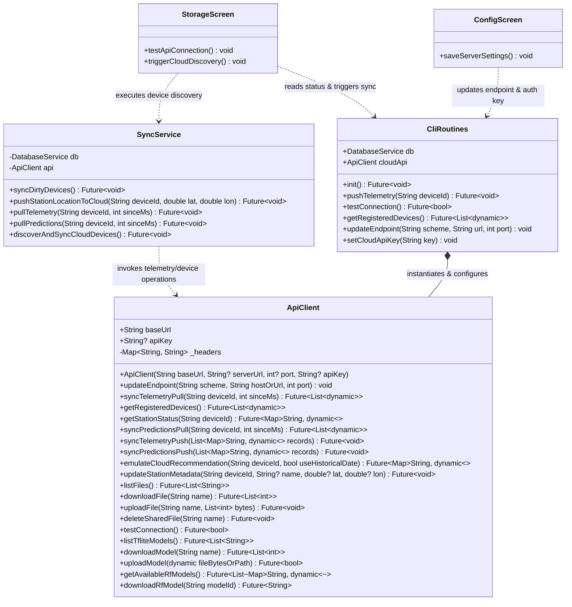
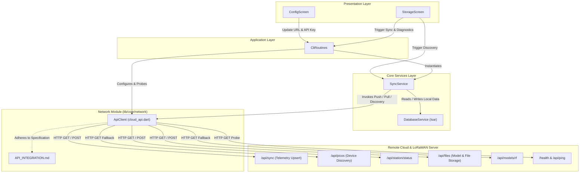
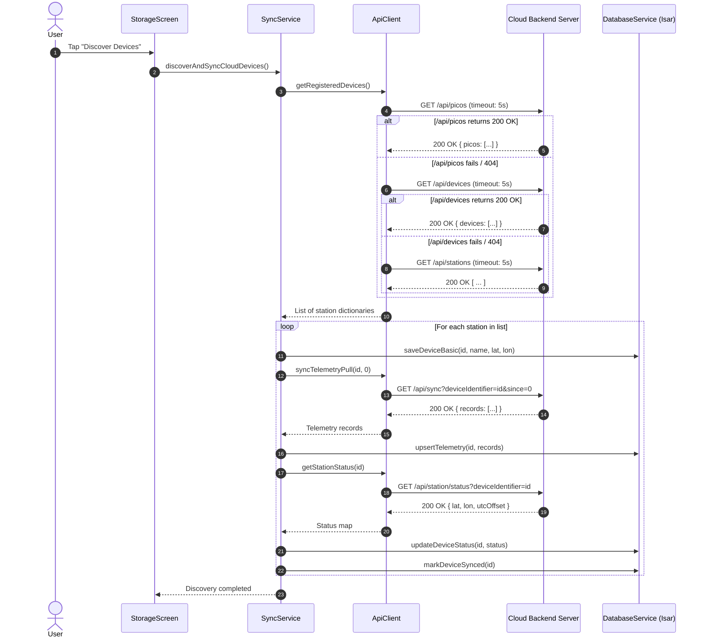
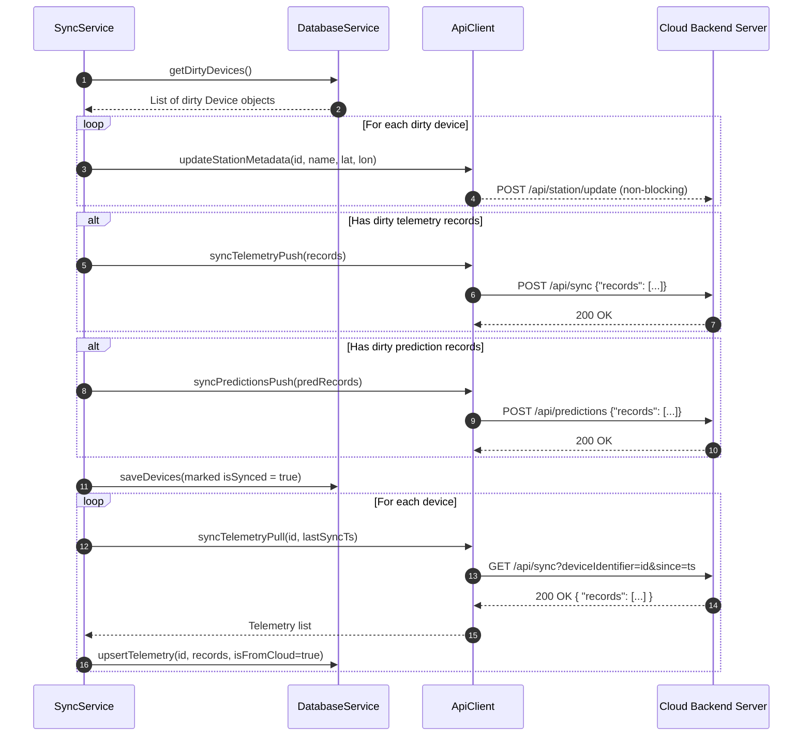
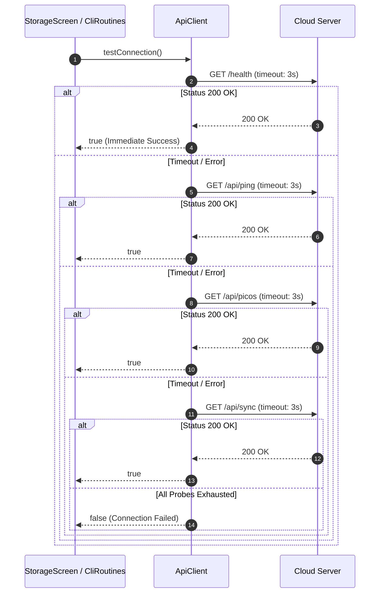

# C4 Code-Level Architecture: `lib/core/network`

This document provides detailed C4 Code-level (Level 4) architectural documentation for the [`lib/core/network`](file:///C:/Users/CrackoPattt88/Proyectos/tfm_app/lib/core/network) module of the TFM Application.

---

## 1. Overview Section

### 1.1 Purpose and Architectural Role
The [`lib/core/network`](file:///C:/Users/CrackoPattt88/Proyectos/tfm_app/lib/core/network) directory encapsulates all HTTP-based networking operations required by the mobile application. Located in the application's core infrastructure layer, it acts as the network communication bridge between local services (such as [`SyncService`](file:///C:/Users/CrackoPattt88/Proyectos/tfm_app/lib/core/database/db_sync.dart#L8) and [`CliRoutines`](file:///C:/Users/CrackoPattt88/Proyectos/tfm_app/lib/cli_routines.dart#L22)) and remote backend servers (the self-hosted TFM telemetry/sync server, LoRaWAN gateways, and cloud inference/model repositories).

```
+-------------------------------------------------------------------------+
|                              Presentation Layer                         |
|         (StorageScreen, ConfigScreen, DashboardScreen, etc.)           |
+------------------------------------+------------------------------------+
                                     |
                                     v
+-------------------------------------------------------------------------+
|                        Application Facade Layer                         |
|                         (CliRoutines Facade)                            |
+------------------------------------+------------------------------------+
                                     |
                                     v
+-------------------------------------------------------------------------+
|                           Core Services Layer                           |
|                       (SyncService / DatabaseService)                   |
+------------------------------------+------------------------------------+
                                     |
                                     v
+-------------------------------------------------------------------------+
|                         Network Core Module                             |
|       lib/core/network/cloud_api.dart (ApiClient)                       |
+------------------------------------+------------------------------------+
                                     | HTTP / JSON / Octet-Stream
                                     v
+-------------------------------------------------------------------------+
|                        External Cloud Infrastructure                    |
|      (TFM Sync API Server, TTN/ChirpStack LoRaWAN, Model Catalog)       |
+-------------------------------------------------------------------------+
```

### 1.2 Core Responsibilities
The network module is responsible for:
1. **Telemetry Synchronization**: Bi-directional data transfer of sensor telemetry (`POST /api/sync` and `GET /api/sync`).
2. **Device Discovery & Registration**: Querying cloud servers for registered field stations (Pico devices) with automatic endpoint fallback probing (`GET /api/picos`, `/devices`, `/stations`).
3. **Station Metadata & Geolocation**: Updating and fetching station coordinates, UTC offsets, and pending downlink queues (`GET /api/station/status`, `POST /api/station/update`).
4. **Machine Learning Model Distribution**: Fetching lists of Random Forest and TensorFlow Lite (TFLite) models, and streaming binary/JSON model weights down to the local device (`/api/models`, `/api/models/rf`, `/api/files`).
5. **Shared File Storage**: Providing generic binary upload, download, listing, and deletion over HTTP (`/api/files/*`).
6. **Emulation & Cloud Inference**: Requesting cloud-side irrigation recommendations (`POST /api/emulate/recommendation`).
7. **Connection Diagnostics**: Fast multi-endpoint probing to verify reachability and authentication health before executing data pipelines (`/health`, `/api/ping`, etc.).

### 1.3 Design Principles and Patterns
- **Stateless HTTP Client**: The [`ApiClient`](file:///C:/Users/CrackoPattt88/Proyectos/tfm_app/lib/core/network/cloud_api.dart#L7) class maintains only target endpoint configuration (`baseUrl` and optional `apiKey`), allowing concurrent asynchronous requests without session state leak.
- **Dynamic Endpoint Reconfiguration**: Runtime sanitization and endpoint updating via [`updateEndpoint`](file:///C:/Users/CrackoPattt88/Proyectos/tfm_app/lib/core/network/cloud_api.dart#L22) enable seamless transitions between LAN IP addresses, cloud hosts, and local emulators without recreating instances.
- **Defensive Multi-Endpoint Fallbacks**: Methods querying polymorphic endpoints (e.g., station discovery and ML catalogs) iterate through alternative legacy or variant paths, accommodating different backend server versions without breaking client workflows.
- **Fail-Fast Probing with Timeouts**: Network diagnostic and discovery requests enforce strict timeouts (3s to 5s) preventing application UI thread blocking and long hung states under unstable field network conditions.
- **Bearer Token Security**: Transparent injection of `Authorization: Bearer <API_KEY>` headers when tokens are configured.

### 1.4 C4 Code-Level Diagram
The following class diagram visualizes the structure of the network module, its internal components, and its direct consumers:



---

## 2. Code Elements Section

The [`lib/core/network`](file:///C:/Users/CrackoPattt88/Proyectos/tfm_app/lib/core/network) module contains two primary files:
1. [`cloud_api.dart`](file:///C:/Users/CrackoPattt88/Proyectos/tfm_app/lib/core/network/cloud_api.dart): Implementation of the HTTP API client class [`ApiClient`](file:///C:/Users/CrackoPattt88/Proyectos/tfm_app/lib/core/network/cloud_api.dart#L7).
2. [`API_INTEGRATION.md`](file:///C:/Users/CrackoPattt88/Proyectos/tfm_app/lib/core/network/API_INTEGRATION.md): Server-side contract specification and communication protocol definition.

### 2.1 Class: [`ApiClient`](file:///C:/Users/CrackoPattt88/Proyectos/tfm_app/lib/core/network/cloud_api.dart#L7-L334)
The primary class handling all network communication.

#### Fields and Properties
- [`baseUrl`](file:///C:/Users/CrackoPattt88/Proyectos/tfm_app/lib/core/network/cloud_api.dart#L8) (`String`):
  Base endpoint URL pointing to the cloud server API prefix. Default value is `"http://localhost:3000/api"`.
- [`apiKey`](file:///C:/Users/CrackoPattt88/Proyectos/tfm_app/lib/core/network/cloud_api.dart#L9) (`String?`):
  Optional Bearer token string used for protected API routes. Can be mutated dynamically when user updates credentials in UI settings.
- [`_headers`](file:///C:/Users/CrackoPattt88/Proyectos/tfm_app/lib/core/network/cloud_api.dart#L37-L40) (`Map<String, String>`):
  Private getter returning the default HTTP headers map. Always contains `'Content-Type': 'application/json'`, and conditionally adds `'Authorization': 'Bearer $apiKey'` when [`apiKey`](file:///C:/Users/CrackoPattt88/Proyectos/tfm_app/lib/core/network/cloud_api.dart#L9) is non-null.

#### Constructor
- [`ApiClient({String baseUrl, String? serverUrl, int? port, String? apiKey})`](file:///C:/Users/CrackoPattt88/Proyectos/tfm_app/lib/core/network/cloud_api.dart#L11-L20):
  Initializes the client. If `serverUrl` is supplied, it invokes [`updateEndpoint`](file:///C:/Users/CrackoPattt88/Proyectos/tfm_app/lib/core/network/cloud_api.dart#L22) using `'http'` scheme and port (defaulting to 3000 if not specified).

#### Endpoint Management Method
- [`void updateEndpoint(String scheme, String hostOrUrl, int port)`](file:///C:/Users/CrackoPattt88/Proyectos/tfm_app/lib/core/network/cloud_api.dart#L22-L35):
  Sanitizes `hostOrUrl`, adds scheme prefixes (`http://` or `https://`) if absent, parses the URI, extracts the host (defaulting to `'localhost'` if empty), calculates the effective port (`port != 0 ? port : (uri.hasPort ? uri.port : 3000)`), and formats [`baseUrl`](file:///C:/Users/CrackoPattt88/Proyectos/tfm_app/lib/core/network/cloud_api.dart#L8) as `'${uri.scheme}://$host:$effectivePort/api'`. Any URI parsing exceptions are caught and suppressed.

---

### 2.2 Telemetry and Device Read Endpoints

#### [`Future<List<dynamic>> syncTelemetryPull(String deviceId, int sinceMs)`](file:///C:/Users/CrackoPattt88/Proyectos/tfm_app/lib/core/network/cloud_api.dart#L47-L57)
- **HTTP Method**: `GET`
- **Route**: `$baseUrl/sync?deviceIdentifier=<deviceId>&since=<sinceMs>`
- **Headers**: Standard [`_headers`](file:///C:/Users/CrackoPattt88/Proyectos/tfm_app/lib/core/network/cloud_api.dart#L37-L40)
- **Parameters**:
  - `deviceId` (`String`): Identifier of the Pico station.
  - `sinceMs` (`int`): Timestamp in milliseconds since epoch to filter incremental updates.
- **Return Type**: `Future<List<dynamic>>` (List of JSON records).
- **Behavior**: Parses the JSON response body. Returns the array under the `'records'` key (or empty list if null). Throws an `Exception('Pull failed (...)')` if status code is not 200.

#### [`Future<List<dynamic>> getRegisteredDevices()`](file:///C:/Users/CrackoPattt88/Proyectos/tfm_app/lib/core/network/cloud_api.dart#L60-L103)
- **HTTP Method**: `GET`
- **Candidate Routes**:
  1. `$baseUrl/picos`
  2. `$baseUrl/devices`
  3. `$baseUrl/stations`
- **Timeout**: 5 seconds per route probe.
- **Return Type**: `Future<List<dynamic>>`
- **Behavior**: Implements resilient fallback discovery. Sequentially queries candidate routes. On receiving status code 200, inspects response structure:
  - If a JSON object (`Map`), probes keys `'picos'`, `'devices'`, `'stations'`, or `'records'`, returning the first non-null list.
  - If a JSON array (`List`), returns it directly.
  - If all candidate endpoints fail or time out, outputs verbose debug information and returns an empty list `[]`.

#### [`Future<Map<String, dynamic>> getStationStatus(String deviceId)`](file:///C:/Users/CrackoPattt88/Proyectos/tfm_app/lib/core/network/cloud_api.dart#L107-L116)
- **HTTP Method**: `GET`
- **Route**: `$baseUrl/station/status?deviceIdentifier=<deviceId>`
- **Parameters**: `deviceId` (`String`).
- **Return Type**: `Future<Map<String, dynamic>>`
- **Behavior**: Returns station metadata (latitude, longitude, UTC offset, last updated timestamp, pending LoRaWAN downlinks). Throws an `Exception` on non-200 responses.

#### [`Future<List<dynamic>> syncPredictionsPull(String deviceId, int sinceMs)`](file:///C:/Users/CrackoPattt88/Proyectos/tfm_app/lib/core/network/cloud_api.dart#L119-L132)
- **HTTP Method**: `GET`
- **Route**: `$baseUrl/predictions?deviceIdentifier=<deviceId>&since=<sinceMs>`
- **Return Type**: `Future<List<dynamic>>`
- **Behavior**: Fetches cloud-generated soil moisture predictions. Parses response body and extracts `'records'`. Throws an `Exception` on non-200 responses.

---

### 2.3 Telemetry and Device Write Endpoints

#### [`Future<void> syncTelemetryPush(List<Map<String, dynamic>> records)`](file:///C:/Users/CrackoPattt88/Proyectos/tfm_app/lib/core/network/cloud_api.dart#L140-L148)
- **HTTP Method**: `POST`
- **Route**: `$baseUrl/sync`
- **Body**: `{"records": [...]}` (JSON encoded)
- **Parameters**: `records` (`List<Map<String, dynamic>>`) containing telemetry objects (`deviceIdentifier`, `tsMs`, `value`, `depthCm`, optional coordinates).
- **Behavior**: Upserts telemetry batch on server. Throws an `Exception('Push failed (...)')` if status code != 200.

#### [`Future<void> syncPredictionsPush(List<Map<String, dynamic>> records)`](file:///C:/Users/CrackoPattt88/Proyectos/tfm_app/lib/core/network/cloud_api.dart#L151-L162)
- **HTTP Method**: `POST`
- **Route**: `$baseUrl/predictions`
- **Body**: `{"records": [...]}` (JSON encoded)
- **Parameters**: `records` (`List<Map<String, dynamic>>`) containing ML inference predictions (`deviceIdentifier`, `tsMs`, `value`, `depthCm`, `kind`, `model`, `confidence`).
- **Behavior**: Upserts predictions batch on the cloud server. Throws an `Exception` if status code != 200.

#### [`Future<Map<String, dynamic>> emulateCloudRecommendation(String deviceId, {bool useHistoricalDate = true})`](file:///C:/Users/CrackoPattt88/Proyectos/tfm_app/lib/core/network/cloud_api.dart#L165-L181)
- **HTTP Method**: `POST`
- **Route**: `$baseUrl/emulate/recommendation`
- **Body**: `{"deviceIdentifier": deviceId, "useHistoricalDate": useHistoricalDate}`
- **Return Type**: `Future<Map<String, dynamic>>`
- **Behavior**: Triggers server-side irrigation recommendation calculation and returns recommendation data. Throws an `Exception` on non-200 responses.

#### [`Future<void> updateStationMetadata(String deviceId, {String? name, double? lat, double? lon})`](file:///C:/Users/CrackoPattt88/Proyectos/tfm_app/lib/core/network/cloud_api.dart#L184-L207)
- **HTTP Method**: `POST`
- **Route**: `$baseUrl/station/update`
- **Body**: JSON map with `deviceIdentifier`, and conditionally `name`, `lat`/`latitude`, `lon`/`longitude`.
- **Behavior**: Fire-and-forget metadata update. Wrapped in `try-catch` to silently ignore network errors so that non-critical metadata failures do not disrupt larger synchronization batches.

---

### 2.4 File Sharing & Storage Service Endpoints

#### [`Future<List<String>> listFiles()`](file:///C:/Users/CrackoPattt88/Proyectos/tfm_app/lib/core/network/cloud_api.dart#L213-L221)
- **HTTP Method**: `GET`
- **Route**: `$baseUrl/files`
- **Timeout**: 4 seconds
- **Return Type**: `Future<List<String>>`
- **Behavior**: Retrieves names of files hosted on the server's shared storage. Parses `'files'` array.

#### [`Future<List<int>> downloadFile(String name)`](file:///C:/Users/CrackoPattt88/Proyectos/tfm_app/lib/core/network/cloud_api.dart#L223-L232)
- **HTTP Method**: `GET`
- **Route**: `$baseUrl/files/download?name=<name>`
- **Timeout**: 5 seconds
- **Return Type**: `Future<List<int>>` (raw bytes `res.bodyBytes`).

#### [`Future<void> uploadFile(String name, List<int> bytes)`](file:///C:/Users/CrackoPattt88/Proyectos/tfm_app/lib/core/network/cloud_api.dart#L234-L248)
- **HTTP Method**: `POST`
- **Route**: `$baseUrl/files/upload?name=<name>`
- **Headers**: Custom header `Content-Type: application/octet-stream` combined with [`_headers`](file:///C:/Users/CrackoPattt88/Proyectos/tfm_app/lib/core/network/cloud_api.dart#L37-L40).
- **Body**: Raw byte stream `bytes`.
- **Timeout**: 5 seconds.

#### [`Future<void> deleteSharedFile(String name)`](file:///C:/Users/CrackoPattt88/Proyectos/tfm_app/lib/core/network/cloud_api.dart#L250-L260)
- **HTTP Method**: `POST`
- **Route**: `$baseUrl/files/delete?name=<name>`
- **Headers**: Header `X-Confirm-Filename: <name>`.
- **Timeout**: 4 seconds.

---

### 2.5 Diagnostics and Machine Learning Model Management

#### [`Future<bool> testConnection()`](file:///C:/Users/CrackoPattt88/Proyectos/tfm_app/lib/core/network/cloud_api.dart#L263-L281)
- **Probed Endpoints**:
  1. `$rootUrl/health` (strips `/api` suffix)
  2. `$baseUrl/ping`
  3. `$baseUrl/picos`
  4. `$baseUrl/sync`
  5. `$baseUrl/devices`
- **Timeout**: 3 seconds per probe.
- **Return Type**: `Future<bool>`
- **Behavior**: Sequentially probes standard health and REST routes. Returns `true` immediately upon receiving any HTTP status code in the 2xx range (`statusCode >= 200 && statusCode < 300`). Returns `false` if all fail.

#### [`Future<List<String>> listTfliteModels()`](file:///C:/Users/CrackoPattt88/Proyectos/tfm_app/lib/core/network/cloud_api.dart#L283-L290)
- **Return Type**: `Future<List<String>>`
- **Behavior**: Calls [`listFiles()`](file:///C:/Users/CrackoPattt88/Proyectos/tfm_app/lib/core/network/cloud_api.dart#L213-L221) and filters names with `.endsWith('.tflite')`. Gracefully catches errors and returns `[]`.

#### [`Future<List<int>> downloadModel(String name)`](file:///C:/Users/CrackoPattt88/Proyectos/tfm_app/lib/core/network/cloud_api.dart#L292)
- **Behavior**: Direct delegation to [`downloadFile(name)`](file:///C:/Users/CrackoPattt88/Proyectos/tfm_app/lib/core/network/cloud_api.dart#L223-L232).

#### [`Future<bool> uploadModel(dynamic fileBytesOrPath)`](file:///C:/Users/CrackoPattt88/Proyectos/tfm_app/lib/core/network/cloud_api.dart#L293)
- **Behavior**: Stub function returning `true`.

#### [`Future<List<Map<String, dynamic>>> getAvailableRfModels()`](file:///C:/Users/CrackoPattt88/Proyectos/tfm_app/lib/core/network/cloud_api.dart#L295-L317)
- **Candidate Routes**:
  1. `$baseUrl/models/rf`
  2. `$baseUrl/models`
  3. `$baseUrl/models/catalog`
- **Timeout**: 5 seconds per route probe.
- **Return Type**: `Future<List<Map<String, dynamic>>>`
- **Behavior**: Probes candidate catalog routes. Checks JSON body for keys `'models'`, `'data'`, or `'records'`, or accepts top-level lists. Throws `Exception('Failed to fetch models catalog')` if all fail.

#### [`Future<String> downloadRfModel(String modelId)`](file:///C:/Users/CrackoPattt88/Proyectos/tfm_app/lib/core/network/cloud_api.dart#L319-L333)
- **Candidate Routes**:
  1. `$baseUrl/models/rf/$modelId`
  2. `$baseUrl/models/$modelId`
- **Timeout**: 5 seconds per route probe.
- **Return Type**: `Future<String>` (model payload / serialized JSON).
- **Behavior**: Fetches model definition or tree rules. Throws `Exception('Failed to download model payload for $modelId')` if none respond 200.

---

### 2.6 Technical Contract Specification: [`API_INTEGRATION.md`](file:///C:/Users/CrackoPattt88/Proyectos/tfm_app/lib/core/network/API_INTEGRATION.md)
This markdown document defines the REST API protocol for external implementers and server maintainers:
- **Authentication**: Bearer token specification via `Authorization: Bearer <API_KEY>`.
- **Health Verification**: Unauthenticated ping endpoints (`GET /health`, `GET /api/ping`).
- **Telemetry Sync Protocol**: JSON structures for batch upsert push (`POST /api/sync`) and incremental timestamp-based pull (`GET /api/sync?deviceIdentifier=...&since=...`).
- **LoRaWAN Gateway Integration**: Webhook specifications for ChirpStack and TTN (The Things Network) uplink payloads (`POST /api/lora/uplink`), TLV patch downlink queueing (`POST /api/lora/downlink`), and device coordinates (`GET /api/station/status`).

---

## 3. Dependencies Section

### 3.1 External Dependencies
The module relies on two core Dart SDK libraries and one pub package:

| Dependency | Scope / Package | Purpose |
| :--- | :--- | :--- |
| `dart:convert` | Dart Core SDK | Provides `jsonDecode()` and `jsonEncode()` for REST request serialization and response deserialization. |
| `dart:async` | Dart Core SDK | Implicitly used for `Future` async/await concurrency. |
| [`package:http/http.dart`](file:///C:/Users/CrackoPattt88/Proyectos/tfm_app/pubspec.yaml#L26) | `http: ^1.6.0` (pub.dev) | High-level HTTP client library providing asynchronous `get`, `post`, `put`, `delete`, headers management, and raw byte stream access. |

### 3.2 Internal Architectural Callers
Within the project repository, [`ApiClient`](file:///C:/Users/CrackoPattt88/Proyectos/tfm_app/lib/core/network/cloud_api.dart#L7) is consumed by:

1. **[`CliRoutines`](file:///C:/Users/CrackoPattt88/Proyectos/tfm_app/lib/cli_routines.dart#L22)**:
   - Holds an instance [`late final ApiClient cloudApi`](file:///C:/Users/CrackoPattt88/Proyectos/tfm_app/lib/cli_routines.dart#L24).
   - Instantiates [`ApiClient`](file:///C:/Users/CrackoPattt88/Proyectos/tfm_app/lib/cli_routines.dart#L61) using settings from local database storage.
   - Delegates telemetry push (`cloudApi.syncTelemetryPush`), status queries (`cloudApi.getStationStatus`), and connection testing (`cloudApi.testConnection`).
2. **[`SyncService`](file:///C:/Users/CrackoPattt88/Proyectos/tfm_app/lib/core/database/db_sync.dart#L8)**:
   - Accepts [`ApiClient api`](file:///C:/Users/CrackoPattt88/Proyectos/tfm_app/lib/core/database/db_sync.dart#L10) via dependency injection in its constructor.
   - Uses `api` to push dirty records, pull incremental telemetry and predictions, and discover cloud-registered Pico stations to populate the local Isar database.
3. **[`StorageScreen`](file:///C:/Users/CrackoPattt88/Proyectos/tfm_app/lib/screens/storage_screen.dart)**:
   - Invokes [`widget.routines.cloudApi.testConnection()`](file:///C:/Users/CrackoPattt88/Proyectos/tfm_app/lib/screens/storage_screen.dart#L184) to update connection indicators.
   - Invokes [`widget.routines.cloudApi.getRegisteredDevices()`](file:///C:/Users/CrackoPattt88/Proyectos/tfm_app/lib/screens/storage_screen.dart#L107) to inspect available hardware units.
4. **[`ConfigScreen`](file:///C:/Users/CrackoPattt88/Proyectos/tfm_app/lib/screens/config_screen.dart)**:
   - Calls `widget.routines.updateEndpoint(...)` and `widget.routines.setCloudApiKey(...)` to immediately apply network configuration changes to the live client instance.

### 3.3 Coupling and Cohesion Analysis
- **Coupling**: **Low to Moderate**. [`ApiClient`](file:///C:/Users/CrackoPattt88/Proyectos/tfm_app/lib/core/network/cloud_api.dart#L7) has **zero** dependencies on Flutter UI frameworks or local database libraries (Isar). It operates strictly on standard primitive Dart types (`Map<String, dynamic>`, `List<dynamic>`, `String`, `int`, `double`, `List<int>`).
- **Cohesion**: **High**. All operations within the class deal exclusively with dispatching HTTP requests and parsing REST payloads against the backend API specification.
- **Extensibility**: The client could be further enhanced by extracting an abstract interface (`IApiClient` or `CloudApiInterface`) to simplify mock injection in unit testing suites.

---

## 4. Relationships Section

### 4.1 Architectural Interaction Overview
The network module sits at the boundary of the application domain. The diagram below illustrates how data flows between UI views, application facades, synchronization services, the network client, and external backend servers.



---

### 4.2 Detailed Workflow Sequences

#### Sequence 1: Pico Station Discovery and Local Database Repopulation
When a user requests cloud device discovery or synchronization from [`StorageScreen`](file:///C:/Users/CrackoPattt88/Proyectos/tfm_app/lib/screens/storage_screen.dart), [`SyncService.discoverAndSyncCloudDevices()`](file:///C:/Users/CrackoPattt88/Proyectos/tfm_app/lib/core/database/db_sync.dart#L210) delegates to [`ApiClient.getRegisteredDevices()`](file:///C:/Users/CrackoPattt88/Proyectos/tfm_app/lib/core/network/cloud_api.dart#L60), which uses fallback probing to contact the cloud backend:



---

#### Sequence 2: Bidirectional Telemetry Synchronization
When synchronizing dirty local devices, [`SyncService.syncDirtyDevices()`](file:///C:/Users/CrackoPattt88/Proyectos/tfm_app/lib/core/database/db_sync.dart#L14) pushes pending sensor readings and pulls server updates:



---

#### Sequence 3: Fast Multi-Endpoint Connection Diagnostics
[`ApiClient.testConnection()`](file:///C:/Users/CrackoPattt88/Proyectos/tfm_app/lib/core/network/cloud_api.dart#L263) tests server reachability through a prioritized multi-probe strategy:



---

### 4.3 Endpoint Mapping Matrix
The table below summarizes all network routes implemented in [`ApiClient`](file:///C:/Users/CrackoPattt88/Proyectos/tfm_app/lib/core/network/cloud_api.dart#L7) along with their protocols, fallbacks, and handling characteristics:

| Method Name | HTTP Verb | Primary Endpoint Path | Fallback Path(s) | Auth Required | Timeout | Request Payload / Params | Response Format |
| :--- | :--- | :--- | :--- | :--- | :--- | :--- | :--- |
| [`syncTelemetryPull`](file:///C:/Users/CrackoPattt88/Proyectos/tfm_app/lib/core/network/cloud_api.dart#L47) | `GET` | `/api/sync` | None | Yes | Default | `deviceIdentifier`, `since` | JSON `{records: [...]}` |
| [`getRegisteredDevices`](file:///C:/Users/CrackoPattt88/Proyectos/tfm_app/lib/core/network/cloud_api.dart#L60) | `GET` | `/api/picos` | `/api/devices`, `/api/stations` | Yes | 5 sec | None | JSON list or wrapped object |
| [`getStationStatus`](file:///C:/Users/CrackoPattt88/Proyectos/tfm_app/lib/core/network/cloud_api.dart#L107) | `GET` | `/api/station/status` | None | Yes | Default | `deviceIdentifier` | JSON status & location object |
| [`syncPredictionsPull`](file:///C:/Users/CrackoPattt88/Proyectos/tfm_app/lib/core/network/cloud_api.dart#L119) | `GET` | `/api/predictions` | None | Yes | Default | `deviceIdentifier`, `since` | JSON `{records: [...]}` |
| [`syncTelemetryPush`](file:///C:/Users/CrackoPattt88/Proyectos/tfm_app/lib/core/network/cloud_api.dart#L140) | `POST` | `/api/sync` | None | Yes | Default | JSON `{"records": [...]}` | Status `200 OK` |
| [`syncPredictionsPush`](file:///C:/Users/CrackoPattt88/Proyectos/tfm_app/lib/core/network/cloud_api.dart#L151) | `POST` | `/api/predictions` | None | Yes | Default | JSON `{"records": [...]}` | Status `200 OK` |
| [`emulateCloudRecommendation`](file:///C:/Users/CrackoPattt88/Proyectos/tfm_app/lib/core/network/cloud_api.dart#L165) | `POST` | `/api/emulate/recommendation` | None | Yes | Default | JSON `{"deviceIdentifier": "...", "useHistoricalDate": bool}` | JSON recommendation object |
| [`updateStationMetadata`](file:///C:/Users/CrackoPattt88/Proyectos/tfm_app/lib/core/network/cloud_api.dart#L184) | `POST` | `/api/station/update` | None | Yes | Default | JSON `{"deviceIdentifier": "...", "name": "...", "lat": ..., "lon": ...}` | Status `200 OK` (errors suppressed) |
| [`listFiles`](file:///C:/Users/CrackoPattt88/Proyectos/tfm_app/lib/core/network/cloud_api.dart#L213) | `GET` | `/api/files` | None | Yes | 4 sec | None | JSON `{files: [...]}` |
| [`downloadFile`](file:///C:/Users/CrackoPattt88/Proyectos/tfm_app/lib/core/network/cloud_api.dart#L223) | `GET` | `/api/files/download` | None | Yes | 5 sec | Query `name` | Binary bytes (`List<int>`) |
| [`uploadFile`](file:///C:/Users/CrackoPattt88/Proyectos/tfm_app/lib/core/network/cloud_api.dart#L234) | `POST` | `/api/files/upload` | None | Yes | 5 sec | Query `name`, Body raw octet-stream | Status `200 OK` |
| [`deleteSharedFile`](file:///C:/Users/CrackoPattt88/Proyectos/tfm_app/lib/core/network/cloud_api.dart#L250) | `POST` | `/api/files/delete` | None | Yes | 4 sec | Query `name`, Header `X-Confirm-Filename` | Status `200 OK` |
| [`testConnection`](file:///C:/Users/CrackoPattt88/Proyectos/tfm_app/lib/core/network/cloud_api.dart#L263) | `GET` | `/health` | `/api/ping`, `/api/picos`, `/api/sync`, `/api/devices` | Yes / None | 3 sec per probe | None | HTTP 2xx status boolean |
| [`listTfliteModels`](file:///C:/Users/CrackoPattt88/Proyectos/tfm_app/lib/core/network/cloud_api.dart#L283) | `GET` | `/api/files` | None | Yes | 4 sec | Filters `.tflite` | List of string file names |
| [`downloadModel`](file:///C:/Users/CrackoPattt88/Proyectos/tfm_app/lib/core/network/cloud_api.dart#L292) | `GET` | `/api/files/download` | None | Yes | 5 sec | Query `name` | Binary bytes (`List<int>`) |
| [`getAvailableRfModels`](file:///C:/Users/CrackoPattt88/Proyectos/tfm_app/lib/core/network/cloud_api.dart#L295) | `GET` | `/api/models/rf` | `/api/models`, `/api/models/catalog` | Yes | 5 sec | None | JSON list of model descriptors |
| [`downloadRfModel`](file:///C:/Users/CrackoPattt88/Proyectos/tfm_app/lib/core/network/cloud_api.dart#L319) | `GET` | `/api/models/rf/{id}` | `/api/models/{id}` | Yes | 5 sec | Path parameter `modelId` | String JSON payload |
