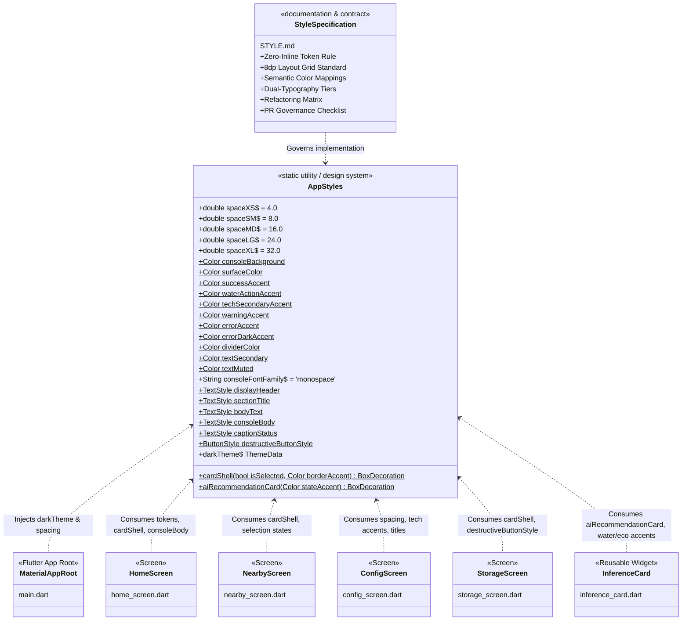
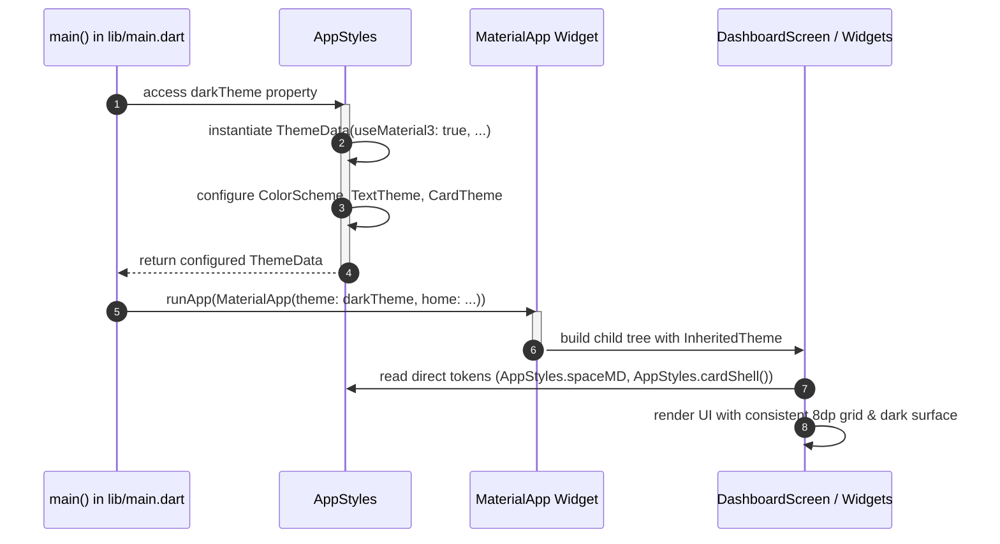
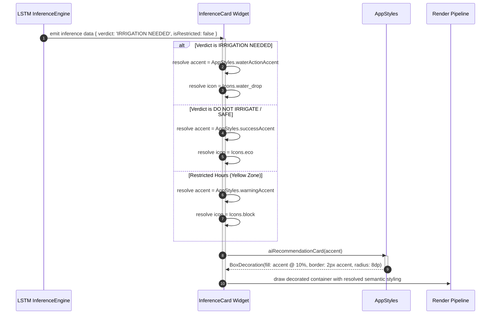
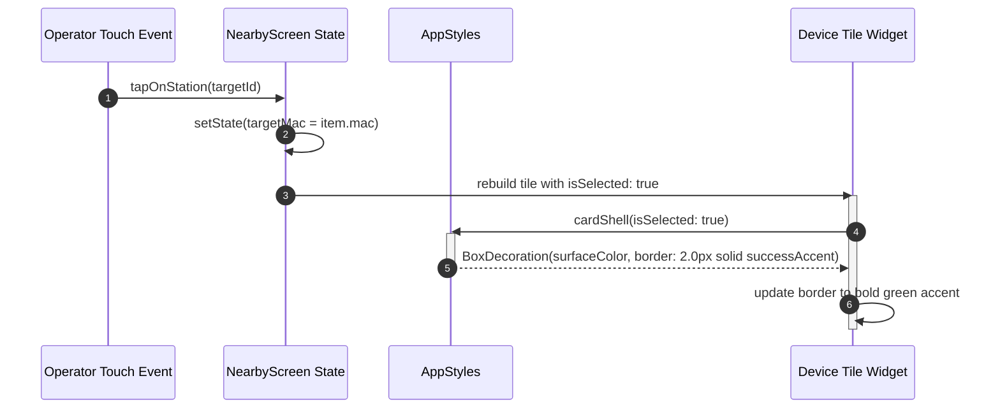

# C4 Model - Level 4: Code Documentation
# Module: `lib/core/theme`

This document provides comprehensive C4 Code-level (Level 4) architectural documentation for the theme and design system module located in [`lib/core/theme`](file:///C:/Users/CrackoPattt88/Proyectos/tfm_app/lib/core/theme). It covers the structural design, tokens, component shell decorators, theme configuration, governance rules, and cross-cutting relationships across the application.

---

## 1. Overview Section

### 1.1 Component Context & Purpose
In the **TFM Predictive Irrigation System** mobile/desktop application, the [`lib/core/theme`](file:///C:/Users/CrackoPattt88/Proyectos/tfm_app/lib/core/theme) directory encapsulates the centralized Design System and Visual Tokens Foundation. It is responsible for governing the visual presentation, spatial rhythm, semantic domain mappings, typography contracts, and component container shells across all presentation screens and reusable widgets.

The theme package comprises two primary artifacts:
1. [`app_styles.dart`](file:///C:/Users/CrackoPattt88/Proyectos/tfm_app/lib/core/theme/app_styles.dart): The production code defining the [`AppStyles`](file:///C:/Users/CrackoPattt88/Proyectos/tfm_app/lib/core/theme/app_styles.dart#L3-L121) class with static layout tokens, color constants, typography definitions, reusable box decorations, button styles, and the application-wide Material 3 [`darkTheme`](file:///C:/Users/CrackoPattt88/Proyectos/tfm_app/lib/core/theme/app_styles.dart#L80-L120).
2. [`STYLE.md`](file:///C:/Users/CrackoPattt88/Proyectos/tfm_app/lib/core/theme/STYLE.md): The authoritative architectural specification and style guide governing domain ergonomics, token centralization mandates, screen refactoring matrices, and pull-request compliance checklists.

### 1.2 Design Philosophy & Architectural Principles
The architecture of [`lib/core/theme`](file:///C:/Users/CrackoPattt88/Proyectos/tfm_app/lib/core/theme) bridges historical telemetry conventions from the original Agronomic Command Line Interface (CLI) with the fluid, modern visual ergonomics of Google's Material 3 design system.

The module enforces five core architectural tenets:
- **Single Source of Truth (SSOT):** Visual property definitions (spacings, borders, colors, text styles) are declared once within [`AppStyles`](file:///C:/Users/CrackoPattt88/Proyectos/tfm_app/lib/core/theme/app_styles.dart#L3-L121) and shared across all screens.
- **Zero-Inline-Color & Zero-Inline-Style Mandate:** Presentation widgets and screens are strictly prohibited from declaring raw hex color literals (e.g. `Color(0xFF1E1E1E)`) or framework color constants (e.g. `Colors.greenAccent`). All visual styling must reference `AppStyles.<token>` or `Theme.of(context).colorScheme.<token>`.
- **Strict 8dp Spatial Rhythm:** Spacing, padding, margins, and container offsets strictly adhere to an 8dp geometric progression (`spaceXS` = 4dp, `spaceSM` = 8dp, `spaceMD` = 16dp, `spaceLG` = 24dp, `spaceXL` = 32dp).
- **Domain Ergonomics & Semantic Mapping:** Visual cues directly map to hardware connectivity (BLE state, cloud sync), data integrity, and machine learning agronomic inference verdicts (e.g., `waterActionAccent` is reserved exclusively for the AI recommendation "IRRIGATE").
- **Dual-Typography Contract:** Employs a strict functional split between human-readable UI prose (rendered in standard sans-serif) and raw hardware telemetry, MAC addresses, sensor values, timestamps, and log traces (rendered in monospace via `consoleFontFamily`).

### 1.3 C4 Code-Level Component Diagram
The following Mermaid diagram visualizes the code-level structure of [`AppStyles`](file:///C:/Users/CrackoPattt88/Proyectos/tfm_app/lib/core/theme/app_styles.dart#L3-L121), its internal token clusters and decorators, its governance document [`STYLE.md`](file:///C:/Users/CrackoPattt88/Proyectos/tfm_app/lib/core/theme/STYLE.md), and its outbound consumption across the application.



---

## 2. Code Elements Section

This section details all files, classes, fields, methods, and architectural specifications residing in [`lib/core/theme`](file:///C:/Users/CrackoPattt88/Proyectos/tfm_app/lib/core/theme).

### 2.1 File Catalog

| File | Type | Lines of Code | Description |
| :--- | :--- | :--- | :--- |
| [`app_styles.dart`](file:///C:/Users/CrackoPattt88/Proyectos/tfm_app/lib/core/theme/app_styles.dart) | Dart Source | 121 lines | Centralized design tokens, text styles, decoration builders, and Material 3 theme factory. |
| [`STYLE.md`](file:///C:/Users/CrackoPattt88/Proyectos/tfm_app/lib/core/theme/STYLE.md) | Markdown Spec | 333 lines | System architecture guidelines, domain mapping tables, screen migration matrix, and QA checklist. |

---

### 2.2 Class: [`AppStyles`](file:///C:/Users/CrackoPattt88/Proyectos/tfm_app/lib/core/theme/app_styles.dart#L3-L121)

* **Location:** [`lib/core/theme/app_styles.dart#L3-L121`](file:///C:/Users/CrackoPattt88/Proyectos/tfm_app/lib/core/theme/app_styles.dart#L3-L121)
* **Declaration:** `class AppStyles`
* **Architectural Role:** Static token repository, component decoration builder, and theme provider. It cannot be instantiated and exposes purely `static const` fields, `static` factory helper methods, and a `static` getter for the root Material 3 theme.

#### 2.2.1 Spacing Tokens (8dp Layout Grid)
Defined at [`app_styles.dart#L4-L9`](file:///C:/Users/CrackoPattt88/Proyectos/tfm_app/lib/core/theme/app_styles.dart#L4-L9), these tokens enforce mathematical layout rhythm across paddings, margins, gaps, and component sizes:

| Token Name | Type | Value | Semantic & Architectural Usage |
| :--- | :--- | :--- | :--- |
| `spaceXS` | `double` | `4.0` | Micro-padding inside badge chips, status dot offsets, compact button inner gaps. |
| `spaceSM` | `double` | `8.0` | Standard internal element spacing, card inner list gaps, icon-to-label spacing, Wrap spacing. |
| `spaceMD` | `double` | `16.0` | Global screen exterior padding, card container inner padding, primary form vertical gaps. |
| `spaceLG` | `double` | `24.0` | Major visual section gaps, vertical separation between distinct functional panels. |
| `spaceXL` | `double` | `32.0` | Hero screen titles, main navigation tab separation, modal overlay top margins. |

#### 2.2.2 Semantic Color Tokens
Defined at [`app_styles.dart#L11-L23`](file:///C:/Users/CrackoPattt88/Proyectos/tfm_app/lib/core/theme/app_styles.dart#L11-L23), these tokens bind visual colors to specific system states, hardware interactions, and agronomic inference verdicts:

| Token Name | Type | Underlying Color | Hex / Material Constant | Domain Meaning & Functional Role |
| :--- | :--- | :--- | :--- | :--- |
| `consoleBackground` | `Color` | Black | `Colors.black` (`#000000`) | Scaffold background, root screen fill, CLI-style dark backdrop. |
| `surfaceColor` | `Color` | Dark Grey Tint | `Color(0xFF1E1E1E)` | Standard container fill for cards, modal dialogs, status log panels, and navigation bars. |
| `successAccent` | `Color` | Green Accent | `Colors.greenAccent` (`#64FFDA` / `#00E676`) | Connected BLE state, HTTP 200 API pings, synced cloud status, and **"DO NOT IRRIGATE"** AI verdicts. |
| `waterActionAccent` | `Color` | Blue Accent | `Colors.blueAccent` (`#448AFF`) | **Strictly reserved for water execution.** Used exclusively when the AI recommends **"IRRIGATE"** or manual irrigation is triggered. |
| `techSecondaryAccent` | `Color` | Cyan Accent | `Colors.cyanAccent` (`#18FFFF`) | Technical telemetry, clock drift indicators, local DB tags, and Irrigation Period configuration sliders. |
| `warningAccent` | `Color` | Amber Accent | `Colors.amberAccent` (`#FFAB40`) | Warning states, pending actions, agronomic restricted window ("Yellow Zone"), unsynced local records. |
| `errorAccent` | `Color` | Red Accent | `Colors.redAccent` (`#FF5252`) | Destructive actions, system errors, API timeouts, manual safety overrides, disconnect actions. |
| `errorDarkAccent` | `Color` | Dark Crimson | `Color(0xFFB71C1C)` (`Colors.red.shade900`) | High-contrast critical alert background, danger zone container accent. |
| `dividerColor` | `Color` | Translucent White | `Colors.white12` (`Color(0x1FFFFFFF)`) | Subtle structural dividing lines, default card perimeter outlines, table borders. |
| `textSecondary` | `Color` | Light Grey | `Colors.white70` (`Color(0xB3FFFFFF)`) | Monospace technical readouts, secondary descriptions, form labels. |
| `textMuted` | `Color` | Muted Grey | `Colors.white54` (`Color(0x8AFFFFFF)`) | Inactive labels, disabled action text, timestamps, telemetry unit legends (`ms`, `VWC`, `°C`). |

#### 2.2.3 Typography Contract & Text Styles
Defined at [`app_styles.dart#L26-L49`](file:///C:/Users/CrackoPattt88/Proyectos/tfm_app/lib/core/theme/app_styles.dart#L26-L49), typography is strictly bifurcated into Human UI Prose (Sans-Serif) and Technical Data (Monospace):

| Style Token | Font Family | Size | Weight | Color | Purpose & Target UI Elements |
| :--- | :--- | :--- | :--- | :--- | :--- |
| `consoleFontFamily` | String | N/A | N/A | N/A | Static constant `'monospace'`, establishing platform monospace fallback. |
| `displayHeader` | System Sans-Serif | 20pt | Bold | `successAccent` | Top-level screen headers (e.g., "Unified Stations Dashboard", "Agronomic Terminal"). |
| `sectionTitle` | System Sans-Serif | 16pt | Bold | `Colors.white` | Panel headers, card titles, dialog titles, settings group headers. |
| `bodyText` | System Sans-Serif | 13pt | Normal | `Colors.white` | Explanatory UI copy, button labels, form field instructions. |
| `consoleBody` | `consoleFontFamily` | 13pt | Normal | `textSecondary` | Raw sensor measurements (`24.5°C`, `78% VWC`), device MAC IDs (`AA:BB:CC:11:22:33`), console logs. |
| `captionStatus` | `consoleFontFamily` | 11pt | Normal | `textMuted` | Ping latencies (`45ms`), record timestamps, HTTP status codes, bottom status bar messages. |

#### 2.2.4 Reusable Container Decorations & Style Builders

##### `cardShell({bool isSelected = false, Color borderAccent = dividerColor})`
* **Location:** [`app_styles.dart#L52-L61`](file:///C:/Users/CrackoPattt88/Proyectos/tfm_app/lib/core/theme/app_styles.dart#L52-L61)
* **Return Type:** `BoxDecoration`
* **Signature:**
  ```dart
  static BoxDecoration cardShell({
    bool isSelected = false, 
    Color borderAccent = dividerColor,
  })
  ```
* **Behavior:** Returns a standardized container decoration featuring:
  - Background fill: `surfaceColor` (`0xFF1E1E1E`).
  - Corner radius: `BorderRadius.circular(8.0)`.
  - Border: When `isSelected` is `false`, renders a 1.0px solid border using `borderAccent` (defaults to `dividerColor`). When `isSelected` is `true`, elevates the border to 2.0px solid `successAccent` (`Colors.greenAccent`).
* **Usage:** Applied to device list items, station cards, debug output containers, and settings panels.

##### `aiRecommendationCard(Color stateAccent)`
* **Location:** [`app_styles.dart#L63-L69`](file:///C:/Users/CrackoPattt88/Proyectos/tfm_app/lib/core/theme/app_styles.dart#L63-L69)
* **Return Type:** `BoxDecoration`
* **Signature:**
  ```dart
  static BoxDecoration aiRecommendationCard(Color stateAccent)
  ```
* **Behavior:** Generates a high-emphasis visual shell for agronomic recommendation outputs:
  - Background fill: `stateAccent.withValues(alpha: 0.1)` (10% translucent tinted wash).
  - Corner radius: `BorderRadius.circular(8.0)`.
  - Border: 2.0px solid border matching `stateAccent`.
* **Usage:** Rendered by [`InferenceCard`](file:///C:/Users/CrackoPattt88/Proyectos/tfm_app/lib/screens/widgets/inference_card.dart) where `stateAccent` is dynamically supplied as:
  - `waterActionAccent` for "IRRIGATE" decisions.
  - `successAccent` for "DO NOT IRRIGATE" decisions.
  - `warningAccent` for restricted agronomic hours or missing sensor telemetry.

##### `destructiveButtonStyle`
* **Location:** [`app_styles.dart#L71-L77`](file:///C:/Users/CrackoPattt88/Proyectos/tfm_app/lib/core/theme/app_styles.dart#L71-L77)
* **Return Type:** `ButtonStyle`
* **Declaration:**
  ```dart
  static ButtonStyle destructiveButtonStyle = OutlinedButton.styleFrom(
    foregroundColor: errorAccent,
    side: const BorderSide(color: errorAccent, width: 1.0),
    shape: RoundedRectangleBorder(
      borderRadius: BorderRadius.circular(8.0),
    ),
  );
  ```
* **Usage:** Used across screens for high-risk irreversible operations: BLE disconnect, local database wipe, and emergency manual safety overrides.

#### 2.2.5 Global Theme Assembly: `darkTheme`
* **Location:** [`app_styles.dart#L80-L120`](file:///C:/Users/CrackoPattt88/Proyectos/tfm_app/lib/core/theme/app_styles.dart#L80-L120)
* **Return Type:** `ThemeData`
* **Description:** Assembles the root Material 3 theme consumed by `MaterialApp` in [`main.dart`](file:///C:/Users/CrackoPattt88/Proyectos/tfm_app/lib/main.dart#L22).
* **Configuration Specifications:**
  - `useMaterial3: true`: Enables Material 3 styling specifications.
  - `brightness: Brightness.dark`: Root dark mode luminance.
  - `scaffoldBackgroundColor: consoleBackground`: Deep black screen canvas.
  - `colorScheme`: Configured with `primary: successAccent`, `secondary: techSecondaryAccent`, `surface: surfaceColor`, `error: errorAccent`.
  - `textTheme`: Maps `headlineSmall` to `displayHeader`, `titleMedium` to `sectionTitle`, `bodyMedium` to `bodyText`, and `bodySmall` to `captionStatus`.
  - `navigationRailTheme`: Styled with `consoleBackground` fill, `successAccent` for selected tabs, and `textMuted` for unselected tabs.
  - `elevatedButtonTheme`: Styled with `surfaceColor` background, `successAccent` border and foreground, and bold text weight.
  - `cardTheme`: Standardizes card components to `surfaceColor` fill, 8.0dp corner radius, and 1.0px `dividerColor` border.

---

### 2.3 Architectural Governance: [`STYLE.md`](file:///C:/Users/CrackoPattt88/Proyectos/tfm_app/lib/core/theme/STYLE.md)

[`STYLE.md`](file:///C:/Users/CrackoPattt88/Proyectos/tfm_app/lib/core/theme/STYLE.md) is the living design contract and governance document that dictates how screens interact with the theme tokens.

#### Key Governance Sections:
1. **Section I - Architectural Foundations & Token Hierarchy:**
   - Enforces the **Zero-Inline-Color Mandate** (no `Colors.*` or `Color(0x...)` within screens).
   - Establishes the strict base-8 layout grid (`spaceXS` to `spaceXL`).
2. **Section II - Semantic Color Palette & Domain Mapping:**
   - Formalizes hardware and telemetry triggers for each color token.
   - Restricts `waterActionAccent` exclusively to irrigation triggers to prevent operator confusion.
3. **Section III - Dual-Typography Contract:**
   - Categorizes fonts into 5 precise tiers with fixed point sizes and family allocations.
4. **Section IV - Component Design Rules & Standardized Shells:**
   - Mandates standard screen header layout rows with `displayHeader`.
   - Restricts card corner radii to exactly 8.0dp.
   - Mandates the selection border scaling behavior (1.0px -> 2.0px `successAccent`).
5. **Section VI - Screen Refactoring Matrix:**
   - Directs screen-by-screen migration tasks for [`home_screen.dart`](file:///C:/Users/CrackoPattt88/Proyectos/tfm_app/lib/screens/home_screen.dart), [`nearby_screen.dart`](file:///C:/Users/CrackoPattt88/Proyectos/tfm_app/lib/screens/nearby_screen.dart), [`config_screen.dart`](file:///C:/Users/CrackoPattt88/Proyectos/tfm_app/lib/screens/config_screen.dart), [`storage_screen.dart`](file:///C:/Users/CrackoPattt88/Proyectos/tfm_app/lib/screens/storage_screen.dart), and [`main.dart`](file:///C:/Users/CrackoPattt88/Proyectos/tfm_app/lib/main.dart).
6. **Section VII - PR Governance & Compliance Checklist:**
   - Mandatory verification checklist executed during code reviews prior to merging pull requests.

---

## 3. Dependencies Section

### 3.1 External Dependencies (Upstream)
The module maintains absolute architectural purity with no external third-party package dependencies outside the official Flutter SDK:

| Package | Purpose | Classes & Types Utilized |
| :--- | :--- | :--- |
| `package:flutter/material.dart` | Flutter Material Design Framework | `ThemeData`, `ColorScheme`, `TextTheme`, `BoxDecoration`, `Border`, `BorderRadius`, `BorderSide`, `ButtonStyle`, `OutlinedButton`, `ElevatedButton`, `ElevatedButtonThemeData`, `CardThemeData`, `NavigationRailThemeData`, `IconThemeData`, `Color`, `Colors`, `TextStyle`, `FontWeight`, `Brightness`, `RoundedRectangleBorder`. |

> [!NOTE]
> `lib/core/theme` has **zero** internal application dependencies. It does not import any database models, BLE managers, network clients, or utility classes. This design makes it an immutable leaf node in the architectural dependency graph.

---

### 3.2 Inbound Dependencies (Consumers of `lib/core/theme`)
The following table details every file across the codebase that imports and consumes `lib/core/theme/app_styles.dart`:

| Consuming File | Imports | Tokens & Methods Consumed | Architectural Role |
| :--- | :--- | :--- | :--- |
| [`lib/main.dart`](file:///C:/Users/CrackoPattt88/Proyectos/tfm_app/lib/main.dart#L5) | `app_styles.dart` | `darkTheme`, `spaceXS`, `spaceSM`, `spaceMD`, `surfaceColor`, `successAccent`, `textMuted`, `captionStatus`, `dividerColor` | Root theme injection into `MaterialApp`; formatting the sticky bottom telemetry status bar and navigation rail. |
| [`lib/screens/home_screen.dart`](file:///C:/Users/CrackoPattt88/Proyectos/tfm_app/lib/screens/home_screen.dart#L10) | `app_styles.dart` | `spaceXS`, `spaceSM`, `spaceMD`, `spaceLG`, `displayHeader`, `sectionTitle`, `bodyText`, `consoleBody`, `captionStatus`, `cardShell`, `destructiveButtonStyle`, `errorAccent`, `warningAccent`, `techSecondaryAccent`, `surfaceColor` | Formatting telemetry dashboards, sensor data chips, danger zone override panels, and CLI terminal output boxes. |
| [`lib/screens/nearby_screen.dart`](file:///C:/Users/CrackoPattt88/Proyectos/tfm_app/lib/screens/nearby_screen.dart#L7) | `app_styles.dart` | `spaceXS`, `spaceSM`, `spaceMD`, `spaceLG`, `displayHeader`, `sectionTitle`, `bodyText`, `consoleBody`, `captionStatus`, `cardShell(isSelected: ...)`, `destructiveButtonStyle`, `errorAccent`, `successAccent`, `warningAccent`, `textMuted` | Styling BLE device scanner cards, dynamic target station selection borders (2px green), connection modals, and PIN dialogues. |
| [`lib/screens/config_screen.dart`](file:///C:/Users/CrackoPattt88/Proyectos/tfm_app/lib/screens/config_screen.dart#L7) | `app_styles.dart` | `spaceXS`, `spaceSM`, `spaceMD`, `spaceLG`, `displayHeader`, `sectionTitle`, `bodyText`, `consoleBody`, `captionStatus`, `cardShell`, `techSecondaryAccent`, `waterActionAccent`, `successAccent`, `errorAccent`, `dividerColor` | Formatting parameter sliders (Irrigation Period in cyan), clock synchronization drift displays, API configuration modals, and location selection sheets. |
| [`lib/screens/storage_screen.dart`](file:///C:/Users/CrackoPattt88/Proyectos/tfm_app/lib/screens/storage_screen.dart#L8) | `app_styles.dart` | `spaceXS`, `spaceSM`, `spaceMD`, `spaceLG`, `displayHeader`, `sectionTitle`, `bodyText`, `consoleBody`, `captionStatus`, `cardShell(isSelected: ...)`, `destructiveButtonStyle`, `successAccent`, `errorAccent`, `warningAccent`, `techSecondaryAccent` | Rendering local Isar database metrics, station record list tiles, sync state badges, and destructive database wipe confirmation dialogs. |
| [`lib/screens/widgets/inference_card.dart`](file:///C:/Users/CrackoPattt88/Proyectos/tfm_app/lib/screens/widgets/inference_card.dart#L2) | `app_styles.dart` | `spaceXS`, `spaceSM`, `spaceMD`, `sectionTitle`, `bodyText`, `captionStatus`, `aiRecommendationCard(stateAccent)`, `waterActionAccent`, `successAccent`, `warningAccent` | Primary agronomic AI decision presentation card; dynamically applies tinted shells and semantic colors based on LSTM model verdicts. |

---

## 4. Relationships Section

### 4.1 Layered Architectural Topology
Within the layered architecture of the application, [`lib/core/theme`](file:///C:/Users/CrackoPattt88/Proyectos/tfm_app/lib/core/theme) resides at the base **Core Foundation Layer**:

```
┌────────────────────────────────────────────────────────────────────────┐
│                        PRESENTATION LAYER                              │
│  HomeScreen   NearbyScreen   ConfigScreen   StorageScreen   Widgets    │
└──────────────────┬───────────────────────────────┬─────────────────────┘
                   │ (Direct Token Access)         │ (Inherited Context)
                   ▼                               ▼
┌──────────────────────────────────────┐     ┌───────────────────────────┐
│     AppStyles (Static API)           │     │    Theme.of(context)      │
│  - cardShell()                       │     │  - colorScheme            │
│  - aiRecommendationCard()            │     │  - textTheme              │
│  - Spacing & Color Tokens            │     │  - cardTheme              │
└──────────────────┬───────────────────┘     └─────────────┬─────────────┘
                   │                                       │
                   │ (Assembles & Injects)                 │
                   ▼                                       │
┌──────────────────────────────────────────────────────────┴─────────────┐
│                 MaterialApp (lib/main.dart)                            │
│                 theme: AppStyles.darkTheme                             │
└──────────────────────────────────┬─────────────────────────────────────┘
                                   ▼
┌────────────────────────────────────────────────────────────────────────┐
│                        CORE FOUNDATION LAYER                           │
│                     lib/core/theme/app_styles.dart                     │
│                        lib/core/theme/STYLE.md                         │
└──────────────────────────────────┬─────────────────────────────────────┘
                                   ▼
┌────────────────────────────────────────────────────────────────────────┐
│                        FLUTTER MATERIAL SDK                            │
│                     package:flutter/material.dart                      │
└────────────────────────────────────────────────────────────────────────┘
```

---

### 4.2 Dynamic Behavioral & Data Flow Workflows

#### Workflow 1: Application Bootstrapping & Theme Injection
This sequence shows how [`AppStyles.darkTheme`](file:///C:/Users/CrackoPattt88/Proyectos/tfm_app/lib/core/theme/app_styles.dart#L80-L120) is constructed at launch and propagated down the widget hierarchy.



---

#### Workflow 2: Reactive Agronomic Verdict Rendering
This workflow illustrates how the AI recommendation engine's verdict maps to dynamic visual styling within [`InferenceCard`](file:///C:/Users/CrackoPattt88/Proyectos/tfm_app/lib/screens/widgets/inference_card.dart) using [`AppStyles`](file:///C:/Users/CrackoPattt88/Proyectos/tfm_app/lib/core/theme/app_styles.dart).



---

#### Workflow 3: Interactive BLE Station Selection Highlighting
This sequence demonstrates the border transition logic when a user selects a BLE device or station in [`NearbyScreen`](file:///C:/Users/CrackoPattt88/Proyectos/tfm_app/lib/screens/nearby_screen.dart) or [`StorageScreen`](file:///C:/Users/CrackoPattt88/Proyectos/tfm_app/lib/screens/storage_screen.dart).



---

### 4.3 Cohesion, Coupling, and Architecture Quality Evaluation

- **High Functional Cohesion:** The module is strictly bounded to visual styling, spatial metrics, typography, and container decoration builders. It does not perform state management, network calls, or asynchronous computations.
- **Zero Inward Coupling:** `lib/core/theme` has no dependencies on other application modules (`lib/core/database`, `lib/core/network`, `lib/screens`, etc.). Changes to business logic or database schemas have zero impact on the styling engine.
- **Unidirectional Outward Coupling:** Presentation modules depend unidirectionally on `AppStyles`. Because all tokens are compile-time constants or pure static functions, consumption overhead is minimal and tree-shaking is fully supported.
- **Extensibility & Theme Switching:** While the application currently leverages [`darkTheme`](file:///C:/Users/CrackoPattt88/Proyectos/tfm_app/lib/core/theme/app_styles.dart#L80-L120) to maintain CLI ergonomics, the encapsulation of color tokens allows the future addition of high-contrast sunlight or daytime palettes by introducing corresponding `ThemeData` builders without changing the calling signatures in the presentation layer.
