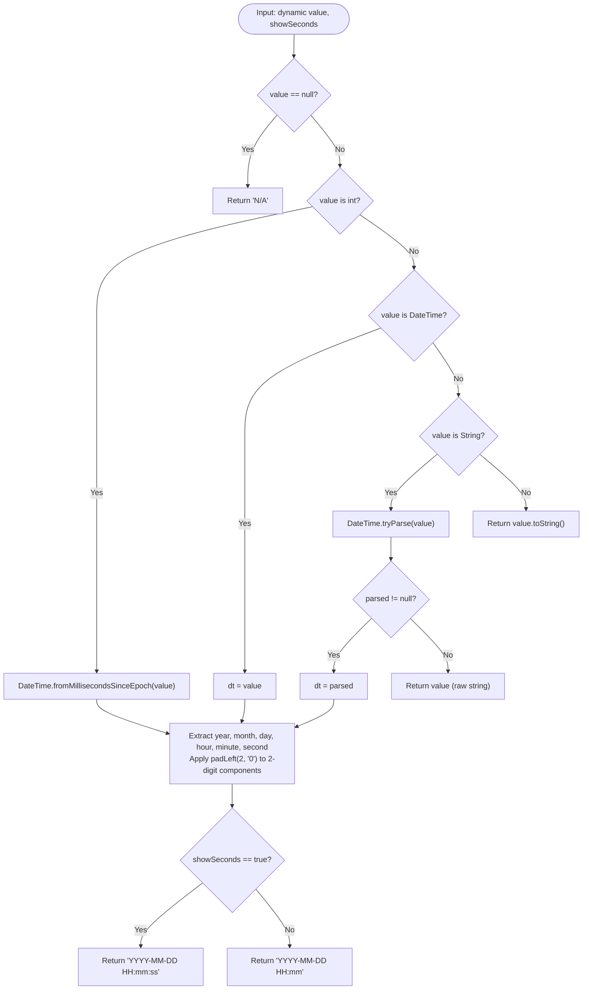
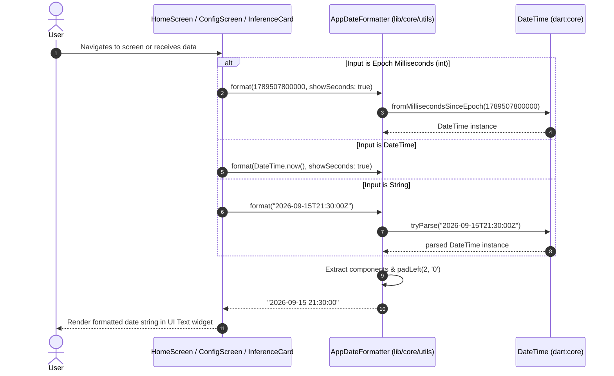
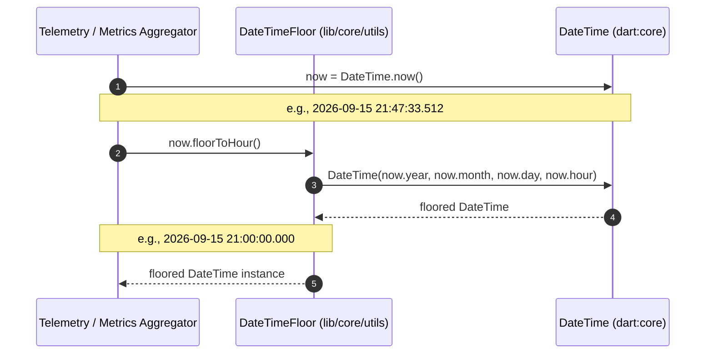

# C4 Code Architecture: `lib/core/utils`

This document provides code-level architecture documentation (Level 4 in the C4 model) for the utilities module located in [`lib/core/utils`](file:///C:/Users/CrackoPattt88/Proyectos/tfm_app/lib/core/utils). Per architectural specification, this document focuses exclusively on the foundational utility implementations within the directory and excludes the localization module ([`l10n`](file:///C:/Users/CrackoPattt88/Proyectos/tfm_app/lib/core/utils/l10n)), which is documented separately.

---

## 1. Overview Section

### 1.1 Purpose & Scope

The [`lib/core/utils`](file:///C:/Users/CrackoPattt88/Proyectos/tfm_app/lib/core/utils) directory serves as a foundational layer within the application architecture. It provides cross-cutting, stateless helper functions, formatting utilities, and type extensions utilized across the domain, data, and presentation layers.

At this level of the architecture, the primary component implemented in this directory is [`date_formatter.dart`](file:///C:/Users/CrackoPattt88/Proyectos/tfm_app/lib/core/utils/date_formatter.dart). It encapsulates:
- Uniform date-time formatting for UI presentation, telemetry stamps, and log display.
- Temporal normalization extensions on standard Dart [`DateTime`](file:///C:/Users/CrackoPattt88/Proyectos/tfm_app/lib/core/utils/date_formatter.dart#L33-L38) instances.

### 1.2 Architectural Role & Boundaries

In accordance with Clean Architecture principles:
- **Layer Placement**: Core Utility (innermost layer).
- **Coupling**: Zero external package dependencies and zero framework dependencies (it relies solely on `dart:core`). It has no knowledge of UI widgets, database entities, or network protocols.
- **State Management**: Completely stateless; all operations are implemented as pure functions without side effects.
- **Thread Safety**: Fully thread-safe and re-entrant across Dart isolates.

```
+-------------------------------------------------------------------------+
|                           Presentation Layer                            |
|  (HomeScreen, ConfigScreen, InferenceCard, Telemetry Widgets)           |
+-------------------------------------------------------------------------+
                                    |
                                    | invokes format() / floorToHour()
                                    v
+-------------------------------------------------------------------------+
|                  Core Utility Layer: lib/core/utils                     |
|                                                                         |
|   +--------------------------+        +-----------------------------+   |
|   |    AppDateFormatter      |        |     DateTimeFloor           |   |
|   |   (Static Utility Class) |        |  (Extension on DateTime)    |   |
|   +--------------------------+        +-----------------------------+   |
+-------------------------------------------------------------------------+
                                    |
                                    | operates on
                                    v
+-------------------------------------------------------------------------+
|                           dart:core (SDK)                               |
|                     (DateTime, String, int, bool)                       |
+-------------------------------------------------------------------------+
```

### 1.3 C4 Code Diagram

The following class diagram details the code elements inside [`lib/core/utils/date_formatter.dart`](file:///C:/Users/CrackoPattt88/Proyectos/tfm_app/lib/core/utils/date_formatter.dart) and their relationship to the Dart SDK and calling modules:

```mermaid
classDiagram
    direction TB

    class AppDateFormatter {
        <<utility>>
        +format(dynamic value, {bool showSeconds}) String$
    }

    class DateTimeFloor {
        <<extension on DateTime>>
        +floorToHour() DateTime
    }

    class DateTime {
        <<dart:core>>
        +int year
        +int month
        +int day
        +int hour
        +int minute
        +int second
        +fromMillisecondsSinceEpoch(int ms)$ DateTime
        +tryParse(String formattedString)$ DateTime?
    }

    class HomeScreen {
        <<StatefulWidget>>
        -_formatDate(int ms) String
    }

    class ConfigScreen {
        <<StatefulWidget>>
        +build(BuildContext context) Widget
    }

    class InferenceCard {
        <<StatelessWidget>>
        -_defaultFormatDate(int ms) String
    }

    AppDateFormatter ..> DateTime : resolves & transforms
    DateTimeFloor ..> DateTime : extends
    HomeScreen ..> AppDateFormatter : calls format()
    ConfigScreen ..> AppDateFormatter : calls format()
    InferenceCard ..> AppDateFormatter : calls format()
```

---

## 2. Code Elements Section

The non-l10n codebase within [`lib/core/utils`](file:///C:/Users/CrackoPattt88/Proyectos/tfm_app/lib/core/utils) is housed entirely in [`date_formatter.dart`](file:///C:/Users/CrackoPattt88/Proyectos/tfm_app/lib/core/utils/date_formatter.dart). It defines two main constructs:

1. [`AppDateFormatter`](file:///C:/Users/CrackoPattt88/Proyectos/tfm_app/lib/core/utils/date_formatter.dart#L1-L31) (Class)
2. [`DateTimeFloor`](file:///C:/Users/CrackoPattt88/Proyectos/tfm_app/lib/core/utils/date_formatter.dart#L33-L38) (Extension)

### 2.1 `AppDateFormatter`

```dart
class AppDateFormatter {
  static String format(dynamic value, {bool showSeconds = true})
}
```

- **File**: [`lib/core/utils/date_formatter.dart`](file:///C:/Users/CrackoPattt88/Proyectos/tfm_app/lib/core/utils/date_formatter.dart#L1-L31)
- **Type**: Utility Class (static container).
- **Design Intent**: Provides an application-wide standardized representation of timestamps (`YYYY-MM-DD HH:mm:ss` or `YYYY-MM-DD HH:mm`) without requiring external dependencies such as the `intl` package.

#### 2.1.1 Method: `format`

- **Declaration**: [`AppDateFormatter.format(dynamic value, {bool showSeconds = true})`](file:///C:/Users/CrackoPattt88/Proyectos/tfm_app/lib/core/utils/date_formatter.dart#L4-L30)
- **Parameters**:
  - `dynamic value`: The source representation of the date/time. Dynamically typed to accept multiple common formats used throughout the data and presentation layers:
    - `null`: Handled gracefully by returning `'N/A'`.
    - `int`: Interpreted as epoch timestamp in milliseconds (`fromMillisecondsSinceEpoch`).
    - `DateTime`: Utilized directly.
    - `String`: Parsed via `DateTime.tryParse()`. If parsing fails, the original string is returned unaltered as a fallback.
    - `Object`: Any other unrecognized type falls back to `value.toString()`.
  - `bool showSeconds`: Optional named parameter (default: `true`). When set to `false`, the seconds component `:ss` is omitted from the output.
- **Return Type**: `String`
- **Output Format**:
  - `showSeconds = true`: `YYYY-MM-DD HH:mm:ss` (e.g., `2026-09-15 21:30:00`)
  - `showSeconds = false`: `YYYY-MM-DD HH:mm` (e.g., `2026-09-15 21:30`)
- **Zero-Padding**: All temporal segments (`month`, `day`, `hour`, `minute`, `second`) are left-padded with zero to guarantee fixed two-character widths using `padLeft(2, '0')`.

#### 2.1.2 Algorithmic Resolution Flow



---

### 2.2 `DateTimeFloor`

```dart
extension DateTimeFloor on DateTime {
  DateTime floorToHour()
}
```

- **File**: [`lib/core/utils/date_formatter.dart`](file:///C:/Users/CrackoPattt88/Proyectos/tfm_app/lib/core/utils/date_formatter.dart#L33-L38)
- **Type**: Dart Language Extension on SDK [`DateTime`](file:///C:/Users/CrackoPattt88/Proyectos/tfm_app/lib/core/utils/date_formatter.dart#L33-L38).
- **Design Intent**: Provides clean syntactic sugar for temporal truncation and time-bucket rounding.

#### 2.2.1 Method: `floorToHour`

- **Declaration**: [`DateTimeFloor.floorToHour()`](file:///C:/Users/CrackoPattt88/Proyectos/tfm_app/lib/core/utils/date_formatter.dart#L35-L37)
- **Receiver**: `DateTime` instance.
- **Return Type**: `DateTime`
- **Behavior**: Snaps the `DateTime` instance down to the top of the hour (`:00:00.000000`). It constructs a new `DateTime(year, month, day, hour)` discarding minutes, seconds, milliseconds, and microseconds.
- **Use Cases**:
  - Telemetry and sensor data bucketing (grouping sensor measurements into hourly intervals).
  - Time-series chart axis intervals.
  - Generating cache invalidation keys based on hourly windows.


---

## 3. Dependencies Section

### 3.1 Dependency Matrix

| Component / File | Inbound Dependencies (Callers) | Outbound Dependencies | External Packages |
| :--- | :--- | :--- | :--- |
| [`date_formatter.dart`](file:///C:/Users/CrackoPattt88/Proyectos/tfm_app/lib/core/utils/date_formatter.dart) | [`HomeScreen`](file:///C:/Users/CrackoPattt88/Proyectos/tfm_app/lib/screens/home_screen.dart#L137)<br/>[`ConfigScreen`](file:///C:/Users/CrackoPattt88/Proyectos/tfm_app/lib/screens/config_screen.dart#L449)<br/>[`InferenceCard`](file:///C:/Users/CrackoPattt88/Proyectos/tfm_app/lib/screens/widgets/inference_card.dart#L33) | `dart:core` (`DateTime`, `String`, `int`, `bool`) | None |

### 3.2 Inbound Call Sites Analysis

1. **[`ConfigScreen`](file:///C:/Users/CrackoPattt88/Proyectos/tfm_app/lib/screens/config_screen.dart#L449)**
   - **Usage**:
     ```dart
     final dateStr = AppDateFormatter.format(_now, showSeconds: true);
     ```
   - **Input**: A Dart `DateTime` object (`_now = DateTime.now()`).
   - **Purpose**: Displays the current synchronization timestamp in the device configuration dashboard header.

2. **[`HomeScreen`](file:///C:/Users/CrackoPattt88/Proyectos/tfm_app/lib/screens/home_screen.dart#L137)**
   - **Usage**:
     ```dart
     String _formatDate(int ms) {
       return AppDateFormatter.format(ms, showSeconds: true);
     }
     ```
   - **Input**: Milliseconds since epoch integer (`int ms`) received from remote station status payload (`status['now_ms']`).
   - **Purpose**: Displays timestamp information for telemetry readouts and station synchronization updates.

3. **[`InferenceCard`](file:///C:/Users/CrackoPattt88/Proyectos/tfm_app/lib/screens/widgets/inference_card.dart#L33)**
   - **Usage**:
     ```dart
     String _defaultFormatDate(int ms) {
       return AppDateFormatter.format(ms, showSeconds: true);
     }
     ```
   - **Input**: Milliseconds since epoch integer (`int ms`) associated with machine learning inference execution records.
   - **Purpose**: Renders the exact execution time of RF model classification/inference inside the UI card.

### 3.3 Architectural Layering & Isolation

- **Zero Coupling to Flutter UI**: The module does not import `package:flutter/material.dart` or any UI framework code.
- **Zero Third-Party Dependencies**: By avoiding packages like `intl`, the core utilities eliminate initialization overhead (such as `initializeDateFormatting()`) and prevent transitive version conflicts.
- **Zero Dependency on Domain/Data Entities**: The module does not import database models, DTOs, or repositories, maintaining clean architecture boundaries where inner layers have no dependency on outer layers.

---

## 4. Relationships Section

### 4.1 Invocation & Execution Flows

#### 4.1.1 UI Rendering Sequence Diagram

This sequence diagram depicts how higher-level presentation components interact with [`AppDateFormatter`](file:///C:/Users/CrackoPattt88/Proyectos/tfm_app/lib/core/utils/date_formatter.dart#L1-L31) during widget build and rendering cycles:



#### 4.1.2 Extension Method Usage Flow



---

### 4.2 Architectural Design Decisions & Trade-Offs

#### 4.2.1 Static Utility vs. Injectable Service

| Aspect | Static Utility ([`AppDateFormatter`](file:///C:/Users/CrackoPattt88/Proyectos/tfm_app/lib/core/utils/date_formatter.dart#L1-L31)) | Injectable Service (e.g., `DateFormatService`) |
| :--- | :--- | :--- |
| **Call Simplicity** | Direct call (`AppDateFormatter.format(...)`) with no dependency injection setup. | Requires injecting service into widgets or passing via `Provider`/`InheritedWidget`. |
| **State** | Stateless, pure functions. | Often requires instantiation and lifecycle management. |
| **Testability** | Deterministic; testable in isolation without mocking. | Can be mocked or substituted if date locale changes dynamically. |
| **Decision** | The application adopted the static utility pattern because date formatting is a pure function that requires no mutable configuration or environmental state. |

#### 4.2.2 Polymorphic `dynamic` Input vs. Strongly Typed Overloads

- **Implementation**: `AppDateFormatter.format(dynamic value, ...)` accepts `dynamic`.
- **Advantage**: Dart does not support method overloading by parameter type (e.g., `format(DateTime)` and `format(int)` cannot co-exist with the same name). Using a `dynamic` parameter with runtime type discrimination enables a single unified entry point across callers handling raw epoch `int` timestamps from JSON payloads, `DateTime` objects from Flutter pickers, and ISO-8601 strings from REST APIs.
- **Defensive Behavior**:
  - `null` returns `'N/A'` instead of throwing a `NullThrownError` or `ArgumentError`.
  - Unparseable strings return the original input, preventing crashes on corrupted date fields.

#### 4.2.3 Native String Formatting vs. `intl.DateFormat`

- **Implementation**: Direct manual string interpolation with `.padLeft(2, '0')`.
- **Rationale**:
  - Eliminates the ~500KB asset overhead of the `intl` package time zone and locale data tables.
  - Enforces uniform, ISO-like machine-readable date representation (`YYYY-MM-DD HH:mm[:ss]`) across all screens, preventing inconsistent date representations in technical/engineering views.
  - Outperforms regex- and ICU-pattern-based formatters in execution speed.

#### 4.2.4 Extension Methods on Platform Types

- **Implementation**: [`DateTimeFloor`](file:///C:/Users/CrackoPattt88/Proyectos/tfm_app/lib/core/utils/date_formatter.dart#L33-L38) extends `DateTime`.
- **Rationale**: Enables natural, idiomatic Dart syntax (`timestamp.floorToHour()`) without wrapping `DateTime` in a custom value object or utility class.
