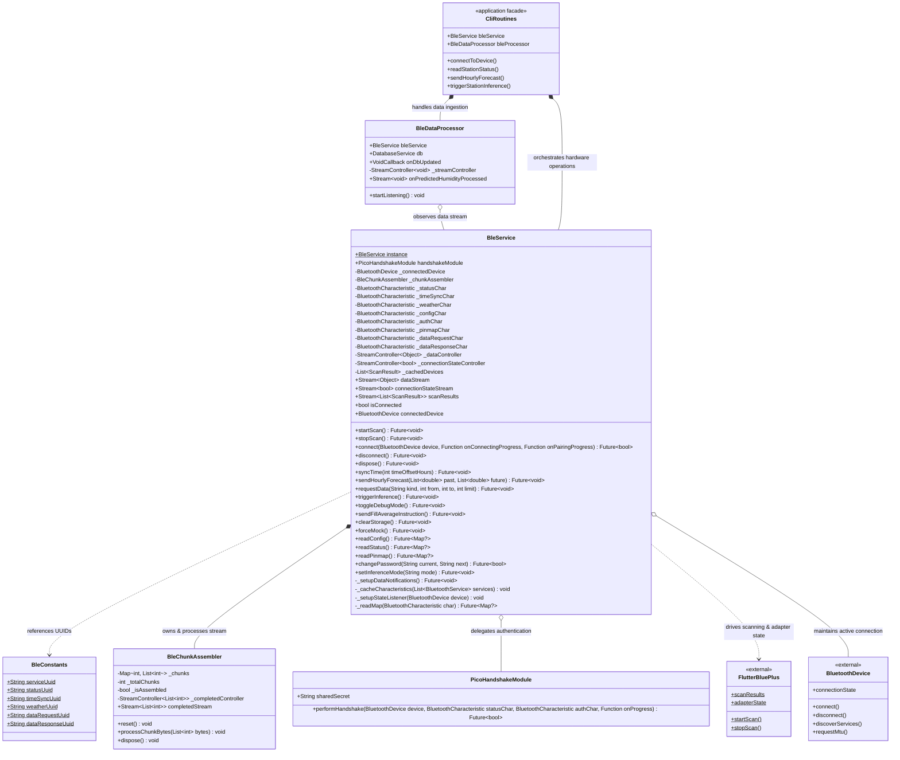
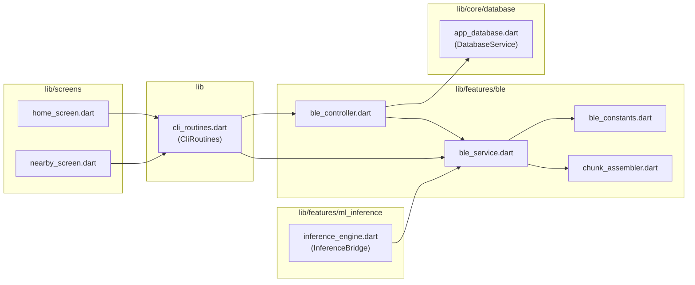
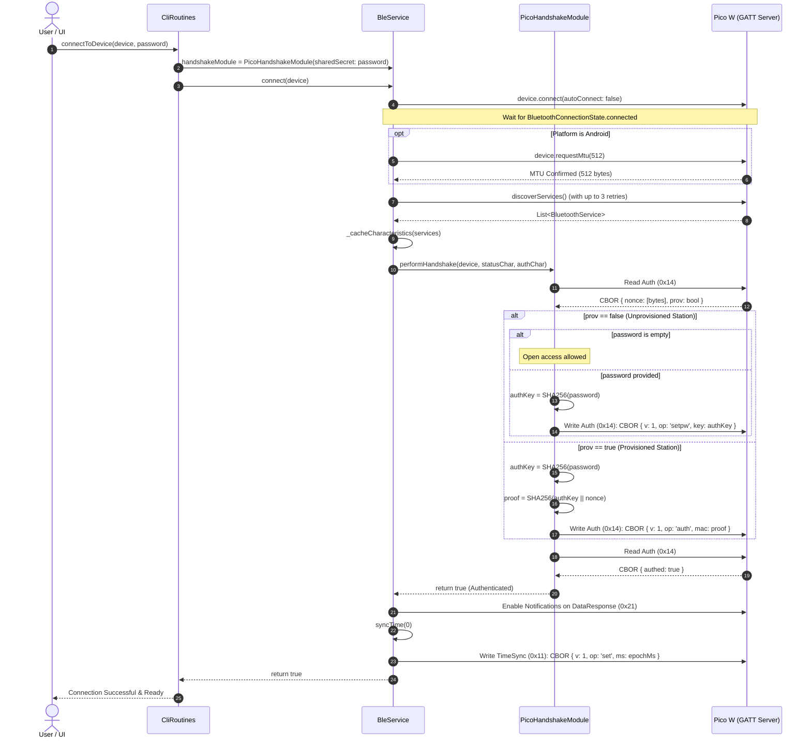
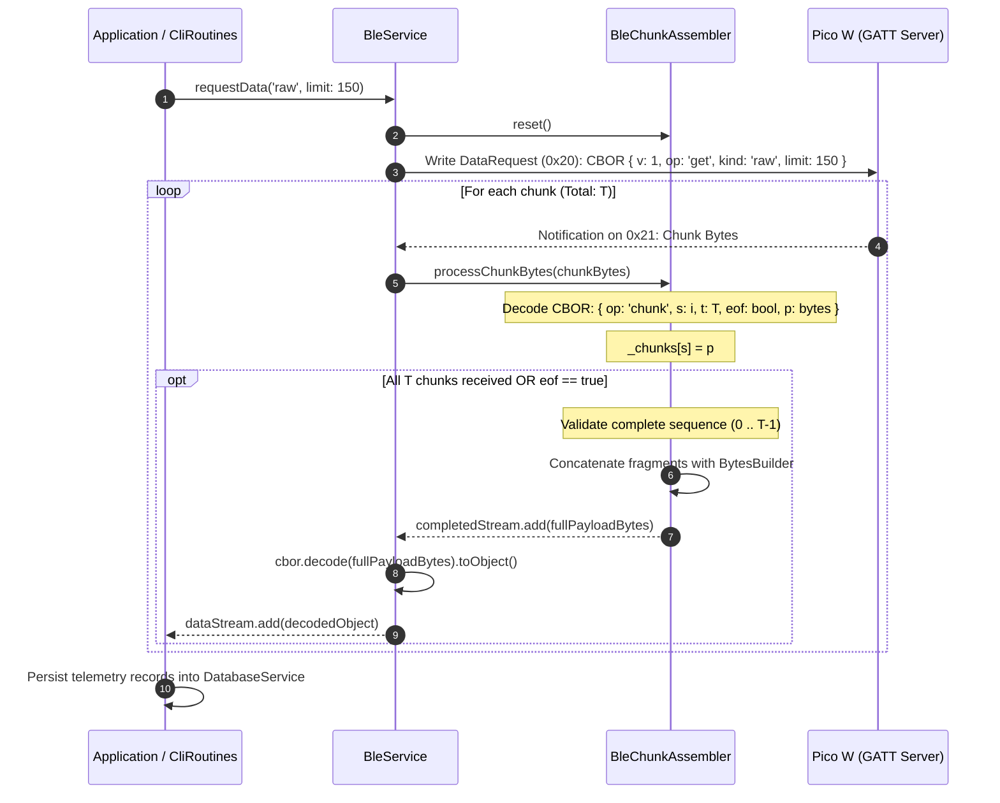
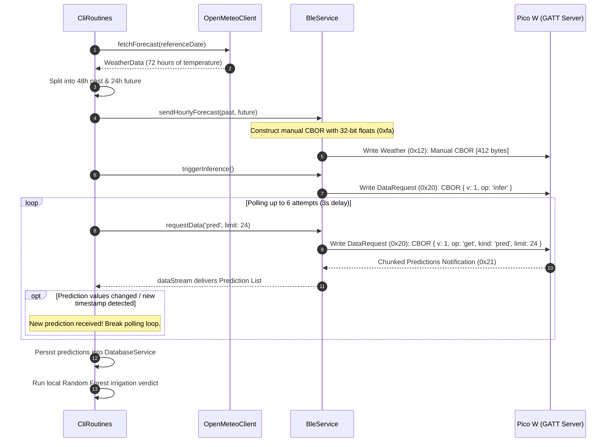

# C4 Code-Level Documentation: BLE Feature (`lib/features/ble`)

This document provides comprehensive C4 Code-level architectural documentation for the **Bluetooth Low Energy (BLE)** subsystem located in [`lib/features/ble`](file:///C:/Users/CrackoPattt88/Proyectos/tfm_app/lib/features/ble). It details the classes, methods, cryptographic protocols, packet serialization schemas, dependencies, and inter-component workflows used to communicate with the Raspberry Pi Pico W agro-climatic telemetry station.

---

## 1. Overview Section

### 1.1 Purpose & Domain Scope
The [`lib/features/ble`](file:///C:/Users/CrackoPattt88/Proyectos/tfm_app/lib/features/ble) module serves as the **hardware abstraction and communication gateway** of the application. It manages point-to-point wireless communication between the client device (smartphone/desktop running Flutter) and the agronomical field station powered by a Raspberry Pi Pico W microcontroller.

Its primary responsibilities encompass:
1. **Device Discovery & Lifecycle Management**: Scanning for Savia BLE peripherals advertising the custom 128-bit service UUID, establishing robust GATT connections with reconnection fallbacks, and monitoring link stability.
2. **Cryptographic Authentication**: Executing a challenge-response handshake utilizing SHA-256 HMAC-like proofs to unlock protected hardware registers and prevent unauthorized station configuration.
3. **High-Efficiency CBOR Serialization**: Serializing and deserializing Concise Binary Object Representation ([RFC 8949](https://datatracker.ietf.org/doc/html/rfc8949)) payloads, including manual binary packaging of IEEE 754 32-bit floating point arrays for weather forecasts to comply with the station's 512-byte MTU ceiling.
4. **Packet Chunk Reassembly**: Reconstituting multi-part telemetry responses transmitted over GATT notifications through a sequence-indexed chunking protocol.
5. **Station State & Command Execution**: Controlling RTC time synchronization, reading pin configurations and system statuses, dispatching historical data requests (`raw`, `agg`, `pred`), triggering on-device LSTM machine learning inferences, and orchestrating station resets/storage flushes.

### 1.2 Architectural Position (C4 Level 4 - Code Diagram)

The following Mermaid diagram illustrates the classes within `lib/features/ble`, their structural relationships, and how external application facades interact with them:



---

## 2. Code Elements Section

The [`lib/features/ble`](file:///C:/Users/CrackoPattt88/Proyectos/tfm_app/lib/features/ble) directory consists of four production Dart files and one Python golden reference test script:

| File | Purpose | Key Symbols |
| :--- | :--- | :--- |
| [`ble_constants.dart`](file:///C:/Users/CrackoPattt88/Proyectos/tfm_app/lib/features/ble/ble_constants.dart) | Standard 128-bit UUID definitions for GATT services & characteristics. | [`BleConstants`](file:///C:/Users/CrackoPattt88/Proyectos/tfm_app/lib/features/ble/ble_constants.dart#L1-L8) |
| [`chunk_assembler.dart`](file:///C:/Users/CrackoPattt88/Proyectos/tfm_app/lib/features/ble/chunk_assembler.dart) | Reassembles multi-packet CBOR data chunks received over GATT notifications. | [`BleChunkAssembler`](file:///C:/Users/CrackoPattt88/Proyectos/tfm_app/lib/features/ble/chunk_assembler.dart#L5-L94) |
| [`ble_service.dart`](file:///C:/Users/CrackoPattt88/Proyectos/tfm_app/lib/features/ble/ble_service.dart) | Authentication module and central BLE connectivity/command facade. | [`PicoHandshakeModule`](file:///C:/Users/CrackoPattt88/Proyectos/tfm_app/lib/features/ble/ble_service.dart#L14-L123), [`BleService`](file:///C:/Users/CrackoPattt88/Proyectos/tfm_app/lib/features/ble/ble_service.dart#L125-L589) |
| [`ble_controller.dart`](file:///C:/Users/CrackoPattt88/Proyectos/tfm_app/lib/features/ble/ble_controller.dart) | Background listener bridging incoming BLE stream events with the local SQLite database. | [`BleDataProcessor`](file:///C:/Users/CrackoPattt88/Proyectos/tfm_app/lib/features/ble/ble_controller.dart#L6-L19) |
| [`ble_example.py`](file:///C:/Users/CrackoPattt88/Proyectos/tfm_app/lib/features/ble/ble_example.py) | Standalone Python testing suite & protocol benchmark using Bleak & CBOR2. | [`notification_handler`](file:///C:/Users/CrackoPattt88/Proyectos/tfm_app/lib/features/ble/ble_example.py#L31-L67), [`make_weather_cbor`](file:///C:/Users/CrackoPattt88/Proyectos/tfm_app/lib/features/ble/ble_example.py#L68-L91), [`wait_for_data`](file:///C:/Users/CrackoPattt88/Proyectos/tfm_app/lib/features/ble/ble_example.py#L93-L104), [`main`](file:///C:/Users/CrackoPattt88/Proyectos/tfm_app/lib/features/ble/ble_example.py#L105-L354) |

---

### 2.1 `ble_constants.dart`
Located at [`lib/features/ble/ble_constants.dart`](file:///C:/Users/CrackoPattt88/Proyectos/tfm_app/lib/features/ble/ble_constants.dart).

#### [`BleConstants`](file:///C:/Users/CrackoPattt88/Proyectos/tfm_app/lib/features/ble/ble_constants.dart#L1-L8)
Defines the standard GATT UUIDs established by the Savia station firmware specification (`protocol.h`).

- [`BleConstants.serviceUuid`](file:///C:/Users/CrackoPattt88/Proyectos/tfm_app/lib/features/ble/ble_constants.dart#L2): `"5a71a000-0000-0000-0000-000000000001"` — Primary Savia telemetry service. Advertised in BLE beacons.
- [`BleConstants.statusUuid`](file:///C:/Users/CrackoPattt88/Proyectos/tfm_app/lib/features/ble/ble_constants.dart#L3): `"5a71a000-0000-0000-0000-000000000010"` (Handle `0x10`) — Exposes station health metrics (battery, memory, RTC synchronization, current operating mode).
- [`BleConstants.timeSyncUuid`](file:///C:/Users/CrackoPattt88/Proyectos/tfm_app/lib/features/ble/ble_constants.dart#L4): `"5a71a000-0000-0000-0000-000000000011"` (Handle `0x11`) — Synchronizes the microcontroller's hardware RTC with epoch milliseconds.
- [`BleConstants.weatherUuid`](file:///C:/Users/CrackoPattt88/Proyectos/tfm_app/lib/features/ble/ble_constants.dart#L5): `"5a71a000-0000-0000-0000-000000000012"` (Handle `0x12`) — Ingests 48 hours of past hourly temperatures and 24 hours of forecast temperatures.
- [`BleConstants.dataRequestUuid`](file:///C:/Users/CrackoPattt88/Proyectos/tfm_app/lib/features/ble/ble_constants.dart#L6): `"5a71a000-0000-0000-0000-000000000020"` (Handle `0x20`) — Accepts CBOR commands (`get`, `infer`, `mock`, `clear`, `debug_toggle`, `fill_avg`).
- [`BleConstants.dataResponseUuid`](file:///C:/Users/CrackoPattt88/Proyectos/tfm_app/lib/features/ble/ble_constants.dart#L7): `"5a71a000-0000-0000-0000-000000000021"` (Handle `0x21`) — Streams chunked CBOR responses via BLE GATT Notifications.

> [!NOTE]
> Additional characteristic UUIDs handled in [`BleService._cacheCharacteristics()`](file:///C:/Users/CrackoPattt88/Proyectos/tfm_app/lib/features/ble/ble_service.dart#L359-L388):
> - **Configuration Characteristic** (`0x13`): `"5a71a000-0000-0000-0000-000000000013"` — Station configuration (inference mode: `local` vs `forward`).
> - **Authentication Characteristic** (`0x14`): `"5a71a000-0000-0000-0000-000000000014"` — Challenge nonce, provisioning state, credential setup (`setpw`, `auth`, `chgpw`).
> - **Pinmap Characteristic** (`0x15`): `"5a71a000-0000-0000-0000-000000000015"` — Hardware sensor pinout configuration.

---

### 2.2 `chunk_assembler.dart`
Located at [`lib/features/ble/chunk_assembler.dart`](file:///C:/Users/CrackoPattt88/Proyectos/tfm_app/lib/features/ble/chunk_assembler.dart).

#### [`BleChunkAssembler`](file:///C:/Users/CrackoPattt88/Proyectos/tfm_app/lib/features/ble/chunk_assembler.dart#L5-L94)
Stateful packet assembly engine responsible for reconstructing arbitrary-length CBOR documents transmitted over GATT notification limits.

##### Internal State & Properties:
- [`_chunks`](file:///C:/Users/CrackoPattt88/Proyectos/tfm_app/lib/features/ble/chunk_assembler.dart#L6): `Map<int, List<int>>` — Sparse lookup table mapping zero-based sequence index `s` to raw payload segment `p`.
- [`_totalChunks`](file:///C:/Users/CrackoPattt88/Proyectos/tfm_app/lib/features/ble/chunk_assembler.dart#L7): `int` — Total chunk count `t` indicated by the chunk header.
- [`_isAssembled`](file:///C:/Users/CrackoPattt88/Proyectos/tfm_app/lib/features/ble/chunk_assembler.dart#L8): `bool` — Guard flag preventing redundant completions once assembly has finalized.
- [`_completedController`](file:///C:/Users/CrackoPattt88/Proyectos/tfm_app/lib/features/ble/chunk_assembler.dart#L10): `StreamController<List<int>>.broadcast()` — Broadcast stream controller delivering reassembled byte buffers.
- [`completedStream`](file:///C:/Users/CrackoPattt88/Proyectos/tfm_app/lib/features/ble/chunk_assembler.dart#L11): `Stream<List<int>>` — Public read-only stream of completed byte buffers.

##### Methods:
- [`reset()`](file:///C:/Users/CrackoPattt88/Proyectos/tfm_app/lib/features/ble/chunk_assembler.dart#L13-L17): Clears buffered segments, resets chunk counters, and unsets assembly completion flags in preparation for a new request.
- [`processChunkBytes(List<int> bytes)`](file:///C:/Users/CrackoPattt88/Proyectos/tfm_app/lib/features/ble/chunk_assembler.dart#L20-L89):
  1. Decodes incoming bytes via `cbor.decode(bytes).toObject()`.
  2. Validates envelope schema: expects map with `'op' == 'chunk'`, sequence `'s'` (`int`), total `'t'` (`int`), EOF flag `'eof'` (`bool`), and payload `'p'` (`List<int>`).
  3. Inserts packet bytes `p` into `_chunks[s]`.
  4. Evaluates termination condition: if `_chunks.length == _totalChunks || eof`, iterates sequence indexes `0` through `_totalChunks - 1` to guarantee packet integrity without sequence drops.
  5. Concatenates all ordered fragments using `BytesBuilder(copy: false)` and dispatches the reconstructed binary payload through [`completedStream`](file:///C:/Users/CrackoPattt88/Proyectos/tfm_app/lib/features/ble/chunk_assembler.dart#L11).
- [`dispose()`](file:///C:/Users/CrackoPattt88/Proyectos/tfm_app/lib/features/ble/chunk_assembler.dart#L91-L93): Closes [`_completedController`](file:///C:/Users/CrackoPattt88/Proyectos/tfm_app/lib/features/ble/chunk_assembler.dart#L10).

##### Chunk Packet Wire Format (CBOR Map):
```json
{
  "op": "chunk",
  "s": 0,
  "t": 4,
  "eof": false,
  "p": [/* binary chunk bytes */]
}
```

---

### 2.3 `ble_service.dart`
Located at [`lib/features/ble/ble_service.dart`](file:///C:/Users/CrackoPattt88/Proyectos/tfm_app/lib/features/ble/ble_service.dart).

#### [`PicoHandshakeModule`](file:///C:/Users/CrackoPattt88/Proyectos/tfm_app/lib/features/ble/ble_service.dart#L14-L123)
Dedicated security sub-module implementing the station's challenge-response cryptographic handshake.

##### Properties:
- [`sharedSecret`](file:///C:/Users/CrackoPattt88/Proyectos/tfm_app/lib/features/ble/ble_service.dart#L15): `final String` — Plaintext passphrase configured for the station. Defaults to empty string `""` for unprovisioned devices.

##### Key Methods:
- [`performHandshake()`](file:///C:/Users/CrackoPattt88/Proyectos/tfm_app/lib/features/ble/ble_service.dart#L18-L122):
  - **Inputs**: `BluetoothDevice device`, `BluetoothCharacteristic? statusChar`, `BluetoothCharacteristic? authChar`, optional progress callback `onProgress`.
  - **Returns**: `Future<bool>` indicating authentication success or failure.
  - **Workflow**:
    1. Reads characteristic `0x14` (`SAVIA_CHR_AUTH_UUID`) within a 3-second timeout window.
    2. Parses CBOR payload extracting the challenge `nonce` (`List<int>`) and `prov` (`bool`).
    3. Derives `authKey = sha256.convert(utf8.encode(sharedSecret)).bytes` (32 bytes).
    4. **Unprovisioned Device (`prov == false`)**:
       - If `sharedSecret.isEmpty`, immediately permits free access (`return true`).
       - If a secret is provided, sends setup payload:
         ```json
         { "v": 1, "op": "setpw", "key": <32-byte authKey> }
         ```
    5. **Provisioned Device (`prov == true`)**:
       - Computes cryptographic proof: $\text{MAC} = \text{SHA-256}(\text{authKey} \parallel \text{nonce})$.
       - Writes authentication verification payload to `0x14`:
         ```json
         { "v": 1, "op": "auth", "mac": <32-byte proof> }
         ```
    6. Re-reads `0x14` to evaluate response map. Returns `true` if `confirmMap['authed'] == true`, otherwise logs error and returns `false`.

---

#### [`BleService`](file:///C:/Users/CrackoPattt88/Proyectos/tfm_app/lib/features/ble/ble_service.dart#L125-L589)
Core facade orchestrating BLE lifecycle, peripheral communication, telemetry streams, and hardware commands.

##### Singleton & Dependency Injection:
- [`BleService.instance`](file:///C:/Users/CrackoPattt88/Proyectos/tfm_app/lib/features/ble/ble_service.dart#L126): Global static reference for convenient cross-layer access (e.g., from [`InferenceEngine`](file:///C:/Users/CrackoPattt88/Proyectos/tfm_app/lib/features/ml_inference/inference_engine.dart#L105)).
- [`handshakeModule`](file:///C:/Users/CrackoPattt88/Proyectos/tfm_app/lib/features/ble/ble_service.dart#L127): Injected [`PicoHandshakeModule`](file:///C:/Users/CrackoPattt88/Proyectos/tfm_app/lib/features/ble/ble_service.dart#L14-L123) instance, dynamically re-configurable with new credentials.

##### GATT Characteristics Caches:
- [`_statusChar`](file:///C:/Users/CrackoPattt88/Proyectos/tfm_app/lib/features/ble/ble_service.dart#L132) (`0x10`): Device status.
- [`_timeSyncChar`](file:///C:/Users/CrackoPattt88/Proyectos/tfm_app/lib/features/ble/ble_service.dart#L133) (`0x11`): Hardware RTC time sync.
- [`_weatherChar`](file:///C:/Users/CrackoPattt88/Proyectos/tfm_app/lib/features/ble/ble_service.dart#L134) (`0x12`): Weather forecast ingress.
- [`_configChar`](file:///C:/Users/CrackoPattt88/Proyectos/tfm_app/lib/features/ble/ble_service.dart#L137) (`0x13`): Station operational configuration.
- [`_authChar`](file:///C:/Users/CrackoPattt88/Proyectos/tfm_app/lib/features/ble/ble_service.dart#L138) (`0x14`): Security and credentials.
- [`_pinmapChar`](file:///C:/Users/CrackoPattt88/Proyectos/tfm_app/lib/features/ble/ble_service.dart#L139) (`0x15`): Hardware pin mappings.
- [`_dataRequestChar`](file:///C:/Users/CrackoPattt88/Proyectos/tfm_app/lib/features/ble/ble_service.dart#L135) (`0x20`): Command submission.
- [`_dataResponseChar`](file:///C:/Users/CrackoPattt88/Proyectos/tfm_app/lib/features/ble/ble_service.dart#L136) (`0x21`): Notifying response channel.

##### Reactive Streams:
- [`dataStream`](file:///C:/Users/CrackoPattt88/Proyectos/tfm_app/lib/features/ble/ble_service.dart#L144): `Stream<Object>` — Broadcast stream delivering fully assembled and CBOR-decoded objects.
- [`connectionStateStream`](file:///C:/Users/CrackoPattt88/Proyectos/tfm_app/lib/features/ble/ble_service.dart#L147): `Stream<bool>` — Broadcast stream signaling connection state transitions (`true` = connected, `false` = disconnected).
- [`scanResults`](file:///C:/Users/CrackoPattt88/Proyectos/tfm_app/lib/features/ble/ble_service.dart#L188): Direct proxy to `FlutterBluePlus.scanResults`.
- [`cachedDevices`](file:///C:/Users/CrackoPattt88/Proyectos/tfm_app/lib/features/ble/ble_service.dart#L150): Synchronous cached list of discovered `ScanResult` instances updated by [`_bgScanResultsSubscription`](file:///C:/Users/CrackoPattt88/Proyectos/tfm_app/lib/features/ble/ble_service.dart#L151).

##### Scanning & Connection Lifecycle:
- [`startScan()`](file:///C:/Users/CrackoPattt88/Proyectos/tfm_app/lib/features/ble/ble_service.dart#L192-L230): Verifies BLE adapter availability and state (`BluetoothAdapterState.on`). Starts scan filtered by [`BleConstants.serviceUuid`](file:///C:/Users/CrackoPattt88/Proyectos/tfm_app/lib/features/ble/ble_constants.dart#L2) with a 15-second timeout.
- [`stopScan()`](file:///C:/Users/CrackoPattt88/Proyectos/tfm_app/lib/features/ble/ble_service.dart#L232-L237): Stops active scan and cancels subscription.
- [`connect()`](file:///C:/Users/CrackoPattt88/Proyectos/tfm_app/lib/features/ble/ble_service.dart#L239-L347):
  1. Handles idempotency: if already connected to target device, returns `true`. If connected to another, invokes [`disconnect()`](file:///C:/Users/CrackoPattt88/Proyectos/tfm_app/lib/features/ble/ble_service.dart#L405-L409).
  2. Connects with `autoConnect: false` and `License.nonprofit`.
  3. Awaits `device.connectionState` stabilization (`connected`) with a 5-second timeout, followed by a 600ms settling delay.
  4. Negotiates 512-byte MTU (`device.requestMtu(512)`) on Android platforms.
  5. Discovers services with up to 3 retry attempts and connection healing if the link drops.
  6. Discovers and caches characteristics via [`_cacheCharacteristics()`](file:///C:/Users/CrackoPattt88/Proyectos/tfm_app/lib/features/ble/ble_service.dart#L359-L388).
  7. Invokes [`handshakeModule.performHandshake()`](file:///C:/Users/CrackoPattt88/Proyectos/tfm_app/lib/features/ble/ble_service.dart#L18-L122).
  8. If authenticated: caches `_connectedDevice`, registers disconnection listener ([`_setupStateListener()`](file:///C:/Users/CrackoPattt88/Proyectos/tfm_app/lib/features/ble/ble_service.dart#L390-L403)), enables notifications on `_dataResponseChar` ([`_setupDataNotifications()`](file:///C:/Users/CrackoPattt88/Proyectos/tfm_app/lib/features/ble/ble_service.dart#L349-L357)), broadcasts `true` on [`connectionStateStream`](file:///C:/Users/CrackoPattt88/Proyectos/tfm_app/lib/features/ble/ble_service.dart#L147), and automatically performs RTC clock synchronization ([`syncTime(0)`](file:///C:/Users/CrackoPattt88/Proyectos/tfm_app/lib/features/ble/ble_service.dart#L417-L428)).
- [`disconnect()`](file:///C:/Users/CrackoPattt88/Proyectos/tfm_app/lib/features/ble/ble_service.dart#L405-L409): Disconnects `_connectedDevice`, sets it to `null`, and broadcasts `false`.
- [`dispose()`](file:///C:/Users/CrackoPattt88/Proyectos/tfm_app/lib/features/ble/ble_service.dart#L411-L414): Cancels scan subscriptions and tears down active connection.

##### Station Commands & Telemetry Operations:
- [`syncTime(int timeOffsetHours)`](file:///C:/Users/CrackoPattt88/Proyectos/tfm_app/lib/features/ble/ble_service.dart#L417-L428):
  - Builds CBOR map: `{ 'v': 1, 'op': 'set', 'ms': epochMs }`.
  - Writes payload to `_timeSyncChar` (`0x11`).
- [`sendHourlyForecast(List<double> pastTemperatures, List<double> futureTemperatures)`](file:///C:/Users/CrackoPattt88/Proyectos/tfm_app/lib/features/ble/ble_service.dart#L431-L471):
  > [!IMPORTANT]
  > **Manual CBOR IEEE 754 32-bit Serialization**: Standard Dart `cbor` libraries serialize floating-point values as 64-bit doubles (`0xfb`), which balloons a 72-item temperature array beyond 600 bytes, exceeding the microcontroller's 512-byte buffer. This method manually constructs the binary CBOR map using `BytesBuilder` and `ByteData.setFloat32(0, f)` with marker `0xfa` (32-bit float), constraining total packet size to approximately 412 bytes.
- [`requestData(String kind, {int? from, int? to, int? limit})`](file:///C:/Users/CrackoPattt88/Proyectos/tfm_app/lib/features/ble/ble_service.dart#L474-L485):
  - Resets [`_chunkAssembler`](file:///C:/Users/CrackoPattt88/Proyectos/tfm_app/lib/features/ble/chunk_assembler.dart#L5-L94).
  - Sends query map: `{ 'v': 1, 'op': 'get', 'kind': kind, ... }` to `_dataRequestChar` (`0x20`). Target kinds include `'raw'`, `'agg'`, and `'pred'`.
- [`triggerInference()`](file:///C:/Users/CrackoPattt88/Proyectos/tfm_app/lib/features/ble/ble_service.dart#L488-L494):
  - Sends `{ 'v': 1, 'op': 'infer' }` to trigger on-device LSTM model execution.
- [`toggleDebugMode()`](file:///C:/Users/CrackoPattt88/Proyectos/tfm_app/lib/features/ble/ble_service.dart#L497-L502): Dispatches `{ 'v': 1, 'op': 'debug_toggle' }`.
- [`sendFillAverageInstruction()`](file:///C:/Users/CrackoPattt88/Proyectos/tfm_app/lib/features/ble/ble_service.dart#L505-L510): Dispatches `{ 'v': 1, 'op': 'fill_avg' }`.
- [`clearStorage()`](file:///C:/Users/CrackoPattt88/Proyectos/tfm_app/lib/features/ble/ble_service.dart#L512-L517): Dispatches `{ 'v': 1, 'op': 'clear' }` to purge station EEPROM/Flash storage.
- [`forceMock()`](file:///C:/Users/CrackoPattt88/Proyectos/tfm_app/lib/features/ble/ble_service.dart#L519-L521): Dispatches `{ 'v': 1, 'op': 'mock', 'kind': '48h' }` to populate synthetic sensor readings.
- [`readConfig()`](file:///C:/Users/CrackoPattt88/Proyectos/tfm_app/lib/features/ble/ble_service.dart#L537), [`readStatus()`](file:///C:/Users/CrackoPattt88/Proyectos/tfm_app/lib/features/ble/ble_service.dart#L539), [`readPinmap()`](file:///C:/Users/CrackoPattt88/Proyectos/tfm_app/lib/features/ble/ble_service.dart#L541): Reads and decodes CBOR maps from characteristics `0x13`, `0x10`, and `0x15`.
- [`changePassword(String currentPassword, String newPassword)`](file:///C:/Users/CrackoPattt88/Proyectos/tfm_app/lib/features/ble/ble_service.dart#L544-L577):
  - Reads active nonce from `0x14`.
  - Computes $\text{old\_mac} = \text{SHA-256}(\text{SHA-256}(\text{current}) \parallel \text{nonce})$.
  - Computes $\text{new\_key} = \text{SHA-256}(\text{new})$.
  - Submits `{ 'v': 1, 'op': 'chgpw', 'old_mac': old_mac, 'key': new_key }` to update station credentials.
- [`setInferenceMode(String mode)`](file:///C:/Users/CrackoPattt88/Proyectos/tfm_app/lib/features/ble/ble_service.dart#L579-L588): Writes `{ 'v': 1, 'op': 'set', 'inference_mode': mode }` (`local` or `forward`) to `_configChar` (`0x13`).

---

### 2.4 `ble_controller.dart`
Located at [`lib/features/ble/ble_controller.dart`](file:///C:/Users/CrackoPattt88/Proyectos/tfm_app/lib/features/ble/ble_controller.dart).

#### [`BleDataProcessor`](file:///C:/Users/CrackoPattt88/Proyectos/tfm_app/lib/features/ble/ble_controller.dart#L6-L19)
A higher-level service adapter connecting [`BleService`](file:///C:/Users/CrackoPattt88/Proyectos/tfm_app/lib/features/ble/ble_service.dart#L125-L589) with the persistence layer [`DatabaseService`](file:///C:/Users/CrackoPattt88/Proyectos/tfm_app/lib/core/database/app_database.dart).

##### Fields & Properties:
- [`bleService`](file:///C:/Users/CrackoPattt88/Proyectos/tfm_app/lib/features/ble/ble_controller.dart#L7): `final BleService` — BLE communication gateway.
- [`db`](file:///C:/Users/CrackoPattt88/Proyectos/tfm_app/lib/features/ble/ble_controller.dart#L8): `final DatabaseService` — Application local database.
- [`onDbUpdated`](file:///C:/Users/CrackoPattt88/Proyectos/tfm_app/lib/features/ble/ble_controller.dart#L9): `final VoidCallback?` — Optional UI notification callback fired upon persistence.
- [`onPredictedHumidityProcessed`](file:///C:/Users/CrackoPattt88/Proyectos/tfm_app/lib/features/ble/ble_controller.dart#L12): `Stream<void>` — Broadcast stream indicating that newly parsed inference predictions have been stored in the database.

##### Methods:
- [`startListening()`](file:///C:/Users/CrackoPattt88/Proyectos/tfm_app/lib/features/ble/ble_controller.dart#L16-L18): Lifecycle hook intended for continuous reactive observation of [`bleService.dataStream`](file:///C:/Users/CrackoPattt88/Proyectos/tfm_app/lib/features/ble/ble_service.dart#L144).

---

### 2.5 `ble_example.py`
Located at [`lib/features/ble/ble_example.py`](file:///C:/Users/CrackoPattt88/Proyectos/tfm_app/lib/features/ble/ble_example.py).

An end-to-end Python script that serves as the **executable specification and validation harness** for the BLE communication protocol.
- [`notification_handler(sender, data)`](file:///C:/Users/CrackoPattt88/Proyectos/tfm_app/lib/features/ble/ble_example.py#L31-L67): Demonstrates Python-side chunk reassembly via an `asyncio.Queue` and CBOR dictionary unpacking.
- [`make_weather_cbor(past, future)`](file:///C:/Users/CrackoPattt88/Proyectos/tfm_app/lib/features/ble/ble_example.py#L68-L91): Uses Python's `struct.pack('>f', ...)` to construct 32-bit float CBOR maps under 512 bytes.
- [`wait_for_data(client, request_payload, description)`](file:///C:/Users/CrackoPattt88/Proyectos/tfm_app/lib/features/ble/ble_example.py#L93-L104): Awaits queued reassembled responses with a 10-second timeout.
- [`main()`](file:///C:/Users/CrackoPattt88/Proyectos/tfm_app/lib/features/ble/ble_example.py#L105-L354): Executes the complete hardware integration workflow:
  1. Scans for `SAVIA_SVC_UUID`.
  2. Connects via `BleakClient` (with Windows `use_cached_services=False`).
  3. Authenticates via challenge-response handshake (`SAVIA_CHR_AUTH_UUID`).
  4. Checks inference capability (`SAVIA_CHR_CONFIG_UUID`).
  5. Syncs RTC timestamp (`SAVIA_CHR_TIME_SYNC_UUID`).
  6. Generates 48-hour mock history (`SAVIA_CHR_DATA_REQ_UUID`).
  7. Retrieves historical soil moisture records (`kind: "raw"`).
  8. Transmits weather forecast (`SAVIA_CHR_WEATHER_UUID`).
  9. Triggers on-station LSTM inference and polls results (`kind: "pred"`).
  10. Renders telemetry and predictions using `matplotlib`.

---

## 3. Dependencies Section

### 3.1 External Dependencies (Pub Packages)

| Package | Version Range | Used By | Architectural Purpose |
| :--- | :--- | :--- | :--- |
| [`flutter_blue_plus`](https://pub.dev/packages/flutter_blue_plus) | `^1.34.0` | [`ble_service.dart`](file:///C:/Users/CrackoPattt88/Proyectos/tfm_app/lib/features/ble/ble_service.dart) | Core cross-platform BLE client driving adapter state, scanning, GATT discovery, MTU negotiation, characteristic read/write, and notifications. |
| [`cbor`](https://pub.dev/packages/cbor) | `^6.2.0` | [`chunk_assembler.dart`](file:///C:/Users/CrackoPattt88/Proyectos/tfm_app/lib/features/ble/chunk_assembler.dart), [`ble_service.dart`](file:///C:/Users/CrackoPattt88/Proyectos/tfm_app/lib/features/ble/ble_service.dart) | High-speed binary decoding and encoding of RFC 8949 CBOR objects exchanged over GATT characteristics. |
| [`crypto`](https://pub.dev/packages/crypto) | `^3.0.3` | [`ble_service.dart`](file:///C:/Users/CrackoPattt88/Proyectos/tfm_app/lib/features/ble/ble_service.dart) | SHA-256 hash calculation for challenge-response authentication proofs and credential key derivation. |
| `flutter/foundation.dart` | SDK | [`ble_service.dart`](file:///C:/Users/CrackoPattt88/Proyectos/tfm_app/lib/features/ble/ble_service.dart), [`ble_controller.dart`](file:///C:/Users/CrackoPattt88/Proyectos/tfm_app/lib/features/ble/ble_controller.dart) | Platform detection constants (`kIsWeb`, `defaultTargetPlatform`, `TargetPlatform.android`) and callbacks (`VoidCallback`). |

### 3.2 Internal Workspace Dependencies



- **Database Layer**: [`BleDataProcessor`](file:///C:/Users/CrackoPattt88/Proyectos/tfm_app/lib/features/ble/ble_controller.dart#L6-L19) depends directly on [`DatabaseService`](file:///C:/Users/CrackoPattt88/Proyectos/tfm_app/lib/core/database/app_database.dart) for persisting device records and telemetry.
- **Application Facade**: [`CliRoutines`](file:///C:/Users/CrackoPattt88/Proyectos/tfm_app/lib/cli_routines.dart#L22) instantiates and configures [`BleService`](file:///C:/Users/CrackoPattt88/Proyectos/tfm_app/lib/features/ble/ble_service.dart#L125-L589) and [`BleDataProcessor`](file:///C:/Users/CrackoPattt88/Proyectos/tfm_app/lib/features/ble/ble_controller.dart#L6-L19), encapsulating end-to-end routines (e.g. `connectToDevice`, `sendHourlyForecast`, `triggerStationInference`).
- **Inference Domain**: [`InferenceBridge`](file:///C:/Users/CrackoPattt88/Proyectos/tfm_app/lib/features/ml_inference/inference_engine.dart#L105) queries [`BleService.instance?.isConnected`](file:///C:/Users/CrackoPattt88/Proyectos/tfm_app/lib/features/ble/ble_service.dart#L189) to determine if live on-station inference can be triggered or if fallback simulation/historical evaluation should proceed.

### 3.3 Platform-Specific Considerations

> [!NOTE]
> - **Android**: Android requires an explicit MTU exchange request (`device.requestMtu(512)`). Without this, Android defaults to a 23-byte MTU, causing large CBOR writes to fail.
> - **iOS / macOS**: CoreBluetooth negotiates MTU automatically upon connection; calling `requestMtu` is unsupported and bypassed via `defaultTargetPlatform == TargetPlatform.android`.
> - **Windows**: Windows WinRT BLE cache can retain stale characteristic handles. As highlighted in [`ble_example.py`](file:///C:/Users/CrackoPattt88/Proyectos/tfm_app/lib/features/ble/ble_example.py#L118), service cache invalidation and retries are implemented during service discovery.
> - **Web**: Bluetooth Low Energy is unsupported in Flutter Web environments; connection attempts are guarded by platform flags.

---

## 4. Relationships Section

### 4.1 Connection & Cryptographic Handshake Workflow

This sequence diagram illustrates the connection lifecycle, MTU negotiation, characteristic caching, challenge-response authentication, and automatic RTC clock synchronization:



---

### 4.2 Data Request & Chunk Reassembly Workflow

When the client requests telemetry (`kind: 'raw'`, `'agg'`, or `'pred'`), the station splits large CBOR datasets across multiple GATT notification packets. [`BleChunkAssembler`](file:///C:/Users/CrackoPattt88/Proyectos/tfm_app/lib/features/ble/chunk_assembler.dart#L5-L94) reconstructs the payload:



---

### 4.3 Weather Forecast Ingestion & Station Inference Execution

The field station uses a hybrid architecture: in **local mode**, weather forecasts fetched by the Flutter app via Open-Meteo are transmitted to the station, which then runs its on-device TensorFlow Lite / micro LSTM neural network:



---

## 5. Security & Error Handling Summary

> [!CAUTION]
> - **GATT Characteristic Exposure**: If the microcontroller's challenge nonce is bypassed or unauthenticated requests are permitted, an attacker within BLE range could overwrite the RTC clock, clear telemetry storage, or alter GPIO pin mapping. The [`PicoHandshakeModule`](file:///C:/Users/CrackoPattt88/Proyectos/tfm_app/lib/features/ble/ble_service.dart#L14-L123) enforces that all write operations to configuration and request characteristics require an active session verified via characteristic `0x14`.
> - **Buffer Limit Exceeded**: Sending CBOR payloads serialized with default 64-bit doubles to `0x12` will cause station buffer overflow errors on the Pico W, which has a 512-byte buffer cap. Always utilize the manual 32-bit float serialization provided in [`BleService.sendHourlyForecast()`](file:///C:/Users/CrackoPattt88/Proyectos/tfm_app/lib/features/ble/ble_service.dart#L431-L471).
> - **Disconnection Recovery**: If connection drops during high-bandwidth data transfers, [`BleService._setupStateListener()`](file:///C:/Users/CrackoPattt88/Proyectos/tfm_app/lib/features/ble/ble_service.dart#L390-L403) automatically clears cached characteristic handles and resets connection state controllers to prevent corrupted pipeline states.
