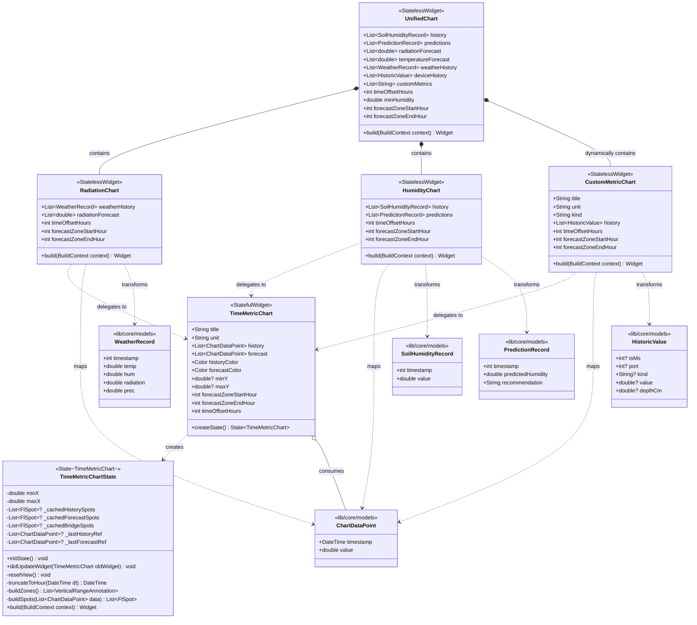
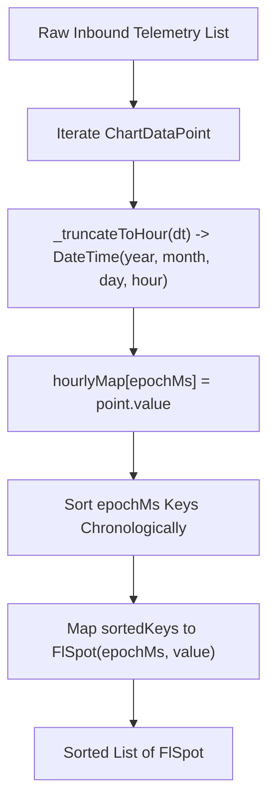
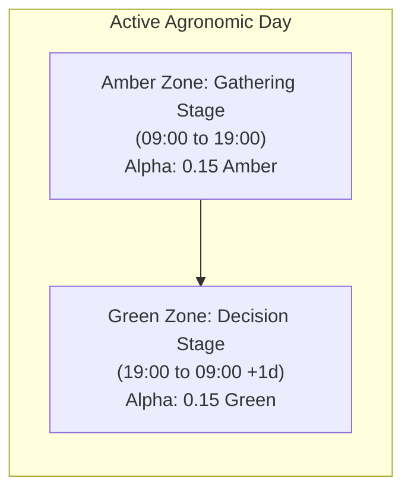
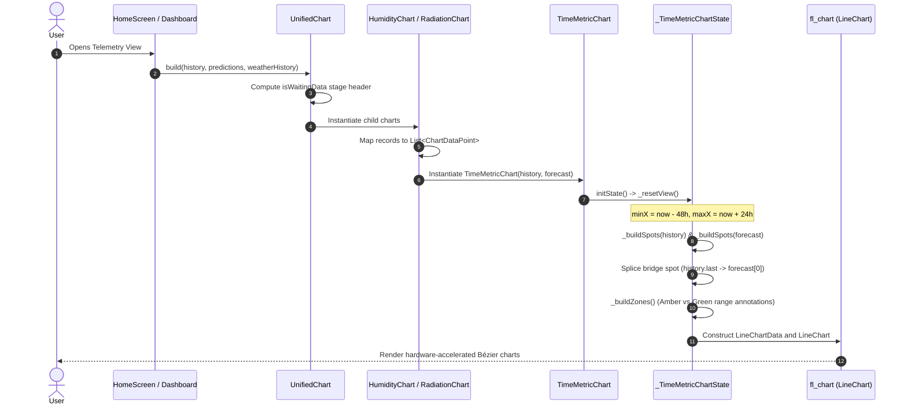
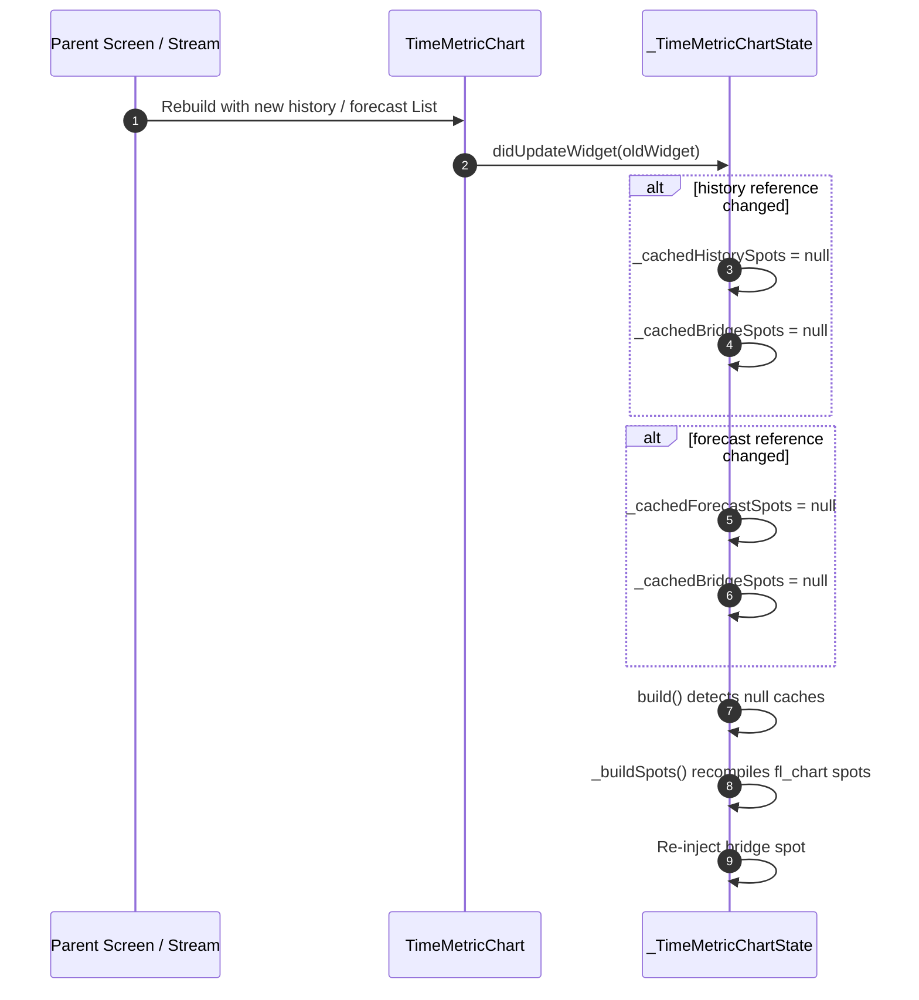

# C4 Code Architecture: `lib/features/charts`

This document provides code-level architecture documentation (Level 4 in the C4 model) for the data visualization and telemetry charting module located in [`lib/features/charts`](file:///C:/Users/CrackoPattt88/Proyectos/tfm_app/lib/features/charts). It details the component architecture, data transformations, algorithmic pipelines, interaction paradigms, and class relationships powering the temporal visualization of historical IoT telemetry and predictive machine learning models.

---

## 1. Overview Section

### 1.1 Purpose & Scope

The [`lib/features/charts`](file:///C:/Users/CrackoPattt88/Proyectos/tfm_app/lib/features/charts) module is the core graphical telemetry engine for the application. Its mission is to transform disparate time-series data streams—originating from physical IoT sensor probes (soil humidity), remote meteorological forecasting APIs (solar radiation, temperature), and on-device machine learning inference engines (LSTM humidity forecasts)—into intuitive, responsive, and synchronized interactive visual representations.

The charting system is purpose-built to support the agronomic decision-making cycle:
1. **Historical Telemetry (48h Observation Window)**: Plots real sensor readings collected via Bluetooth Low Energy (BLE) or database synchronization.
2. **Predictive Horizon (24h Forecast Window)**: Seamlessly projects LSTM-derived soil moisture trajectories and Open-Meteo solar radiation forecasts into future hours.
3. **Agronomic Cycle Synchronization**: Visually delineates agricultural operative stages ("ETAPA ESPERAR DATOS" vs. "ETAPA DATOS LISTOS") using dynamic background range annotations and synchronization headers.
4. **Adaptive Gesture Control**: Supports direct horizontal panning via low-latency pointer tracking and dynamic axis-interval decimation to avoid visual clutter across diverse mobile and desktop screen sizes.

### 1.2 Architectural Role & Boundaries

In accordance with Clean Architecture principles:
- **Layer Placement**: Presentation Layer (Feature-level visual component library).
- **Design Pattern**: Composite Hierarchical Adapter Pattern. Specialized widget adapters wrap a common, high-performance canvas engine ([`TimeMetricChart`](file:///C:/Users/CrackoPattt88/Proyectos/tfm_app/lib/features/charts/time_metric_chart.dart#L14-L45)), translating domain entities into normalized intermediate data structures ([`ChartDataPoint`](file:///C:/Users/CrackoPattt88/Proyectos/tfm_app/lib/core/models/chart_data_point.dart#L1-L6)), which are then compiled into hardware-accelerated graphic primitives ([`FlSpot`](https://pub.dev/documentation/fl_chart/latest/fl_chart/FlSpot-class.html)).
- **State Management**: Stateless adapters ([`UnifiedChart`](file:///C:/Users/CrackoPattt88/Proyectos/tfm_app/lib/features/charts/unified_chart.dart#L12-L112), [`HumidityChart`](file:///C:/Users/CrackoPattt88/Proyectos/tfm_app/lib/features/charts/humidity_chart.dart#L11-L60), [`RadiationChart`](file:///C:/Users/CrackoPattt88/Proyectos/tfm_app/lib/features/charts/radiation_chart.dart#L11-L62), [`CustomMetricChart`](file:///C:/Users/CrackoPattt88/Proyectos/tfm_app/lib/features/charts/custom_metric_chart.dart#L8-L55)) delegate interactive viewport transformation to the stateful engine ([`_TimeMetricChartState`](file:///C:/Users/CrackoPattt88/Proyectos/tfm_app/lib/features/charts/time_metric_chart.dart#L47-L355)).
- **Hardware Acceleration**: Canvas rendering is offloaded to the Skia/Impeller graphics backend via the [`fl_chart`](https://pub.dev/packages/fl_chart) vector engine.

```
┌─────────────────────────────────────────────────────────────────────────────┐
│                            Presentation / Screen Layer                      │
│                    (HomeScreen, TelemetryDashboard, DeviceView)             │
└──────────────────────────────────────┬──────────────────────────────────────┘
                                       │
                                       │ feeds domain entities
                                       ▼
┌─────────────────────────────────────────────────────────────────────────────┐
│                       lib/features/charts (Facade)                          │
│                                                                             │
│                            ┌──────────────┐                                 │
│                            │ UnifiedChart │                                 │
│                            └──────┬───────┘                                 │
│                                   │ orchestrates                            │
│         ┌─────────────────────────┼─────────────────────────┐               │
│         ▼                         ▼                         ▼               │
│  ┌──────────────┐          ┌──────────────┐          ┌───────────────────┐  │
│  │HumidityChart │          │RadiationChart│          │ CustomMetricChart │  │
│  └──────┬───────┘          └──────┬───────┘          └─────────┬─────────┘  │
│         │                         │                            │            │
│         └─────────────────────────┼────────────────────────────┘            │
│                                   │ maps to ChartDataPoint                  │
│                                   ▼                                         │
│                      ┌─────────────────────────┐                            │
│                      │     TimeMetricChart     │                            │
│                      │  (Stateful Canvas Core) │                            │
│                      └────────────┬────────────┘                            │
└───────────────────────────────────┼─────────────────────────────────────────┘
                                    │
                                    │ translates to FlSpot / LineChartData
                                    ▼
┌─────────────────────────────────────────────────────────────────────────────┐
│                       External Rendering Packages                           │
│              fl_chart (LineChart, RangeAnnotations, Tooltips)               │
│                       intl (Temporal Axis Formatting)                       │
└─────────────────────────────────────────────────────────────────────────────┘
```

### 1.3 C4 Code Diagram

The following Mermaid class diagram details the complete structural composition of all classes, contracts, states, and relationships within [`lib/features/charts`](file:///C:/Users/CrackoPattt88/Proyectos/tfm_app/lib/features/charts):



### 1.4 Key Architectural Principles

1. **Decoupled Data Translation**: Upstream screens and database repositories do not need knowledge of chart rendering internals or `FlSpot` mechanics. Widgets consume domain entities ([`SoilHumidityRecord`](file:///C:/Users/CrackoPattt88/Proyectos/tfm_app/lib/core/models/device.dart#L69-L73), [`PredictionRecord`](file:///C:/Users/CrackoPattt88/Proyectos/tfm_app/lib/core/models/device.dart#L75-L80), [`WeatherRecord`](file:///C:/Users/CrackoPattt88/Proyectos/tfm_app/lib/core/models/device.dart#L60-L67), [`HistoricValue`](file:///C:/Users/CrackoPattt88/Proyectos/tfm_app/lib/core/models/device.dart#L40-L47)) and normalize them into [`ChartDataPoint`](file:///C:/Users/CrackoPattt88/Proyectos/tfm_app/lib/core/models/chart_data_point.dart#L1-L6).
2. **Memoized Spot Compilation**: Point-to-spot transformations and hourly aggregations are computationally intensive over thousands of telemetry points. [`_TimeMetricChartState`](file:///C:/Users/CrackoPattt88/Proyectos/tfm_app/lib/features/charts/time_metric_chart.dart#L47-L355) implements strict reference comparison caching, avoiding redundant spot rebuilding during UI drag and pan interactions.
3. **Visual Continuity via Temporal Bridging**: Disjoint historical and forecast vectors are dynamically spliced via synthetic bridge spots, ensuring smooth Bézier curves across the "now" horizon without artificial gaps or discontinuities.
4. **Resilient Axis Dynamics**: The Y-axis automatically detects bounded physical units (such as `%` for humidity) while applying dynamic +20% statistical headroom for unbounded physical magnitudes (e.g., Solar Radiation in $W/m^2$).

---

## 2. Code Elements Section

The module comprises five distinct Dart source files:
1. [`time_metric_chart.dart`](file:///C:/Users/CrackoPattt88/Proyectos/tfm_app/lib/features/charts/time_metric_chart.dart): Foundational interactive canvas engine and state controller.
2. [`unified_chart.dart`](file:///C:/Users/CrackoPattt88/Proyectos/tfm_app/lib/features/charts/unified_chart.dart): Master dashboard facade and agronomic phase synchronization header.
3. [`humidity_chart.dart`](file:///C:/Users/CrackoPattt88/Proyectos/tfm_app/lib/features/charts/humidity_chart.dart): Specialized adapter for observed and predicted soil moisture.
4. [`radiation_chart.dart`](file:///C:/Users/CrackoPattt88/Proyectos/tfm_app/lib/features/charts/radiation_chart.dart): Specialized adapter for historical and forecasted solar radiation.
5. [`custom_metric_chart.dart`](file:///C:/Users/CrackoPattt88/Proyectos/tfm_app/lib/features/charts/custom_metric_chart.dart): Generalized telemetry adapter for arbitrary station sensor data.

---

### 2.1 Foundational Canvas Engine: `time_metric_chart.dart`

File: [`lib/features/charts/time_metric_chart.dart`](file:///C:/Users/CrackoPattt88/Proyectos/tfm_app/lib/features/charts/time_metric_chart.dart)

#### 2.1.1 `TimeMetricChart` (Widget Class)

Declared at [`TimeMetricChart`](file:///C:/Users/CrackoPattt88/Proyectos/tfm_app/lib/features/charts/time_metric_chart.dart#L14-L45), this is a `StatefulWidget` configuring the core visual parameters of the time-series chart:

```dart
class TimeMetricChart extends StatefulWidget {
  final String title;
  final String unit;
  final List<ChartDataPoint> history;
  final List<ChartDataPoint> forecast;
  final Color historyColor;
  final Color forecastColor;
  final double? minY;
  final double? maxY;
  final int forecastZoneStartHour; // e.g. 19
  final int forecastZoneEndHour;   // e.g. 9
  final int timeOffsetHours;
}
```

##### Field Properties
- `title`: Header label identifying the telemetry metric (e.g., `'Soil Humidity'`, `'Solar Radiation'`).
- `unit`: Physical engineering unit label (e.g., `'%'`, `'W/m²'`).
- `history`: Time-ordered collection of historical data points.
- `forecast`: Time-ordered collection of projected future data points.
- `historyColor`: Color applied to the solid historical trend line.
- `forecastColor`: Color applied to the dashed predictive trend line.
- `minY` / `maxY`: Optional manual overrides for vertical axis bounds.
- `forecastZoneStartHour`: Hour of the day (0–23) marking the onset of the predictive decision window (defaults to `19`, or 19:00 / 7:00 PM).
- `forecastZoneEndHour`: Hour of the day (0–23) marking the conclusion of the agronomic cycle (defaults to `9`, or 09:00 / 9:00 AM).
- `timeOffsetHours`: Integer hour offset applied to normalize device local time against UTC or station RTC drift.

#### 2.1.2 `_TimeMetricChartState` (State Controller Class)

Declared at [`_TimeMetricChartState`](file:///C:/Users/CrackoPattt88/Proyectos/tfm_app/lib/features/charts/time_metric_chart.dart#L47-L355), this class manages viewport coordinates, pointer gesture listeners, spot memoization, hourly bucketing, and canvas rendering.

##### Viewport & Cache Fields
- `minX`: Double precision epoch millisecond representing the left boundary of the visible X-axis.
- `maxX`: Double precision epoch millisecond representing the right boundary of the visible X-axis.
- `_cachedHistorySpots` / `_cachedForecastSpots`: Cached [`List<FlSpot>`](https://pub.dev/documentation/fl_chart/latest/fl_chart/FlSpot-class.html) instances compiled from historical and predictive datasets.
- `_cachedBridgeSpots`: Cached combined forecast spot list spliced with the trailing historical anchor.
- `_lastHistoryRef` / `_lastForecastRef`: Object identity references tracking dataset modifications to invalidate caches.

##### Lifecycle Methods
- [`initState()`](file:///C:/Users/CrackoPattt88/Proyectos/tfm_app/lib/features/charts/time_metric_chart.dart#L58-L61): Initializes state and invokes `_resetView()`.
- [`didUpdateWidget(TimeMetricChart oldWidget)`](file:///C:/Users/CrackoPattt88/Proyectos/tfm_app/lib/features/charts/time_metric_chart.dart#L64-L68): Detects dataset instance replacements and nullifies spot caches accordingly:
  ```dart
  if (oldWidget.history != widget.history) _cachedHistorySpots = null;
  if (oldWidget.forecast != widget.forecast) _cachedForecastSpots = null;
  ```

##### Viewport Centering: `_resetView()`
Declared at [`_resetView()`](file:///C:/Users/CrackoPattt88/Proyectos/tfm_app/lib/features/charts/time_metric_chart.dart#L70-L74):
Calculates a 72-hour sliding horizontal window anchored around the current normalized time (`nowMs`):
$$\text{minX} = \text{nowMs} - 48 \times 3,600,000 \text{ ms (48 hours in past)}$$
$$\text{maxX} = \text{nowMs} + 24 \times 3,600,000 \text{ ms (24 hours in future)}$$

##### Data Bucketing & Quantization: `_truncateToHour()` and `_buildSpots()`
Declared at [`_truncateToHour()`](file:///C:/Users/CrackoPattt88/Proyectos/tfm_app/lib/features/charts/time_metric_chart.dart#L76-L78) and [`_buildSpots()`](file:///C:/Users/CrackoPattt88/Proyectos/tfm_app/lib/features/charts/time_metric_chart.dart#L113-L121):
- **Problem**: Raw telemetry arriving over BLE or HTTP can exhibit temporal jitter (e.g., readings logged at `:04`, `:17`, `:48` minutes). Direct plotting leads to jagged, uneven X-axis distributions.
- **Algorithm**:
  1. Truncates each timestamp to the start of the hour: `DateTime(dt.year, dt.month, dt.day, dt.hour)`.
  2. Aggregates data into a `Map<int, double> hourlyMap`, effectively deduplicating multiple readings per hour bucket.
  3. Sorts keys chronologically: `final sortedKeys = hourlyMap.keys.toList()..sort();`.
  4. Maps sorted keys into [`FlSpot(ms.toDouble(), hourlyMap[ms]!)`](https://pub.dev/documentation/fl_chart/latest/fl_chart/FlSpot-class.html).



##### Agronomic Phase Calculation: `_buildZones()`
Declared at [`_buildZones()`](file:///C:/Users/CrackoPattt88/Proyectos/tfm_app/lib/features/charts/time_metric_chart.dart#L81-L111):
Configures background vertical tint overlays ([`VerticalRangeAnnotation`](https://pub.dev/documentation/fl_chart/latest/fl_chart/VerticalRangeAnnotation-class.html)) indicating the operational stage of the current active agronomic day:
- **Agronomic Day Anchor (`agroDayStart`)**:
  - If current hour $\ge \text{forecastZoneEndHour}$ (e.g., $\ge 9$ AM): active day began today at 09:00.
  - If current hour $< \text{forecastZoneEndHour}$ (e.g., $< 9$ AM): active day began yesterday at 09:00.
- **Gathering Stage (Amber Zone)**:
  - From `yellowStart` (`agroDayStart` at 09:00) to `yellowEnd` (19:00 today).
  - Background color: `Colors.amber.withValues(alpha: 0.15)`.
- **Forecasting / Decision Stage (Green Zone)**:
  - From `greenStart` (19:00 today) to `greenEnd` (`agroDayStart + 1 day` at 09:00 tomorrow).
  - Background color: `Colors.green.withValues(alpha: 0.15)`.



##### Seamless Trajectory Bridging
Implemented in [`build()`](file:///C:/Users/CrackoPattt88/Proyectos/tfm_app/lib/features/charts/time_metric_chart.dart#L140-L150):
When rendering independent line bars (`LineChartBarData`) for history (solid) and forecast (dashed), a physical visual gap would appear between the last historical data point ($t_0$) and the first predicted point ($t_{+1}$).
To prevent this, the engine constructs a synthetic bridge list (`_cachedBridgeSpots`):
```dart
if (_cachedBridgeSpots == null) {
  final List<FlSpot> forecastSpotsWithBridge = List.from(forecastFlSpots);
  if (historyFlSpots.isNotEmpty && forecastSpotsWithBridge.isNotEmpty) {
    if (forecastSpotsWithBridge.first.x > historyFlSpots.last.x) {
      forecastSpotsWithBridge.insert(0, historyFlSpots.last);
    }
  }
  _cachedBridgeSpots = forecastSpotsWithBridge;
}
```
This prepends the trailing historical spot to the forecast series, allowing the dashed Bézier curve to emerge continuously from the last observed measurement.

##### Dynamic Axis Scaling & Adaptive Decimation
Implemented in [`build()`](file:///C:/Users/CrackoPattt88/Proyectos/tfm_app/lib/features/charts/time_metric_chart.dart#L152-L185):
- **Y-Axis Dynamics**:
  - Minimum bound is anchored to `0.0` by default.
  - If unit contains `'%'` or title contains `'humidity'` / `'moisture'`, the upper bound is capped at `100.0`.
  - For unbounded metrics (e.g. solar irradiance), it scans both history and forecast spots for $\max(y)$ and applies a 20% statistical buffer:
    $$\text{calculatedMaxY} = \max(y) \times 1.20$$
- **Adaptive X-Axis Step Calculation**:
  - Measures total visible span in hours: $\text{visibleHours} = \frac{\text{maxX} - \text{minX}}{3,600,000}$.
  - Dynamically calculates tick interval step:
    $$\text{stepHours} = \begin{cases} 12 & \text{if } \text{visibleHours} > 60 \\ 6 & \text{if } \text{visibleHours} > 30 \\ 4 & \text{if } \text{visibleHours} > 12 \\ 3 & \text{otherwise} \end{cases}$$
  - Tick Renderer:
    - At `hour == 0` (midnight): renders month and day in bold indigo ([`DateFormat('MMM dd')`](https://pub.dev/documentation/intl/latest/intl/DateFormat-class.html)).
    - At `hour % stepHours == 0`: renders `${dt.hour}h` in black54.
    - All other hours return `SizedBox.shrink()` to prevent label collisions.

##### Interactive Panning via Raw Pointer Tracking
Implemented in [`build()`](file:///C:/Users/CrackoPattt88/Proyectos/tfm_app/lib/features/charts/time_metric_chart.dart#L208-L216):
Rather than using heavy, gesture-conflicting `GestureDetector` horizontal drag handlers, the widget wraps the chart canvas in a lightweight Flutter [`Listener`](https://api.flutter.dev/flutter/widgets/Listener-class.html):
```dart
Listener(
  onPointerMove: (event) {
    setState(() {
      final shift = -event.delta.dx * (240000.0); 
      minX += shift;
      maxX += shift;
    });
  },
  child: ...
)
```
- A horizontal drag delta of $1$ logical pixel shifts the temporal viewport by $240,000 \text{ ms}$ ($4\text{ minutes}$).
- Dragging left shifts the window forward into future time; dragging right shifts it back into historical time.
- A "Center to Now" [`IconButton`](https://api.flutter.dev/flutter/material/IconButton-class.html) with [`Icons.center_focus_strong`](https://api.flutter.dev/flutter/material/Icons/center_focus_strong-constant.html) provides instant re-centering to the default 72h window.

---

### 2.2 Master Dashboard Facade: `unified_chart.dart`

File: [`lib/features/charts/unified_chart.dart`](file:///C:/Users/CrackoPattt88/Proyectos/tfm_app/lib/features/charts/unified_chart.dart)

#### 2.2.1 `UnifiedChart` (Widget Class)

Declared at [`UnifiedChart`](file:///C:/Users/CrackoPattt88/Proyectos/tfm_app/lib/features/charts/unified_chart.dart#L12-L112), this `StatelessWidget` serves as the primary composite entry point for application screens, aggregating all telemetry metrics into a vertically unified view.

```dart
class UnifiedChart extends StatelessWidget {
  final List<SoilHumidityRecord> history;
  final List<PredictionRecord> predictions;
  final List<double> radiationForecast;
  final List<double> temperatureForecast;
  final List<WeatherRecord> weatherHistory;
  final List<HistoricValue> deviceHistory;
  final List<String> customMetrics;
  final int timeOffsetHours;
  final double minHumidity;
  final int forecastZoneStartHour;
  final int forecastZoneEndHour;
}
```

##### Field Properties
- `history`: Soil moisture sensor records from database or BLE cache.
- `predictions`: Predicted soil moisture records generated by ML inference models.
- `radiationForecast`: Hourly solar irradiance predictions ($W/m^2$) retrieved from Open-Meteo API.
- `temperatureForecast`: Hourly ambient temperature predictions (retained for future multi-metric plots).
- `weatherHistory`: Meteorological history records collected by weather stations or API backfills.
- `deviceHistory`: Generic historical telemetry entries ([`HistoricValue`](file:///C:/Users/CrackoPattt88/Proyectos/tfm_app/lib/core/models/device.dart#L40-L47)) from the station's Isar DB collection.
- `customMetrics`: List of telemetry identifier keys (`kind`, e.g. `['batt', 'temp']`) to dynamically instantiate child charts.
- `minHumidity`: Agronomic minimum humidity threshold.
- `timeOffsetHours`, `forecastZoneStartHour`, `forecastZoneEndHour`: Operational time-zone and agronomic configuration parameters.

#### 2.2.2 Agronomic State Detection Algorithm

Implemented at [`UnifiedChart.build()`](file:///C:/Users/CrackoPattt88/Proyectos/tfm_app/lib/features/charts/unified_chart.dart#L45-L59):
Determines whether the system is currently gathering telemetry or executing predictive inferences:

```dart
final int h = now.hour;
final int gatheringStartHour = (forecastZoneEndHour + 1) % 24; // e.g. (9 + 1) = 10
final int fStart = forecastZoneStartHour % 24;                 // e.g. 19

if (gatheringStartHour < fStart) {
  isWaitingData = (h >= gatheringStartHour && h < fStart);
} else {
  isWaitingData = (h >= gatheringStartHour || h < fStart);
}
```

- **Waiting Data State ("ETAPA ESPERAR DATOS")**:
  - Color: `Colors.amber.shade700`
  - Icon: [`Icons.hourglass_empty`](https://api.flutter.dev/flutter/material/Icons/hourglass_empty-constant.html)
  - Indicates that the daily observation window is actively collecting raw sensor samples before running the nightly ML forecast.
- **Data Ready State ("ETAPA DATOS LISTOS")**:
  - Color: `Colors.green.shade700`
  - Icon: [`Icons.check_circle_outline`](https://api.flutter.dev/flutter/material/Icons/check_circle_outline-constant.html)
  - Indicates that the gathering cycle has closed, predictions have materialized, and irrigation classification verdicts are valid.

#### 2.2.3 Child Chart Composition
Renders children sequentially within a single vertical [`Column`](https://api.flutter.dev/flutter/widgets/Column-class.html):
1. **Header Row**: Synchronized stage indicator icon and title.
2. [`RadiationChart`](file:///C:/Users/CrackoPattt88/Proyectos/tfm_app/lib/features/charts/radiation_chart.dart#L11-L62): Visualizes solar energy trends influencing evapotranspiration.
3. [`HumidityChart`](file:///C:/Users/CrackoPattt88/Proyectos/tfm_app/lib/features/charts/humidity_chart.dart#L11-L60): Visualizes critical soil moisture dynamics and future model forecasts.
4. **Custom Metric Chart Collection**: Dynamically expands any user-configured metrics via `...customMetrics.map(...)` into [`CustomMetricChart`](file:///C:/Users/CrackoPattt88/Proyectos/tfm_app/lib/features/charts/custom_metric_chart.dart#L8-L55) instances.

---

### 2.3 Specialized Domain Adapters

#### 2.3.1 `HumidityChart`

File: [`lib/features/charts/humidity_chart.dart`](file:///C:/Users/CrackoPattt88/Proyectos/tfm_app/lib/features/charts/humidity_chart.dart)

Declared at [`HumidityChart`](file:///C:/Users/CrackoPattt88/Proyectos/tfm_app/lib/features/charts/humidity_chart.dart#L11-L60), this `StatelessWidget` adapts soil moisture records:
- **Inputs**:
  - `history`: `List<SoilHumidityRecord>`
  - `predictions`: `List<PredictionRecord>`
- **Data Mapping**:
  - Converts [`SoilHumidityRecord`](file:///C:/Users/CrackoPattt88/Proyectos/tfm_app/lib/core/models/device.dart#L69-L73) $\to$ [`ChartDataPoint`](file:///C:/Users/CrackoPattt88/Proyectos/tfm_app/lib/core/models/chart_data_point.dart#L1-L6):
    `timestamp = DateTime.fromMillisecondsSinceEpoch(h.timestamp)`, `value = h.value`.
  - Converts [`PredictionRecord`](file:///C:/Users/CrackoPattt88/Proyectos/tfm_app/lib/core/models/device.dart#L75-L80) $\to$ [`ChartDataPoint`](file:///C:/Users/CrackoPattt88/Proyectos/tfm_app/lib/core/models/chart_data_point.dart#L1-L6):
    `timestamp = DateTime.fromMillisecondsSinceEpoch(p.timestamp)`, `value = p.predictedHumidity`.
- **Theming & Units**:
  - `title`: `'Soil Humidity'`
  - `unit`: `'%'`
  - Observed Line Color: `Theme.of(context).colorScheme.primary` (Teal)
  - Forecast Line Color: `Theme.of(context).colorScheme.secondary` (Orange)

#### 2.3.2 `RadiationChart`

File: [`lib/features/charts/radiation_chart.dart`](file:///C:/Users/CrackoPattt88/Proyectos/tfm_app/lib/features/charts/radiation_chart.dart)

Declared at [`RadiationChart`](file:///C:/Users/CrackoPattt88/Proyectos/tfm_app/lib/features/charts/radiation_chart.dart#L11-L62), this `StatelessWidget` adapts meteorological irradiance data:
- **Inputs**:
  - `weatherHistory`: `List<WeatherRecord>`
  - `radiationForecast`: `List<double>` (sequential hourly forecasted solar irradiance in $W/m^2$)
- **Data Mapping**:
  - Converts [`WeatherRecord`](file:///C:/Users/CrackoPattt88/Proyectos/tfm_app/lib/core/models/device.dart#L60-L67) $\to$ [`ChartDataPoint`](file:///C:/Users/CrackoPattt88/Proyectos/tfm_app/lib/core/models/chart_data_point.dart#L1-L6):
    `timestamp = DateTime.fromMillisecondsSinceEpoch(w.timestamp)`, `value = w.radiation`.
  - Synthesizes future forecast time-series:
    $$\text{timestamp}_i = \text{nowMs} + (i \times 3,600,000 \text{ ms})$$
    $$\text{value}_i = \text{radiationForecast}[i]$$
- **Theming & Units**:
  - `title`: `'Solar Radiation'`
  - `unit`: `'W/m²'`
  - Observed Line Color: `Theme.of(context).colorScheme.error` (Red)
  - Forecast Line Color: `Theme.of(context).colorScheme.secondary` (Orange)

#### 2.3.3 `CustomMetricChart`

File: [`lib/features/charts/custom_metric_chart.dart`](file:///C:/Users/CrackoPattt88/Proyectos/tfm_app/lib/features/charts/custom_metric_chart.dart)

Declared at [`CustomMetricChart`](file:///C:/Users/CrackoPattt88/Proyectos/tfm_app/lib/features/charts/custom_metric_chart.dart#L8-L55), this `StatelessWidget` provides a generic rendering pipeline for arbitrary telemetry metrics:
- **Inputs**:
  - `title`: Display title for the metric.
  - `unit`: Display unit label.
  - `kind`: Unique telemetry filter identifier string matching [`HistoricValue.kind`](file:///C:/Users/CrackoPattt88/Proyectos/tfm_app/lib/core/models/device.dart#L44) (e.g. `'batt'`, `'temp'`).
  - `history`: `List<HistoricValue>` from the device database.
- **Data Filtering & Mapping**:
  Filters historical values discarding unmatching kinds or null payloads:
  ```dart
  final historyData = history
      .where((h) => h.kind == kind && h.tsMs != null && h.value != null)
      .map((h) => ChartDataPoint(
            timestamp: DateTime.fromMillisecondsSinceEpoch(h.tsMs!),
            value: h.value!,
          ))
      .toList();
  ```
- **Theming & Units**:
  - Uses `Theme.of(context).colorScheme.primary` for historical line.
  - Configures empty forecast vector `forecast: const []`.

---

## 3. Dependencies Section

### 3.1 Dependency Matrix

| Component / File | Inbound Callers | Internal Subsystem Dependencies | External / SDK Dependencies |
| :--- | :--- | :--- | :--- |
| [`unified_chart.dart`](file:///C:/Users/CrackoPattt88/Proyectos/tfm_app/lib/features/charts/unified_chart.dart) | Screens / Dashboards | [`radiation_chart.dart`](file:///C:/Users/CrackoPattt88/Proyectos/tfm_app/lib/features/charts/radiation_chart.dart)<br/>[`humidity_chart.dart`](file:///C:/Users/CrackoPattt88/Proyectos/tfm_app/lib/features/charts/humidity_chart.dart)<br/>[`custom_metric_chart.dart`](file:///C:/Users/CrackoPattt88/Proyectos/tfm_app/lib/features/charts/custom_metric_chart.dart)<br/>[`device.dart`](file:///C:/Users/CrackoPattt88/Proyectos/tfm_app/lib/core/models/device.dart) | `package:flutter/material.dart` |
| [`humidity_chart.dart`](file:///C:/Users/CrackoPattt88/Proyectos/tfm_app/lib/features/charts/humidity_chart.dart) | [`UnifiedChart`](file:///C:/Users/CrackoPattt88/Proyectos/tfm_app/lib/features/charts/unified_chart.dart) | [`time_metric_chart.dart`](file:///C:/Users/CrackoPattt88/Proyectos/tfm_app/lib/features/charts/time_metric_chart.dart)<br/>[`chart_data_point.dart`](file:///C:/Users/CrackoPattt88/Proyectos/tfm_app/lib/core/models/chart_data_point.dart)<br/>[`device.dart`](file:///C:/Users/CrackoPattt88/Proyectos/tfm_app/lib/core/models/device.dart) | `package:flutter/material.dart` |
| [`radiation_chart.dart`](file:///C:/Users/CrackoPattt88/Proyectos/tfm_app/lib/features/charts/radiation_chart.dart) | [`UnifiedChart`](file:///C:/Users/CrackoPattt88/Proyectos/tfm_app/lib/features/charts/unified_chart.dart) | [`time_metric_chart.dart`](file:///C:/Users/CrackoPattt88/Proyectos/tfm_app/lib/features/charts/time_metric_chart.dart)<br/>[`chart_data_point.dart`](file:///C:/Users/CrackoPattt88/Proyectos/tfm_app/lib/core/models/chart_data_point.dart)<br/>[`device.dart`](file:///C:/Users/CrackoPattt88/Proyectos/tfm_app/lib/core/models/device.dart) | `package:flutter/material.dart` |
| [`custom_metric_chart.dart`](file:///C:/Users/CrackoPattt88/Proyectos/tfm_app/lib/features/charts/custom_metric_chart.dart) | [`UnifiedChart`](file:///C:/Users/CrackoPattt88/Proyectos/tfm_app/lib/features/charts/unified_chart.dart) | [`time_metric_chart.dart`](file:///C:/Users/CrackoPattt88/Proyectos/tfm_app/lib/features/charts/time_metric_chart.dart)<br/>[`chart_data_point.dart`](file:///C:/Users/CrackoPattt88/Proyectos/tfm_app/lib/core/models/chart_data_point.dart)<br/>[`device.dart`](file:///C:/Users/CrackoPattt88/Proyectos/tfm_app/lib/core/models/device.dart) | `package:flutter/material.dart` |
| [`time_metric_chart.dart`](file:///C:/Users/CrackoPattt88/Proyectos/tfm_app/lib/features/charts/time_metric_chart.dart) | Specialized Adapters | [`chart_data_point.dart`](file:///C:/Users/CrackoPattt88/Proyectos/tfm_app/lib/core/models/chart_data_point.dart) | `package:flutter/material.dart`<br/>[`package:fl_chart/fl_chart.dart`](https://pub.dev/packages/fl_chart)<br/>[`package:intl/intl.dart`](https://pub.dev/packages/intl) |

### 3.2 External Package Dependencies Analysis

#### 1. `fl_chart: ^1.2.0`
The entire visual rendering pipeline is built on [`fl_chart`](https://pub.dev/packages/fl_chart). Specific classes utilized:
- [`LineChart`](https://pub.dev/documentation/fl_chart/latest/fl_chart/LineChart-class.html): Root RenderBox widget executing canvas paint routines.
- [`LineChartData`](https://pub.dev/documentation/fl_chart/latest/fl_chart/LineChartData-class.html): Data configuration bag defining coordinate domains (`minX`, `maxX`, `minY`, `maxY`), grid structures, annotations, and series.
- [`LineChartBarData`](https://pub.dev/documentation/fl_chart/latest/fl_chart/LineChartBarData-class.html): Series configuration defining Bézier spline smoothing (`isCurved: true`), line weights (`barWidth: 2.5`), round stroke caps (`isStrokeCapRound: true`), and dashed stroke patterns (`dashArray: [5, 5]`).
- [`VerticalRangeAnnotation`](https://pub.dev/documentation/fl_chart/latest/fl_chart/VerticalRangeAnnotation-class.html): Background tint overlays for agronomic stage indication.
- [`ExtraLinesData`](https://pub.dev/documentation/fl_chart/latest/fl_chart/ExtraLinesData-class.html) & [`VerticalLine`](https://pub.dev/documentation/fl_chart/latest/fl_chart/VerticalLine-class.html): Dynamic red dashed reference line pinned at the normalized "Now" epoch timestamp.
- [`FlTitlesData`](https://pub.dev/documentation/fl_chart/latest/fl_chart/FlTitlesData-class.html) & [`SideTitles`](https://pub.dev/documentation/fl_chart/latest/fl_chart/SideTitles-class.html): Left numeric axis labels and bottom temporal timestamp axis labels.
- [`LineTouchData`](https://pub.dev/documentation/fl_chart/latest/fl_chart/LineTouchData-class.html) & [`LineTouchTooltipData`](https://pub.dev/documentation/fl_chart/latest/fl_chart/LineTouchTooltipData-class.html): Pointer hover/touch inspection tooltips displaying time and engineering values.
- [`FlClipData`](https://pub.dev/documentation/fl_chart/latest/fl_chart/FlClipData-class.html): Enforces canvas viewport clipping (`FlClipData.all()`), preventing spline overshoots during dynamic panning.

#### 2. `intl: 0.20.2`
Used exclusively for temporal string generation within bottom axis labels and touch tooltips:
- `DateFormat('MMM dd')`: Formats midnight transitions into calendar markers (e.g., `"Sep 15"`).
- `DateFormat('MM/dd HH:mm')`: Formats high-precision tooltip timestamps (e.g., `"09/15 21:00"`).

#### 3. `flutter/material.dart`
Provides theme resolution ([`Theme.of(context).colorScheme`](https://api.flutter.dev/flutter/material/ColorScheme-class.html)), responsive container styling (`BoxDecoration`, `BorderRadius`, `ClipRect`), gesture handling via `Listener`, and icon primitives (`Icons.hourglass_empty`, `Icons.check_circle_outline`, `Icons.center_focus_strong`).

### 3.3 Internal Domain Model Dependencies

The module maintains strict unidirectional dependencies on [`lib/core/models`](file:///C:/Users/CrackoPattt88/Proyectos/tfm_app/lib/core/models):
- [`ChartDataPoint`](file:///C:/Users/CrackoPattt88/Proyectos/tfm_app/lib/core/models/chart_data_point.dart#L1-L6): Lightweight intermediate representation decouples `time_metric_chart.dart` from database entities.
- [`SoilHumidityRecord`](file:///C:/Users/CrackoPattt88/Proyectos/tfm_app/lib/core/models/device.dart#L69-L73): Domain DTO representing in-situ capacitive sensor observations.
- [`PredictionRecord`](file:///C:/Users/CrackoPattt88/Proyectos/tfm_app/lib/core/models/device.dart#L75-L80): Domain DTO representing ML inference output trajectories.
- [`WeatherRecord`](file:///C:/Users/CrackoPattt88/Proyectos/tfm_app/lib/core/models/device.dart#L60-L67): Domain DTO representing solar irradiance and ambient weather conditions.
- [`HistoricValue`](file:///C:/Users/CrackoPattt88/Proyectos/tfm_app/lib/core/models/device.dart#L40-L47): Isar embedded NoSQL entity storing generic station telemetry.

---

## 4. Relationships Section

### 4.1 Invocation & Execution Flows

#### 4.1.1 Dashboard Hierarchy & Widget Compilation Sequence

The following sequence diagram illustrates how telemetry data flows from a calling screen into the specialized chart adapters and compiles down to the `fl_chart` vector canvas:



#### 4.1.2 Interactive Viewport Pan Sequence

The following diagram illustrates the pointer interaction pipeline during real-time chart panning:

```mermaid
sequenceDiagram
    autonumber
    actor User
    participant Listener as Listener (Pointer Tracker)
    participant State as _TimeMetricChartState
    participant FL as fl_chart Engine

    User->>Listener: Drags horizontally on chart canvas (PointerMoveEvent)
    Listener->>State: onPointerMove(event)
    Note over State: shift = -event.delta.dx * 240,000 ms
    State->>State: minX += shift; maxX += shift;
    State->>State: setState(...)
    Note over State: Re-use cached _cachedHistorySpots & _cachedBridgeSpots<br/>(No recalculation / bucketing needed)
    State->>FL: Update LineChartData(minX: newMinX, maxX: newMaxX)
    FL-->>User: Re-paint clipped viewport at 60/120 FPS
```

#### 4.1.3 Cache Invalidation and Update Flow



---

### 4.2 Architectural Design Decisions & Trade-Offs

#### 4.2.1 Composite Adapter Hierarchy vs. Monolithic Chart Widget

| Attribute | Composite Adapter Pattern (Current Architecture) | Monolithic Chart Widget (Alternative) |
| :--- | :--- | :--- |
| **Separation of Concerns** | Excellent. [`TimeMetricChart`](file:///C:/Users/CrackoPattt88/Proyectos/tfm_app/lib/features/charts/time_metric_chart.dart#L14-L45) knows nothing about domain models (`Device`, `WeatherRecord`). Adapters isolate domain entity parsing. | Poor. The chart class must import all database and weather models, coupling presentation primitives to backend storage. |
| **Code Reusability** | High. Any arbitrary time-series stream can be displayed simply by mapping to [`ChartDataPoint`](file:///C:/Users/CrackoPattt88/Proyectos/tfm_app/lib/core/models/chart_data_point.dart#L1-L6) or wrapping with [`CustomMetricChart`](file:///C:/Users/CrackoPattt88/Proyectos/tfm_app/lib/features/charts/custom_metric_chart.dart#L8-L55). | Low. Displaying a new telemetry kind requires modifying the core rendering widget. |
| **Testing** | Adapters and canvas state can be unit- and widget-tested in isolation with synthetic data points. | Complex mocking required for multiple domain models simultaneously. |
| **Trade-Off** | Slightly higher widget tree depth due to wrapper widgets. Negligible performance impact in Flutter. |

#### 4.2.2 Custom Pointer Tracking (`Listener`) vs. Built-in `fl_chart` Pan/Zoom

- **Implementation**: [`Listener(onPointerMove: ...)`](file:///C:/Users/CrackoPattt88/Proyectos/tfm_app/lib/features/charts/time_metric_chart.dart#L209-L215) modifying `minX`/`maxX` directly.
- **Rationale**:
  1. `fl_chart`'s built-in touch interactions frequently collide with vertical scrolling when charts are embedded inside a scrollable view (such as [`UnifiedChart`](file:///C:/Users/CrackoPattt88/Proyectos/tfm_app/lib/features/charts/unified_chart.dart#L12-L112) or screen lists).
  2. Pointer moves allow exact control over drag sensitivity ($240,000\text{ ms/px}$) and permit synchronizing or resetting multiple charts simultaneously.
  3. Raw pointer events bypass heavy gesture arena disambiguation, ensuring immediate 60/120 FPS panning responsiveness.

#### 4.2.3 Spot Memoization & Reference Tracking

- **Implementation**: Storing `_cachedHistorySpots`, `_cachedForecastSpots`, and `_lastHistoryRef` inside [`_TimeMetricChartState`](file:///C:/Users/CrackoPattt88/Proyectos/tfm_app/lib/features/charts/time_metric_chart.dart#L51-L55).
- **Rationale**:
  - Panning triggers continuous `setState()` calls (up to 120 times per second during user gestures).
  - Without memoization, sorting and truncating thousands of [`ChartDataPoint`](file:///C:/Users/CrackoPattt88/Proyectos/tfm_app/lib/core/models/chart_data_point.dart#L1-L6) instances on every frame would cause UI jank and frame drops.
  - Caching guarantees $O(1)$ frame builds during panning, recalculating spots ($O(N \log N)$) only when parent references change.

#### 4.2.4 Hourly Truncation vs. Exact Sub-Second Plotting

- **Implementation**: [`_truncateToHour()`](file:///C:/Users/CrackoPattt88/Proyectos/tfm_app/lib/features/charts/time_metric_chart.dart#L76-L78) aggregates timestamps to hour boundaries.
- **Rationale**:
  - Agronomic models (LSTM and Random Forest) operate on discrete 1-hour time buckets.
  - Sensor stations upload telemetry intermittently over BLE. Plotting uneven minute timestamps creates jagged splines that distort trends.
  - Truncation aligns sensor observations perfectly with external Open-Meteo hourly weather forecasts.

---

### 4.3 Extension Guidelines

#### Adding a New Telemetry Metric Chart
To introduce a new sensor metric (e.g., Electrical Conductivity or Ambient Temperature):
1. **Option A (Dynamic Metric)**:
   Add the metric kind string (e.g. `'ec'`) to the `customMetrics` parameter in [`UnifiedChart`](file:///C:/Users/CrackoPattt88/Proyectos/tfm_app/lib/features/charts/unified_chart.dart#L19). [`UnifiedChart`](file:///C:/Users/CrackoPattt88/Proyectos/tfm_app/lib/features/charts/unified_chart.dart#L95-L108) will automatically map it to a [`CustomMetricChart`](file:///C:/Users/CrackoPattt88/Proyectos/tfm_app/lib/features/charts/custom_metric_chart.dart#L8-L55).
2. **Option B (Dedicated Adapter)**:
   Create a specialized adapter following the pattern in [`HumidityChart`](file:///C:/Users/CrackoPattt88/Proyectos/tfm_app/lib/features/charts/humidity_chart.dart#L11-L60) or [`RadiationChart`](file:///C:/Users/CrackoPattt88/Proyectos/tfm_app/lib/features/charts/radiation_chart.dart#L11-L62):
   - Accept domain records.
   - Transform records to [`ChartDataPoint`](file:///C:/Users/CrackoPattt88/Proyectos/tfm_app/lib/core/models/chart_data_point.dart#L1-L6).
   - Configure domain-specific colors, titles, units, and Y-axis limits (`minY`, `maxY`).
   - Instantiate [`TimeMetricChart`](file:///C:/Users/CrackoPattt88/Proyectos/tfm_app/lib/features/charts/time_metric_chart.dart#L14-L45).
