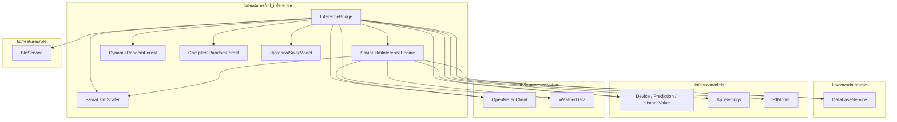
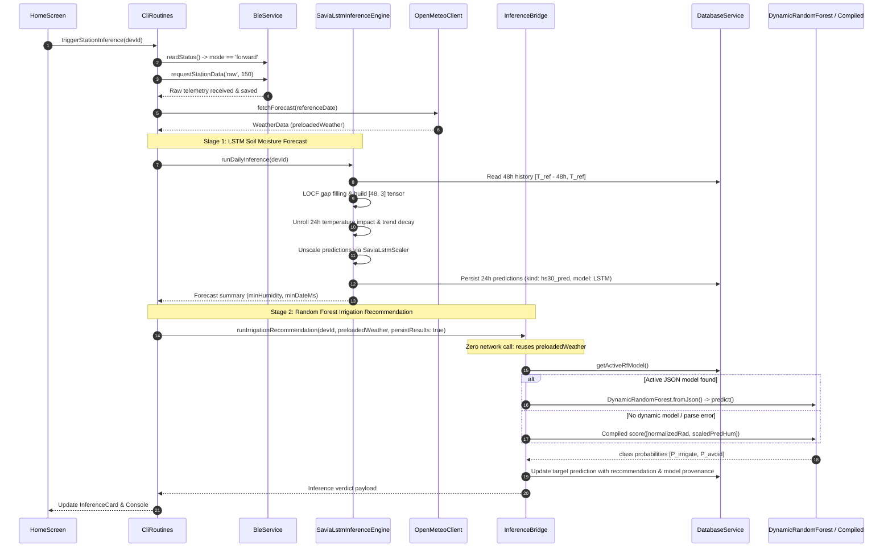
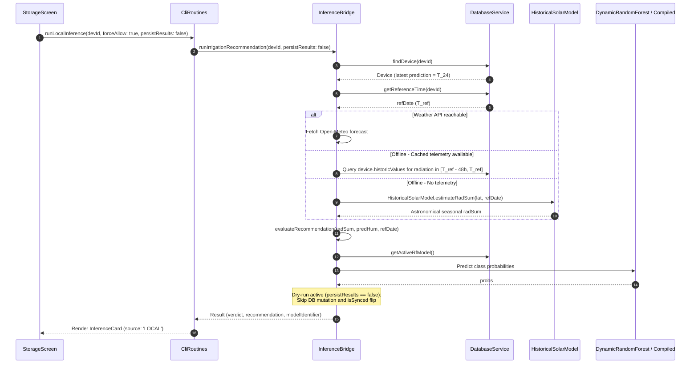
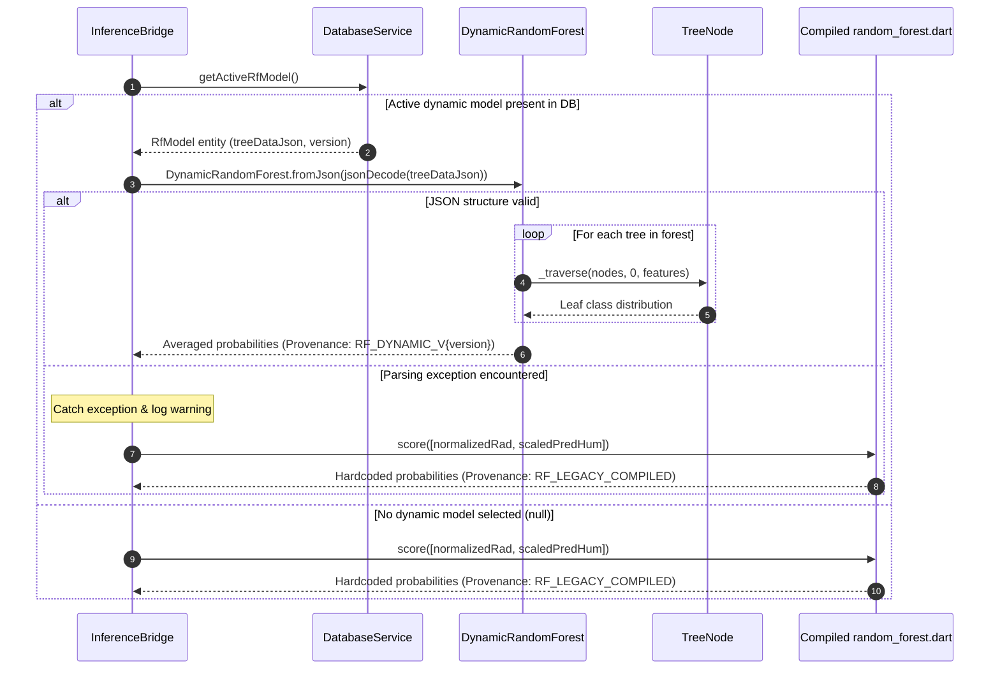

# C4 Code-Level Architecture Documentation: `lib/features/ml_inference`

This document provides comprehensive C4 Code-level (Component & Code) architectural documentation for the Machine Learning Inference subsystem located in [`lib/features/ml_inference`](file:///C:/Users/CrackoPattt88/Proyectos/tfm_app/lib/features/ml_inference).

---

## 1. Overview Section

The `lib/features/ml_inference` module implements the on-device and off-device machine learning evaluation engine powering the smart irrigation decision support system. Operating on agronomic telemetry collected from IoT ground stations (such as Raspberry Pi Pico W nodes) and meteorological forecasts from Open-Meteo, the module executes a two-stage hybrid machine learning pipeline:

1. **Stage 1 (LSTM Soil Moisture Forecast)**: Computes a 24-hour predictive trajectory of 30 cm soil moisture ($HS_{30}$, Volumetric Water Content VWC) based on the preceding 48 hours of tri-axial telemetry (air temperature $T_A$, soil moisture at 10 cm $HS_{10}$, and soil moisture at 30 cm $HS_{30}$) combined with a 24-hour future air temperature forecast. The implementation in pure Dart replicates the embedded C firmware specifications (`scaler.c`, `lstm_input.c`, `inference.c`).
2. **Stage 2 (Random Forest Decision Classifier)**: Evaluates whether irrigation is necessary (`IRRIGATION NEEDED`, Class 0) or can be safely skipped (`IRRIGATION AVOIDABLE`, Class 1). It bases this classification on the 48-hour accumulated shortwave solar radiation sum ($radSum$ in $\text{W/m}^2$) and the predicted minimum soil moisture level at horizon $T_{24}$ ($predHum$, $HS_{30}$).

```
┌─────────────────────────────────────────────────────────────────────────────────────────────┐
│                                 lib/features/ml_inference                                   │
│                                                                                             │
│   ┌────────────────────────────────┐                 ┌──────────────────────────────────┐   │
│   │    SaviaLstmInferenceEngine    │                 │         InferenceBridge          │   │
│   │      (lstm_inference.dart)     │                 │      (inference_engine.dart)     │   │
│   │  • 48h Telemetry Binning       │                 │  • Orchestrates Stage 1 & Stage 2│   │
│   │  • LOCF Gap Filling            │                 │  • Zero-Roundtrip Context Reuse  │   │
│   │  • StandardScaler Transforms   │                 │  • Multi-Tier Solar Fallback     │   │
│   │  • 24h Unrolled Trend Dynamics │                 │  • Dry-Run & Emulation Awareness │   │
│   └───────────────┬────────────────┘                 └────────────────┬─────────────────┘   │
│                   │                                                   │                     │
│                   ▼                                                   ▼                     │
│   ┌────────────────────────────────┐                 ┌──────────────────────────────────┐   │
│   │        SaviaLstmScaler         │                 │       HistoricalSolarModel       │   │
│   │  • StandardScaler parameters   │                 │  • Offline Solar Zenith Irradiance│   │
│   └────────────────────────────────┘                 └──────────────────────────────────┘   │
│                                                                       │                     │
│                                       ┌───────────────────────────────┴─────────────────┐   │
│                                       ▼                                                 ▼   │
│                       ┌──────────────────────────────┐              ┌───────────────────┐   │
│                       │     DynamicRandomForest      │              │ Compiled RF Model │   │
│                       │ (dynamic_random_forest.dart) │              │(random_forest.dart│   │
│                       │  • Zero-Dependency JSON Tree │              │  • 50 Hardcoded   │   │
│                       │  • Runtime Model Hot-Swap    │              │    Compiled Trees │   │
│                       └──────────────────────────────┘              └───────────────────┘   │
└─────────────────────────────────────────────────────────────────────────────────────────────┘
```

### Key Architectural Characteristics

- **Two-Stage Decoupled Pipeline**:
  - *Stage 1 Forecast*: Models natural soil evapotranspiration dynamics under ambient temperature forcing. Because the current physical model describes a monotonic soil moisture decay over a 24-hour horizon, the value at $T_{24}$ represents the expected minimum moisture level.
  - *Stage 2 Classification*: Maps the predicted moisture floor and cumulative atmospheric evaporative demand (solar radiation) into an agronomic irrigation prescription.
- **Dynamic Model Hot-Swapping & Fallback Resilience**:
  - Incorporates [`DynamicRandomForest`](file:///C:/Users/CrackoPattt88/Proyectos/tfm_app/lib/features/ml_inference/dynamic_random_forest.dart#L2) which deserializes tree structures from database-persisted JSON models ([`RfModel`](file:///C:/Users/CrackoPattt88/Proyectos/tfm_app/lib/core/models/app_rf_model.dart#L6)), enabling crop-specific or newly trained models to be loaded on the fly.
  - If no dynamic model is selected or if JSON parsing encounters an error, the engine seamlessly fails over to the hardcoded, 50-tree compiled classifier in [`random_forest.dart`](file:///C:/Users/CrackoPattt88/Proyectos/tfm_app/lib/features/ml_inference/random_forest.dart#L1) (`RF_LEGACY_COMPILED`).
- **Four-Tier Solar Irradiance Fallback**:
  To guarantee that irrigation decisions can be rendered even in harsh rural environments without internet access:
  1. *Tier 1 (Context Sharing)*: Reuses preloaded Open-Meteo weather data fetched during Stage 1 (`preloadedWeatherData`), eliminating duplicate HTTP requests.
  2. *Tier 2 (Live API Fetch)*: Queries the Open-Meteo API using station coordinates with automatic local solar time synchronization (`timezone=auto`).
  3. *Tier 3 (Local DB History)*: Sums cached pyranometer/radiation telemetry points ($W/m^2$) stored in the local Isar database within $[T_{ref}-48h, T_{ref}]$.
  4. *Tier 4 (Astronomical Model)*: Computes an offline solar radiation estimate via [`HistoricalSolarModel`](file:///C:/Users/CrackoPattt88/Proyectos/tfm_app/lib/features/ml_inference/inference_engine.dart#L15) using latitude, solar declination, and solar zenith angles.
- **Dry-Run Audit & Cloud Emulation Support**:
  - Supports non-destructive evaluation via `persistResults: false`, enabling instant local evaluation on stored records without mutating sync flags (`isSynced = false`).
  - Supports pure in-memory cloud emulation (`emulateCloudRecommendationInMemory`), allowing remote decision verification in RAM.
- **Model Provenance Tracking**:
  Every inference outcome tags its source model metadata explicitly:
  - `RF_DYNAMIC_V{version}`: Active dynamic JSON tree model.
  - `RF_LEGACY_COMPILED`: Hardcoded 50-tree compiled Dart classifier.
  - `RF_CLOUD_EMULATED`: Pure in-memory cloud emulation.

---

## 2. Code Elements Section

The module is composed of four primary Dart source files:

1. [`inference_engine.dart`](file:///C:/Users/CrackoPattt88/Proyectos/tfm_app/lib/features/ml_inference/inference_engine.dart): High-level inference coordinator ([`InferenceBridge`](file:///C:/Users/CrackoPattt88/Proyectos/tfm_app/lib/features/ml_inference/inference_engine.dart#L26)) and offline solar fallback model ([`HistoricalSolarModel`](file:///C:/Users/CrackoPattt88/Proyectos/tfm_app/lib/features/ml_inference/inference_engine.dart#L15)).
2. [`lstm_inference.dart`](file:///C:/Users/CrackoPattt88/Proyectos/tfm_app/lib/features/ml_inference/lstm_inference.dart): 24-hour off-device soil moisture prediction engine ([`SaviaLstmInferenceEngine`](file:///C:/Users/CrackoPattt88/Proyectos/tfm_app/lib/features/ml_inference/lstm_inference.dart#L63)), scaler ([`SaviaLstmScaler`](file:///C:/Users/CrackoPattt88/Proyectos/tfm_app/lib/features/ml_inference/lstm_inference.dart#L20)), sample structure ([`LstmInputSample`](file:///C:/Users/CrackoPattt88/Proyectos/tfm_app/lib/features/ml_inference/lstm_inference.dart#L44)), and error codes ([`SaviaLstmErrorCode`](file:///C:/Users/CrackoPattt88/Proyectos/tfm_app/lib/features/ml_inference/lstm_inference.dart#L11)).
3. [`dynamic_random_forest.dart`](file:///C:/Users/CrackoPattt88/Proyectos/tfm_app/lib/features/ml_inference/dynamic_random_forest.dart): Zero-dependency JSON Random Forest parser and recursive tree evaluator ([`DynamicRandomForest`](file:///C:/Users/CrackoPattt88/Proyectos/tfm_app/lib/features/ml_inference/dynamic_random_forest.dart#L2), [`TreeNode`](file:///C:/Users/CrackoPattt88/Proyectos/tfm_app/lib/features/ml_inference/dynamic_random_forest.dart#L54)).
4. [`random_forest.dart`](file:///C:/Users/CrackoPattt88/Proyectos/tfm_app/lib/features/ml_inference/random_forest.dart): Hardcoded, 50-tree compiled decision forest ([`score`](file:///C:/Users/CrackoPattt88/Proyectos/tfm_app/lib/features/ml_inference/random_forest.dart#L1)).

```mermaid
classDiagram
    class InferenceBridge {
        -DatabaseService _db
        +VoidCallback? onDbUpdated
        +String status
        +double progress
        +DateTime? lastInferenceTime
        +bool isRunning
        +bool injectLowMoisture
        +InferenceBridge(DatabaseService db, {VoidCallback? onDbUpdated})
        +runLocalLstmInference(String? deviceId) Future~Map~String, dynamic~~
        +runIrrigationRecommendation(String? deviceId, WeatherData? preloadedWeatherData, bool persistResults) Future~Map~String, dynamic~~
        +evaluateRecommendation(double radSum, double predHum, DateTime? refDate, bool invertModelOutput, String verbosePrefix) Map~String, dynamic~
        -generateRecommendationFromClass(int resultClass) String
        -loadModelFromSettings() Future~void~
    }

    class HistoricalSolarModel {
        <<utility>>
        +estimateRadSum(double lat, DateTime date)$ double
    }

    class SaviaLstmErrorCode {
        <<constants>>
        +int success$
        +int insufficientHistory$
        +int noForecast$
        +int executionError$
    }

    class SaviaLstmScaler {
        <<utility>>
        +double hs30Mean$
        +double hs30Std$
        +double taMean$
        +double taStd$
        +double hs10Mean$
        +double hs10Std$
        +scaleHs30(double val)$ double
        +unscaleHs30(double val)$ double
        +scaleTa(double val)$ double
        +unscaleTa(double val)$ double
        +scaleHs10(double val)$ double
        +unscaleHs10(double val)$ double
    }

    class LstmInputSample {
        +double ta
        +double hs10
        +double hs30
        +LstmInputSample(double ta, double hs10, double hs30)
        +toScaledTensorRow() List~double~
    }

    class SaviaLstmInferenceEngine {
        +DatabaseService db
        +SaviaLstmInferenceEngine(DatabaseService db)
        +runDailyInference(String deviceId, {DateTime? targetRefDate}) Future~Map~String, dynamic~~
        -gatherInputs(Device device, DateTime refDate) Future~Map~String, dynamic~~
        -executeLstmModel(List~List~double~~ pastTensor, List~double~ futureTensor) List~double~
        -persistPredictions(Device device, DateTime refDate, List~double~ predictions) void
    }

    class DynamicRandomForest {
        +String modelId
        +int numTrees
        +List~List~TreeNode~~ trees
        -DynamicRandomForest._(String modelId, int numTrees, List~List~TreeNode~~ trees)
        +fromJson(Map~String, dynamic~ json)$ DynamicRandomForest
        +predict(List~double~ features) List~double~
        -traverse(List~TreeNode~ nodes, int nodeId, List~double~ features) TreeNode
    }

    class TreeNode {
        +int nodeId
        +bool isLeaf
        +int featureIndex
        +double threshold
        +int leftChild
        +int rightChild
        +List~double~ value
        +TreeNode(int nodeId, bool isLeaf, int featureIndex, double threshold, int leftChild, int rightChild, List~double~ value)
        +fromJson(Map~String, dynamic~ json)$ TreeNode
    }

    class CompiledRandomForest {
        <<module random_forest.dart>>
        +score(List~double~ input)$ List~double~
        +addVectors(List~double~ v1, List~double~ v2)$ List~double~
        +mulVectorNumber(List~double~ v1, double num)$ List~double~
    }

    InferenceBridge --> SaviaLstmInferenceEngine : invokes Stage 1
    InferenceBridge --> HistoricalSolarModel : invokes solar fallback
    InferenceBridge --> DynamicRandomForest : evaluates dynamic JSON model
    InferenceBridge --> CompiledRandomForest : evaluates compiled fallback model
    SaviaLstmInferenceEngine --> SaviaLstmScaler : normalizes & unscales features
    SaviaLstmInferenceEngine --> LstmInputSample : creates hourly samples
    DynamicRandomForest *-- TreeNode : contains tree nodes
```

---

### 2.1 File: `inference_engine.dart`

**Path**: [`lib/features/ml_inference/inference_engine.dart`](file:///C:/Users/CrackoPattt88/Proyectos/tfm_app/lib/features/ml_inference/inference_engine.dart)

#### 2.1.1 Class: `HistoricalSolarModel`
An offline utility calculating theoretical 48-hour accumulated shortwave solar radiation ($W/m^2$) based on station latitude and calendar date, allowing offline classification when meteorological APIs and telemetry pyranometers are unavailable.

```dart
class HistoricalSolarModel {
  static double estimateRadSum({required double lat, required DateTime date})
}
```

##### Mathematical Formulation
1. **Day of Year ($N$)**:
   $$\text{dayOfYear} = \text{date} - \text{Jan 1} + 1$$
2. **Solar Declination Angle ($\delta$)**:
   $$\delta = 23.45^\circ \cdot \sin\left(\frac{284 + N}{365} \cdot 360^\circ\right)$$
3. **Solar Zenith Cosine ($\cos \theta_z$)**:
   $$\cos \theta_z = \max(0.2, \, \cos(\phi) \cos(\delta) + \sin(\phi) \sin(\delta))$$
   where $\phi$ is the latitude in radians.
4. **Estimated 48h Accumulated Radiation ($radSum$)**:
   $$radSum = 48.0 \times 180.0 \times \cos \theta_z$$

---

#### 2.1.2 Class: `InferenceBridge`
The central coordinator bridging local database state, external weather context, Stage 1 LSTM forecasting, and Stage 2 Random Forest classification.

##### Properties
| Property | Type | Visibility | Description |
| :--- | :--- | :--- | :--- |
| `_db` | [`DatabaseService`](file:///C:/Users/CrackoPattt88/Proyectos/tfm_app/lib/core/database/app_database.dart#L10) | Private | Data access service for stations, telemetry, settings, and RF models. |
| [`onDbUpdated`](file:///C:/Users/CrackoPattt88/Proyectos/tfm_app/lib/features/ml_inference/inference_engine.dart#L28) | `VoidCallback?` | Public | Optional callback notified when database persistence operations complete. |
| [`status`](file:///C:/Users/CrackoPattt88/Proyectos/tfm_app/lib/features/ml_inference/inference_engine.dart#L30) | `String` | Public | Human-readable pipeline execution status (e.g. `"Running Savia Off-Device LSTM..."`). |
| [`progress`](file:///C:/Users/CrackoPattt88/Proyectos/tfm_app/lib/features/ml_inference/inference_engine.dart#L31) | `double` | Public | Normalised pipeline progress indicator ($0.0 \to 1.0$). |
| [`lastInferenceTime`](file:///C:/Users/CrackoPattt88/Proyectos/tfm_app/lib/features/ml_inference/inference_engine.dart#L32) | `DateTime?` | Public | Timestamp of the most recently finished inference run. |
| [`isRunning`](file:///C:/Users/CrackoPattt88/Proyectos/tfm_app/lib/features/ml_inference/inference_engine.dart#L33) | `bool` | Public | Semaphore flag indicating whether an inference routine is active. |
| [`injectLowMoisture`](file:///C:/Users/CrackoPattt88/Proyectos/tfm_app/lib/features/ml_inference/inference_engine.dart#L34) | `bool` | Public | Diagnostic/testing override flag forcing 15% VWC moisture input. |

##### Key Methods Breakdown

- [`runLocalLstmInference([String? deviceId])`](file:///C:/Users/CrackoPattt88/Proyectos/tfm_app/lib/features/ml_inference/inference_engine.dart#L39-L62)
  - **Return**: `Future<Map<String, dynamic>>`
  - **Description**: Instantiates a [`SaviaLstmInferenceEngine`](file:///C:/Users/CrackoPattt88/Proyectos/tfm_app/lib/features/ml_inference/lstm_inference.dart#L63) instance and executes the off-device 24-hour LSTM forecast for the targeted device. Updates pipeline status and progress.

- [`runIrrigationRecommendation({String? deviceId, WeatherData? preloadedWeatherData, bool persistResults = true})`](file:///C:/Users/CrackoPattt88/Proyectos/tfm_app/lib/features/ml_inference/inference_engine.dart#L66-L224)
  - **Return**: `Future<Map<String, dynamic>>`
  - **Description**: Executes the complete Stage 2 workflow:
    1. Extracts latest prediction vector ($T_{24}$ soil moisture). Normalizes percentage values ($> 1.0 \implies / 100.0$).
    2. Sanitizes future data corruption on the device record (`_db.sanitizeCorruptedFutureData`).
    3. Computes the reference date $T_{ref}$ via `_db.getReferenceTime`.
    4. Obtains 48-hour shortwave radiation sum through the 4-tier fallback: preloaded weather $\to$ Open-Meteo API $\to$ local DB cached telemetry $\to$ [`HistoricalSolarModel`](file:///C:/Users/CrackoPattt88/Proyectos/tfm_app/lib/features/ml_inference/inference_engine.dart#L15).
    5. Calls [`evaluateRecommendation`](file:///C:/Users/CrackoPattt88/Proyectos/tfm_app/lib/features/ml_inference/inference_engine.dart#L235) to perform decision tree classification.
    6. If `persistResults == true`: updates the latest prediction record with target timestamp ($T_{ref} + 24h$), recommendation category, and model identifier, flips `device.isSynced = false`, and commits changes to Isar DB. If `persistResults == false`, acts as a dry-run audit.

- [`evaluateRecommendation({required double radSum, required double predHum, DateTime? refDate, bool invertModelOutput = false, String verbosePrefix = '[Inference Core Verbose]'})`](file:///C:/Users/CrackoPattt88/Proyectos/tfm_app/lib/features/ml_inference/inference_engine.dart#L235-L343)
  - **Return**: `Map<String, dynamic>`
  - **Description**: The core decision tree classification routine.
    - Scales $predHum$ using [`SaviaLstmScaler.scaleHs30`](file:///C:/Users/CrackoPattt88/Proyectos/tfm_app/lib/features/ml_inference/lstm_inference.dart#L33).
    - Normalizes solar radiation: if $radSum > 10.0$, scales to $0.27$ to match the trained tree split feature space.
    - Inspects `_db.getActiveRfModel()`. If an active dynamic JSON model exists, decodes it into [`DynamicRandomForest`](file:///C:/Users/CrackoPattt88/Proyectos/tfm_app/lib/features/ml_inference/dynamic_random_forest.dart#L2) and runs `predict([normalizedRad, scaledPredHum])`. In case of parsing failure or absence of dynamic models, falls back to [`rf.score([normalizedRad, scaledPredHum])`](file:///C:/Users/CrackoPattt88/Proyectos/tfm_app/lib/features/ml_inference/random_forest.dart#L1).
    - Determines class verdict: `resultClass = (probs[1] > probs[0]) ? 1 : 0`. Applies `invertModelOutput` if configured.
    - Checks agronomic window constraints (`agronomicDayStart` vs `agronomicDayEnd`).
    - Detects whether $T_{ref}$ represents a simulated/past date (`isEmulated`).

---

### 2.2 File: `lstm_inference.dart`

**Path**: [`lib/features/ml_inference/lstm_inference.dart`](file:///C:/Users/CrackoPattt88/Proyectos/tfm_app/lib/features/ml_inference/lstm_inference.dart)

#### 2.2.1 Class: `SaviaLstmErrorCode`
Integer error constants matching the Savia C station firmware (`inference.h`):
- `success = 0`: Normal execution.
- `insufficientHistory = -1`: Less than 48 hours of historical aggregates available (`LSTM_INPUT_INSUFFICIENT_HISTORY`).
- `noForecast = -2`: Open-Meteo meteorological weather forecast unavailable or incomplete (`LSTM_INPUT_NO_FORECAST`).
- `executionError = -3`: Generic processing failure or device not found.

#### 2.2.2 Class: `SaviaLstmScaler`
StandardScaler normalization matching the scikit-learn 1.6.1 model training pipeline and `src/system/scaler.c`:

| Feature Name | Mean ($\mu$) | Standard Deviation ($\sigma$) | Description |
| :--- | :--- | :--- | :--- |
| **`HS30`** | `0.7712527688624472` | `0.042382551037717174` | Volumetric Water Content at 30 cm depth ($m^3/m^3$) |
| **`TA`** | `24.38746466771412` | `5.069760003904925` | 2-meter Air Temperature ($^\circ\text{C}$) |
| **`HS10`** | `0.7902161245631403` | `0.04550010247318015` | Volumetric Water Content at 10 cm depth ($m^3/m^3$) |

##### Transformation Functions
- Scale: $z = \frac{x - \mu}{\sigma}$ via `scaleHs30(val)`, `scaleTa(val)`, `scaleHs10(val)`.
- Unscale: $x = (z \cdot \sigma) + \mu$ via `unscaleHs30(val)`, `unscaleTa(val)`, `unscaleHs10(val)`.

#### 2.2.3 Class: `LstmInputSample`
Value object representing a 1-hour sensor input tuple:
- `double ta`: Ambient air temperature ($^\circ\text{C}$).
- `double hs10`: Soil moisture at 10 cm ($VWC$).
- `double hs30`: Soil moisture at 30 cm ($VWC$).
- `List<double> toScaledTensorRow()`: Produces `[scaleTa(ta), scaleHs10(hs10), scaleHs30(hs30)]` matching the neural network tensor row ordering.

#### 2.2.4 Class: `SaviaLstmInferenceEngine`
The off-device implementation of the 24-hour unrolled soil moisture forecast.

##### Execution Steps (`runDailyInference`)
1. **Input Gathering (`_gatherInputs`)**:
   - Filters telemetry history within $[T_{ref}-48h, T_{ref}]$.
   - Enforces a minimum threshold: aborts if fewer than 12 points exist in the 48h window and fewer than 48 total points exist.
   - Fetches 72 hours of hourly air temperature from Open-Meteo (48 hours past, 24 hours future).
   - Constructs 48 one-hour historical bins using **Last Observation Carried Forward (LOCF)** and initial leading backfill.
2. **Tensor Assembly**:
   - Converts the 48 hourly bins into a scaled matrix $[48, 3]$.
   - Converts the 24 future temperature values into a scaled vector $[24, 1]$.
3. **Model Prediction (`_executeLstmModel`)**:
   - Computes historical average moisture decay over the past 24 hours:
     $$\text{avgDecay} = \frac{\text{pastTensor}[47][HS_{30}] - \text{pastTensor}[23][HS_{30}]}{24.0}$$
   - Iterates $t \in [0, 23]$:
     $$\text{tempImpact} = -0.002 \cdot (\text{futureTaScaled}[t] - 0.5)$$
     $$\text{stepDecay} = \text{avgDecay} \cdot 0.95 + \text{tempImpact}$$
     $$\text{currentHs30Scaled} \mathrel{+}= \text{stepDecay}$$
4. **Unscaling**:
   - Maps the 24 scaled values back to real $VWC$ via [`SaviaLstmScaler.unscaleHs30`](file:///C:/Users/CrackoPattt88/Proyectos/tfm_app/lib/features/ml_inference/lstm_inference.dart#L34).
5. **Database Persistence (`_persistPredictions`)**:
   - Writes 24 hourly prediction records ([`Prediction`](file:///C:/Users/CrackoPattt88/Proyectos/tfm_app/lib/core/models/device.dart#L49)) with `kind: 'hs30_pred'` and `model: 'LSTM'` into `device.newPredictions`.
   - Flips `device.isSynced = false` and triggers `db.updateDeviceSync(device)`.

---

### 2.3 File: `dynamic_random_forest.dart`

**Path**: [`lib/features/ml_inference/dynamic_random_forest.dart`](file:///C:/Users/CrackoPattt88/Proyectos/tfm_app/lib/features/ml_inference/dynamic_random_forest.dart)

A zero-dependency JSON decision tree parser and inference evaluator.

#### 2.3.1 Class: `TreeNode`
Represents an individual node within a decision tree.

| Field | Type | Description |
| :--- | :--- | :--- |
| [`nodeId`](file:///C:/Users/CrackoPattt88/Proyectos/tfm_app/lib/features/ml_inference/dynamic_random_forest.dart#L55) | `int` | Unique node identifier within the tree. |
| [`isLeaf`](file:///C:/Users/CrackoPattt88/Proyectos/tfm_app/lib/features/ml_inference/dynamic_random_forest.dart#L56) | `bool` | True if this node is terminal (contains class probabilities). |
| [`featureIndex`](file:///C:/Users/CrackoPattt88/Proyectos/tfm_app/lib/features/ml_inference/dynamic_random_forest.dart#L57) | `int` | Feature vector index to compare ($0 = radSum, 1 = predHum$). |
| [`threshold`](file:///C:/Users/CrackoPattt88/Proyectos/tfm_app/lib/features/ml_inference/dynamic_random_forest.dart#L58) | `double` | Numerical decision threshold. |
| [`leftChild`](file:///C:/Users/CrackoPattt88/Proyectos/tfm_app/lib/features/ml_inference/dynamic_random_forest.dart#L59) | `int` | Node ID of child when $feature \le threshold$. |
| [`rightChild`](file:///C:/Users/CrackoPattt88/Proyectos/tfm_app/lib/features/ml_inference/dynamic_random_forest.dart#L60) | `int` | Node ID of child when $feature > threshold$. |
| [`value`](file:///C:/Users/CrackoPattt88/Proyectos/tfm_app/lib/features/ml_inference/dynamic_random_forest.dart#L61) | `List<double>` | Class distribution array at leaf (e.g. $[P(\text{Irrigate}), P(\text{Avoid})]$). |

#### 2.3.2 Class: `DynamicRandomForest`
- Deserializes a complete ensemble from JSON via `DynamicRandomForest.fromJson(Map<String, dynamic> json)`.
- Traverses each tree recursively from root (`nodeId = 0`) using `_traverse`.
- Averages class probabilities across all trees in `predict(List<double> features)`:
  $$P(\text{class}_i) = \frac{1}{N_{\text{trees}}} \sum_{k=1}^{N_{\text{trees}}} \text{leaf}_k.\text{value}[i]$$

---

### 2.4 File: `random_forest.dart`

**Path**: [`lib/features/ml_inference/random_forest.dart`](file:///C:/Users/CrackoPattt88/Proyectos/tfm_app/lib/features/ml_inference/random_forest.dart)

A high-speed, compiled decision forest containing 50 hardcoded binary decision trees generated from scikit-learn.
- [`score(List<double> input)`](file:///C:/Users/CrackoPattt88/Proyectos/tfm_app/lib/features/ml_inference/random_forest.dart#L1-L1743): Evaluates 50 decision trees (`var0` to `var49`) directly in native Dart code, sums all class probability vectors, and scales by $0.02$ ($\frac{1}{50}$) using [`mulVectorNumber`](file:///C:/Users/CrackoPattt88/Proyectos/tfm_app/lib/features/ml_inference/random_forest.dart#L1751) and [`addVectors`](file:///C:/Users/CrackoPattt88/Proyectos/tfm_app/lib/features/ml_inference/random_forest.dart#L1744).
- Provides zero-latency, zero-parsing execution when dynamic models are not in use.

---

## 3. Dependencies Section

### 3.1 Internal Project Dependencies



| Dependency | File Location | Used By | Purpose |
| :--- | :--- | :--- | :--- |
| [`DatabaseService`](file:///C:/Users/CrackoPattt88/Proyectos/tfm_app/lib/core/database/app_database.dart#L10) | `lib/core/database/app_database.dart` | [`InferenceBridge`](file:///C:/Users/CrackoPattt88/Proyectos/tfm_app/lib/features/ml_inference/inference_engine.dart#L26), [`SaviaLstmInferenceEngine`](file:///C:/Users/CrackoPattt88/Proyectos/tfm_app/lib/features/ml_inference/lstm_inference.dart#L63) | Accessing saved stations, querying historical sensor readings, resolving $T_{ref}$, sanitizing timestamps, and saving prediction records. |
| [`Device`](file:///C:/Users/CrackoPattt88/Proyectos/tfm_app/lib/core/models/device.dart#L6) | `lib/core/models/device.dart` | [`InferenceBridge`](file:///C:/Users/CrackoPattt88/Proyectos/tfm_app/lib/features/ml_inference/inference_engine.dart#L26), [`SaviaLstmInferenceEngine`](file:///C:/Users/CrackoPattt88/Proyectos/tfm_app/lib/features/ml_inference/lstm_inference.dart#L63) | Station entity encapsulating telemetry arrays, predictions, coordinates, and sync state. |
| [`Prediction`](file:///C:/Users/CrackoPattt88/Proyectos/tfm_app/lib/core/models/device.dart#L49) | `lib/core/models/device.dart` | [`InferenceBridge`](file:///C:/Users/CrackoPattt88/Proyectos/tfm_app/lib/features/ml_inference/inference_engine.dart#L26), [`SaviaLstmInferenceEngine`](file:///C:/Users/CrackoPattt88/Proyectos/tfm_app/lib/features/ml_inference/lstm_inference.dart#L63) | Target entity for generated 24h soil moisture curves and irrigation recommendations. |
| [`HistoricValue`](file:///C:/Users/CrackoPattt88/Proyectos/tfm_app/lib/core/models/device.dart#L40) | `lib/core/models/device.dart` | [`InferenceBridge`](file:///C:/Users/CrackoPattt88/Proyectos/tfm_app/lib/features/ml_inference/inference_engine.dart#L26), [`SaviaLstmInferenceEngine`](file:///C:/Users/CrackoPattt88/Proyectos/tfm_app/lib/features/ml_inference/lstm_inference.dart#L63) | Historical sensor reading data points ($HS_{10}$, $HS_{30}$, radiation, temperature). |
| [`AppSettings`](file:///C:/Users/CrackoPattt88/Proyectos/tfm_app/lib/core/models/app_settings.dart#L5) | `lib/core/models/app_settings.dart` | [`InferenceBridge`](file:///C:/Users/CrackoPattt88/Proyectos/tfm_app/lib/features/ml_inference/inference_engine.dart#L26) | User agronomic scheduling configuration (`agronomicDayStart`, `agronomicDayEnd`, `invertModelOutput`). |
| [`RfModel`](file:///C:/Users/CrackoPattt88/Proyectos/tfm_app/lib/core/models/app_rf_model.dart#L6) | `lib/core/models/app_rf_model.dart` | [`InferenceBridge`](file:///C:/Users/CrackoPattt88/Proyectos/tfm_app/lib/features/ml_inference/inference_engine.dart#L26) | Isar model record containing serialized decision tree JSON and metadata. |
| [`OpenMeteoClient`](file:///C:/Users/CrackoPattt88/Proyectos/tfm_app/lib/features/weather/open_meteo_api.dart#L6) | `lib/features/weather/open_meteo_api.dart` | [`InferenceBridge`](file:///C:/Users/CrackoPattt88/Proyectos/tfm_app/lib/features/ml_inference/inference_engine.dart#L26), [`SaviaLstmInferenceEngine`](file:///C:/Users/CrackoPattt88/Proyectos/tfm_app/lib/features/ml_inference/lstm_inference.dart#L63) | Meteorological forecast client retrieving temperature and solar radiation. |
| [`WeatherData`](file:///C:/Users/CrackoPattt88/Proyectos/tfm_app/lib/features/weather/weather_data.dart#L1) | `lib/features/weather/weather_data.dart` | [`InferenceBridge`](file:///C:/Users/CrackoPattt88/Proyectos/tfm_app/lib/features/ml_inference/inference_engine.dart#L26), [`SaviaLstmInferenceEngine`](file:///C:/Users/CrackoPattt88/Proyectos/tfm_app/lib/features/ml_inference/lstm_inference.dart#L63) | Parsed meteorological payload container passed across pipeline stages. |
| [`BleService`](file:///C:/Users/CrackoPattt88/Proyectos/tfm_app/lib/features/ble/ble_service.dart#L13) | `lib/features/ble/ble_service.dart` | [`InferenceBridge`](file:///C:/Users/CrackoPattt88/Proyectos/tfm_app/lib/features/ml_inference/inference_engine.dart#L26) | Used to determine connection status when resolving station reference time ($T_{ref}$). |

---

### 3.2 External Package Dependencies

| Package / Library | Import Path | Purpose in Module |
| :--- | :--- | :--- |
| `dart:async` | `dart:async` | Asynchronous programming abstractions (`Future`). |
| `dart:math` | `dart:math` | Trigonometric functions (`sin`, `cos`) and math functions (`max`, `min`) used in [`HistoricalSolarModel`](file:///C:/Users/CrackoPattt88/Proyectos/tfm_app/lib/features/ml_inference/inference_engine.dart#L15) and [`SaviaLstmInferenceEngine`](file:///C:/Users/CrackoPattt88/Proyectos/tfm_app/lib/features/ml_inference/lstm_inference.dart#L63). |
| `dart:convert` | `dart:convert` | Serializing and deserializing JSON dynamic tree payloads (`jsonDecode`). |
| `flutter/material.dart` | `package:flutter/material.dart` | Exposes `VoidCallback` for database update event hooks. |

---

## 4. Relationships Section

### 4.1 Inbound Consumers

The machine learning inference engine is consumed by orchestration routines, user interface screens, and automated test suites:

```mermaid
graph TD
    ROUTINES[CliRoutines (cli_routines.dart)] -->|Executes runLocalInference| INF_B[InferenceBridge]
    ROUTINES -->|Executes emulateCloudRecommendationInMemory| INF_B
    ROUTINES -->|Executes emulateCloudRecommendationInMemory| LSTM[SaviaLstmInferenceEngine]
    ROUTINES -->|Executes triggerStationInference forward| LSTM

    HOME_UI[HomeScreen (home_screen.dart)] -->|Triggers live BLE inference| ROUTINES
    STORE_UI[StorageScreen (storage_screen.dart)] -->|Triggers local dry-run audit| ROUTINES
    STORE_UI -->|Triggers cloud emulation| ROUTINES

    TESTS[inference_engine_test.dart] -->|Validates evaluation logic| INF_B
    TESTS -->|Validates scaler math| SCALER[SaviaLstmScaler]
```

1. [`CliRoutines`](file:///C:/Users/CrackoPattt88/Proyectos/tfm_app/lib/cli_routines.dart#L23) (`lib/cli_routines.dart`):
   - [`runLocalInference`](file:///C:/Users/CrackoPattt88/Proyectos/tfm_app/lib/cli_routines.dart#L108): Enforces agronomic schedule guards (Yellow Zone vs Green Zone) before delegating to [`InferenceBridge.runIrrigationRecommendation`](file:///C:/Users/CrackoPattt88/Proyectos/tfm_app/lib/features/ml_inference/inference_engine.dart#L66).
   - [`triggerStationInference`](file:///C:/Users/CrackoPattt88/Proyectos/tfm_app/lib/cli_routines.dart#L360): Orchestrates real-time BLE inference. When in `'forward'` mode, invokes [`SaviaLstmInferenceEngine.runDailyInference`](file:///C:/Users/CrackoPattt88/Proyectos/tfm_app/lib/features/ml_inference/lstm_inference.dart#L70), caches Open-Meteo weather as `preloadedWeather`, and passes it into [`runLocalInference`](file:///C:/Users/CrackoPattt88/Proyectos/tfm_app/lib/cli_routines.dart#L108).
   - [`emulateCloudRecommendationInMemory`](file:///C:/Users/CrackoPattt88/Proyectos/tfm_app/lib/cli_routines.dart#L547): Performs cloud-side emulation in dynamic RAM without mutating local Isar DB. If cloud predictions are unavailable, executes [`SaviaLstmInferenceEngine`](file:///C:/Users/CrackoPattt88/Proyectos/tfm_app/lib/features/ml_inference/lstm_inference.dart#L63) in RAM, pulls weather, and runs [`InferenceBridge.evaluateRecommendation`](file:///C:/Users/CrackoPattt88/Proyectos/tfm_app/lib/features/ml_inference/inference_engine.dart#L235).
2. [`HomeScreen`](file:///C:/Users/CrackoPattt88/Proyectos/tfm_app/lib/screens/home_screen.dart#L411) (`lib/screens/home_screen.dart`):
   - Invokes live inference when connected to an IoT station via BLE, rendering results in [`InferenceCard`](file:///C:/Users/CrackoPattt88/Proyectos/tfm_app/lib/screens/widgets/inference_card.dart).
3. [`StorageScreen`](file:///C:/Users/CrackoPattt88/Proyectos/tfm_app/lib/screens/storage_screen.dart#L210) (`lib/screens/storage_screen.dart`):
   - Invokes local inference with `persistResults: false` to allow offline examination of historical records without triggering unsynced flags.
   - Invokes cloud emulation to test model responses against cloud data.
4. [`inference_engine_test.dart`](file:///C:/Users/CrackoPattt88/Proyectos/tfm_app/test/inference_engine_test.dart) (`test/inference_engine_test.dart`):
   - Comprehensive test suite covering [`SaviaLstmScaler`](file:///C:/Users/CrackoPattt88/Proyectos/tfm_app/lib/features/ml_inference/lstm_inference.dart#L20) normalization accuracy and 8 test cases of [`InferenceBridge.evaluateRecommendation`](file:///C:/Users/CrackoPattt88/Proyectos/tfm_app/lib/features/ml_inference/inference_engine.dart#L235) (normal moisture, high moisture, low moisture, percentage inputs, low moisture injection, inverted model outputs, and night hour restriction guards).

---

### 4.2 Sequence Workflows

#### Sequence 1: Two-Stage Forward Inference Workflow (Live Hardware / App-Side)
Demonstrates the full execution path during live station interaction in `'forward'` mode:



---

#### Sequence 2: Storage Screen Offline Dry-Run Inference Workflow
Demonstrates the non-destructive offline audit path on historical records:



---

#### Sequence 3: Dynamic Model Hot-Swapping & Fault-Tolerant Fallback
Demonstrates dynamic JSON tree evaluation with automatic fallback to compiled Dart trees:


