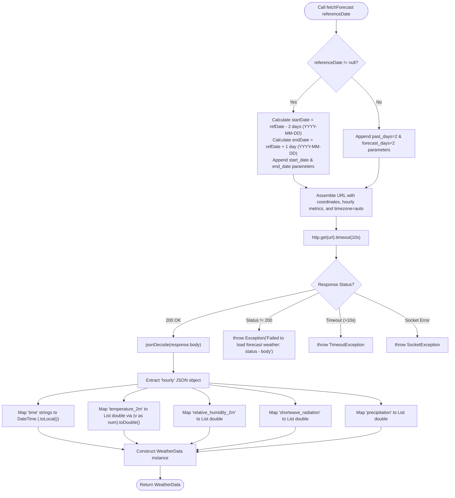
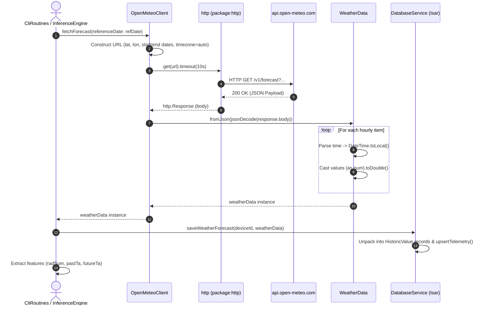
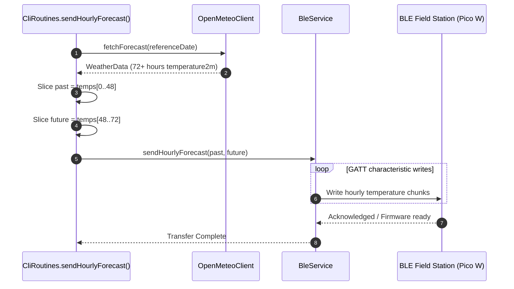

# C4 Code Architecture: `lib/features/weather`

This document provides code-level architecture documentation (Level 4 in the C4 model) for the weather feature module located in [`lib/features/weather`](file:///C:/Users/CrackoPattt88/Proyectos/tfm_app/lib/features/weather). It provides detailed descriptions of classes, methods, data structures, dependencies, data flows, and architectural design choices.

---

## 1. Overview Section

### 1.1 Purpose & Scope

The [`lib/features/weather`](file:///C:/Users/CrackoPattt88/Proyectos/tfm_app/lib/features/weather) module is responsible for retrieving, deserializing, and structuring meteorological forecast and historical weather data for the smart irrigation decision support system.

The module interfaces with the public Open-Meteo REST API without requiring proprietary API keys, fetching critical meteorological parameters—such as ambient temperature at 2 meters, relative humidity, shortwave solar radiation, and precipitation—indexed by coordinate location and temporal reference windows.

Key capabilities provided:
- **Location-Aware Weather Ingestion**: Queries hourly meteorological metrics for arbitrary WGS-84 geographic coordinates (`latitude`, `longitude`).
- **Flexible Temporal Windows**: Supports both live forecasts (rolling 48h past and 48h future) and reference-anchored queries (for historical replay, device clock synchronization, or back-testing).
- **Timezone Synchronization**: Requests automated solar timezone alignment (`timezone=auto`) to harmonize UTC weather arrays with station-local solar cycles.
- **Model Ingestion Pipeline**: Delivers strongly-typed time series consumed directly by the machine learning inference engine (Random Forest solar irradiance accumulator), the deep learning LSTM soil moisture forecasting engine, the local database persistence layer, and BLE peripheral synchronization routines.

### 1.2 Architectural Role & Boundaries

In the application's clean-architecture-inspired design, [`lib/features/weather`](file:///C:/Users/CrackoPattt88/Proyectos/tfm_app/lib/features/weather) operates as an **External Data Provider / Gateway** within the Feature layer:

- **Layer Placement**: Feature / Data Source Layer (`lib/features/weather`).
- **Coupling**: 
  - External: Depends on `dart:async`, `dart:convert`, and `package:http/http`.
  - Internal: Consumed by the machine learning inference services ([`InferenceEngine`](file:///C:/Users/CrackoPattt88/Proyectos/tfm_app/lib/features/ml_inference/inference_engine.dart#L144), [`LstmInferenceEngine`](file:///C:/Users/CrackoPattt88/Proyectos/tfm_app/lib/features/ml_inference/lstm_inference.dart#L170)), the local persistence service ([`DatabaseService`](file:///C:/Users/CrackoPattt88/Proyectos/tfm_app/lib/core/database/app_database.dart#L730)), and CLI orchestration routines ([`CliRoutines`](file:///C:/Users/CrackoPattt88/Proyectos/tfm_app/lib/cli_routines.dart#L275)).
  - Presentation Isolation: Contains no Flutter UI widgets, rendering logic, or theme dependencies.
- **State Management**: The client ([`OpenMeteoClient`](file:///C:/Users/CrackoPattt88/Proyectos/tfm_app/lib/features/weather/open_meteo_api.dart#L6)) holds only immutable coordinate state, making it safe for concurrent, multi-threaded (isolate), or asynchronous execution.
- **Resilience Strategy**: Serves as the primary weather provider, complemented by dual offline fallback layers (database-cached telemetry and historical seasonal radiation estimation) implemented in consumer modules.

```
+------------------------------------------------------------------------------------+
|                               Presentation & CLI                                   |
|       (HomeScreen, ConfigScreen, CliRoutines.sendHourlyForecast)                  |
+------------------------------------------------------------------------------------+
                                      |
                                      v
+------------------------------------------------------------------------------------+
|                         Machine Learning Inference Layer                           |
|       (InferenceEngine: radSum, LstmInferenceEngine: 48h past / 24h future)       |
+------------------------------------------------------------------------------------+
                                      |
                                      v
+------------------------------------------------------------------------------------+
|                           Weather Feature Layer                                    |
|                       (lib/features/weather)                                       |
|                                                                                    |
|      +--------------------------------+      produces      +--------------------+  |
|      |        OpenMeteoClient         | -----------------> |    WeatherData     |  |
|      | (HTTP Client, Coordinate State)|                    | (Typed Data DTO)   |  |
|      +--------------------------------+                    +--------------------+  |
+------------------------------------------------------------------------------------+
             |                                                       |
             | sends HTTP GET (JSON)                                 | decomposes to
             v                                                       v
+-----------------------------+                    +---------------------------------+
|   api.open-meteo.com/v1     |                    |      DatabaseService (Isar)     |
|   (External REST Service)   |                    |   (upsertTelemetry HistoricVal) |
+-----------------------------+                    +---------------------------------+
```

### 1.3 C4 Code Diagram

The following Mermaid class diagram illustrates the classes, fields, methods, external packages, and upstream consumer relationships comprising the [`lib/features/weather`](file:///C:/Users/CrackoPattt88/Proyectos/tfm_app/lib/features/weather) module:

```mermaid
classDiagram
    direction TB

    class OpenMeteoClient {
        -_baseUrl: String$ = "https://api.open-meteo.com/v1/forecast"
        +latitude: double
        +longitude: double
        +OpenMeteoClient({required double latitude, required double longitude})
        +fetchForecast({DateTime? referenceDate}) Future~WeatherData~
    }

    class WeatherData {
        +time: List~DateTime~
        +temperature2m: List~double~
        +relativeHumidity2m: List~double~
        +shortwaveRadiation: List~double~
        +precipitation: List~double~
        +WeatherData({required List~DateTime~ time, required List~double~ temperature2m, required List~double~ relativeHumidity2m, required List~double~ shortwaveRadiation, required List~double~ precipitation})
        +fromJson(Map~String, dynamic~ json)$ WeatherData
    }

    class HttpClient {
        <<package:http>>
        +get(Uri url) Future~Response~
    }

    class InferenceEngine {
        <<lib/features/ml_inference>>
        -_db: DatabaseService
        +runInference(Device device, {DateTime? refDate, WeatherData? preloadedWeatherData}) Future~Map~
    }

    class LstmInferenceEngine {
        <<lib/features/ml_inference>>
        +evaluateModel(Device device, DatabaseService db, {DateTime? refDate}) Future~Map~
    }

    class CliRoutines {
        <<lib/cli_routines>>
        +sendHourlyForecast({String? devId, DateTime? referenceDate}) Future~void~
        +triggerInferenceAndSync(String devId, {bool forwardMode}) Future~void~
    }

    class DatabaseService {
        <<lib/core/database>>
        +saveWeatherForecast(String deviceId, WeatherData weatherData) void
    }

    %% Relationships
    OpenMeteoClient ..> HttpClient : invokes get() with 10s timeout
    OpenMeteoClient ..> WeatherData : constructs via fromJson()
    InferenceEngine ..> OpenMeteoClient : instantiates & fetches forecast
    InferenceEngine ..> WeatherData : reads shortwaveRadiation
    LstmInferenceEngine ..> OpenMeteoClient : instantiates & fetches forecast
    LstmInferenceEngine ..> WeatherData : slices past (48h) & future (24h) temperature2m
    CliRoutines ..> OpenMeteoClient : fetches forecast by location
    CliRoutines ..> WeatherData : reads temperature2m for BLE sync
    DatabaseService ..> WeatherData : unpacks into HistoricValue records
```

---

## 2. Code Elements Section

The [`lib/features/weather`](file:///C:/Users/CrackoPattt88/Proyectos/tfm_app/lib/features/weather) module comprises two core files:
1. [`weather_data.dart`](file:///C:/Users/CrackoPattt88/Proyectos/tfm_app/lib/features/weather/weather_data.dart): Defines the data transfer object ([`WeatherData`](file:///C:/Users/CrackoPattt88/Proyectos/tfm_app/lib/features/weather/weather_data.dart#L1-L29)) and JSON factory parser.
2. [`open_meteo_api.dart`](file:///C:/Users/CrackoPattt88/Proyectos/tfm_app/lib/features/weather/open_meteo_api.dart): Defines the network service gateway ([`OpenMeteoClient`](file:///C:/Users/CrackoPattt88/Proyectos/tfm_app/lib/features/weather/open_meteo_api.dart#L6-L48)).

---

### 2.1 `WeatherData`

```dart
class WeatherData {
  final List<DateTime> time;
  final List<double> temperature2m;
  final List<double> relativeHumidity2m;
  final List<double> shortwaveRadiation;
  final List<double> precipitation;

  WeatherData({
    required this.time,
    required this.temperature2m,
    required this.relativeHumidity2m,
    required this.shortwaveRadiation,
    required this.precipitation,
  });

  factory WeatherData.fromJson(Map<String, dynamic> json);
}
```

- **File**: [`lib/features/weather/weather_data.dart`](file:///C:/Users/CrackoPattt88/Proyectos/tfm_app/lib/features/weather/weather_data.dart#L1-L29)
- **Type**: Domain Value Object / DTO (Data Transfer Object).
- **Design Intent**: Encapsulates synchronized parallel time-series arrays representing discrete hourly weather metrics for a geographic coordinate.

#### 2.1.1 Member Properties

| Property | Type | Nullable | Description | Typical Unit |
| :--- | :--- | :--- | :--- | :--- |
| [`time`](file:///C:/Users/CrackoPattt88/Proyectos/tfm_app/lib/features/weather/weather_data.dart#L2) | `List<DateTime>` | No | Hourly timestamps parsed and normalized to the device's local solar time zone. | ISO-8601 timestamps |
| [`temperature2m`](file:///C:/Users/CrackoPattt88/Proyectos/tfm_app/lib/features/weather/weather_data.dart#L3) | `List<double>` | No | Ambient air temperature measured 2 meters above ground. | Degrees Celsius (°C) |
| [`relativeHumidity2m`](file:///C:/Users/CrackoPattt88/Proyectos/tfm_app/lib/features/weather/weather_data.dart#L4) | `List<double>` | No | Relative atmospheric humidity measured 2 meters above ground. | Percentage (%) |
| [`shortwaveRadiation`](file:///C:/Users/CrackoPattt88/Proyectos/tfm_app/lib/features/weather/weather_data.dart#L5) | `List<double>` | No | Direct and diffuse solar shortwave radiation received on a horizontal surface. | Watts per square meter (W/m²) |
| [`precipitation`](file:///C:/Users/CrackoPattt88/Proyectos/tfm_app/lib/features/weather/weather_data.dart#L6) | `List<double>` | No | Total precipitation (liquid and water-equivalent solid) per hour. | Millimeters (mm) |

#### 2.1.2 Factory Constructor: `WeatherData.fromJson`

- **Declaration**: [`factory WeatherData.fromJson(Map<String, dynamic> json)`](file:///C:/Users/CrackoPattt88/Proyectos/tfm_app/lib/features/weather/weather_data.dart#L16-L28)
- **Input**: Decoded JSON map matching Open-Meteo REST API forecast schema containing an `hourly` object.
- **Output**: Fully instantiated and validated [`WeatherData`](file:///C:/Users/CrackoPattt88/Proyectos/tfm_app/lib/features/weather/weather_data.dart#L1) instance.
- **Parsing Mechanics**:
  1. **Subtree Extraction**: Extracts `final hourly = json['hourly'];`.
  2. **Timestamp Parsing & Timezone Handling**:
     ```dart
     time: (hourly['time'] as List).map((t) {
       final s = t.toString();
       return DateTime.parse(s.endsWith('Z') ? s : '${s}Z').toLocal();
     }).toList(),
     ```
     - Open-Meteo with `timezone=auto` yields ISO-8601 strings without a trailing offset designator (e.g., `2026-09-15T14:00`).
     - The parser evaluates whether the string ends with `'Z'`. If not, it appends `'Z'` to treat the raw string uniformly as UTC representation during parse, and then invokes `.toLocal()` to project the timestamp accurately into the execution platform's local solar reference time.
  3. **Numeric Type Coercion**:
     ```dart
     (hourly['temperature_2m'] as List).map((v) => (v as num).toDouble()).toList()
     ```
     - Employs `(v as num).toDouble()` across all numeric fields (`temperature_2m`, `relative_humidity_2m`, `shortwave_radiation`, `precipitation`).
     - **Rationale**: JSON parsers instantiate whole numbers (e.g., `0` or `12`) as Dart `int`, while decimal numbers are parsed as `double`. Direct casting to `double` (`v as double`) would trigger a runtime `TypeError`. Casting to `num` before `.toDouble()` guarantees safe coercion.

---

### 2.2 `OpenMeteoClient`

```dart
class OpenMeteoClient {
  static const String _baseUrl = 'https://api.open-meteo.com/v1/forecast';

  final double latitude;
  final double longitude;

  OpenMeteoClient({required this.latitude, required this.longitude});

  Future<WeatherData> fetchForecast({DateTime? referenceDate}) async;
}
```

- **File**: [`lib/features/weather/open_meteo_api.dart`](file:///C:/Users/CrackoPattt88/Proyectos/tfm_app/lib/features/weather/open_meteo_api.dart#L6-L48)
- **Type**: Service / API Client.
- **Design Intent**: Encapsulates HTTP communication, URI parameter composition, request timeout enforcement, and response decoding for the Open-Meteo weather API.

#### 2.2.1 Constants & Fields

| Member | Modifier / Type | Value / Purpose |
| :--- | :--- | :--- |
| [`_baseUrl`](file:///C:/Users/CrackoPattt88/Proyectos/tfm_app/lib/features/weather/open_meteo_api.dart#L7) | `static const String` | `'https://api.open-meteo.com/v1/forecast'` — Base endpoint for Open-Meteo's non-commercial weather forecasting API. |
| [`latitude`](file:///C:/Users/CrackoPattt88/Proyectos/tfm_app/lib/features/weather/open_meteo_api.dart#L9) | `final double` | Geographic latitude in decimal degrees (-90.0 to 90.0). |
| [`longitude`](file:///C:/Users/CrackoPattt88/Proyectos/tfm_app/lib/features/weather/open_meteo_api.dart#L10) | `final double` | Geographic longitude in decimal degrees (-180.0 to 180.0). |

#### 2.2.2 Constructor: `OpenMeteoClient`

- **Declaration**: [`OpenMeteoClient({required this.latitude, required this.longitude})`](file:///C:/Users/CrackoPattt88/Proyectos/tfm_app/lib/features/weather/open_meteo_api.dart#L12)
- **Parameters**: Requires geographic coordinates (`latitude`, `longitude`).
- **Immutability**: Fully immutable once instantiated; enables stateless concurrent requests.

#### 2.2.3 Method: `fetchForecast`

- **Declaration**: [`Future<WeatherData> fetchForecast({DateTime? referenceDate}) async`](file:///C:/Users/CrackoPattt88/Proyectos/tfm_app/lib/features/weather/open_meteo_api.dart#L18-L47)
- **Parameters**:
  - `DateTime? referenceDate`: Optional anchor timestamp.
    - When `referenceDate != null`: Operates in **Explicit Historical/Relative Range Mode**.
    - When `referenceDate == null`: Operates in **Live Rolling Window Mode**.
- **Return Type**: `Future<WeatherData>`
- **Execution Timeout**: Enforces a strict 10-second deadline (`.timeout(const Duration(seconds: 10))`) via `dart:async`.
- **Query Construction**:
  - **Explicit Date Range Mode (`referenceDate != null`)**:
    - Calculates `startDate`: `referenceDate.subtract(Duration(days: 2)).toIso8601String().split('T')[0]` (2 days prior to reference date in `YYYY-MM-DD` format).
    - Calculates `endDate`: `referenceDate.add(Duration(days: 1)).toIso8601String().split('T')[0]` (1 day following reference date in `YYYY-MM-DD` format).
    - Assembles URI:
      ```
      https://api.open-meteo.com/v1/forecast?latitude={lat}&longitude={lon}&start_date={startDate}&end_date={endDate}&hourly=temperature_2m,relative_humidity_2m,shortwave_radiation,precipitation&timezone=auto
      ```
  - **Live Rolling Window Mode (`referenceDate == null`)**:
    - Specifies relative day counts: `forecast_days=2&past_days=2`.
    - Assembles URI:
      ```
      https://api.open-meteo.com/v1/forecast?latitude={lat}&longitude={lon}&forecast_days=2&past_days=2&hourly=temperature_2m,relative_humidity_2m,shortwave_radiation,precipitation&timezone=auto
      ```
- **Timezone Parameter**:
  - Sets `&timezone=auto` on all requests.
  - **Rationale**: Instructs Open-Meteo's geocoding engine to automatically determine the local civil timezone for the target coordinate. The hourly arrays return aligned with the local daylight and diurnal cycle rather than UTC midnight, which is essential for accurate solar radiation accumulation and irrigation scheduling.
- **Error Handling**:
  - If `response.statusCode == 200`: Decodes JSON body with `jsonDecode()` and delegates to [`WeatherData.fromJson()`](file:///C:/Users/CrackoPattt88/Proyectos/tfm_app/lib/features/weather/weather_data.dart#L16).
  - If `response.statusCode != 200`: Throws an `Exception('Failed to load forecast weather: ${response.statusCode} - ${response.body}')`.
  - Network disconnection or socket failures propagate standard `http.ClientException` / `SocketException` to caller retry/fallback handlers.
  - Exceeding the 10-second limit throws a `TimeoutException`.

#### 2.2.4 Algorithmic Request & Deserialization Flow



---

## 3. Dependencies Section

### 3.1 Dependency Matrix

| Component | Inbound Dependencies (Callers) | Outbound Dependencies | External Packages |
| :--- | :--- | :--- | :--- |
| [`open_meteo_api.dart`](file:///C:/Users/CrackoPattt88/Proyectos/tfm_app/lib/features/weather/open_meteo_api.dart) | [`InferenceEngine`](file:///C:/Users/CrackoPattt88/Proyectos/tfm_app/lib/features/ml_inference/inference_engine.dart#L144)<br/>[`LstmInferenceEngine`](file:///C:/Users/CrackoPattt88/Proyectos/tfm_app/lib/features/ml_inference/lstm_inference.dart#L170)<br/>[`CliRoutines`](file:///C:/Users/CrackoPattt88/Proyectos/tfm_app/lib/cli_routines.dart#L275) | [`weather_data.dart`](file:///C:/Users/CrackoPattt88/Proyectos/tfm_app/lib/features/weather/weather_data.dart)<br/>`dart:async`<br/>`dart:convert` | `package:http/http.dart` |
| [`weather_data.dart`](file:///C:/Users/CrackoPattt88/Proyectos/tfm_app/lib/features/weather/weather_data.dart) | [`OpenMeteoClient`](file:///C:/Users/CrackoPattt88/Proyectos/tfm_app/lib/features/weather/open_meteo_api.dart#L43)<br/>[`DatabaseService`](file:///C:/Users/CrackoPattt88/Proyectos/tfm_app/lib/core/database/app_database.dart#L730)<br/>[`InferenceEngine`](file:///C:/Users/CrackoPattt88/Proyectos/tfm_app/lib/features/ml_inference/inference_engine.dart#L136)<br/>[`LstmInferenceEngine`](file:///C:/Users/CrackoPattt88/Proyectos/tfm_app/lib/features/ml_inference/lstm_inference.dart#L171)<br/>[`CliRoutines`](file:///C:/Users/CrackoPattt88/Proyectos/tfm_app/lib/cli_routines.dart#L279) | `dart:core` (`DateTime`, `List`, `Map`, `double`, `num`, `String`) | None |

### 3.2 Outbound External Dependencies

1. **`package:http/http.dart` (v1.x)**:
   - Provides standard cross-platform asynchronous HTTP request handling (`http.get`).
   - Handles connection pooling, redirect following, and network socket management on Android, iOS, Windows, and Linux.
2. **`dart:async`**:
   - Provides `Future` primitives and the `.timeout(Duration)` extension mechanism on Futures to avoid hung requests under unstable outdoor agricultural cellular connectivity.
3. **`dart:convert`**:
   - Provides `jsonDecode()` for fast UTF-8 payload deserialization.

### 3.3 Inbound Call Sites Analysis

#### 3.3.1 Machine Learning Inference Engine: `InferenceEngine`

- **File**: [`lib/features/ml_inference/inference_engine.dart`](file:///C:/Users/CrackoPattt88/Proyectos/tfm_app/lib/features/ml_inference/inference_engine.dart#L140-L170)
- **Role**: Computes the 48-hour cumulative shortwave radiation sum (`radSum` in W/m²) used as a primary feature in the Random Forest / Decision Tree model to classify solar intensity.
- **Invocation Pattern**:
  ```dart
  final weatherClient = OpenMeteoClient(latitude: lat, longitude: lon);
  final weatherData = await weatherClient.fetchForecast(referenceDate: refDate);
  _db.saveWeatherForecast(device.deviceIdentifier, weatherData);
  radSum = weatherData.shortwaveRadiation.isNotEmpty
      ? weatherData.shortwaveRadiation.reduce((a, b) => a + b)
      : 0.0;
  ```
- **Fallback Integration**: If `fetchForecast` throws a network or timeout error, `InferenceEngine` intercepts the exception and falls back to:
  1. Offline Fallback 1: Querying local Isar database telemetry for cached radiation readings over the 48-hour window.
  2. Offline Fallback 2: Invoking [`HistoricalSolarModel.estimateRadSum()`](file:///C:/Users/CrackoPattt88/Proyectos/tfm_app/lib/features/ml_inference/inference_engine.dart#L166) based on seasonal solar declination and coordinate latitude.

#### 3.3.2 Deep Learning Soil Moisture Inference: `LstmInferenceEngine`

- **File**: [`lib/features/ml_inference/lstm_inference.dart`](file:///C:/Users/CrackoPattt88/Proyectos/tfm_app/lib/features/ml_inference/lstm_inference.dart#L165-L192)
- **Role**: Supplies 72 hours of hourly air temperature values (`temperature2m`) required by the dual-stage LSTM neural network predicting future 24h soil moisture dynamics.
- **Invocation Pattern**:
  ```dart
  final weatherClient = OpenMeteoClient(latitude: lat, longitude: lon);
  WeatherData weatherData = await weatherClient.fetchForecast(referenceDate: refDate);
  db.saveWeatherForecast(device.deviceIdentifier, weatherData);

  if (weatherData.temperature2m.length < 72) {
    return {
      'code': SaviaLstmErrorCode.noForecast,
      'message': 'LSTM_INPUT_NO_FORECAST: Insufficient hourly temperature forecast data (required 72h).',
    };
  }

  final pastTa = weatherData.temperature2m.sublist(0, 48);
  final futureTa = weatherData.temperature2m.sublist(48, 72);
  ```
- **Data Slicing**: Splits the parsed temperature series into:
  - `pastTa`: 48 past hourly measurements aligned with historic soil moisture readings.
  - `futureTa`: 24 future hourly forecast values driving the autoregressive prediction window.

#### 3.3.3 Persistence Layer: `DatabaseService.saveWeatherForecast`

- **File**: [`lib/core/database/app_database.dart`](file:///C:/Users/CrackoPattt88/Proyectos/tfm_app/lib/core/database/app_database.dart#L730-L760)
- **Role**: Normalizes parallel [`WeatherData`](file:///C:/Users/CrackoPattt88/Proyectos/tfm_app/lib/features/weather/weather_data.dart#L1) arrays into discrete `HistoricValue` records (`kind`: `'temperature'`, `'humidity'`, `'radiation'`, `'precipitation'`) and stores them inside the local Isar database using `upsertTelemetry()`.
- **Purpose**: Creates an offline cache of environmental conditions for future replay, offline inference fallback, and UI telemetry visualization.

#### 3.3.4 CLI & BLE Transmission Routines: `CliRoutines`

- **File**: [`lib/cli_routines.dart`](file:///C:/Users/CrackoPattt88/Proyectos/tfm_app/lib/cli_routines.dart#L270-L309)
- **Role**: Fetches weather data and transmits hourly forecast arrays to the physical field station (Raspberry Pi Pico W / ESP32) over Bluetooth Low Energy (BLE).
- **Invocation Pattern**:
  ```dart
  final client = OpenMeteoClient(latitude: loc.latitude, longitude: loc.longitude);
  final weatherData = await client.fetchForecast(referenceDate: refDate);
  final temps = weatherData.temperature2m;

  final past = temps.sublist(0, 48);
  final future = temps.sublist(48, 72);
  await bleService.sendHourlyForecast(past, future);
  ```
- **Hardware Integration**: Slices temperature into 48h past and 24h future vectors, packing them into binary BLE GATT packets expected by the field station's onboard C firmware.

### 3.4 Architectural Layering & Isolation

- **Zero Coupling to Presentation / UI**: The weather module does not import Flutter widgets, Flutter theme tokens, or `BuildContext`.
- **Zero Coupling to Persistence**: `WeatherData` and `OpenMeteoClient` do not import `Isar`, schemas, or `DatabaseService`. Instead, `DatabaseService` imports `WeatherData` as a pure data transfer object, adhering to the Clean Architecture Dependency Rule (dependencies point inward).
- **Loose Coupling to Coordinates**: Rather than depending on a complex `LocationService` or GPS hardware plugin, `OpenMeteoClient` accepts standard primitive `double` values (`latitude`, `longitude`), facilitating unit testing with mock coordinates.

---

## 4. Relationships Section

### 4.1 Invocation & Execution Flows

#### 4.1.1 End-to-End Forecast Fetch & Ingestion Sequence

The following sequence diagram illustrates how an inference or sync request triggers a forecast fetch, JSON deserialization, local persistence, and feature extraction:



#### 4.1.2 BLE Weather Synchronization Flow



---

### 4.2 Architectural Design Decisions & Trade-Offs

#### 4.2.1 Free Open-Meteo REST API vs. Commercial Weather APIs (OpenWeatherMap, AccuWeather)

| Criterion | Open-Meteo (Chosen) | Commercial APIs (OpenWeatherMap, etc.) |
| :--- | :--- | :--- |
| **Authentication** | Zero API keys required for non-commercial open usage. | Requires individual developer API keys and credential storage. |
| **Historical Replay** | Seamless query of past weather via `past_days` or `start_date` / `end_date`. | Historical data typically gated behind paid subscription tiers. |
| **Solar Radiation** | Direct access to horizontal shortwave radiation (`shortwave_radiation`). | Solar radiation often unavailable or requires specialized solar add-ons. |
| **Cost & Privacy** | Fully open source, open data, GDPR-compliant. | Rate-limited per minute/month; incurs ongoing API costs for field units. |
| **Trade-Off** | Relies on public server uptime; mitigated by application-level offline fallback models. | Higher SLA guarantees from commercial providers. |

#### 4.2.2 Flat Parallel Arrays vs. List of Timestamp Objects

- **Implementation**: [`WeatherData`](file:///C:/Users/CrackoPattt88/Proyectos/tfm_app/lib/features/weather/weather_data.dart#L1) maintains 5 parallel lists (`time`, `temperature2m`, `relativeHumidity2m`, `shortwaveRadiation`, `precipitation`).
- **Rationale**:
  1. **Direct Match with Upstream JSON**: Open-Meteo formats hourly payloads as column-oriented parallel arrays (`{"hourly": {"time": [...], "temperature_2m": [...]}}`). Parsing parallel arrays requires $O(N)$ operations with minimal object allocation overhead, compared to allocating $N$ individual record objects.
  2. **Vector Math Efficiency**: ML algorithms operate on columnar vectors. Computing `radSum = shortwaveRadiation.reduce((a, b) => a + b)` or slicing `temperature2m.sublist(0, 48)` executes directly on primitive double lists without extracting properties from intermediate entity objects.

#### 4.2.3 Automatic Timezone Alignment (`timezone=auto`)

- **Implementation**: Every query appends `&timezone=auto`.
- **Rationale**: Solar irradiance curves and ambient temperature cycles are strongly diurnal and dependent on local solar noon. By requesting `timezone=auto`, the server aligns hourly buckets with the station's geographical timezone, avoiding manual UTC offset conversions and daylight savings time calculation errors on low-power client devices.

#### 4.2.4 Defensive Offline Fallback Strategy

The weather module deliberately acts as a clean data pipe that raises standard exceptions upon network failure. Consumer modules implement a multi-tiered resilience pattern:

```
                  +-----------------------------------+
                  |  OpenMeteoClient.fetchForecast()  |
                  +-----------------------------------+
                                    |
                    +---------------+---------------+
                    | (Success)                     | (Network / Timeout Failure)
                    v                               v
         +--------------------+          +--------------------+
         | Use Live Forecast  |          | Offline Fallback 1 |
         | & Save to Local DB |          | (Query DB Cache)   |
         +--------------------+          +--------------------+
                                                    |
                                    +---------------+---------------+
                                    | (Cache Hit)                   | (Cache Empty / First Run)
                                    v                               v
                         +--------------------+          +--------------------+
                         | Sum Cached Records |          | Offline Fallback 2 |
                         +--------------------+          | (HistoricalSolar-  |
                                                         |  Model Estimation) |
                                                         +--------------------+
```

- **Tier 1 (Live Network)**: Real-time 48h weather forecast fetched via [`OpenMeteoClient`](file:///C:/Users/CrackoPattt88/Proyectos/tfm_app/lib/features/weather/open_meteo_api.dart#L6) and cached to Isar database.
- **Tier 2 (Cached Telemetry)**: On network loss, queries previously stored `HistoricValue` records within the target temporal window (`[refDate - 48h, refDate]`).
- **Tier 3 (Astronomical Estimation)**: If no database cache exists (e.g., fresh deployment or remote field station), computes solar irradiance mathematically via [`HistoricalSolarModel.estimateRadSum`](file:///C:/Users/CrackoPattt88/Proyectos/tfm_app/lib/features/ml_inference/inference_engine.dart#L166), ensuring the inference engine never halts due to loss of Internet connectivity.

---

### 4.3 Error Handling & Edge Cases

| Scenario | Component Behavior | Caller Resolution / Mitigation |
| :--- | :--- | :--- |
| **Network Timeout (> 10s)** | [`OpenMeteoClient.fetchForecast`](file:///C:/Users/CrackoPattt88/Proyectos/tfm_app/lib/features/weather/open_meteo_api.dart#L41) terminates via `.timeout(const Duration(seconds: 10))` and throws `TimeoutException`. | Handled by `try/catch` in `InferenceEngine` or `CliRoutines`, activating local database cache or solar estimation. |
| **HTTP Error (Non-200)** | Throws `Exception('Failed to load forecast weather: status - body')`. | Caller logs error details and invokes offline fallback routines. |
| **Missing Timezone Suffix ('Z')** | [`WeatherData.fromJson`](file:///C:/Users/CrackoPattt88/Proyectos/tfm_app/lib/features/weather/weather_data.dart#L20) checks `s.endsWith('Z') ? s : '${s}Z'` before calling `DateTime.parse()`. | Ensures consistent UTC parsing before converting to local solar time via `.toLocal()`. |
| **Integer Values in JSON Decimals** | Explicit cast to `(v as num).toDouble()` across all numeric lists. | Prevents Dart runtime `TypeError` when zero or whole numbers are decoded as `int` instead of `double`. |
| **Truncated Weather Record (< 72h)** | `WeatherData` parses whatever array is returned. | [`LstmInferenceEngine`](file:///C:/Users/CrackoPattt88/Proyectos/tfm_app/lib/features/ml_inference/lstm_inference.dart#L183) explicitly validates `weatherData.temperature2m.length < 72` and rejects the inference execution with `SaviaLstmErrorCode.noForecast` if incomplete. |
| **Null Reference Date** | Uses `past_days=2&forecast_days=2` relative to the server's current timestamp. | Provides seamless live forecast querying without manual date arithmetic. |
