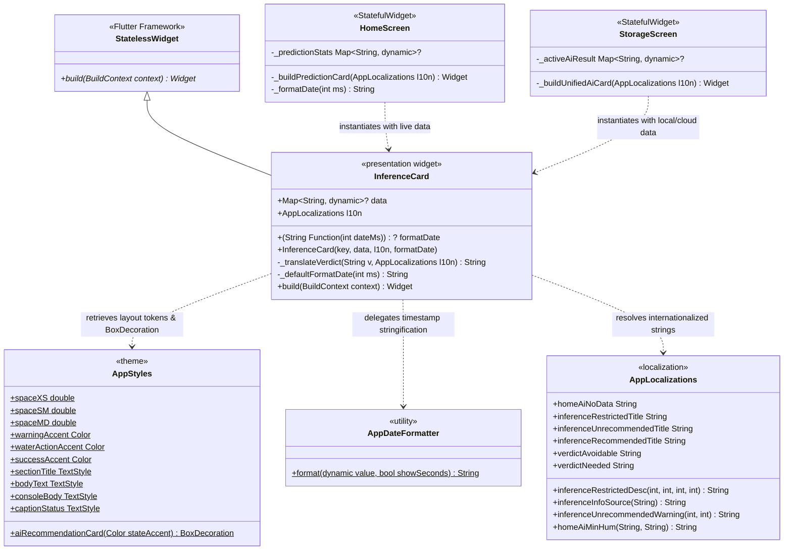
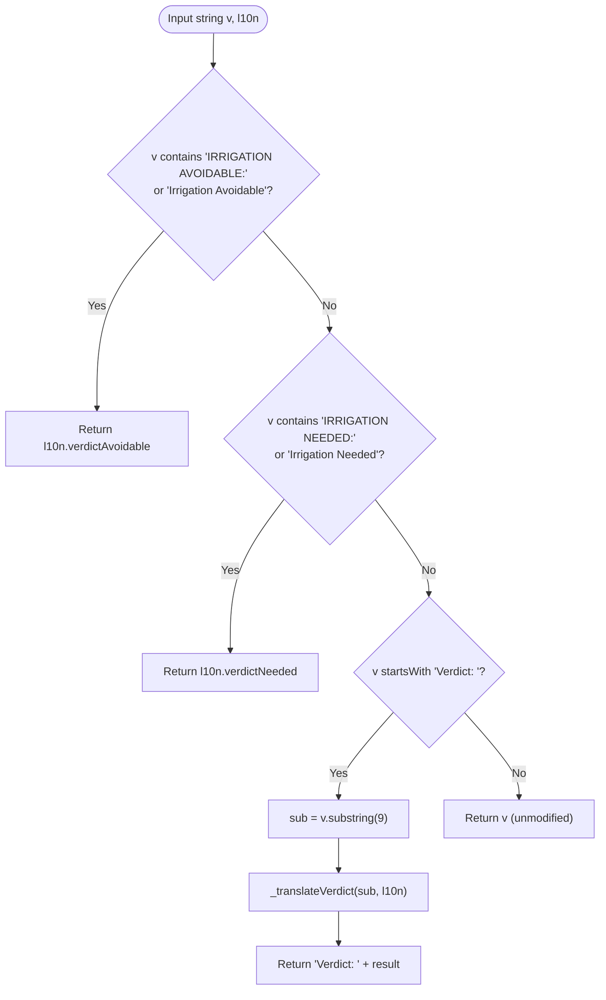
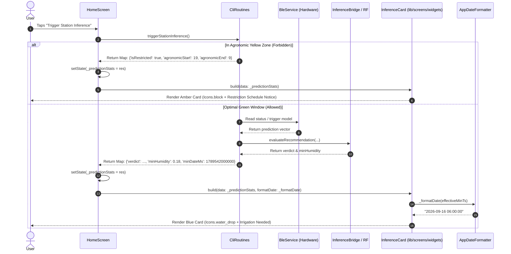
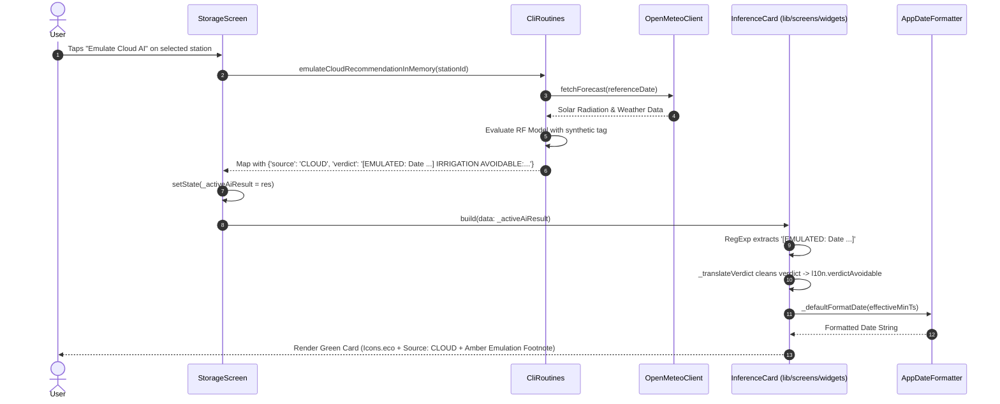

# C4 Code Architecture: `lib/screens/widgets`

This document provides code-level architecture documentation (Level 4 in the C4 model) for the shared screen widgets directory located in [`lib/screens/widgets`](file:///C:/Users/CrackoPattt88/Proyectos/tfm_app/lib/screens/widgets). It analyzes the visual presentation components, state evaluation logic, internationalization mechanics, and design token integration implemented within this module.

---

## 1. Overview Section

### 1.1 Purpose & Scope

The [`lib/screens/widgets`](file:///C:/Users/CrackoPattt88/Proyectos/tfm_app/lib/screens/widgets) directory serves as a presentation-layer sub-package dedicated to modular, high-cohesion, reusable UI widgets shared across top-level application screens.

At this level of the architecture, the primary component housed within this directory is [`InferenceCard`](file:///C:/Users/CrackoPattt88/Proyectos/tfm_app/lib/screens/widgets/inference_card.dart#L6-L218) in [`inference_card.dart`](file:///C:/Users/CrackoPattt88/Proyectos/tfm_app/lib/screens/widgets/inference_card.dart). This widget encapsulates:
- The visual rendering of machine learning (ML) agronomic inference outcomes produced by on-device edge hardware (Raspberry Pi Pico firmware via BLE), local off-device model pipelines (Dart-native Random Forest and LSTM engines), and cloud backend emulation routines.
- Semantic state interpretation across multiple operational conditions: missing telemetry, agronomic gathering restrictions (Yellow Zone protection), non-recommended operational windows, and definitive irrigation verdicts (Irrigation Needed vs. Irrigation Avoidable).
- Dynamic extraction and formatting of critical telemetry parameters, including minimum projected soil moisture percentages, target timestamp projections, model provenance badges, and historical emulation metadata.
- Multilingual localization support via Flutter's [`AppLocalizations`](file:///C:/Users/CrackoPattt88/Proyectos/tfm_app/lib/core/utils/l10n/app_localizations.dart).

### 1.2 Architectural Role & Boundaries

In accordance with Clean Architecture principles and Flutter UI design patterns:
- **Layer Placement**: Presentation Layer (Outer Layer). The widget interacts exclusively downward towards core styles, foundational utilities, and localization.
- **State Management**: Fully stateless (`StatelessWidget`). The component maintains zero internal mutable state and operates as a pure rendering function of its input properties (`data`, `l10n`, and optional `formatDate` callback).
- **Data Decoupling**: Rather than binding tightly to concrete database entities (`Device`, `Prediction`) or domain services, [`InferenceCard`](file:///C:/Users/CrackoPattt88/Proyectos/tfm_app/lib/screens/widgets/inference_card.dart#L6-L218) consumes a loosely-coupled `Map<String, dynamic>?` data dictionary. This enables transparent reuse across disparate telemetry pipelines (live BLE streams, cached local Isar database records, and ephemeral RAM cloud emulations).
- **Design System Adherence**: Adheres strictly to the console/industrial design system specified in [`AppStyles`](file:///C:/Users/CrackoPattt88/Proyectos/tfm_app/lib/core/theme/app_styles.dart), applying designated color tokens (`warningAccent`, `waterActionAccent`, `successAccent`, `surfaceColor`), typography (`sectionTitle`, `bodyText`, `consoleBody`, `captionStatus`), and 8dp spacing grids.

```
+-------------------------------------------------------------------------+
|                           Top-Level Screens                             |
|          HomeScreen (Live BLE)     |     StorageScreen (Local/Cloud)    |
+------------------------------------+------------------------------------+
                                     |
                                     | feeds Map<String, dynamic> data
                                     v
+-------------------------------------------------------------------------+
|                  Presentation Widgets: lib/screens/widgets              |
|                                                                         |
|   +-----------------------------------------------------------------+   |
|   |                         InferenceCard                           |   |
|   |                      (StatelessWidget)                          |   |
|   |                                                                 |   |
|   |  - Null / No-Data Fallback Render                               |   |
|   |  - Agronomic Restricted Window (Yellow Zone) State              |   |
|   |  - Unrecommended Window Warning Banner                          |   |
|   |  - Semantic Action Classification (Needed vs Avoidable)         |   |
|   |  - Emulation Tag Extraction & Substring Parsing                 |   |
|   |  - Diurnal Temporal Normalization (+24h rollover)               |   |
|   +-----------------------------------------------------------------+   |
+-------------------------------------------------------------------------+
        |                                    |                      |
        | uses tokens                        | formats timestamps   | translates
        v                                    v                      v
+-----------------------+  +--------------------+  +----------------------+
|       AppStyles       |  |  AppDateFormatter  |  |   AppLocalizations   |
|  (lib/core/theme)     |  |  (lib/core/utils)  |  |  (lib/core/utils/l10n) |
+-----------------------+  +--------------------+  +----------------------+
```

### 1.3 C4 Code Diagram

The following class diagram details the code elements inside [`lib/screens/widgets/inference_card.dart`](file:///C:/Users/CrackoPattt88/Proyectos/tfm_app/lib/screens/widgets/inference_card.dart) and their relationships to callers, styling systems, and utility formatters:



---

## 2. Code Elements Section

The [`lib/screens/widgets`](file:///C:/Users/CrackoPattt88/Proyectos/tfm_app/lib/screens/widgets) module contains the single high-impact widget file [`inference_card.dart`](file:///C:/Users/CrackoPattt88/Proyectos/tfm_app/lib/screens/widgets/inference_card.dart).

### 2.1 `InferenceCard` Class Specification

```dart
class InferenceCard extends StatelessWidget {
  final Map<String, dynamic>? data;
  final AppLocalizations l10n;
  final String Function(int dateMs)? formatDate;

  const InferenceCard({
    super.key,
    required this.data,
    required this.l10n,
    this.formatDate,
  });
...
}
```

- **File**: [`lib/screens/widgets/inference_card.dart`](file:///C:/Users/CrackoPattt88/Proyectos/tfm_app/lib/screens/widgets/inference_card.dart#L6-L218)
- **Inheritance**: Extends [`StatelessWidget`](file:///C:/Users/CrackoPattt88/Proyectos/tfm_app/lib/screens/widgets/inference_card.dart#L6).
- **Constructor**:
  - `Key? key`: Standard Flutter widget key passed to `super.key`.
  - `required Map<String, dynamic>? data`: The inference payload containing model status, prediction metrics, timestamps, and agronomic flags. May be `null`.
  - `required AppLocalizations l10n`: The active localization bundle for resolving string resources in Spanish (`es`) or English (`en`).
  - `String Function(int dateMs)? formatDate`: Optional closure injection allowing the parent screen to override or specialize epoch timestamp formatting.

### 2.2 Data Contract & Schema Specification (`data`)

The widget dynamically inspects the key-value pairs of the input `data` map. The contract supported by [`InferenceCard`](file:///C:/Users/CrackoPattt88/Proyectos/tfm_app/lib/screens/widgets/inference_card.dart#L6-L218) is summarized below:

| Key | Expected Type | Nullable | Description | Producer Source |
| :--- | :--- | :--- | :--- | :--- |
| `isRestricted` | `bool` | Yes | Indicates whether the station is in an agronomic data collection phase (Yellow Zone) where inference is forbidden to preserve BLE bandwidth. | [`CliRoutines.triggerStationInference()`](file:///C:/Users/CrackoPattt88/Proyectos/tfm_app/lib/cli_routines.dart#L401) |
| `agronomicStart` | `int` | Yes | Start hour of the optimal operational window in 24h format (defaults to `19` = 19:00 / 7 PM). | [`AppSettings.agronomicDayStart`](file:///C:/Users/CrackoPattt88/Proyectos/tfm_app/lib/core/models/app_settings.dart) |
| `agronomicEnd` | `int` | Yes | End hour of the optimal operational window in 24h format (defaults to `9` = 09:00 / 9 AM). | [`AppSettings.agronomicDayEnd`](file:///C:/Users/CrackoPattt88/Proyectos/tfm_app/lib/core/models/app_settings.dart) |
| `minHumidity` | `double` | Yes | The lowest predicted volumetric soil water content across the next 24-hour cycle ($0.0 \dots 1.0$). If `null`, triggers fallback state. | ML LSTM / RF Pipeline |
| `minDateMs` | `int` | Yes | Epoch timestamp in milliseconds when `minHumidity` is projected to occur. | ML Pipeline / BLE payload |
| `source` | `String` | Yes | Origin tag displayed in an outlined status badge (e.g. `'LOCAL'`, `'CLOUD'`). | StorageScreen / Routine handler |
| `verdict` | `String` | Yes | Raw text verdict emitted by the Random Forest classifier (e.g., `'IRRIGATION NEEDED: ...'`, `'IRRIGATION AVOIDABLE: ...'`), optionally containing an emulation prefix. Defaults to `'UNKNOWN'`. | [`InferenceBridge.evaluateRecommendation()`](file:///C:/Users/CrackoPattt88/Proyectos/tfm_app/lib/features/ml_inference/inference_engine.dart) |
| `isUnrecommended` | `bool` | Yes | Flag indicating the inference was manually forced outside the optimal agronomic window (warning mode). | StorageScreen / Agronomic calculation |

### 2.3 Internal Methods & Algorithmic Procedures

#### 2.3.1 Verdict Translation & Recursion: `_translateVerdict`

- **Declaration**: [`String _translateVerdict(String v, AppLocalizations l10n)`](file:///C:/Users/CrackoPattt88/Proyectos/tfm_app/lib/screens/widgets/inference_card.dart#L18-L30)
- **Design Intent**: Decouples the machine learning engine (which emits standardized English technical tokens) from user-facing language presentation.
- **Recursive Pattern**: If the verdict string starts with the prefix `'Verdict: '`, the method strips the initial 9 characters (`v.substring(9)`) and recursively re-invokes [`_translateVerdict`](file:///C:/Users/CrackoPattt88/Proyectos/tfm_app/lib/screens/widgets/inference_card.dart#L18-L30) on the substring, prefixing `'Verdict: '` back onto the translated localized string.
- **Matching Branches**:
  1. Contains `'IRRIGATION AVOIDABLE:'` or `'Irrigation Avoidable'` $\rightarrow$ Returns [`l10n.verdictAvoidable`](file:///C:/Users/CrackoPattt88/Proyectos/tfm_app/lib/core/utils/l10n/app_localizations.dart#L135).
  2. Contains `'IRRIGATION NEEDED:'` or `'Irrigation Needed'` $\rightarrow$ Returns [`l10n.verdictNeeded`](file:///C:/Users/CrackoPattt88/Proyectos/tfm_app/lib/core/utils/l10n/app_localizations.dart#L135).
  3. Prefix `'Verdict: '` $\rightarrow$ Recurses with `sub = v.substring(9)`.
  4. Unmatched string $\rightarrow$ Returns raw string `v` as an idempotent fallback.



#### 2.3.2 Default Date Formatting: `_defaultFormatDate`

- **Declaration**: [`String _defaultFormatDate(int ms)`](file:///C:/Users/CrackoPattt88/Proyectos/tfm_app/lib/screens/widgets/inference_card.dart#L32-L34)
- **Implementation**: Invokes [`AppDateFormatter.format(ms, showSeconds: true)`](file:///C:/Users/CrackoPattt88/Proyectos/tfm_app/lib/core/utils/date_formatter.dart#L4-L30).
- **Execution**: Invoked only when the caller did not supply a custom `formatDate` callback function in the constructor.

#### 2.3.3 Emulation Watermark Extraction via Regular Expression

- **Declaration & Execution**: [`inference_card.dart#L120-L123`](file:///C:/Users/CrackoPattt88/Proyectos/tfm_app/lib/screens/widgets/inference_card.dart#L120-L123)
- **Regex Pattern**: `RegExp(r'\[EMULATED: Date (.*?)\]')`
- **Mechanism**:
  - When cloud emulation runs against historical telemetry, the engine embeds provenance metadata directly into the verdict string (e.g. `"[EMULATED: Date 2024-05-12 14:00:00] IRRIGATION AVOIDABLE: ..."`).
  - The card searches for this pattern using `firstMatch(verdict)`.
  - If detected (`isEmulated == true`), the tag is extracted into `emuText` and cleanly excised from `cleanVerdict` using `verdict.replaceAll(emuText, '').trim()`.
  - The cleaned verdict is localized and displayed in 18pt typography, while `emuText` is relegated to a secondary amber footnote span (14pt) inside the [`RichText`](file:///C:/Users/CrackoPattt88/Proyectos/tfm_app/lib/screens/widgets/inference_card.dart#L185-L197) element.

#### 2.3.4 Diurnal Temporal Normalization (+24h Rollover)

- **Declaration & Execution**: [`inference_card.dart#L133-L140`](file:///C:/Users/CrackoPattt88/Proyectos/tfm_app/lib/screens/widgets/inference_card.dart#L133-L140)
- **Problem Solved**: Daily ML models project soil moisture across a 24-hour cycle. If the projected minimum hour occurred earlier on the same calendar day as the current user execution time ($dt.day == now.day$), displaying today's date would imply a historical minimum rather than the next actionable irrigation event.
- **Algorithm**:
  ```dart
  int? effectiveMinTs = minTs;
  if (effectiveMinTs != null) {
    final now = DateTime.now();
    final dt = DateTime.fromMillisecondsSinceEpoch(effectiveMinTs);
    if (dt.day == now.day && dt.month == now.month && dt.year == now.year) {
      effectiveMinTs += 86400000; // Shift forward exactly 24 hours (86,400,000 ms)
    }
  }
  ```

---

### 2.4 Visual State Machine & Widget Tree Hierarchy

[`InferenceCard.build()`](file:///C:/Users/CrackoPattt88/Proyectos/tfm_app/lib/screens/widgets/inference_card.dart#L36-L217) functions as a deterministic state machine yielding four distinct visual card representations:

```mermaid
flowchart TD
    In([build Context]) --> CheckNull{data == null?}
    CheckNull -- Yes --> StateNull["<b>State 1: No Data Placeholder</b><br/>Grey Card | Icons.help_outline<br/>Text: l10n.homeAiNoData"]
    
    CheckNull -- No --> CheckRestricted{data['isRestricted'] == true?}
    CheckRestricted -- Yes --> StateRestricted["<b>State 2: Agronomic Restricted (Yellow Zone)</b><br/>Amber Card | Icons.block<br/>Title: l10n.inferenceRestrictedTitle<br/>Desc: l10n.inferenceRestrictedDesc(...)"]
    
    CheckRestricted -- No --> CheckMinHum{data['minHumidity'] == null?}
    CheckMinHum -- Yes --> StateMinHum["<b>State 3: Incomplete Telemetry Fallback</b><br/>Grey Card | Icons.help_outline<br/>Text: l10n.homeAiNoData"]
    
    CheckMinHum -- No --> EvalVerdict["Parse Emulation & Classify Verdict<br/>isUnrecommended, isIrrigate"]
    
    EvalVerdict --> BranchColor{Visual Branch}
    BranchColor -- isUnrecommended == true --> StateUnrec["<b>State 4: Unrecommended Execution</b><br/>Amber Card | Icons.warning_amber_rounded<br/>Title: l10n.inferenceUnrecommendedTitle<br/>Warning: l10n.inferenceUnrecommendedWarning(...)"]
    BranchColor -- isIrrigate == true --> StateIrrig["<b>State 5: Irrigation Needed</b><br/>Blue Card (waterActionAccent) | Icons.water_drop<br/>Title: l10n.inferenceRecommendedTitle"]
    BranchColor -- isIrrigate == false --> StateAvoid["<b>State 6: Irrigation Avoidable</b><br/>Green Card (successAccent) | Icons.eco<br/>Title: l10n.inferenceRecommendedTitle"]
```

#### 2.4.1 Component Tree Hierarchy (Full Recommendation State)

When rendering a populated recommendation (States 4, 5, or 6), the resulting Flutter widget hierarchy is constructed as follows:

```
Container (margin: top 16dp, padding: 16dp, decoration: AppStyles.aiRecommendationCard(cardColor))
 └── Column (crossAxisAlignment: CrossAxisAlignment.start)
      ├── Row (Header Row)
      │    ├── Icon (icon: Icons.warning_amber_rounded | Icons.water_drop | Icons.eco, size: 28)
      │    ├── SizedBox (width: 8dp)
      │    ├── Expanded
      │    │    └── Text (isUnrecommended ? l10n.inferenceUnrecommendedTitle : l10n.inferenceRecommendedTitle)
      │    └── [Conditional] Container (Source Badge if data['source'] != null)
      │         └── Text (l10n.inferenceInfoSource(source))
      ├── [Conditional] SizedBox (height: 4dp)
      ├── [Conditional] Text (l10n.inferenceUnrecommendedWarning(startH, endH))
      ├── SizedBox (height: 8dp)
      ├── RichText (Verdict Display)
      │    └── TextSpan (style: fontSize 18, color: cardColor)
      │         ├── TextSpan (text: _translateVerdict(cleanVerdict, l10n))
      │         └── [Conditional] TextSpan (text: '\n$emuText', color: warningAccent, fontSize 14)
      ├── SizedBox (height: 8dp)
      ├── Divider (color: cardColor with alpha 0.3)
      ├── SizedBox (height: 8dp)
      └── [Conditional] Row (Minimum Projected Humidity Row)
           ├── Icon (Icons.show_chart, size: 16, color: cardColor with alpha 0.7)
           ├── SizedBox (width: 8dp)
           └── Expanded
                └── Text (l10n.homeAiMinHum(minHum%, dateStr), style: monospace consoleBody)
```

---

## 3. Dependencies Section

### 3.1 Dependency Matrix

| Component / File | Inbound Callers | Outbound Dependencies | Third-Party Packages |
| :--- | :--- | :--- | :--- |
| [`inference_card.dart`](file:///C:/Users/CrackoPattt88/Proyectos/tfm_app/lib/screens/widgets/inference_card.dart) | [`HomeScreen`](file:///C:/Users/CrackoPattt88/Proyectos/tfm_app/lib/screens/home_screen.dart#L321)<br/>[`StorageScreen`](file:///C:/Users/CrackoPattt88/Proyectos/tfm_app/lib/screens/storage_screen.dart#L511) | [`AppStyles`](file:///C:/Users/CrackoPattt88/Proyectos/tfm_app/lib/core/theme/app_styles.dart)<br/>[`AppDateFormatter`](file:///C:/Users/CrackoPattt88/Proyectos/tfm_app/lib/core/utils/date_formatter.dart)<br/>[`AppLocalizations`](file:///C:/Users/CrackoPattt88/Proyectos/tfm_app/lib/core/utils/l10n/app_localizations.dart) | `package:flutter/material.dart` |

### 3.2 Inbound Call Sites Analysis

#### 3.2.1 `HomeScreen` Call Site

- **File**: [`lib/screens/home_screen.dart`](file:///C:/Users/CrackoPattt88/Proyectos/tfm_app/lib/screens/home_screen.dart#L320-L326)
- **Context**: The `HomeScreen` acts as the primary dashboard during live Bluetooth Low Energy (BLE) connection with an agronomic station.
- **Invocation Code**:
  ```dart
  Widget _buildPredictionCard(AppLocalizations l10n) {
    return InferenceCard(
      data: _predictionStats,
      l10n: l10n,
      formatDate: _formatDate,
    );
  }
  ```
- **Data Provenance**:
  - `_predictionStats` is updated inside `_executeAction('triggerStationInference', ...)` ([`home_screen.dart#L214-L220`](file:///C:/Users/CrackoPattt88/Proyectos/tfm_app/lib/screens/home_screen.dart#L214-L220)).
  - Receives the return map from [`CliRoutines.triggerStationInference()`](file:///C:/Users/CrackoPattt88/Proyectos/tfm_app/lib/cli_routines.dart#L376-L411), which contains either the yellow-zone restricted dictionary (`'isRestricted': true`) or the full telemetry inference results.
- **Custom Formatter**: Injects `formatDate: _formatDate`, which delegates to [`AppDateFormatter.format(ms, showSeconds: true)`](file:///C:/Users/CrackoPattt88/Proyectos/tfm_app/lib/core/utils/date_formatter.dart#L4).

#### 3.2.2 `StorageScreen` Call Site

- **File**: [`lib/screens/storage_screen.dart`](file:///C:/Users/CrackoPattt88/Proyectos/tfm_app/lib/screens/storage_screen.dart#L510-L515)
- **Context**: The `StorageScreen` provides offline database inspection, station synchronization, and cloud emulation review.
- **Invocation Code**:
  ```dart
  Widget _buildUnifiedAiCard(AppLocalizations l10n) {
    return InferenceCard(
      data: _activeAiResult,
      l10n: l10n,
    );
  }
  ```
- **Data Provenance**:
  - `_activeAiResult` is updated in two scenarios:
    1. **Local DB Inference** ([`storage_screen.dart#L275-L286`](file:///C:/Users/CrackoPattt88/Proyectos/tfm_app/lib/screens/storage_screen.dart#L275-L286)): Populated with `'source': 'LOCAL'`, using offline Isar database prediction vectors.
    2. **Cloud RAM Emulation** ([`storage_screen.dart#L319-L330`](file:///C:/Users/CrackoPattt88/Proyectos/tfm_app/lib/screens/storage_screen.dart#L319-L330)): Populated with `'source': 'CLOUD'`, executing pure in-memory Random Forest evaluation with Open-Meteo weather integration.
  - Reset to `null` on station deselect or database wipe ([`storage_screen.dart#L150`](file:///C:/Users/CrackoPattt88/Proyectos/tfm_app/lib/screens/storage_screen.dart#L150), [`#L361`](file:///C:/Users/CrackoPattt88/Proyectos/tfm_app/lib/screens/storage_screen.dart#L361)).
- **Custom Formatter**: Omits `formatDate`, allowing the widget to exercise its internal `_defaultFormatDate` path.

### 3.3 Outbound Dependencies & Layer Isolation

- **Flutter Material SDK**: Leverages core layout primitives (`Container`, `Row`, `Column`, `Expanded`, `RichText`, `TextSpan`, `Divider`) and icons (`Icons.help_outline`, `Icons.block`, `Icons.warning_amber_rounded`, `Icons.water_drop`, `Icons.eco`, `Icons.show_chart`).
- **[`AppStyles`](file:///C:/Users/CrackoPattt88/Proyectos/tfm_app/lib/core/theme/app_styles.dart)**:
  - Consumes `AppStyles.aiRecommendationCard(Color)` ([`app_styles.dart#L63-L68`](file:///C:/Users/CrackoPattt88/Proyectos/tfm_app/lib/core/theme/app_styles.dart#L63-L68)) which creates a specialized `BoxDecoration` with a $10\%$ opacity fill (`withValues(alpha: 0.1)`) and a 2.0dp border in the semantic state color.
  - Consumes spacing constants (`spaceXS` = 4.0, `spaceSM` = 8.0, `spaceMD` = 16.0).
  - Consumes typography contracts (`sectionTitle`, `bodyText`, `consoleBody`, `captionStatus`).
- **[`AppDateFormatter`](file:///C:/Users/CrackoPattt88/Proyectos/tfm_app/lib/core/utils/date_formatter.dart)**:
  - Calls `AppDateFormatter.format(ms, showSeconds: true)` for zero-padded ISO-like date string formatting without third-party dependencies.
- **[`AppLocalizations`](file:///C:/Users/CrackoPattt88/Proyectos/tfm_app/lib/core/utils/l10n/app_localizations.dart)**:
  - References 10 separate localized keys to provide complete Spanish and English coverage across all card states.
- **Zero Framework Leakage**: Does NOT import or depend on Bluetooth libraries (`flutter_blue_plus`), database ORMs (`isar`), HTTP clients, or machine learning math packages.

---

## 4. Relationships Section

### 4.1 Invocation & Execution Flows

#### 4.1.1 Live BLE Station Inference Flow (`HomeScreen`)

The sequence diagram below traces data generation on edge hardware through to presentation in [`InferenceCard`](file:///C:/Users/CrackoPattt88/Proyectos/tfm_app/lib/screens/widgets/inference_card.dart#L6-L218):



#### 4.1.2 Offline Local DB & Cloud Emulation Flow (`StorageScreen`)

This sequence diagram depicts how historical records and cloud-emulated forecasts are routed into [`InferenceCard`](file:///C:/Users/CrackoPattt88/Proyectos/tfm_app/lib/screens/widgets/inference_card.dart#L6-L218):



---

### 4.2 Architectural Design Decisions & Trade-Offs

#### 4.2.1 Pure `StatelessWidget` vs. State-Bearing Widget

- **Decision**: [`InferenceCard`](file:///C:/Users/CrackoPattt88/Proyectos/tfm_app/lib/screens/widgets/inference_card.dart#L6-L218) is implemented as an immutable `StatelessWidget`.
- **Rationale**:
  - Eliminates synchronization discrepancies between parent screen states and the presentation card.
  - When switching stations in [`StorageScreen`](file:///C:/Users/CrackoPattt88/Proyectos/tfm_app/lib/screens/storage_screen.dart) or receiving new asynchronous telemetry chunks in [`HomeScreen`](file:///C:/Users/CrackoPattt88/Proyectos/tfm_app/lib/screens/home_screen.dart), Flutter immediately repaints the card with zero residual state.
  - Simplifies testing and enables aggressive compile-time optimizations.

#### 4.2.2 Dynamic Map Schema vs. Strongly Typed Model Class

- **Decision**: Consumes `Map<String, dynamic>? data` rather than a typed `InferenceResult` domain class.
- **Trade-Off Analysis**:

| Factor | Typed Domain Entity (e.g. `InferenceResult`) | Dynamic Map Contract (`Map<String, dynamic>?`) [Adopted] |
| :--- | :--- | :--- |
| **Type Safety** | Compile-time validation of fields. | Runtime key checking and dynamic type casts. |
| **Pipeline Coupling** | High. Any change to BLE JSON, database DTO, or cloud API requires domain model updates and adapters. | Minimal. Decouples the presentation card from heterogeneous upstream producers. |
| **Heterogeneous Sources** | Requires converting BLE hardware responses, local Isar queries, and RAM emulation objects into identical domain models. | Directly accepts the lightweight maps returned by [`CliRoutines`](file:///C:/Users/CrackoPattt88/Proyectos/tfm_app/lib/cli_routines.dart). |
| **Null Safety / Resiliency** | If a mandatory field is missing in deserialization, the entire model throws an exception. | Defensive fallbacks handle missing keys gracefully (`?? 'UNKNOWN'`, `?? 19`, null checks). |

#### 4.2.3 Regular Expression Extraction for Historical Emulation Watermarks

- **Decision**: Uses regex parsing `RegExp(r'\[EMULATED: Date (.*?)\]')` on the verdict string rather than requiring a dedicated metadata field.
- **Rationale**:
  - Preserves backward compatibility with legacy firmware and cloud endpoints where verdict strings bundle debug watermarks into a single textual payload.
  - Separates the core actionable instruction (which needs prominent typography and localization) from diagnostic auditing metadata without polluting domain models.

#### 4.2.4 Injected Function Callback vs. Hardcoded Static Formatter

- **Decision**: Provides an optional constructor callback `final String Function(int dateMs)? formatDate;` falling back to `_defaultFormatDate` ([`inference_card.dart#L9`](file:///C:/Users/CrackoPattt88/Proyectos/tfm_app/lib/screens/widgets/inference_card.dart#L9), [`#L32-L34`](file:///C:/Users/CrackoPattt88/Proyectos/tfm_app/lib/screens/widgets/inference_card.dart#L32-L34)).
- **Rationale**:
  - In [`HomeScreen`](file:///C:/Users/CrackoPattt88/Proyectos/tfm_app/lib/screens/home_screen.dart#L324), allows formatting logic to be synchronized with the screen's relative time tickers or custom presentation requirements.
  - In [`StorageScreen`](file:///C:/Users/CrackoPattt88/Proyectos/tfm_app/lib/screens/storage_screen.dart#L511-L514), callers can omit the parameter and rely on the card's standardized default behavior, minimizing boilerplate.

#### 4.2.5 Industrial UI Design Compliance (`AppStyles.aiRecommendationCard`)

- **Decision**: Employs `AppStyles.aiRecommendationCard(cardColor)` ([`inference_card.dart#L42`](file:///C:/Users/CrackoPattt88/Proyectos/tfm_app/lib/screens/widgets/inference_card.dart#L42), [`#L65`](file:///C:/Users/CrackoPattt88/Proyectos/tfm_app/lib/screens/widgets/inference_card.dart#L65), [`#L96`](file:///C:/Users/CrackoPattt88/Proyectos/tfm_app/lib/screens/widgets/inference_card.dart#L96), [`#L149`](file:///C:/Users/CrackoPattt88/Proyectos/tfm_app/lib/screens/widgets/inference_card.dart#L149)) across all rendered states.
- **Rationale**:
  - Enforces uniform visual rhythm: 8.0dp corner radius, 2.0dp border accent, and a subtle $10\%$ tint fill.
  - Conveys operational severity through color semantics:
    - **Amber (`warningAccent`)**: Cautionary states (agronomic gathering restriction or unrecommended execution window).
    - **Blue (`waterActionAccent`)**: Urgent physical intervention required (irrigation needed).
    - **Green (`successAccent`)**: Normal agronomic stability (irrigation avoidable).
    - **Grey (`Colors.grey`)**: Neutral missing data.
