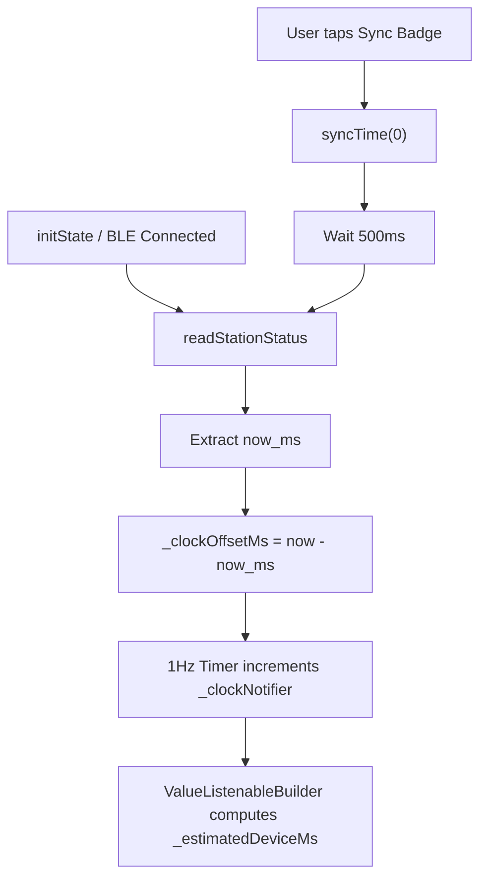
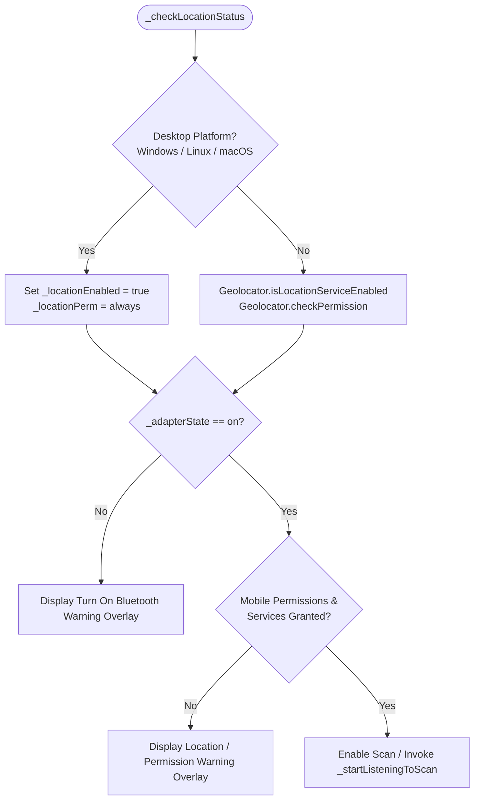
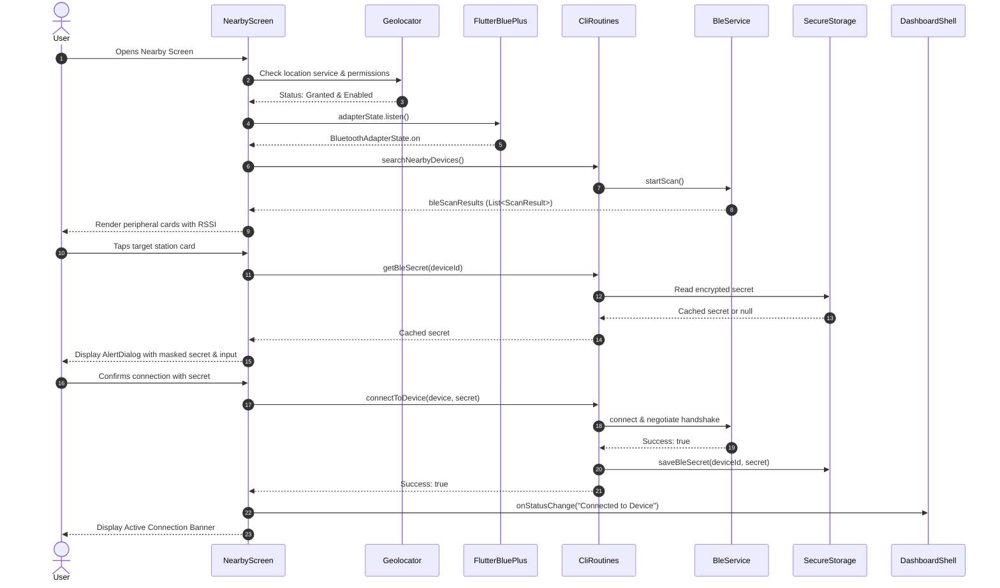
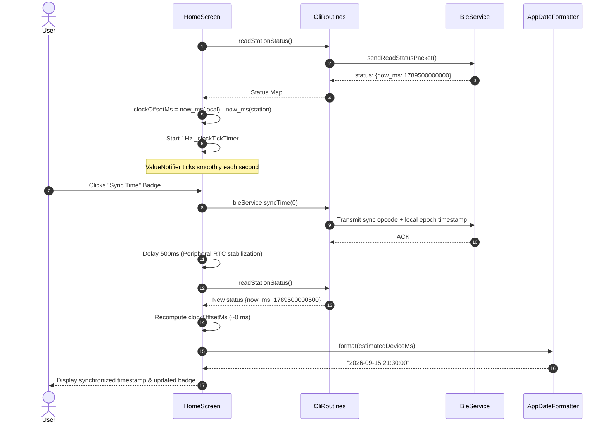
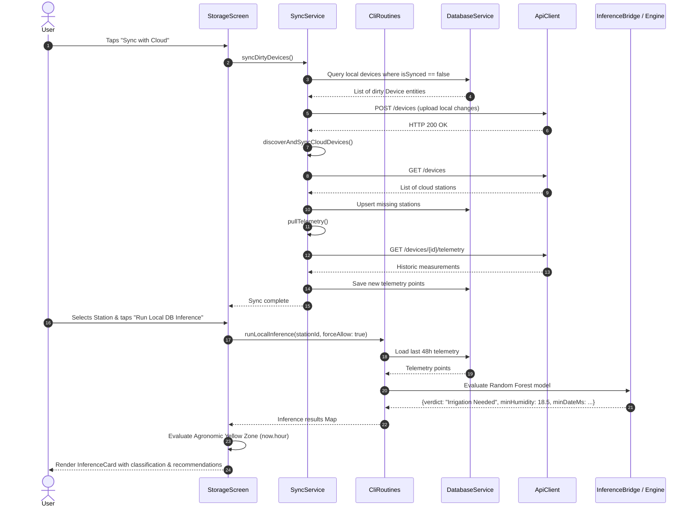

# C4 Code Architecture: `lib/screens`

This document provides code-level architecture documentation (Level 4 in the C4 model) for the primary screen views located in [`lib/screens`](file:///C:/Users/CrackoPattt88/Proyectos/tfm_app/lib/screens). Per architectural specification, this document focuses exclusively on the foundational screen views and modals within this directory and excludes the reusable presentation widgets located in [`lib/screens/widgets`](file:///C:/Users/CrackoPattt88/Proyectos/tfm_app/lib/screens/widgets) (such as [`InferenceCard`](file:///C:/Users/CrackoPattt88/Proyectos/tfm_app/lib/screens/widgets/inference_card.dart)), which are documented separately.

---

## 1. Overview Section

### 1.1 Purpose & Scope

The [`lib/screens`](file:///C:/Users/CrackoPattt88/Proyectos/tfm_app/lib/screens) module houses the top-level screen containers of the application presentation layer. These screens serve as the primary user-facing views rendered within the navigation shell ([`DashboardShell`](file:///C:/Users/CrackoPattt88/Proyectos/tfm_app/lib/main.dart#L38-L227)). Each screen coordinates view-specific lifecycle events, manages local UI state, binds asynchronous hardware/network streams, and delegates domain orchestration and hardware communication to the central facade ([`CliRoutines`](file:///C:/Users/CrackoPattt88/Proyectos/tfm_app/lib/cli_routines.dart#L22-L918)).

The four primary screens implemented directly in this directory are:

1. [`HomeScreen`](file:///C:/Users/CrackoPattt88/Proyectos/tfm_app/lib/screens/home_screen.dart#L15-L27) ([`home_screen.dart`](file:///C:/Users/CrackoPattt88/Proyectos/tfm_app/lib/screens/home_screen.dart)):
   - Live telemetry monitoring and device status display.
   - Smooth local clock estimation and real-time clock (RTC) synchronization with connected microcontrollers (Raspberry Pi Pico W / ESP32).
   - On-demand BLE station commands: status interrogation, telemetry batch downloading, and station-side ML inference execution.
   - Diagnostics and debug injection panel (artificial moisture alteration, synthetic sensor mocks, flash memory wiping).
   - Interactive diagnostic console terminal with clipboard export and JSON document serialization.

2. [`NearbyScreen`](file:///C:/Users/CrackoPattt88/Proyectos/tfm_app/lib/screens/nearby_screen.dart#L10-L24) ([`nearby_screen.dart`](file:///C:/Users/CrackoPattt88/Proyectos/tfm_app/lib/screens/nearby_screen.dart)):
   - Bluetooth Low Energy (BLE) peripheral scanning, discovery, and RSSI tracking.
   - Cross-platform hardware and permission orchestration (adaptive handling distinguishing desktop environments—Windows, Linux, macOS—from mobile Android/iOS environments requiring location services).
   - Interactive security pairing dialog with password obscurity controls and credential caching via secure storage.
   - Connection lifecycle management and active session indicators.

3. [`StorageScreen`](file:///C:/Users/CrackoPattt88/Proyectos/tfm_app/lib/screens/storage_screen.dart#L53-L67) ([`storage_screen.dart`](file:///C:/Users/CrackoPattt88/Proyectos/tfm_app/lib/screens/storage_screen.dart)):
   - Unified station aggregation merging local database records ([`Device`](file:///C:/Users/CrackoPattt88/Proyectos/tfm_app/lib/core/models/device.dart)) with remote cloud registry devices into [`UnifiedStation`](file:///C:/Users/CrackoPattt88/Proyectos/tfm_app/lib/screens/storage_screen.dart#L14-L50) entities.
   - Cloud synchronization pipeline via [`SyncService`](file:///C:/Users/CrackoPattt88/Proyectos/tfm_app/lib/core/database/db_sync.dart) (dirty device uploading, cloud device discovery, and telemetry extraction).
   - Dual-path ML inference execution: on-device Random Forest inference against cached SQLite telemetry vs. backend cloud recommendation emulation.
   - Agronomic "yellow zone" decision evaluation based on diurnal time windows.
   - Interactive geospatial mapping modal powered by OpenStreetMap (`flutter_map`).

4. [`ConfigScreen`](file:///C:/Users/CrackoPattt88/Proyectos/tfm_app/lib/screens/config_screen.dart#L13-L27) & [`MlModelManagerSheet`](file:///C:/Users/CrackoPattt88/Proyectos/tfm_app/lib/screens/config_screen.dart#L894-L900) ([`config_screen.dart`](file:///C:/Users/CrackoPattt88/Proyectos/tfm_app/lib/screens/config_screen.dart)):
   - Application configuration: system clock monitoring, location selection (GPS auto-detection via `Geolocator` or interactive manual geocoding via map picker).
   - Network endpoint management: Open-Meteo weather API verification, cloud server REST URL/port parsing, ping latency testing, and secure API key management.
   - Agronomic schedule constraints engine: circular modulo-24 arithmetic governing the valid operational windows for prediction and irrigation.
   - Dynamic Machine Learning model catalog management: browsing, downloading, switching active models, and removing crop-specific Random Forest models.

---

### 1.2 Architectural Role & Boundaries

In accordance with Clean Architecture and Flutter presentation layer design:
- **Layer Placement**: Presentation Layer (Screens / Views).
- **Navigation Ingestion**: Instantiated and switched within [`DashboardShell`](file:///C:/Users/CrackoPattt88/Proyectos/tfm_app/lib/main.dart#L38-L227) via `NavigationRail` (desktop/tablet) or `BottomNavigationBar` (mobile/web).
- **Domain Decoupling**: Screens do not directly manipulate raw database queries or direct BLE sockets. Instead, all interaction with services (BLE, SQLite, REST API, ML Inference, Weather) is routed through the [`CliRoutines`](file:///C:/Users/CrackoPattt88/Proyectos/tfm_app/lib/cli_routines.dart#L22-L918) facade.
- **Visual Design & Localization**: Screens consume styling from [`AppStyles`](file:///C:/Users/CrackoPattt88/Proyectos/tfm_app/lib/core/theme/app_styles.dart) and internationalized strings from [`AppLocalizations`](file:///C:/Users/CrackoPattt88/Proyectos/tfm_app/lib/core/utils/l10n/app_localizations.dart).
- **Reusable Components**: Specialized diagnostic cards, such as [`InferenceCard`](file:///C:/Users/CrackoPattt88/Proyectos/tfm_app/lib/screens/widgets/inference_card.dart), are embedded by composition.

```
+---------------------------------------------------------------------------------------+
|                                    MAIN ENTRYPOINT                                    |
|                                     DashboardShell                                    |
+---------------------------------------------------------------------------------------+
                                           |
                   +-----------------------+-----------------------+
                   |                       |                       |
                   v                       v                       v
+----------------------+ +-----------------------+ +----------------------+ +----------------------+
|     HomeScreen       | |     NearbyScreen      | |    StorageScreen     | |    ConfigScreen      |
|  - Telemetry Monitor | |  - BLE Discovery      | |  - Unified Station   | |  - Sys & Env Config  |
|  - Clock Drift Sync  | |  - Auth & Pairing     | |  - Cloud Sync Pipe   | |  - API & Net Checks  |
|  - Console Log Term  | |  - Permission Guard   | |  - Local/Cloud ML    | |  - Modulo-24 Engine  |
|  - Debug Injections  | |  - Lifecycle Listener | |  - OpenStreetMap View| |  - ML Model Manager  |
+----------------------+ +-----------------------+ +----------------------+ +----------------------+
                   \                       |                       /                  /
                    \                      |                      /                  /
                     v                     v                     v                  v
+---------------------------------------------------------------------------------------+
|                                 APPLICATION FACADE                                    |
|                                    CliRoutines                                        |
|  +-------------------+  +--------------------+  +------------------+  +-------------+ |
|  |    BleService     |  |  DatabaseService   |  |     ApiClient    |  | ML Engine & | |
|  |  (FlutterBluePlus)|  |   (SQLite / Isar)  |  |  (REST Client)   |  | Open-Meteo  | |
|  +-------------------+  +--------------------+  +------------------+  +-------------+ |
+---------------------------------------------------------------------------------------+
```

---

### 1.3 C4 Code Diagram

The following diagram illustrates the classes, models, and dependencies comprising the `lib/screens` directory:

```mermaid
classDiagram
    direction TB

    class DashboardShell {
        <<StatefulWidget>>
        -int _selectedIndex
        -String _statusMsg
        -_buildCurrentScreen() Widget
    }

    class HomeScreen {
        <<StatefulWidget>>
        +CliRoutines routines
        +Function(String) onStatusChange
        +createState() _HomeScreenState
    }

    class _HomeScreenState {
        <<State>>
        -String? _consoleOutput
        -StreamSubscription _dataSub
        -int? _clockOffsetMs
        -Timer? _clockTickTimer
        -ValueNotifier~int~ _clockNotifier
        -Map~String, dynamic~? _predictionStats
        -_copyConsoleToClipboard() void
        -_downloadConsoleJson() Future~void~
        -_fetchDeviceStatus() Future~void~
        -_handleSyncTime() Future~void~
        -_executeAction(String, Function) Future~void~
        -_buildDebugPanel(AppLocalizations) Widget
    }

    class NearbyScreen {
        <<StatefulWidget>>
        +CliRoutines routines
        +VoidCallback onBack
        +Function(String) onStatusChange
        +createState() _NearbyScreenState
    }

    class _NearbyScreenState {
        <<State, WidgetsBindingObserver>>
        -List~ScanResult~ _devices
        -bool _isConnecting
        -BluetoothAdapterState _adapterState
        -bool _locationEnabled
        -LocationPermission _locationPerm
        -_checkLocationStatus() Future~void~
        -_startListeningToScan() void
        -_promptConnection(ScanResult) Future~void~
        -_attemptConnection(BluetoothDevice, String, String) Future~void~
        -_getRequirementOverlay(AppLocalizations) Widget?
    }

    class StorageScreen {
        <<StatefulWidget>>
        +CliRoutines routines
        +VoidCallback onBack
        +Function(String) onStatusChange
        +createState() _StorageScreenState
    }

    class _StorageScreenState {
        <<State>>
        -List~UnifiedStation~ _stations
        -int? _selectedIndex
        -String _cloudConnStatus
        -Map~String, dynamic~? _activeAiResult
        -_loadUnifiedData() Future~void~
        -_testCloudConnection() Future~void~
        -_handleSync() Future~void~
        -_handleLocalInference(UnifiedStation) Future~void~
        -_handleCloudEmulation(UnifiedStation) Future~void~
        -_openMapViewerDialog(UnifiedStation) void
    }

    class UnifiedStation {
        <<Data Model / Adapter>>
        +String id
        +String name
        +Device? localDevice
        +Map~String, dynamic~? cloudDevice
        +bool hasLocal
        +bool hasCloud
        +bool isSynced
        +double? latitude
        +double? longitude
    }

    class ConfigScreen {
        <<StatefulWidget>>
        +CliRoutines routines
        +VoidCallback onBack
        +Function(String) onStatusChange
        +createState() _ConfigScreenState
    }

    class _ConfigScreenState {
        <<State>>
        -String _cloudScheme
        -String _cloudUrl
        -int _cloudPort
        -String _cloudApiKey
        -int _agronomicDayStart
        -int _agronomicDayEnd
        -_handleAutoGpsLocation() Future~void~
        -_openMapPickerDialog() Future~void~
        -_adjustDayStart(int) void
        -_adjustDayEnd(int) void
        -_checkOpenMeteo() Future~void~
        -_checkCloudPing() Future~void~
        -_saveConfiguration() void
        -_showMlModelManager() void
    }

    class MlModelManagerSheet {
        <<StatefulWidget>>
        +CliRoutines routines
        +createState() _MlModelManagerSheetState
    }

    class _MlModelManagerSheetState {
        <<State>>
        -List~Map~String, dynamic~~ _cloudModels
        -List~RfModel~ _localModels
        -Set~String~ _processingIds
        -_fetchData() Future~void~
        -_handleDownload(Map) Future~void~
        -_handleSetActive(String) void
        -_handleDelete(String, String) void
    }

    class CliRoutines {
        <<Facade>>
        +BleService bleService
        +DatabaseService db
        +ApiClient cloudApi
        +InferenceBridge inferenceBridge
    }

    class InferenceCard {
        <<StatelessWidget>>
        +Map~String, dynamic~? data
    }

    class AppDateFormatter {
        <<utility>>
        +format(dynamic, {bool showSeconds})$ String
    }

    DashboardShell --> HomeScreen : instantiates
    DashboardShell --> NearbyScreen : instantiates
    DashboardShell --> StorageScreen : instantiates
    DashboardShell --> ConfigScreen : instantiates

    HomeScreen ..> _HomeScreenState : creates
    _HomeScreenState --> CliRoutines : invokes commands
    _HomeScreenState ..> AppDateFormatter : formats timestamps
    _HomeScreenState --> InferenceCard : renders inference

    NearbyScreen ..> _NearbyScreenState : creates
    _NearbyScreenState --> CliRoutines : scans & connects

    StorageScreen ..> _StorageScreenState : creates
    _StorageScreenState *-- UnifiedStation : manages list
    _StorageScreenState --> CliRoutines : queries DB & Cloud
    _StorageScreenState --> InferenceCard : renders inference

    ConfigScreen ..> _ConfigScreenState : creates
    _ConfigScreenState --> CliRoutines : updates settings
    _ConfigScreenState ..> AppDateFormatter : formats time
    _ConfigScreenState ..> MlModelManagerSheet : opens modal
    MlModelManagerSheet ..> _MlModelManagerSheetState : creates
    _MlModelManagerSheetState --> CliRoutines : manages ML models
```

---

## 2. Code Elements Section

### 2.1 `HomeScreen` (`lib/screens/home_screen.dart`)

The [`HomeScreen`](file:///C:/Users/CrackoPattt88/Proyectos/tfm_app/lib/screens/home_screen.dart#L15-L27) widget manages operational interaction with an actively connected IoT station over BLE.

```dart
class HomeScreen extends StatefulWidget {
  final CliRoutines routines;
  final Function(String) onStatusChange;
  const HomeScreen({super.key, required this.routines, required this.onStatusChange});
  @override
  State<HomeScreen> createState() => _HomeScreenState();
}
```

- **File**: [`lib/screens/home_screen.dart`](file:///C:/Users/CrackoPattt88/Proyectos/tfm_app/lib/screens/home_screen.dart#L15-L518)
- **Primary Class**: [`HomeScreen`](file:///C:/Users/CrackoPattt88/Proyectos/tfm_app/lib/screens/home_screen.dart#L15-L27)
- **State Class**: [`_HomeScreenState`](file:///C:/Users/CrackoPattt88/Proyectos/tfm_app/lib/screens/home_screen.dart#L29-L518)

#### 2.1.1 Key State Variables & Controllers

| Variable | Type | Description |
| :--- | :--- | :--- |
| `_consoleOutput` | `String?` | Buffer storing raw or formatted string output received from asynchronous BLE transmissions or routine executions. |
| `_dataSub` | `StreamSubscription<Object>?` | Listens to incoming BLE packets on `widget.routines.bleService.dataStream`. |
| `_clockOffsetMs` | `int?` | Delta in milliseconds between local device epoch time and station RTC time (`fetchTimeMs - deviceNowMs`). |
| `_clockTickTimer` | `Timer?` | 1-second periodic timer advancing `_clockNotifier` for smooth UI clock rendering. |
| `_clockNotifier` | `ValueNotifier<int>` | Reactive primitive that ticks second-by-second to update the live clock widget without re-evaluating the entire widget tree. |
| `_isFetchingStatus` | `bool` | Indicates active execution of `_fetchDeviceStatus()`. |
| `_predictionStats` | `Map<String, dynamic>?` | Structured result from station ML inference execution, passed into [`InferenceCard`](file:///C:/Users/CrackoPattt88/Proyectos/tfm_app/lib/screens/widgets/inference_card.dart). |

#### 2.1.2 Methods & Implementation Logic

- **[`initState()`](file:///C:/Users/CrackoPattt88/Proyectos/tfm_app/lib/screens/home_screen.dart#L83-L105)**:
  - Subscribes to `widget.routines.bleService.dataStream` and updates `_consoleOutput` with pretty-printed JSON when incoming packets arrive.
  - Starts `_clockTickTimer` (1 Hz) which increments `_clockNotifier` if `_clockOffsetMs != null`.
  - If BLE is already connected (`isConnected == true`), triggers `_fetchDeviceStatus()`.

- **[`_estimatedDeviceMs`](file:///C:/Users/CrackoPattt88/Proyectos/tfm_app/lib/screens/home_screen.dart#L115-L118)** (Getter):
  - Computes `DateTime.now().millisecondsSinceEpoch - _clockOffsetMs!`. Yields the instantaneous estimated station time without polling the peripheral every second.

- **[`_fetchDeviceStatus()`](file:///C:/Users/CrackoPattt88/Proyectos/tfm_app/lib/screens/home_screen.dart#L140-L156)**:
  - Executes `widget.routines.readStationStatus()`. Extracts `status['now_ms']`, computes clock drift:
    $$\Delta t = t_{\text{local}} - t_{\text{station}}$$
  - Stores $\Delta t$ into `_clockOffsetMs` to drive both the live time readout and the gap indicator badge.

- **[`_handleSyncTime()`](file:///C:/Users/CrackoPattt88/Proyectos/tfm_app/lib/screens/home_screen.dart#L158-L181)**:
  - Sends a time synchronization packet (`widget.routines.bleService.syncTime(0)`).
  - Delays 500 ms to allow peripheral RTC processing.
  - Re-reads station status to verify synchronization and update `_clockOffsetMs`.

- **[`_executeAction(...)`](file:///C:/Users/CrackoPattt88/Proyectos/tfm_app/lib/screens/home_screen.dart#L205-L226)**:
  - Higher-order command wrapper: sets status message, invokes asynchronous action callback, formats output using `_prettyFormatData()`, captures exceptions, and updates `_consoleOutput`.

- **[`_copyConsoleToClipboard()`](file:///C:/Users/CrackoPattt88/Proyectos/tfm_app/lib/screens/home_screen.dart#L38-L48)** & **[`_downloadConsoleJson()`](file:///C:/Users/CrackoPattt88/Proyectos/tfm_app/lib/screens/home_screen.dart#L50-L80)**:
  - Clipboard export via `Clipboard.setData()`.
  - JSON disk export: generates payload `{timestamp, device, consoleOutput}`, queries application document path via `getApplicationDocumentsDirectory()`, writes file `console_log_<ms>.json`, and notifies user via `SnackBar`.

- **[`_buildDebugPanel(...)`](file:///C:/Users/CrackoPattt88/Proyectos/tfm_app/lib/screens/home_screen.dart#L228-L318)**:
  - Contains fault-injection tools:
    1. *Low Moisture Injection*: Toggles `inferenceBridge.injectLowMoisture` and triggers `runLocalInference(...)` with forced parameters.
    2. *Force Mock*: Calls `bleService.forceMock()`.
    3. *Clear Storage*: Calls `bleService.clearStorage()` (destructive command).



---

### 2.2 `NearbyScreen` (`lib/screens/nearby_screen.dart`)

The [`NearbyScreen`](file:///C:/Users/CrackoPattt88/Proyectos/tfm_app/lib/screens/nearby_screen.dart#L10-L24) provides BLE discovery, hardware sanity checking, permission verification, and credential pairing.

```dart
class NearbyScreen extends StatefulWidget {
  final CliRoutines routines;
  final VoidCallback onBack;
  final void Function(String msg) onStatusChange;
  const NearbyScreen({super.key, required this.routines, required this.onBack, required this.onStatusChange});
  @override
  State<NearbyScreen> createState() => _NearbyScreenState();
}
```

- **File**: [`lib/screens/nearby_screen.dart`](file:///C:/Users/CrackoPattt88/Proyectos/tfm_app/lib/screens/nearby_screen.dart#L10-L549)
- **Primary Class**: [`NearbyScreen`](file:///C:/Users/CrackoPattt88/Proyectos/tfm_app/lib/screens/nearby_screen.dart#L10-L24)
- **State Class**: [`_NearbyScreenState`](file:///C:/Users/CrackoPattt88/Proyectos/tfm_app/lib/screens/nearby_screen.dart#L26-L549) with `WidgetsBindingObserver`

#### 2.2.1 Hardware & Permission Guarding Logic

The screen implements strict defensive checks before allowing BLE scanning to start. It distinguishes between desktop and mobile platforms:

- **Desktop (Windows, Linux, macOS)**: Location services and location permissions are bypassed (`Platform.isWindows || Platform.isLinux || Platform.isMacOS`). Only `BluetoothAdapterState.on` is required.
- **Mobile (Android, iOS)**: Operating systems mandate fine location permissions and active location hardware for BLE discovery:
  - `Geolocator.isLocationServiceEnabled()`
  - `Geolocator.checkPermission()` (`LocationPermission.always` or `whileInUse`)
  - `BluetoothAdapterState.on`



#### 2.2.2 Key Methods & Lifecycle Integration

- **[`didChangeAppLifecycleState(...)`](file:///C:/Users/CrackoPattt88/Proyectos/tfm_app/lib/screens/nearby_screen.dart#L68-L74)**:
  - Reacts to `AppLifecycleState.resumed`. If the user leaves the application to enable Bluetooth or Location in OS Settings, returning immediately re-runs `_checkLocationStatus()`.

- **[`_startListeningToScan()`](file:///C:/Users/CrackoPattt88/Proyectos/tfm_app/lib/screens/nearby_screen.dart#L115-L132)**:
  - Cancels existing scan subscription, invokes `widget.routines.searchNearbyDevices()`, and binds `widget.routines.bleScanResults` to update `_devices`.

- **[`_promptConnection(...)`](file:///C:/Users/CrackoPattt88/Proyectos/tfm_app/lib/screens/nearby_screen.dart#L158-L270)**:
  - Opens a `StatefulBuilder` modal dialog prompting for the BLE authentication secret.
  - Queries `widget.routines.getBleSecret(deviceId)` to see if a secret is already cached in secure storage.
  - Displays masked representation (`_maskSecret`) with visibility toggle buttons (`isObscured`).
  - Upon user confirmation, invokes `_attemptConnection()`.

- **[`_attemptConnection(...)`](file:///C:/Users/CrackoPattt88/Proyectos/tfm_app/lib/screens/nearby_screen.dart#L272-L293)**:
  - Sets `_isConnecting = true`.
  - Executes `widget.routines.connectToDevice(device, secret)`.
  - If successful, saves credentials via `widget.routines.saveBleSecret(deviceId, deviceName, secret)`.

---

### 2.3 `StorageScreen` & `UnifiedStation` (`lib/screens/storage_screen.dart`)

The [`StorageScreen`](file:///C:/Users/CrackoPattt88/Proyectos/tfm_app/lib/screens/storage_screen.dart#L53-L67) integrates local SQLite database storage with remote cloud backend data into a single unified management dashboard.

- **File**: [`lib/screens/storage_screen.dart`](file:///C:/Users/CrackoPattt88/Proyectos/tfm_app/lib/screens/storage_screen.dart#L1-L670)
- **Data Model**: [`UnifiedStation`](file:///C:/Users/CrackoPattt88/Proyectos/tfm_app/lib/screens/storage_screen.dart#L14-L50)
- **Primary Class**: [`StorageScreen`](file:///C:/Users/CrackoPattt88/Proyectos/tfm_app/lib/screens/storage_screen.dart#L53-L67)
- **State Class**: [`_StorageScreenState`](file:///C:/Users/CrackoPattt88/Proyectos/tfm_app/lib/screens/storage_screen.dart#L69-L670)

#### 2.3.1 `UnifiedStation` Data Model

```dart
class UnifiedStation {
  final String id;
  final String name;
  final Device? localDevice;
  final Map<String, dynamic>? cloudDevice;

  UnifiedStation({required this.id, required this.name, this.localDevice, this.cloudDevice});
  
  bool get hasLocal => localDevice != null;
  bool get hasCloud => cloudDevice != null;
  bool get isSynced => localDevice?.isSynced ?? false;
  double? get latitude => ...;
  double? get longitude => ...;
}
```

- **Role**: Adapter Pattern / Merged Data View.
- **Responsibility**: Combines the strongly-typed offline entity [`Device`](file:///C:/Users/CrackoPattt88/Proyectos/tfm_app/lib/core/models/device.dart) with raw JSON dictionaries returned by the cloud REST API (`ApiClient.getRegisteredDevices()`).
- **Coordinate Resolution**: Implements fallback resolution:
  1. Checks `localDevice.latitude` / `localDevice.longitude`.
  2. If absent, parses `cloudDevice['lat']` / `cloudDevice['latitude']` / `cloudDevice['lon']` / `cloudDevice['lng']` (supporting both numeric and string values).

#### 2.3.2 Methods & Storage Pipelines

- **[`_loadUnifiedData()`](file:///C:/Users/CrackoPattt88/Proyectos/tfm_app/lib/screens/storage_screen.dart#L99-L155)**:
  - Fetches local devices from `widget.routines.db.getSavedDevices()`.
  - If cloud is connected (`_cloudConnStatus == 'CONNECTED'`), calls `widget.routines.cloudApi.getRegisteredDevices()`.
  - Merges records into `Map<String, UnifiedStation>` keyed by `deviceIdentifier`.
  - Updates `_unsyncedCount` by counting local devices with `!isSynced`.

- **[`_handleSync()`](file:///C:/Users/CrackoPattt88/Proyectos/tfm_app/lib/screens/storage_screen.dart#L202-L227)**:
  - Orchestrates bidirectional synchronization via [`SyncService`](file:///C:/Users/CrackoPattt88/Proyectos/tfm_app/lib/core/database/db_sync.dart):
    1. `syncDirtyDevices()`: pushes locally modified devices to cloud.
    2. `discoverAndSyncCloudDevices()`: discovers cloud stations missing locally.
    3. `pullTelemetry(devId, latestTs)`: pulls incremental telemetry packets for each registered station.
  - Re-tests connection and refreshes unified station list.

- **[`_handleLocalInference(...)`](file:///C:/Users/CrackoPattt88/Proyectos/tfm_app/lib/screens/storage_screen.dart#L229-L295)**:
  - Executes on-device Random Forest inference against cached SQLite historic telemetry via `widget.routines.runLocalInference(...)`.
  - Determines the agronomic "yellow zone" condition:
    ```dart
    final isYellowZone = (endH < startH) 
        ? (h >= endH && h < startH) 
        : (h >= endH || h < startH);
    ```
  - Populates `_activeAiResult` with source `'LOCAL'`, verdict, minimum predicted moisture, and solar radiation sum.

- **[`_handleCloudEmulation(...)`](file:///C:/Users/CrackoPattt88/Proyectos/tfm_app/lib/screens/storage_screen.dart#L297-L338)**:
  - Calls `widget.routines.emulateCloudRecommendationInMemory(station.id)` to compute irrigation recommendations using backend models.
  - Populates `_activeAiResult` with source `'CLOUD'`.

- **[`_openMapViewerDialog(...)`](file:///C:/Users/CrackoPattt88/Proyectos/tfm_app/lib/screens/storage_screen.dart#L385-L443)**:
  - Opens a dialog displaying `FlutterMap` centered at `LatLng(dev.latitude, dev.longitude)`.
  - Loads OpenStreetMap tiles via `TileLayer` (`tile.openstreetmap.org`) and places a marker at station coordinates.

---

### 2.4 `ConfigScreen` & `MlModelManagerSheet` (`lib/screens/config_screen.dart`)

[`ConfigScreen`](file:///C:/Users/CrackoPattt88/Proyectos/tfm_app/lib/screens/config_screen.dart#L13-L27) governs environmental, network, temporal, and machine learning model parameters.

- **File**: [`lib/screens/config_screen.dart`](file:///C:/Users/CrackoPattt88/Proyectos/tfm_app/lib/screens/config_screen.dart#L1-L1135)
- **Primary Screen Class**: [`ConfigScreen`](file:///C:/Users/CrackoPattt88/Proyectos/tfm_app/lib/screens/config_screen.dart#L13-L27)
- **Primary State Class**: [`_ConfigScreenState`](file:///C:/Users/CrackoPattt88/Proyectos/tfm_app/lib/screens/config_screen.dart#L29-L892)
- **Bottom Sheet Class**: [`MlModelManagerSheet`](file:///C:/Users/CrackoPattt88/Proyectos/tfm_app/lib/screens/config_screen.dart#L894-L900)
- **Bottom Sheet State**: [`_MlModelManagerSheetState`](file:///C:/Users/CrackoPattt88/Proyectos/tfm_app/lib/screens/config_screen.dart#L902-L1134)

#### 2.4.1 Configuration Cards Breakdown

The screen organizes settings into four primary sections:

1. **System & Environment**:
   - System clock monitoring (1-second tick updates formatted via [`AppDateFormatter`](file:///C:/Users/CrackoPattt88/Proyectos/tfm_app/lib/core/utils/date_formatter.dart#L1-L31)).
   - Location management: Choice between Auto GPS (`Geolocator.getCurrentPosition`) and manual point-and-click selection on `FlutterMap` (`_openMapPickerDialog`).

2. **API & Cloud Services**:
   - Open-Meteo connection check via `widget.routines.testWeatherConnection()`.
   - Cloud REST server endpoint editor dialog (`_editCloudEndpointDialog`) with parsing of `scheme`, `host`, and `port`.
   - Cloud API ping test (`_checkCloudPing`) measuring round-trip latency.
   - Secret API key editor dialog (`_editApiKeyDialog`) with password masking.

3. **Agronomic Schedule**:
   - Manages the cyclic operational windows:
     - Prediction window: $\text{start} = \text{agronomicDayStart}$, $\text{end} = \text{agronomicDayEnd}$.
     - Irrigation window: $\text{start} = (\text{agronomicDayEnd} + 1) \pmod{24}$, $\text{end} = (\text{agronomicDayStart} - 1) \pmod{24}$.

4. **ML Models Management (Random Forest)**:
   - Displays active crop classifier model version and size.
   - Launches [`MlModelManagerSheet`](file:///C:/Users/CrackoPattt88/Proyectos/tfm_app/lib/screens/config_screen.dart#L894-L900) for downloading, activating, and deleting models.

#### 2.4.2 Circular Modulo-24 Agronomic Schedule Engine

Agronomic schedule adjustments in [`_adjustDayStart`](file:///C:/Users/CrackoPattt88/Proyectos/tfm_app/lib/screens/config_screen.dart#L250-L269) and [`_adjustDayEnd`](file:///C:/Users/CrackoPattt88/Proyectos/tfm_app/lib/screens/config_screen.dart#L271-L290) implement modular arithmetic with boundary constraints:

```dart
void _adjustDayStart(int delta) {
  final newVal = (_agronomicDayStart + delta) % 24;
  final diff = ((newVal - _defaultDayStart + 36) % 24) - 12;
  
  if (diff.abs() <= 3) {
    setState(() {
      _agronomicDayStart = newVal;
      if ((_agronomicDayStart - _agronomicDayEnd + 24) % 24 <= 1) {
        _agronomicDayEnd = (_agronomicDayStart - 2 + 24) % 24;
      }
      _scheduleWarning = null;
    });
  } else {
    setState(() => _scheduleWarning = l10n.cfgPredLimit(_defaultDayStart));
  }
}
```

- **Circular Arithmetic**: Hours are wrapped in the $[0, 23]$ domain using `(val + delta) % 24`.
- **Constraint 1 (Drift Limit)**: Prevents deviating by more than $\pm 3$ hours from baseline default defaults (`_defaultDayStart = 19`, `_defaultDayEnd = 10`). The formula `((newVal - default + 36) % 24) - 12` calculates the signed shortest circular distance.
- **Constraint 2 (Minimum Buffer)**: Enforces at least a 2-hour separation between prediction start and irrigation start to ensure valid sampling and decision time before actuators trigger.

```mermaid
flowchart TD
    InputDelta([Input: delta = +1 or -1]) --> CalcNewVal["newVal = (_agronomicDayStart + delta) % 24"]
    CalcNewVal --> CalcDiff["diff = ((newVal - 19 + 36) % 24) - 12"]
    CalcDiff --> CheckLimit{diff.abs() <= 3?}
    
    CheckLimit -- No --> SetWarn["Set _scheduleWarning (Limit Reached)"]
    CheckLimit -- Yes --> CheckOverlap{"((newVal - _agronomicDayEnd + 24) % 24) <= 1?"}
    
    CheckOverlap -- Yes --> PushEnd["Shift _agronomicDayEnd = (newVal - 2 + 24) % 24"]
    CheckOverlap -- No --> ApplyStart["Apply _agronomicDayStart = newVal"]
    PushEnd --> ApplyStart
    ApplyStart --> ClearWarn["_scheduleWarning = null"]
```

#### 2.4.3 `MlModelManagerSheet` (`lib/screens/config_screen.dart`)

```dart
class MlModelManagerSheet extends StatefulWidget {
  final CliRoutines routines;
  const MlModelManagerSheet({super.key, required this.routines});
  @override
  State<MlModelManagerSheet> createState() => _MlModelManagerSheetState();
}
```

- **File**: [`lib/screens/config_screen.dart`](file:///C:/Users/CrackoPattt88/Proyectos/tfm_app/lib/screens/config_screen.dart#L894-L1135)
- **UI Container**: `DraggableScrollableSheet` configured with sizing: `initialChildSize: 0.6`, `minChildSize: 0.4`, `maxChildSize: 0.9`.
- **Operations**:
  - **`_fetchData()`**: Fetches available catalog metadata from cloud (`routines.getAvailableRfModels()`) and queries locally downloaded models from database (`routines.getSavedRfModels()`).
  - **`_handleDownload(metadata)`**: Tracks model in `_processingIds`, calls `routines.downloadRfModel(mId)`, and stores both metadata and JSON payload in SQLite via `routines.saveRfModel(...)`.
  - **`_handleSetActive(mId)`**: Invokes `routines.setActiveRfModel(mId)` to switch the active Random Forest classifier.
  - **`_handleDelete(mId, name)`**: Calls `routines.deleteRfModel(mId)` to delete downloaded models.

---

## 3. Dependencies Section

### 3.1 Dependency Matrix

| Screen File | Internal Dependencies (Core / Features) | External Packages | Direct Inbound Callers |
| :--- | :--- | :--- | :--- |
| [`home_screen.dart`](file:///C:/Users/CrackoPattt88/Proyectos/tfm_app/lib/screens/home_screen.dart) | [`CliRoutines`](file:///C:/Users/CrackoPattt88/Proyectos/tfm_app/lib/cli_routines.dart#L22-L918)<br/>[`AppStyles`](file:///C:/Users/CrackoPattt88/Proyectos/tfm_app/lib/core/theme/app_styles.dart)<br/>[`AppDateFormatter`](file:///C:/Users/CrackoPattt88/Proyectos/tfm_app/lib/core/utils/date_formatter.dart#L1-L31)<br/>[`AppLocalizations`](file:///C:/Users/CrackoPattt88/Proyectos/tfm_app/lib/core/utils/l10n/app_localizations.dart)<br/>[`InferenceCard`](file:///C:/Users/CrackoPattt88/Proyectos/tfm_app/lib/screens/widgets/inference_card.dart) | `flutter/material.dart`<br/>`flutter/services.dart` (`Clipboard`)<br/>`path_provider`<br/>`dart:async`<br/>`dart:convert`<br/>`dart:io` | [`DashboardShell`](file:///C:/Users/CrackoPattt88/Proyectos/tfm_app/lib/main.dart#L84) |
| [`nearby_screen.dart`](file:///C:/Users/CrackoPattt88/Proyectos/tfm_app/lib/screens/nearby_screen.dart) | [`CliRoutines`](file:///C:/Users/CrackoPattt88/Proyectos/tfm_app/lib/cli_routines.dart#L22-L918)<br/>[`AppStyles`](file:///C:/Users/CrackoPattt88/Proyectos/tfm_app/lib/core/theme/app_styles.dart)<br/>[`AppLocalizations`](file:///C:/Users/CrackoPattt88/Proyectos/tfm_app/lib/core/utils/l10n/app_localizations.dart) | `flutter/material.dart`<br/>`flutter_blue_plus`<br/>`geolocator`<br/>`dart:async`<br/>`dart:io` | [`DashboardShell`](file:///C:/Users/CrackoPattt88/Proyectos/tfm_app/lib/main.dart#L85) |
| [`storage_screen.dart`](file:///C:/Users/CrackoPattt88/Proyectos/tfm_app/lib/screens/storage_screen.dart) | [`CliRoutines`](file:///C:/Users/CrackoPattt88/Proyectos/tfm_app/lib/cli_routines.dart#L22-L918)<br/>[`Device`](file:///C:/Users/CrackoPattt88/Proyectos/tfm_app/lib/core/models/device.dart)<br/>[`SyncService`](file:///C:/Users/CrackoPattt88/Proyectos/tfm_app/lib/core/database/db_sync.dart)<br/>[`AppStyles`](file:///C:/Users/CrackoPattt88/Proyectos/tfm_app/lib/core/theme/app_styles.dart)<br/>[`AppLocalizations`](file:///C:/Users/CrackoPattt88/Proyectos/tfm_app/lib/core/utils/l10n/app_localizations.dart)<br/>[`InferenceCard`](file:///C:/Users/CrackoPattt88/Proyectos/tfm_app/lib/screens/widgets/inference_card.dart) | `flutter/material.dart`<br/>`flutter_map`<br/>`latlong2`<br/>`dart:async` | [`DashboardShell`](file:///C:/Users/CrackoPattt88/Proyectos/tfm_app/lib/main.dart#L80) |
| [`config_screen.dart`](file:///C:/Users/CrackoPattt88/Proyectos/tfm_app/lib/screens/config_screen.dart) | [`CliRoutines`](file:///C:/Users/CrackoPattt88/Proyectos/tfm_app/lib/cli_routines.dart#L22-L918)<br/>[`AppStyles`](file:///C:/Users/CrackoPattt88/Proyectos/tfm_app/lib/core/theme/app_styles.dart)<br/>[`AppDateFormatter`](file:///C:/Users/CrackoPattt88/Proyectos/tfm_app/lib/core/utils/date_formatter.dart#L1-L31)<br/>[`RfModel`](file:///C:/Users/CrackoPattt88/Proyectos/tfm_app/lib/core/models/app_rf_model.dart)<br/>[`AppLocalizations`](file:///C:/Users/CrackoPattt88/Proyectos/tfm_app/lib/core/utils/l10n/app_localizations.dart) | `flutter/material.dart`<br/>`flutter_map`<br/>`latlong2`<br/>`geolocator`<br/>`dart:async` | [`DashboardShell`](file:///C:/Users/CrackoPattt88/Proyectos/tfm_app/lib/main.dart#L81) |

---

### 3.2 Analysis of Outbound External Packages

1. **`flutter_blue_plus`**:
   - Used in [`NearbyScreen`](file:///C:/Users/CrackoPattt88/Proyectos/tfm_app/lib/screens/nearby_screen.dart) for listening to `FlutterBluePlus.adapterState`, triggering native Bluetooth prompts (`FlutterBluePlus.turnOn()`), and handling `ScanResult` / `BluetoothDevice` types.

2. **`geolocator`**:
   - Used in [`NearbyScreen`](file:///C:/Users/CrackoPattt88/Proyectos/tfm_app/lib/screens/nearby_screen.dart) to verify location services and permissions necessary for BLE scanning on Android/iOS.
   - Used in [`ConfigScreen`](file:///C:/Users/CrackoPattt88/Proyectos/tfm_app/lib/screens/config_screen.dart) to automatically obtain the farm's geographic coordinates via GPS (`Geolocator.getCurrentPosition()`).

3. **`flutter_map` & `latlong2`**:
   - Used in [`StorageScreen`](file:///C:/Users/CrackoPattt88/Proyectos/tfm_app/lib/screens/storage_screen.dart) and [`ConfigScreen`](file:///C:/Users/CrackoPattt88/Proyectos/tfm_app/lib/screens/config_screen.dart) to render interactive Slippy Maps with OpenStreetMap tiles, placing coordinates with `MarkerLayer`. Eliminates proprietary Google Maps API keys and platform setup.

4. **`path_provider`**:
   - Used in [`HomeScreen`](file:///C:/Users/CrackoPattt88/Proyectos/tfm_app/lib/screens/home_screen.dart) (`getApplicationDocumentsDirectory()`) to save diagnostic console JSON files to persistent storage across Android, iOS, Windows, Linux, and macOS.

---

### 3.3 Architectural Decoupling & Isolation

- **Zero Direct Database Querying**: None of the screens import raw SQLite database drivers (`sqflite`) or database helper classes. All queries (`getSavedDevices()`, `getAppSettings()`, `saveAppSettings()`) pass through [`CliRoutines`](file:///C:/Users/CrackoPattt88/Proyectos/tfm_app/lib/cli_routines.dart#L22-L918).
- **Uniform Callback Communication**: Screens receive status update closures (`onStatusChange(String)`) from [`DashboardShell`](file:///C:/Users/CrackoPattt88/Proyectos/tfm_app/lib/main.dart#L38-L227), ensuring that status bar feedback is centralized in the shell rather than tightly coupled to screen widgets.
- **Defensive Disposal**: All screen state classes implement robust `dispose()` lifecycles: stream subscriptions (`_dataSub`, `_scanSub`, `_adapterStateSub`) and timers (`_clockTickTimer`, `_clockTimer`) are cancelled, and `ValueNotifier` instances are disposed to avoid memory leaks.

---

## 4. Relationships Section

### 4.1 Invocation & Execution Flows

#### 4.1.1 BLE Discovery, Authentication & Pairing Sequence

The following sequence diagram outlines how [`NearbyScreen`](file:///C:/Users/CrackoPattt88/Proyectos/tfm_app/lib/screens/nearby_screen.dart) discovers an agronomic IoT peripheral, prompts for authentication, and establishes an authenticated session:



---

#### 4.1.2 Real-Time Clock Synchronization & Telemetry Polling

This sequence diagram depicts how [`HomeScreen`](file:///C:/Users/CrackoPattt88/Proyectos/tfm_app/lib/screens/home_screen.dart) calculates temporal drift, synchronizes station RTC hardware, and captures data:



---

#### 4.1.3 Storage Synchronization & Dual ML Inference Flow

The following diagram traces the flow in [`StorageScreen`](file:///C:/Users/CrackoPattt88/Proyectos/tfm_app/lib/screens/storage_screen.dart) between local offline storage, cloud REST synchronization, and ML prediction:



---

### 4.2 Architectural Design Decisions & Trade-Offs

#### 4.2.1 Unified Facade (`CliRoutines`) vs. Multi-Provider Injection

- **Decision**: The application passes a single [`CliRoutines`](file:///C:/Users/CrackoPattt88/Proyectos/tfm_app/lib/cli_routines.dart#L22-L918) instance to each screen constructor rather than injecting individual services (`BleService`, `DatabaseService`, `ApiClient`, `InferenceBridge`) through nested `InheritedWidget` or `Provider` trees.
- **Trade-Off Analysis**:
  - *Advantage*: Dramatically reduces dependency injection ceremony, enables the application to run identical routine logic in headless CLI integration testing scripts, and provides a consolidated facade for cross-cutting flows (e.g. inference pulling from DB and weather API simultaneously).
  - *Mitigation*: To preserve modularity, `CliRoutines` exposes sub-services as public properties (`routines.bleService`, `routines.db`, `routines.cloudApi`), allowing screens to target specific subsystems.

#### 4.2.2 Unified Station Adapter Model (`UnifiedStation`)

- **Decision**: [`StorageScreen`](file:///C:/Users/CrackoPattt88/Proyectos/tfm_app/lib/screens/storage_screen.dart) defines [`UnifiedStation`](file:///C:/Users/CrackoPattt88/Proyectos/tfm_app/lib/screens/storage_screen.dart#L14-L50) to synthesize local [`Device`](file:///C:/Users/CrackoPattt88/Proyectos/tfm_app/lib/core/models/device.dart) entities and cloud JSON maps.
- **Trade-Off Analysis**:
  - *Advantage*: Prevents polluting the persistent database model (`Device`) with transient cloud connection states and disparate API schemas. Stations can be displayed in the dashboard even if they exist solely in the cloud or solely in local offline flash memory.
  - *Disadvantage*: Requires mapping during each data reload (`_loadUnifiedData`). Given farm deployments typically manage dozens (not millions) of physical stations, the merging overhead is negligible ($< 5\text{ ms}$).

#### 4.2.3 Fine-Grained Clock Rendering with `ValueNotifier`

- **Decision**: In [`HomeScreen`](file:///C:/Users/CrackoPattt88/Proyectos/tfm_app/lib/screens/home_screen.dart), smooth live station clock ticking is driven by a `ValueNotifier<int>` coupled to a `ValueListenableBuilder` rather than calling `setState()` inside the 1-second `Timer.periodic`.
- **Trade-Off Analysis**:
  - *Advantage*: Prevents full-screen rebuilds every 1000 ms. Rebuilds are strictly isolated to the single `Text` widget rendering the date/time string.
  - *Result*: Minimizes battery consumption on mobile devices and eliminates visual flickering in scrollable lists and diagnostic terminals.

#### 4.2.4 OpenStreetMap (`flutter_map`) vs. Native Google Maps SDK

- **Decision**: Location verification and coordinate selection in [`ConfigScreen`](file:///C:/Users/CrackoPattt88/Proyectos/tfm_app/lib/screens/config_screen.dart) and [`StorageScreen`](file:///C:/Users/CrackoPattt88/Proyectos/tfm_app/lib/screens/storage_screen.dart) use `flutter_map` with OpenStreetMap raster tiles.
- **Trade-Off Analysis**:
  - *Advantage*: Operates consistently across Android, iOS, Windows, Linux, macOS, and Web without requiring Google Cloud API keys, billing accounts, or platform-specific Gradle/CocoaPods native view integrations.
  - *Trade-Off*: Requires HTTP network access for tile loading and lacks native 3D building rendering, which is unnecessary for agricultural field coordinates.

#### 4.2.5 Modular Cyclic Schedule Constraints vs. Unconstrained Sliders

- **Decision**: In [`ConfigScreen`](file:///C:/Users/CrackoPattt88/Proyectos/tfm_app/lib/screens/config_screen.dart), agronomic start/end hours are controlled via increment/decrement buttons backed by circular modulo-24 arithmetic (`_adjustDayStart`, `_adjustDayEnd`) rather than unconstrained continuous sliders.
- **Trade-Off Analysis**:
  - *Advantage*: Guarantees that agricultural models receive logically valid operational intervals, enforces a maximum $\pm 3$-hour deviation from validated agronomic baselines, and prevents overlapping irrigation/prediction windows.
  - *Result*: Defends against invalid sensor sampling intervals and actuator schedule corruption.
