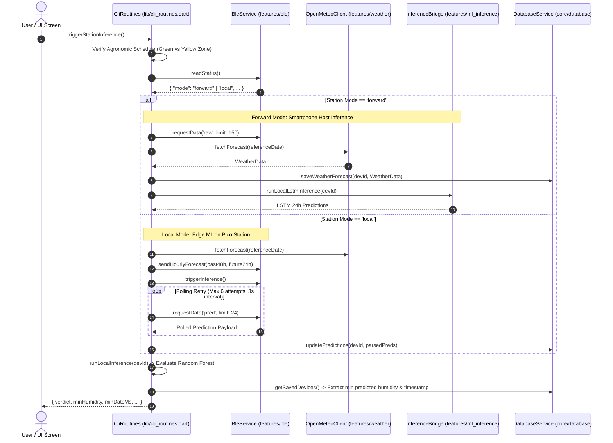
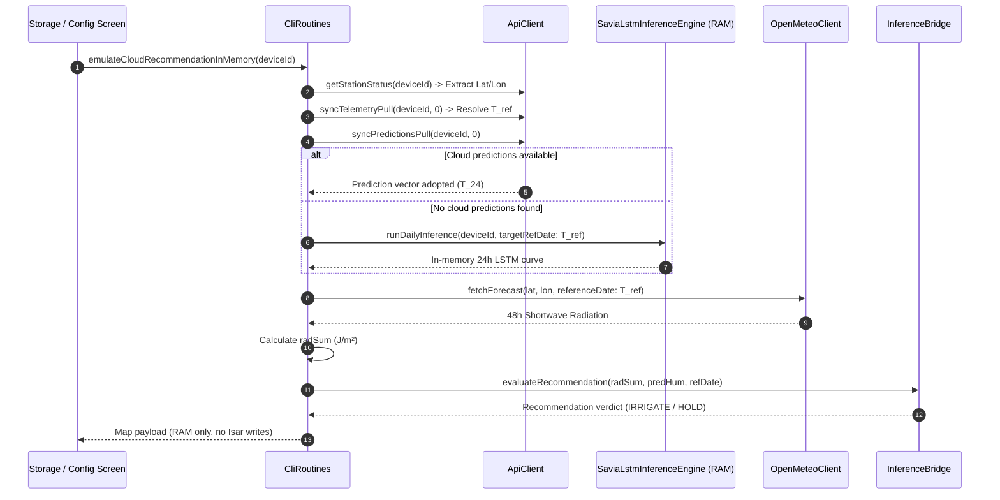

# C4 Code Architecture: Root Application Layer (`lib/main.dart` & `lib/cli_routines.dart`)

This document provides code-level architecture documentation (Level 4 in the C4 model) for the root application entry and orchestration components located directly within the [`lib`](file:///C:/Users/CrackoPattt88/Proyectos/tfm_app/lib) directory. In accordance with the architectural specification, this document focuses exclusively on [`lib/main.dart`](file:///C:/Users/CrackoPattt88/Proyectos/tfm_app/lib/main.dart) and [`lib/cli_routines.dart`](file:///C:/Users/CrackoPattt88/Proyectos/tfm_app/lib/cli_routines.dart), excluding all subdirectories.

---

## 1. Overview Section

### 1.1 Purpose & Scope

The root directory [`lib`](file:///C:/Users/CrackoPattt88/Proyectos/tfm_app/lib) acts as the bridgehead and top-level orchestrator for the entire application. It contains the primary runtime bootstrap sequence and the centralized application service facade that binds together all core infrastructure and feature domains.

The two constituent components analyzed herein are:
1. [`lib/main.dart`](file:///C:/Users/CrackoPattt88/Proyectos/tfm_app/lib/main.dart): The Flutter application entry point. It initializes platform hardware bindings, boots the dependency facade, configures internationalization and styling, and mounts the responsive root navigation shell ([`DashboardShell`](file:///C:/Users/CrackoPattt88/Proyectos/tfm_app/lib/main.dart#L38-L44)).
2. [`lib/cli_routines.dart`](file:///C:/Users/CrackoPattt88/Proyectos/tfm_app/lib/cli_routines.dart): The central orchestration facade ([`CliRoutines`](file:///C:/Users/CrackoPattt88/Proyectos/tfm_app/lib/cli_routines.dart#L22-L917)). It aggregates, initializes, and controls the core persistence layer, BLE radio communications, cloud synchronization, weather forecast harvesting, and dual-mode machine learning inference pipelines (Edge Pico vs. Smartphone Host).

### 1.2 Architectural Role & System Boundaries

In the application's Clean Architecture structure:
- **Presentation & Bootstrapping**: [`main.dart`](file:///C:/Users/CrackoPattt88/Proyectos/tfm_app/lib/main.dart) resides at the outer Presentation/Framework layer. It creates the top-level widget tree, handles multi-platform display adaptations (Desktop vs. Mobile vs. Web), and establishes reactive listeners to hardware telemetry streams.
- **Application Facade / Orchestrator**: [`cli_routines.dart`](file:///C:/Users/CrackoPattt88/Proyectos/tfm_app/lib/cli_routines.dart) implements the **Facade Pattern**. It isolates user-facing screens ([`HomeScreen`](file:///C:/Users/CrackoPattt88/Proyectos/tfm_app/lib/screens/home_screen.dart), [`NearbyScreen`](file:///C:/Users/CrackoPattt88/Proyectos/tfm_app/lib/screens/nearby_screen.dart), [`StorageScreen`](file:///C:/Users/CrackoPattt88/Proyectos/tfm_app/lib/screens/storage_screen.dart), and [`ConfigScreen`](file:///C:/Users/CrackoPattt88/Proyectos/tfm_app/lib/screens/config_screen.dart)) from direct low-level coupling with underlying subsystems (such as raw BLE GATT streams, SQLite/Isar queries, or HTTP REST endpoints).
- **Responsive Scaffolding**: [`DashboardShell`](file:///C:/Users/CrackoPattt88/Proyectos/tfm_app/lib/main.dart#L38-L44) detects viewport width changes (threshold: `600px`). It dynamically provides a desktop [`NavigationRail`](file:///C:/Users/CrackoPattt88/Proyectos/tfm_app/lib/main.dart#L179-L198) on wide viewports or a mobile [`BottomNavigationBar`](file:///C:/Users/CrackoPattt88/Proyectos/tfm_app/lib/main.dart#L206-L224) on compact devices.
- **Platform Branching (`kIsWeb`)**: On Web browsers where Bluetooth Low Energy hardware access is restricted, [`main.dart`](file:///C:/Users/CrackoPattt88/Proyectos/tfm_app/lib/main.dart#L78-L94) prunes BLE-dependent routes ([`HomeScreen`](file:///C:/Users/CrackoPattt88/Proyectos/tfm_app/lib/screens/home_screen.dart), [`NearbyScreen`](file:///C:/Users/CrackoPattt88/Proyectos/tfm_app/lib/screens/nearby_screen.dart)) and only renders [`StorageScreen`](file:///C:/Users/CrackoPattt88/Proyectos/tfm_app/lib/screens/storage_screen.dart) and [`ConfigScreen`](file:///C:/Users/CrackoPattt88/Proyectos/tfm_app/lib/screens/config_screen.dart).

```
+------------------------------------------------------------------------------------+
|                                    Flutter Engine                                  |
|                                    main() Entry                                    |
+------------------------------------------------------------------------------------+
                                           |
                                           v
+------------------------------------------------------------------------------------+
|                             lib/main.dart (UI Shell)                               |
|                                                                                    |
|   +----------------------------------------------------------------------------+   |
|   |                              DashboardShell                                |   |
|   |   +--------------------------+             +---------------------------+   |   |
|   |   | Desktop: NavigationRail  |             | Mobile: BottomNavBar      |   |   |
|   |   +--------------------------+             +---------------------------+   |   |
|   |   +--------------------------------------------------------------------+   |   |
|   |   |                  Collapsible Persistent Status Bar                 |   |   |
|   |   +--------------------------------------------------------------------+   |   |
|   +----------------------------------------------------------------------------+   |
+------------------------------------------------------------------------------------+
                                           |
                                           | injects & delegates
                                           v
+------------------------------------------------------------------------------------+
|                     lib/cli_routines.dart (Application Facade)                     |
|                                                                                    |
|   +----------------------------------------------------------------------------+   |
|   |                                 CliRoutines                                |   |
|   |   - DatabaseService db           - BleService bleService                   |   |
|   |   - ApiClient cloudApi           - BleDataProcessor bleProcessor           |   |
|   |   - InferenceBridge inference    - SaviaLstmInferenceEngine lstm           |   |
|   +----------------------------------------------------------------------------+   |
+------------------------------------------------------------------------------------+
          |                     |                      |                    |
          v                     v                      v                    v
+-------------------+ +-------------------+  +-------------------+  +----------------+
|  core/database    | |   core/network    |  |   features/ble    |  | features/ml_   |
| (AppDatabase,     | | (ApiClient,       |  | (BleService,      |  | inference &    |
|  DbSync)          | |  REST endpoints)  |  |  PicoHandshake)   |  | weather)       |
+-------------------+ +-------------------+  +-------------------+  +----------------+
```

### 1.3 C4 Code Diagram

The following class diagram documents the structural composition of [`lib/main.dart`](file:///C:/Users/CrackoPattt88/Proyectos/tfm_app/lib/main.dart) and [`lib/cli_routines.dart`](file:///C:/Users/CrackoPattt88/Proyectos/tfm_app/lib/cli_routines.dart), and illustrates how the facade mediates requests between UI screens and underlying architectural subsystems:

```mermaid
classDiagram
    direction TB

    class main {
        <<entrypoint>>
        +main() void$
    }

    class DashboardShell {
        <<StatefulWidget>>
        +CliRoutines routines
        +createState() _DashboardShellState
    }

    class _DashboardShellState {
        <<State>>
        -int _selectedIndex
        -String _statusMsg
        -bool _isStatusVisible
        -StreamSubscription~bool~? _connSub
        +initState() void
        +dispose() void
        -_setStatus(String msg) void
        -_buildCurrentScreen() Widget
        -_buildMainContent() Widget
        +build(BuildContext context) Widget
    }

    class CliRoutines {
        <<facade>>
        +DatabaseService db
        +ApiClient cloudApi
        +BleService bleService
        +BleDataProcessor bleProcessor
        +InferenceBridge inferenceBridge
        +init() Future~void~
        +close() void
        +pushTelemetry(String deviceId) Future~void~
        +runLocalInference(String deviceId, ...) Future~Map~
        +searchNearbyDevices() void
        +connectToDevice(BluetoothDevice device, String sharedSecret) Future~bool~
        +readStationStatus() Future~Map?~
        +readStationConfig() Future~Map?~
        +requestStationData(String kind, {int? limit}) Future~Object?~
        +sendHourlyForecast({DateTime? targetReferenceDate}) Future~void~
        +fetchLatestPredictionFromConnectedDevice() Future~String~
        +triggerStationInference() Future~Map~
        +emulateCloudRecommendationInMemory(String deviceId) Future~Map~
        +clearLocalDatabase() void
        +pushStationLocationToCloud(String deviceId, double lat, double lon) Future~void~
        +testCloudConnection() Future~bool~
        +testCloudPing() Future~Map~
        +testWeatherConnection() Future~Map~
    }

    class DatabaseService {
        <<core/database>>
        +init() Future~void~
        +getAppSettings() AppSettings
        +getLocationSettings() LocationSettings
        +getSavedDevices() List~Device~
        +getReferenceTime(String devId, ...) DateTime
        +upsertTelemetry(String devId, List~HistoricValue~ vals, ...) void
        +updatePredictions(String devId, List~Prediction~ preds, ...) void
    }

    class ApiClient {
        <<core/network>>
        +syncTelemetryPush(List records) Future~void~
        +syncTelemetryPull(String devId, int ts) Future~List~
        +syncPredictionsPull(String devId, int ts) Future~List~
        +getStationStatus(String devId) Future~Map~
        +testConnection() Future~bool~
    }

    class BleService {
        <<features/ble>>
        +bool isConnected
        +BluetoothDevice? connectedDevice
        +Stream~bool~ connectionStateStream
        +Stream~List~ScanResult~~ scanResults
        +Stream~Object~ dataStream
        +startScan() void
        +stopScan() Future~void~
        +connect(BluetoothDevice device) Future~bool~
        +disconnect() void
        +readStatus() Future~Map?~
        +readConfig() Future~Map?~
        +requestData(String kind, {int? limit}) Future~void~
        +sendHourlyForecast(List past, List future) Future~void~
        +triggerInference() Future~void~
    }

    class InferenceBridge {
        <<features/ml_inference>>
        +String status
        +runIrrigationRecommendation(...) Future~Map~
        +runLocalLstmInference(String deviceId) Future~Map~
        +evaluateRecommendation(...) Map
    }

    main ..> CliRoutines : instantiates & initializes
    main ..> DashboardShell : mounts in MaterialApp
    DashboardShell --> _DashboardShellState : creates
    DashboardShell o-- CliRoutines : holds reference
    _DashboardShellState ..> CliRoutines : reads bleService & invokes routines
    CliRoutines *-- DatabaseService : owns
    CliRoutines *-- ApiClient : owns
    CliRoutines *-- BleService : owns
    CliRoutines *-- InferenceBridge : owns
```

---

## 2. Code Elements Section

### 2.1 File: `lib/main.dart`

[`lib/main.dart`](file:///C:/Users/CrackoPattt88/Proyectos/tfm_app/lib/main.dart) serves as the presentation entry and UI shell scaffolding module.

#### 2.1.1 Function: `main()`

- **Declaration**: [`void main() async`](file:///C:/Users/CrackoPattt88/Proyectos/tfm_app/lib/main.dart#L13-L36)
- **Role**: Application bootstrap routine.
- **Execution Flow**:
  1. Calls [`WidgetsFlutterBinding.ensureInitialized()`](file:///C:/Users/CrackoPattt88/Proyectos/tfm_app/lib/main.dart#L14) to bind the Flutter rendering pipeline before asynchronous plugins fire.
  2. Instantiates [`CliRoutines`](file:///C:/Users/CrackoPattt88/Proyectos/tfm_app/lib/cli_routines.dart#L22) and awaits [`routines.init()`](file:///C:/Users/CrackoPattt88/Proyectos/tfm_app/lib/cli_routines.dart#L30-L75).
  3. Launches [`runApp()`](file:///C:/Users/CrackoPattt88/Proyectos/tfm_app/lib/main.dart#L19) configuring [`MaterialApp`](file:///C:/Users/CrackoPattt88/Proyectos/tfm_app/lib/main.dart#L20-L35) with:
     - Theme: [`AppStyles.darkTheme`](file:///C:/Users/CrackoPattt88/Proyectos/tfm_app/lib/core/theme/app_styles.dart) for agronomic low-glare field operation.
     - Localization: [`AppLocalizations.delegate`](file:///C:/Users/CrackoPattt88/Proyectos/tfm_app/lib/core/utils/l10n/app_localizations.dart) alongside standard Flutter material/widgets/cupertino delegates.
     - Supported Locales: English (`en`) and Spanish (`es`).
     - Root Screen: [`DashboardShell(routines: routines)`](file:///C:/Users/CrackoPattt88/Proyectos/tfm_app/lib/main.dart#L33).

#### 2.1.2 Class: `DashboardShell`

- **Declaration**: [`class DashboardShell extends StatefulWidget`](file:///C:/Users/CrackoPattt88/Proyectos/tfm_app/lib/main.dart#L38-L44)
- **Properties**:
  - `final CliRoutines routines`: Central orchestration facade injected from [`main()`](file:///C:/Users/CrackoPattt88/Proyectos/tfm_app/lib/main.dart#L13-L36).
- **Design Intent**: Top-level persistent scaffold hosting the multi-screen navigation state, adaptive platform menus, and sticky telemetry status bar.

#### 2.1.3 Class: `_DashboardShellState`

- **Declaration**: [`class _DashboardShellState extends State<DashboardShell>`](file:///C:/Users/CrackoPattt88/Proyectos/tfm_app/lib/main.dart#L46-L228)
- **State Fields**:
  - `int _selectedIndex` (Line 47): Current navigation tab index (default: `0`).
  - `late String _statusMsg` (Line 48): Status text displayed in the persistent footer. Initialized to `AppLocalizations.of(context)!.mainStatusReady`.
  - `bool _isStatusVisible` (Line 49): Boolean toggle controlling whether the bottom status banner is expanded or minimized (default: `true`).
  - `StreamSubscription<bool>? _connSub` (Line 51): Event listener tracking BLE hardware connection state changes.

##### Lifecycle Methods:

- **[`initState()`](file:///C:/Users/CrackoPattt88/Proyectos/tfm_app/lib/main.dart#L54-L65)**:
  Subscribes to [`widget.routines.bleService.connectionStateStream`](file:///C:/Users/CrackoPattt88/Proyectos/tfm_app/lib/features/ble/ble_service.dart). Whenever the peripheral connects or disconnects, it mutates `_statusMsg` to localized strings (`mainStatusBleConnected` or `mainStatusBleDisconnected`) and triggers a rebuild if the widget is mounted.
- **[`dispose()`](file:///C:/Users/CrackoPattt88/Proyectos/tfm_app/lib/main.dart#L67-L71)**:
  Cancels `_connSub` to prevent memory leaks and dangling stream subscriptions when the widget unmounts.

##### Helper & Rendering Methods:

- **[`_setStatus(String msg)`](file:///C:/Users/CrackoPattt88/Proyectos/tfm_app/lib/main.dart#L73-L75)**:
  Callback closure passed into child screens to update the global status bar with operation feedback (e.g., sync status, errors, inference results).
- **[`_buildCurrentScreen()`](file:///C:/Users/CrackoPattt88/Proyectos/tfm_app/lib/main.dart#L77-L94)**:
  Resolves the active widget screen based on platform target:
  - **Web (`kIsWeb`)**: Restricts destinations to [`StorageScreen`](file:///C:/Users/CrackoPattt88/Proyectos/tfm_app/lib/screens/storage_screen.dart) and [`ConfigScreen`](file:///C:/Users/CrackoPattt88/Proyectos/tfm_app/lib/screens/config_screen.dart).
  - **Native (Android/iOS/Desktop)**: Full feature set: [`HomeScreen`](file:///C:/Users/CrackoPattt88/Proyectos/tfm_app/lib/screens/home_screen.dart) (0), [`NearbyScreen`](file:///C:/Users/CrackoPattt88/Proyectos/tfm_app/lib/screens/nearby_screen.dart) (1), [`StorageScreen`](file:///C:/Users/CrackoPattt88/Proyectos/tfm_app/lib/screens/storage_screen.dart) (2), and [`ConfigScreen`](file:///C:/Users/CrackoPattt88/Proyectos/tfm_app/lib/screens/config_screen.dart) (3).
  - Contains index overflow guards (`if (_selectedIndex >= screens.length) _selectedIndex = 0`).
- **[`_buildMainContent()`](file:///C:/Users/CrackoPattt88/Proyectos/tfm_app/lib/main.dart#L96-L167)**:
  Builds a vertical [`Column`](file:///C:/Users/CrackoPattt88/Proyectos/tfm_app/lib/main.dart#L97) composed of an [`Expanded`](file:///C:/Users/CrackoPattt88/Proyectos/tfm_app/lib/main.dart#L99) child screen and a collapsible status bar. When collapsed, renders a compact chevron tab in the bottom right corner allowing the user to restore visibility.
- **[`build(BuildContext context)`](file:///C:/Users/CrackoPattt88/Proyectos/tfm_app/lib/main.dart#L169-L227)**:
  Inspects `MediaQuery.of(context).size.width >= 600`.
  - **Desktop / Wide Screen**: Employs a horizontal [`Row`](file:///C:/Users/CrackoPattt88/Proyectos/tfm_app/lib/main.dart#L177-L202) featuring a side-anchored [`NavigationRail`](file:///C:/Users/CrackoPattt88/Proyectos/tfm_app/lib/main.dart#L179-L198) with `NavigationRailLabelType.all`, divided by a vertical hairline delimiter.
  - **Mobile / Narrow Screen**: Renders `_buildMainContent()` in the body with a bottom [`BottomNavigationBar`](file:///C:/Users/CrackoPattt88/Proyectos/tfm_app/lib/main.dart#L206-L224) (`BottomNavigationBarType.fixed`).

---

### 2.2 File: `lib/cli_routines.dart`

[`lib/cli_routines.dart`](file:///C:/Users/CrackoPattt88/Proyectos/tfm_app/lib/cli_routines.dart) defines [`CliRoutines`](file:///C:/Users/CrackoPattt88/Proyectos/tfm_app/lib/cli_routines.dart#L22-L917), the master facade coordinating all hardware, database, network, and intelligence routines.

#### 2.2.1 Core Architectural Attributes & Subsystem Services

```dart
late final DatabaseService db;
late final ApiClient cloudApi;
late final BleService bleService;
late final BleDataProcessor bleProcessor;
late final InferenceBridge inferenceBridge;
```

- [`db`](file:///C:/Users/CrackoPattt88/Proyectos/tfm_app/lib/cli_routines.dart#L23): [`DatabaseService`](file:///C:/Users/CrackoPattt88/Proyectos/tfm_app/lib/core/database/app_database.dart) managing local NoSQL storage (Isar), schema versioning, device metadata, telemetry archives, and settings.
- [`cloudApi`](file:///C:/Users/CrackoPattt88/Proyectos/tfm_app/lib/cli_routines.dart#L24): [`ApiClient`](file:///C:/Users/CrackoPattt88/Proyectos/tfm_app/lib/core/network/cloud_api.dart) handling authenticated HTTP communication with the TFM cloud backend.
- [`bleService`](file:///C:/Users/CrackoPattt88/Proyectos/tfm_app/lib/cli_routines.dart#L25): [`BleService`](file:///C:/Users/CrackoPattt88/Proyectos/tfm_app/lib/features/ble/ble_service.dart) abstracting the Bluetooth Low Energy stack (scanning, MTU negotiation, challenge-response auth, GATT characteristics).
- [`bleProcessor`](file:///C:/Users/CrackoPattt88/Proyectos/tfm_app/lib/cli_routines.dart#L26): [`BleDataProcessor`](file:///C:/Users/CrackoPattt88/Proyectos/tfm_app/lib/features/ble/ble_controller.dart) mediating between BLE streams and persistent database caching.
- [`inferenceBridge`](file:///C:/Users/CrackoPattt88/Proyectos/tfm_app/lib/cli_routines.dart#L27): [`InferenceBridge`](file:///C:/Users/CrackoPattt88/Proyectos/tfm_app/lib/features/ml_inference/inference_engine.dart) orchestrating Random Forest classification and host-side LSTM inference.

#### 2.2.2 Lifecycle & Initialization Pipeline

##### Method: `init()`

- **Declaration**: [`Future<void> init() async`](file:///C:/Users/CrackoPattt88/Proyectos/tfm_app/lib/cli_routines.dart#L30-L75)
- **Role**: Establishes all system prerequisites in a deterministic sequence before UI rendering:
  1. **Hardware Checks**: Verifies BLE support via [`FlutterBluePlus.isSupported`](file:///C:/Users/CrackoPattt88/Proyectos/tfm_app/lib/cli_routines.dart#L36) and location services via [`Geolocator.isLocationServiceEnabled()`](file:///C:/Users/CrackoPattt88/Proyectos/tfm_app/lib/cli_routines.dart#L47). Errors are intercepted and logged as non-fatal warnings to enable offline or mock execution.
  2. **Database Setup**: Instantiates `DatabaseService` and awaits [`db.init()`](file:///C:/Users/CrackoPattt88/Proyectos/tfm_app/lib/cli_routines.dart#L57).
  3. **Cloud Configuration**: Queries [`db.getAppSettings()`](file:///C:/Users/CrackoPattt88/Proyectos/tfm_app/lib/cli_routines.dart#L60) to initialize `ApiClient` with the persisted server URL, port, and API token.
  4. **BLE Stack Instantiation**: Creates `BleService` configured with [`PicoHandshakeModule()`](file:///C:/Users/CrackoPattt88/Proyectos/tfm_app/lib/cli_routines.dart#L68) and hooks up `BleDataProcessor`.
  5. **Inference Setup**: Instantiates `InferenceBridge(db)`.

##### Method: `close()`

- **Declaration**: [`void close()`](file:///C:/Users/CrackoPattt88/Proyectos/tfm_app/lib/cli_routines.dart#L722-L725)
- **Role**: Gracefully terminates database connections (`db.close()`) and tears down BLE scan subscriptions and peripheral links (`bleService.dispose()`).

---

#### 2.2.3 Orchestration Routines (Complex Workflows)

##### 1. Telemetry Cloud Push: `pushTelemetry`
- **Declaration**: [`Future<void> pushTelemetry(String deviceId) async`](file:///C:/Users/CrackoPattt88/Proyectos/tfm_app/lib/cli_routines.dart#L78-L105)
- **Behavior**: Retrieves stored sensor readings from `db.getDeviceTelemetry(deviceId)`. Translates `HistoricValue` records into the JSON payload format expected by the cloud (`tsMs`, `port`, `kind`, `value`, `depthCm`) and dispatches via [`cloudApi.syncTelemetryPush(records)`](file:///C:/Users/CrackoPattt88/Proyectos/tfm_app/lib/cli_routines.dart#L100).

##### 2. BLE Device Connection: `connectToDevice`
- **Declaration**: [`Future<bool> connectToDevice(BluetoothDevice device, String sharedSecret) async`](file:///C:/Users/CrackoPattt88/Proyectos/tfm_app/lib/cli_routines.dart#L159-L179)
- **Behavior**:
  - Stops ongoing BLE scans (`bleService.stopScan()`) to mitigate radio frequency conflicts.
  - Injects `PicoHandshakeModule(sharedSecret: sharedSecret)` into `bleService`.
  - Initiates GATT connection and executes challenge-response authentication.
  - On success, registers the device in local database via `db.saveDeviceBasic()`.

##### 3. Meteorological Forecast Transmission: `sendHourlyForecast`
- **Declaration**: [`Future<void> sendHourlyForecast({DateTime? targetReferenceDate}) async`](file:///C:/Users/CrackoPattt88/Proyectos/tfm_app/lib/cli_routines.dart#L248-L309)
- **Behavior**:
  - Determines station reference timestamp $T_{ref}$ (either explicitly supplied or queried via `db.getReferenceTime()`).
  - Detects if historical emulation is active ($T_{ref} \neq \text{today}$).
  - Queries `OpenMeteoClient` for hourly forecast data at the configured GPS coordinates.
  - Slices hourly temperature records into past (48 hours) and future (24 hours) buffers matching the Raspberry Pi Pico C firmware specification.
  - Saves weather records in the local database and transmits them over BLE to the remote station (`bleService.sendHourlyForecast(past, future)`).

##### 4. Station Inference Orchestration: `triggerStationInference`
- **Declaration**: [`Future<Map<String, dynamic>> triggerStationInference() async`](file:///C:/Users/CrackoPattt88/Proyectos/tfm_app/lib/cli_routines.dart#L376-L542)
- **Behavior & Branching**:
  1. **Agronomic Schedule Guard**: Checks current hour against `agronomicDayStart` and `agronomicDayEnd`. If within the "Yellow Zone" (solar gathering period), inference is restricted unless forced by settings.
  2. **Mode Inspection**: Reads station status via BLE to detect operational mode (`mode == 'forward'` vs `mode == 'local'`).
  3. **Branch A (`forward` mode)**: The peripheral functions purely as a data logger. The smartphone requests raw telemetry (`requestStationData('raw')`), fetches Open-Meteo weather data, saves it to the database, and executes the local LSTM inference model on the phone CPU via [`inferenceBridge.runLocalLstmInference(devId)`](file:///C:/Users/CrackoPattt88/Proyectos/tfm_app/lib/cli_routines.dart#L439).
  4. **Branch B (`local` mode)**: The peripheral executes edge ML. The smartphone sends the 72h hourly weather forecast to the Pico, signals the inference trigger characteristic (`bleService.triggerInference()`), and enters a polling retry loop (up to 6 attempts with 3-second delays) to retrieve the newly generated prediction vector from the Pico station.
  5. **Random Forest Evaluation**: Feeds the resulting 24h soil moisture predictions and weather parameters into [`runLocalInference()`](file:///C:/Users/CrackoPattt88/Proyectos/tfm_app/lib/cli_routines.dart#L108-L152) to generate an actionable irrigation recommendation.
  6. **Minimum Extraction**: Scans device predictions to extract minimum expected humidity (`minHumidity`) and epoch timestamp (`minDateMs`).

##### 5. Cloud In-Memory RAM Emulation: `emulateCloudRecommendationInMemory`
- **Declaration**: [`Future<Map<String, dynamic>> emulateCloudRecommendationInMemory(String deviceId) async`](file:///C:/Users/CrackoPattt88/Proyectos/tfm_app/lib/cli_routines.dart#L547-L712)
- **Behavior**: Executes a complete two-stage inference emulation in dynamic memory (RAM) without mutating the local Isar database:
  - Stage 1 (LSTM): Resolves telemetry reference timestamp $T_{ref}$. If cloud prediction vectors are absent, instantiates [`SaviaLstmInferenceEngine`](file:///C:/Users/CrackoPattt88/Proyectos/tfm_app/lib/features/ml_inference/lstm_inference.dart) in RAM to project the 24-hour humidity curve.
  - Stage 2 (RF): Harvests 48-hour solar shortwave radiation sum from Open-Meteo and executes [`inferenceBridge.evaluateRecommendation()`](file:///C:/Users/CrackoPattt88/Proyectos/tfm_app/lib/cli_routines.dart#L688-L694) in RAM. Returns the resulting recommendation and emulation metadata.

##### 6. Direct Cloud Location Update: `pushStationLocationToCloud`
- **Declaration**: [`Future<void> pushStationLocationToCloud(String deviceId, double lat, double lon) async`](file:///C:/Users/CrackoPattt88/Proyectos/tfm_app/lib/cli_routines.dart#L868-L916)
- **Behavior**: Issues an HTTP `PUT` request to `/api/devices/$deviceId/location` authenticated with `tfmServerApiKey`. On receiving HTTP 200, immediately updates coordinates on the in-memory/local device object.

---

#### 2.2.4 Facade Delegation Map

[`CliRoutines`](file:///C:/Users/CrackoPattt88/Proyectos/tfm_app/lib/cli_routines.dart#L22-L917) surfaces simplified accessors for UI screens, acting as a single point of interaction:

| Domain Area | Facade Method / Getter | Target Subsystem / Class | Description |
| :--- | :--- | :--- | :--- |
| **App Settings** | [`getAppSettings()`](file:///C:/Users/CrackoPattt88/Proyectos/tfm_app/lib/cli_routines.dart#L730)<br/>[`saveAppSettings(...)`](file:///C:/Users/CrackoPattt88/Proyectos/tfm_app/lib/cli_routines.dart#L731-L747) | [`DatabaseService`](file:///C:/Users/CrackoPattt88/Proyectos/tfm_app/lib/core/database/app_database.dart) | Reads and updates server URLs, ports, API keys, and agronomic schedule hours. |
| **Location Settings** | [`getLocationSettings()`](file:///C:/Users/CrackoPattt88/Proyectos/tfm_app/lib/cli_routines.dart#L750)<br/>[`saveLocationSettings(...)`](file:///C:/Users/CrackoPattt88/Proyectos/tfm_app/lib/cli_routines.dart#L751-L753) | [`DatabaseService`](file:///C:/Users/CrackoPattt88/Proyectos/tfm_app/lib/core/database/app_database.dart) | Reads/saves fallback coordinates and GPS toggle state. |
| **RF Models** | [`getActiveRfModel()`](file:///C:/Users/CrackoPattt88/Proyectos/tfm_app/lib/cli_routines.dart#L756)<br/>[`getSavedRfModels()`](file:///C:/Users/CrackoPattt88/Proyectos/tfm_app/lib/cli_routines.dart#L757)<br/>[`setActiveRfModel(...)`](file:///C:/Users/CrackoPattt88/Proyectos/tfm_app/lib/cli_routines.dart#L758)<br/>[`saveRfModel(...)`](file:///C:/Users/CrackoPattt88/Proyectos/tfm_app/lib/cli_routines.dart#L760-L761) | [`DatabaseService`](file:///C:/Users/CrackoPattt88/Proyectos/tfm_app/lib/core/database/app_database.dart) | CRUD operations for Random Forest decision trees stored locally. |
| **Cloud Synchronization** | [`syncCloudAndLocal()`](file:///C:/Users/CrackoPattt88/Proyectos/tfm_app/lib/cli_routines.dart#L775-L779)<br/>[`syncCloudTelemetry(...)`](file:///C:/Users/CrackoPattt88/Proyectos/tfm_app/lib/cli_routines.dart#L781-L784) | [`SyncService`](file:///C:/Users/CrackoPattt88/Proyectos/tfm_app/lib/core/database/db_sync.dart) | Bidirectional synchronization between local Isar store and remote backend. |
| **Network Diagnostics** | [`testCloudConnection()`](file:///C:/Users/CrackoPattt88/Proyectos/tfm_app/lib/cli_routines.dart#L787-L789)<br/>[`testCloudPing()`](file:///C:/Users/CrackoPattt88/Proyectos/tfm_app/lib/cli_routines.dart#L791-L819)<br/>[`testWeatherConnection()`](file:///C:/Users/CrackoPattt88/Proyectos/tfm_app/lib/cli_routines.dart#L821-L834) | [`ApiClient`](file:///C:/Users/CrackoPattt88/Proyectos/tfm_app/lib/core/network/cloud_api.dart) & `http` | Probes cloud API health endpoints (`/health`, `/api/ping`) with latency timing, and checks Open-Meteo connectivity. |
| **BLE Credentials** | [`getBleSecret(id)`](file:///C:/Users/CrackoPattt88/Proyectos/tfm_app/lib/cli_routines.dart#L837-L839)<br/>[`saveBleSecret(id, name, secret)`](file:///C:/Users/CrackoPattt88/Proyectos/tfm_app/lib/cli_routines.dart#L841-L847) | [`FlutterSecureStorage`](file:///C:/Users/CrackoPattt88/Proyectos/tfm_app/lib/cli_routines.dart#L12) | Persists and retrieves encrypted device pre-shared keys (PSK) in platform keychain/keystore. |
| **BLE Control & Streams** | [`bleScanResults`](file:///C:/Users/CrackoPattt88/Proyectos/tfm_app/lib/cli_routines.dart#L854)<br/>[`bleDataStream`](file:///C:/Users/CrackoPattt88/Proyectos/tfm_app/lib/cli_routines.dart#L855)<br/>[`disconnectBle()`](file:///C:/Users/CrackoPattt88/Proyectos/tfm_app/lib/cli_routines.dart#L851)<br/>[`syncBleTime(offset)`](file:///C:/Users/CrackoPattt88/Proyectos/tfm_app/lib/cli_routines.dart#L856) | [`BleService`](file:///C:/Users/CrackoPattt88/Proyectos/tfm_app/lib/features/ble/ble_service.dart) | Radio scanning controls, peripheral disconnection, telemetry streams, and RTC clock synchronization. |

---

## 3. Dependencies Section

### 3.1 Dependency Matrix

| File / Component | Inbound Dependencies (Callers) | Outbound Internal Dependencies | External Packages |
| :--- | :--- | :--- | :--- |
| [`lib/main.dart`](file:///C:/Users/CrackoPattt88/Proyectos/tfm_app/lib/main.dart) | Flutter Engine / Runtime Runner | [`CliRoutines`](file:///C:/Users/CrackoPattt88/Proyectos/tfm_app/lib/cli_routines.dart)<br/>[`AppStyles`](file:///C:/Users/CrackoPattt88/Proyectos/tfm_app/lib/core/theme/app_styles.dart)<br/>[`AppLocalizations`](file:///C:/Users/CrackoPattt88/Proyectos/tfm_app/lib/core/utils/l10n/app_localizations.dart)<br/>[`HomeScreen`](file:///C:/Users/CrackoPattt88/Proyectos/tfm_app/lib/screens/home_screen.dart)<br/>[`NearbyScreen`](file:///C:/Users/CrackoPattt88/Proyectos/tfm_app/lib/screens/nearby_screen.dart)<br/>[`StorageScreen`](file:///C:/Users/CrackoPattt88/Proyectos/tfm_app/lib/screens/storage_screen.dart)<br/>[`ConfigScreen`](file:///C:/Users/CrackoPattt88/Proyectos/tfm_app/lib/screens/config_screen.dart) | `flutter/material.dart`<br/>`flutter/foundation.dart`<br/>`flutter_localizations` |
| [`lib/cli_routines.dart`](file:///C:/Users/CrackoPattt88/Proyectos/tfm_app/lib/cli_routines.dart) | [`main.dart`](file:///C:/Users/CrackoPattt88/Proyectos/tfm_app/lib/main.dart)<br/>[`HomeScreen`](file:///C:/Users/CrackoPattt88/Proyectos/tfm_app/lib/screens/home_screen.dart)<br/>[`NearbyScreen`](file:///C:/Users/CrackoPattt88/Proyectos/tfm_app/lib/screens/nearby_screen.dart)<br/>[`StorageScreen`](file:///C:/Users/CrackoPattt88/Proyectos/tfm_app/lib/screens/storage_screen.dart)<br/>[`ConfigScreen`](file:///C:/Users/CrackoPattt88/Proyectos/tfm_app/lib/screens/config_screen.dart) | [`DatabaseService`](file:///C:/Users/CrackoPattt88/Proyectos/tfm_app/lib/core/database/app_database.dart)<br/>[`SyncService`](file:///C:/Users/CrackoPattt88/Proyectos/tfm_app/lib/core/database/db_sync.dart)<br/>[`ApiClient`](file:///C:/Users/CrackoPattt88/Proyectos/tfm_app/lib/core/network/cloud_api.dart)<br/>[`BleService`](file:///C:/Users/CrackoPattt88/Proyectos/tfm_app/lib/features/ble/ble_service.dart)<br/>[`BleDataProcessor`](file:///C:/Users/CrackoPattt88/Proyectos/tfm_app/lib/features/ble/ble_controller.dart)<br/>[`InferenceBridge`](file:///C:/Users/CrackoPattt88/Proyectos/tfm_app/lib/features/ml_inference/inference_engine.dart)<br/>[`SaviaLstmInferenceEngine`](file:///C:/Users/CrackoPattt88/Proyectos/tfm_app/lib/features/ml_inference/lstm_inference.dart)<br/>[`OpenMeteoClient`](file:///C:/Users/CrackoPattt88/Proyectos/tfm_app/lib/features/weather/open_meteo_api.dart)<br/>Domain Models (`Device`, `AppSettings`, `RfModel`, `LocationSettings`, `HistoricValue`, `Prediction`) | `flutter_blue_plus`<br/>`geolocator`<br/>`flutter_secure_storage`<br/>`http`<br/>`dart:convert`<br/>`dart:async` |

### 3.2 External Packages Analysis

1. **`flutter_blue_plus`**:
   - Primary Bluetooth Low Energy communication library.
   - Used in `cli_routines.dart` for hardware support verification (`FlutterBluePlus.isSupported`) and peripheral data streaming.
2. **`geolocator`**:
   - Location service access.
   - Evaluates whether device GPS services are enabled (`Geolocator.isLocationServiceEnabled()`) during `init()`.
3. **`flutter_secure_storage`**:
   - Hardware-backed keychain/keystore encryption.
   - Stores and retrieves BLE pre-shared secrets (`ble_secret_$id`) to authenticate against the station firmware challenge.
4. **`http`**:
   - Standard HTTP client used for lightweight diagnostic health checks (`testCloudPing`, `testWeatherConnection`) and location updates (`pushStationLocationToCloud`).
5. **`flutter_localizations`**:
   - Standard Flutter framework localization infrastructure for multilingual rendering (`AppLocalizations`).

### 3.3 Architectural Isolation & Layering

- **Separation of Concerns**: UI screens do not import `flutter_blue_plus`, `geolocator`, or raw SQL/Isar database models. All hardware commands, queries, and network sync events pass strictly through [`CliRoutines`](file:///C:/Users/CrackoPattt88/Proyectos/tfm_app/lib/cli_routines.dart#L22-L917).
- **Single Source of Truth**: System configuration parameters (cloud URLs, API tokens, agronomic thresholds) are read from `DatabaseService` into memory during `CliRoutines.init()` and dynamically propagated to `ApiClient`.
- **Fault-Tolerant Initialization**: Pre-flight checks for BLE and GPS wrap exceptions in `try-catch` blocks, guaranteeing that device hardware limitations (e.g. disabled GPS or running inside an emulator) do not crash the application during startup.

---

## 4. Relationships Section

### 4.1 Invocation & Execution Flows

#### 4.1.1 Application Bootstrapping & Shell Scaffolding

The following sequence diagram illustrates the initialization flow from engine start through subsystem setup and UI mounting:

```mermaid
sequenceDiagram
    autonumber
    actor Engine as Flutter Engine
    participant Main as main() (lib/main.dart)
    participant Routines as CliRoutines (lib/cli_routines.dart)
    participant DB as DatabaseService (core/database)
    participant Ble as BleService (features/ble)
    participant Shell as DashboardShell (lib/main.dart)

    Engine->>Main: Entry point execution
    Main->>Main: WidgetsFlutterBinding.ensureInitialized()
    Main->>Routines: CliRoutines()
    Main->>Routines: init()
    
    rect rgb(30, 40, 60)
        Note over Routines: Subsystem Initialization Pipeline
        Routines->>Routines: Verify BLE & GPS support
        Routines->>DB: DatabaseService().init()
        DB-->>Routines: DB ready
        Routines->>DB: getAppSettings()
        DB-->>Routines: AppSettings (URL, Port, API Key)
        Routines->>Ble: BleService(PicoHandshakeModule())
        Routines->>Routines: Initialize InferenceBridge(db)
    end

    Routines-->>Main: Initialization complete
    Main->>Shell: runApp(MaterialApp(home: DashboardShell(routines)))
    Shell->>Ble: Listen to connectionStateStream
    Shell-->>Engine: Render initial frame
```



#### 4.1.2 Dual-Mode Station Inference Flow (`triggerStationInference`)

This sequence diagram depicts how [`CliRoutines.triggerStationInference()`](file:///C:/Users/CrackoPattt88/Proyectos/tfm_app/lib/cli_routines.dart#L376-L542) dynamically branches between forward (smartphone host computation) and local (Pico edge computation) modes:



#### 4.1.3 In-Memory Cloud Emulation Pipeline (`emulateCloudRecommendationInMemory`)

The following diagram shows the volatile RAM emulation pipeline used to evaluate recommendations without modifying the persistent database:



---

### 4.2 Architectural Design Decisions & Trade-Offs

#### 4.2.1 Unified Facade (`CliRoutines`) vs. Distributed Dependency Injection

- **Approach**: The application adopts a single comprehensive facade ([`CliRoutines`](file:///C:/Users/CrackoPattt88/Proyectos/tfm_app/lib/cli_routines.dart#L22-L917)) instantiated in `main()` and passed to the widget tree.
- **Trade-Off Analysis**:
  - *Advantages*: Simplifies subsystem orchestration across disparate domains (e.g., pulling weather data, formatting it for Pico BLE buffers, sending it over GATT, and recording it in Isar requires coordinating four separate services). A central facade prevents UI screens from having to orchestrate complex multi-step sagas.
  - *Trade-Off*: `CliRoutines` has a broad surface area (~900 LOC). However, delegating individual tasks to lower-level domain controllers (`BleDataProcessor`, `InferenceBridge`, `SyncService`) preserves clean modularity while maintaining a single interaction point for presentation widgets.

#### 4.2.2 Dual-Mode Machine Learning Architecture

- **Approach**: The system transparently supports both edge inference on low-power microcontrollers (Raspberry Pi Pico running C firmware) and host-side inference on mobile devices (Dart/TFLite/Native).
- **Trade-Off Analysis**:
  - In fields with reliable Bluetooth connections and capable stations, edge inference minimizes radio transmission volume by processing raw sensor data locally on the station.
  - In degraded conditions or when stations operate in data-logging (`forward`) mode, `CliRoutines` dynamically shifts computational workload to the smartphone CPU, ensuring agronomic recommendations are delivered regardless of station firmware constraints.

#### 4.2.3 Volatile In-Memory Emulation vs. Persistent Database Writes

- **Approach**: [`emulateCloudRecommendationInMemory()`](file:///C:/Users/CrackoPattt88/Proyectos/tfm_app/lib/cli_routines.dart#L547-L712) evaluates agronomic ML models purely in transient memory without mutating Isar collections.
- **Trade-Off Analysis**:
  - *Rationale*: Field agronomists frequently test hypothetical scenarios ("what-if" analyses) or inspect historical data from cloud stations without wanting to overwrite local device logs or corrupt the synchronization status (`isDirty`) of production telemetry.
  - *Trade-Off*: In-memory emulation requires rebuilding temporary forecasting structures in RAM, but completely protects local database integrity against transient test data.

#### 4.2.4 Multi-Platform Scaffolding & Graceful Degradation

- **Approach**: Responsive breakpoints (`width >= 600`) and compile-time platform checks (`kIsWeb`) are implemented at the root shell level ([`DashboardShell`](file:///C:/Users/CrackoPattt88/Proyectos/tfm_app/lib/main.dart#L38-L44)).
- **Trade-Off Analysis**:
  - On desktop and tablet viewports, the interface automatically expands into a lateral [`NavigationRail`](file:///C:/Users/CrackoPattt88/Proyectos/tfm_app/lib/main.dart#L179-L198) suited for wide displays.
  - On Web targets lacking BLE hardware APIs, disabling Bluetooth screens prevents runtime exceptions and presents a clean cloud storage and configuration console.

#### 4.2.5 Centralized Agronomic Window ("Yellow Zone") Guardrail

- **Approach**: Time-of-day agronomic execution policies are enforced directly inside [`CliRoutines.runLocalInference()`](file:///C:/Users/CrackoPattt88/Proyectos/tfm_app/lib/cli_routines.dart#L108-L152) and [`CliRoutines.triggerStationInference()`](file:///C:/Users/CrackoPattt88/Proyectos/tfm_app/lib/cli_routines.dart#L376-L542).
- **Trade-Off Analysis**:
  - Prevents premature or erroneous inference requests during diurnal solar gathering cycles ("Yellow Zone").
  - Centralizing this rule in the facade protects BLE radio bandwidth and battery life on field stations by blocking unnecessary GATT traffic before radio transmission begins, while still providing an override mechanism (`alwaysForceInference` or `forceAllow`).
