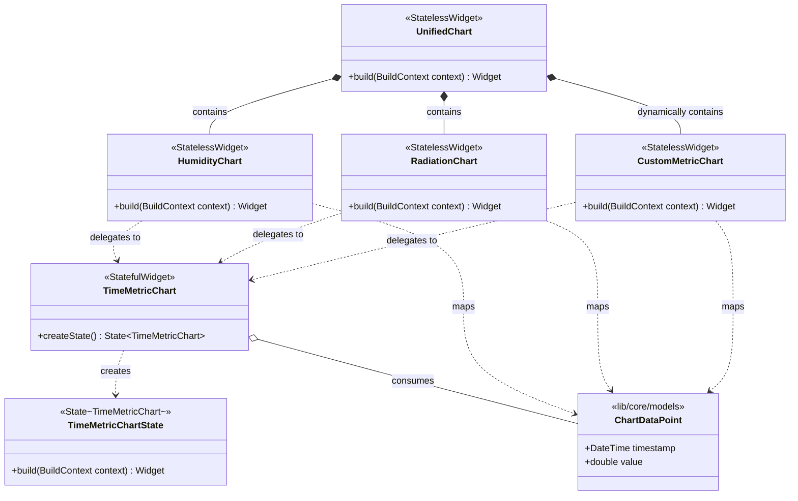

# C4 Component Architecture: Charts Engine

## 1. Overview Section
The **Charts Component** (`lib/features/charts`) is the core graphical telemetry engine for the application. Its mission is to transform disparate time-series data streams—originating from physical IoT sensor probes (soil humidity), remote meteorological forecasting APIs (solar radiation, temperature), and on-device machine learning inference engines (LSTM humidity forecasts)—into intuitive, responsive, and synchronized interactive visual representations.

## 2. Purpose Section
The charting system is purpose-built to support the agronomic decision-making cycle:
1. **Historical Telemetry (48h Observation Window)**: Plots real sensor readings collected via Bluetooth Low Energy (BLE) or database synchronization.
2. **Predictive Horizon (24h Forecast Window)**: Seamlessly projects LSTM-derived soil moisture trajectories and Open-Meteo solar radiation forecasts into future hours.
3. **Agronomic Cycle Synchronization**: Visually delineates agricultural operative stages ("ETAPA ESPERAR DATOS" vs. "ETAPA DATOS LISTOS") using dynamic background range annotations and synchronization headers.
4. **Adaptive Gesture Control**: Supports direct horizontal panning via low-latency pointer tracking and dynamic axis-interval decimation to avoid visual clutter across diverse mobile and desktop screen sizes.

## 3. Software Features Section
- **Decoupled Data Translation**: Upstream screens and database repositories do not need knowledge of chart rendering internals or `FlSpot` mechanics. Widgets consume domain entities and normalize them into `ChartDataPoint`.
- **Memoized Spot Compilation**: Point-to-spot transformations and hourly aggregations are computationally intensive over thousands of telemetry points. Caching avoids redundant spot rebuilding during UI interactions.
- **Visual Continuity via Temporal Bridging**: Disjoint historical and forecast vectors are dynamically spliced via synthetic bridge spots, ensuring smooth Bézier curves across the "now" horizon without artificial gaps.
- **Resilient Axis Dynamics**: The Y-axis automatically detects bounded physical units (such as `%` for humidity) while applying dynamic +20% statistical headroom for unbounded physical magnitudes (e.g., Solar Radiation).
- **Adaptive X-Axis Step Calculation**: Dynamically adjusts interval steps for axis labels based on viewport boundaries.

## 4. Code Elements Section
- [`UnifiedChart`](file:///C:/Users/CrackoPattt88/Proyectos/tfm_app/lib/features/charts/unified_chart.dart): Master dashboard facade and agronomic phase synchronization header.
- [`HumidityChart`](file:///C:/Users/CrackoPattt88/Proyectos/tfm_app/lib/features/charts/humidity_chart.dart): Specialized adapter for observed and predicted soil moisture.
- [`RadiationChart`](file:///C:/Users/CrackoPattt88/Proyectos/tfm_app/lib/features/charts/radiation_chart.dart): Specialized adapter for historical and forecasted solar radiation.
- [`CustomMetricChart`](file:///C:/Users/CrackoPattt88/Proyectos/tfm_app/lib/features/charts/custom_metric_chart.dart): Generalized telemetry adapter for arbitrary station sensor data.
- [`TimeMetricChart`](file:///C:/Users/CrackoPattt88/Proyectos/tfm_app/lib/features/charts/time_metric_chart.dart): Foundational interactive canvas engine and state controller (`_TimeMetricChartState`).

## 5. Interfaces Section
- **Inbound Data**: Accepts domain data models like `SoilHumidityRecord`, `PredictionRecord`, `WeatherRecord`, and `HistoricValue`.
- **User Interface**: Provides hardware-accelerated canvas components (powered by `fl_chart`) integrated with standard Flutter gesture `Listener`s.
- **Outbound Rendered Views**: Exposes stateless widget compositions to upstream app screens.

## 6. Dependencies Section
- **Flutter Framework (`flutter/material.dart`)**: For widget hierarchies, theming, scaling, layout, and event handling.
- **`fl_chart`**: Vector graphics rendering for splines, annotations, axes, grids, and touch areas.
- **`intl`**: For formatting and temporal string conversions (e.g., tick labels).
- **Core Models (`lib/core/models`)**: Data model boundaries ensuring chart library does not depend on database or remote API logic.

## 7. Component Diagram

