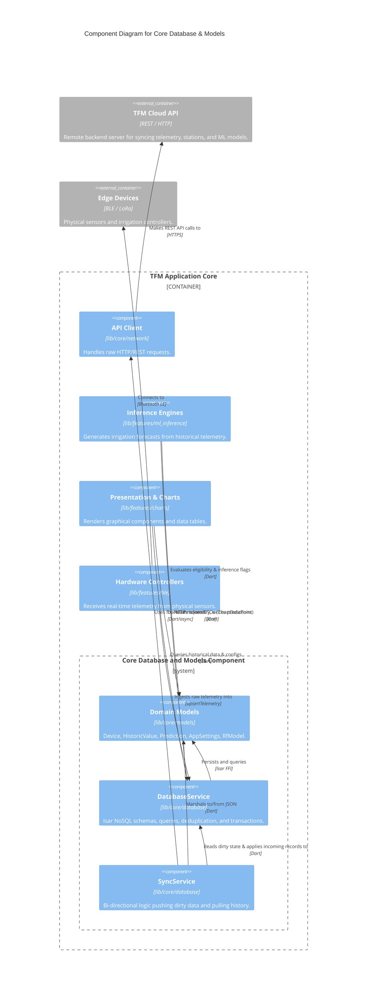

# C4 Component-Level Architecture: Core Database and Models

This document provides a C4 Component-level architectural description of the data persistence, synchronization, and domain modeling foundation of the application, derived from the `lib/core/database` and `lib/core/models` subsystems.

## 1. Overview Section

| Attribute | Details |
| :--- | :--- |
| **Name** | Core Database and Models Component |
| **Description** | Serves as the primary persistence, caching, cloud-synchronization engine, and core domain model layer for the application. |
| **Type** | Component |
| **Technology** | Dart, Flutter, Isar NoSQL (`isar_community`), REST (HTTP) |

## 2. Purpose Section

The primary purpose of this component is to manage local data persistence across mobile, desktop, and web environments while strictly defining the canonical domain model of the application. It isolates database transactions from upper-level UI and business-logic layers, manages entities related to IoT telemetry and machine learning, and coordinates bi-directional synchronization of station data, predictions, and settings with the remote cloud infrastructure. By acting as a foundational leaf layer, it enforces Clean Architecture principles through a zero-coupling inbound dependency structure.

## 3. Software Features Section

- **Dual Persistence Strategy**: Employs embedded high-performance ACID-compliant NoSQL (`Isar`) on native platforms (Android, iOS, macOS, Windows, Linux) and falls back to in-memory collections on the web.
- **Idempotent Telemetry Ingestion**: Uses a composite index hash table for $O(1)$ deduplication and merging of incoming sensor series.
- **Cloud Synchronization Pipeline**: Performs background two-way syncing of dirty devices, batch telemetry pushes, prediction updates, and full station discovery and historical backfills via REST.
- **Temporal Integrity**: Detects and sanitizes corrupt future timestamps (e.g., from faulty real-time clocks on hardware edge devices) to preserve correct data lineage.
- **Rich Domain Modeling**: Maps hierarchical domain models, including aggregate roots (`Device`), embedded values (`HistoricValue`, `Prediction`), dynamic ML structures (`RfModel`), and presentation Data Transfer Objects (DTOs) for chart rendering.

## 4. Code Elements Section

This component synthesizes the following Code-level architectural domains:

1. **[Core Database](file:///C:/Users/CrackoPattt88/Proyectos/tfm_app/C4-Documentation/c4-code-lib-core-database.md)** (`lib/core/database`): Contains `DatabaseService` for NoSQL engine interaction and telemetry operations, and `SyncService` for cloud orchestration.
2. **[Core Models](file:///C:/Users/CrackoPattt88/Proyectos/tfm_app/C4-Documentation/c4-code-lib-core-models.md)** (`lib/core/models`): Contains the foundational entity schemas and DTOs: `Device`, `HistoricValue`, `Prediction`, `AppSettings`, `RfModel`, `ChartDataPoint`, etc.

## 5. Interfaces Section

### Provided Interfaces (Operations)
- **Persistence Operations (`DatabaseService`)**:
  - `init()`, `close()`, `clearAllData()`
  - `saveDevice()`, `getSavedDevices()`, `findDevice()`, `deleteDevice()`, `getDirtyDevices()`
  - `upsertTelemetry()`, `getDeviceTelemetry()`, `sanitizeCorruptedFutureData()`
  - `updatePredictions()`, `saveWeatherForecast()`
  - Settings and Configuration management (`getAppSettings`, `saveLocationSettings`, etc.)
  - `saveRfModel()`, `getActiveRfModel()`
- **Synchronization Operations (`SyncService`)**:
  - `syncDirtyDevices()`: Pushes locally generated data (telemetry, predictions, metadata) to the cloud.
  - `discoverAndSyncCloudDevices()`: Pulls remote station definitions and orchestrates historical backfills.
  - `pullTelemetry()`, `pullPredictions()`: Backfills specific time-series spans from the server.

### Required Interfaces (Protocols)
- **Cloud REST API (`ApiClient`)**: HTTP communication with the TFM remote server backend using REST patterns (e.g., `POST /api/telemetry`, `PUT /api/devices/{id}/location`).
- **Hardware Integration Protocols**: Indirectly ingests data structured by outer layers via BLE (Bluetooth Low Energy) and LoRa hardware bridges.

## 6. Dependencies Section

### Internal Consuming Components
- **`lib/features/ml_inference`**: Reads time-series telemetry and active `RfModel` definitions to execute LSTM or Random Forest inference; writes output `Prediction` entities.
- **`lib/features/ble`**: Pushes decoded raw hardware payloads into telemetry schemas and verifies clock alignment.
- **`lib/features/charts`**: Maps domain entities and historical records into immutable `ChartDataPoint` and `WeatherRecord` DTOs for rendering.
- **`lib/screens` & `lib/cli_routines.dart`**: Drive UI state and orchestrate background/foreground synchronization cycles based on `AppSettings` and `Device` data.
- **`lib/core/network`**: Provides `ApiClient` to resolve HTTP calls requested by `SyncService`.

### External Packages
- `isar_community` (^3.3.2): Fast NoSQL embedded persistence and schema annotation generation.
- `path_provider`: Resolves platform-specific file directories for database persistence files.
- `http`: Underlying REST execution layer.
- Dart Core (`dart:async`, `dart:convert`, `flutter/foundation.dart`).

## 7. Component Diagram

