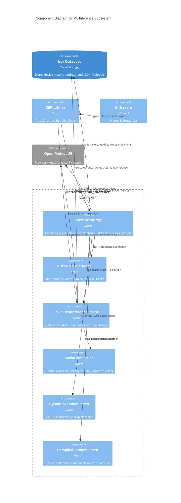

# C4 Component-Level Architecture: ML Inference

## 1. Overview Section

The `lib/features/ml_inference` component is a dedicated Machine Learning Inference subsystem for the smart irrigation decision support system. It handles both on-device and off-device evaluation of machine learning models. By processing agronomic telemetry collected from IoT ground stations and weather forecasts from Open-Meteo, the module determines when and how much irrigation is needed to maintain optimal soil moisture levels.

## 2. Purpose Section

The core purpose of this component is to execute a two-stage hybrid machine learning pipeline that provides reliable, crop-specific irrigation recommendations:
1. **Stage 1 (LSTM Soil Moisture Forecast)**: Predicts a 24-hour trajectory for 30 cm depth soil moisture ($HS_{30}$) using the past 48 hours of sensor telemetry (temperature, soil moisture) and 24-hour future temperature forecasts.
2. **Stage 2 (Random Forest Decision Classifier)**: Classifies the predicted moisture level and shortwave solar radiation sum into a binary decision: whether irrigation is necessary or can be safely bypassed.

The component is designed to operate dependably even in offline or poorly connected rural environments, utilizing robust fallback mechanisms for weather variables and model implementations.

## 3. Software Features Section

- **Two-Stage Decoupled Pipeline**: Separates physical forecasting of evapotranspiration (LSTM) from the agronomic rule-based prescription generation (Random Forest), allowing each model to be optimized and evaluated independently.
- **Dynamic Model Hot-Swapping**: Integrates `DynamicRandomForest` to load tree structures natively from JSON models stored in the local Isar database on the fly, allowing adaptive, crop-specific classifiers without app recompilation.
- **Resilient Model Fallback**: Automatically reverts to a highly optimized, hardcoded 50-tree compiled Random Forest classifier if JSON parsing fails or dynamic models are unavailable.
- **Four-Tier Solar Irradiance Fallback**: Ensures uninterrupted classification regardless of internet access:
  1. *Context Sharing*: Reuses fetched Open-Meteo weather data.
  2. *Live API Fetch*: Fetches real-time forecasts.
  3. *Local DB History*: Uses local offline pyranometer historical records.
  4. *Astronomical Model*: Synthesizes solar radiation estimates using an offline mathematical model (`HistoricalSolarModel`).
- **Dry-Run & Cloud Emulation**: Supports non-destructive inference audits that bypass local database commits, alongside pure in-memory cloud emulation to verify server-side logic locally.
- **Provenance Tracking**: Tracks and tags predictions with their definitive model origin (e.g., `RF_DYNAMIC_V{version}`, `RF_LEGACY_COMPILED`, `RF_CLOUD_EMULATED`) to improve observability and diagnostics.

## 4. Code Elements Section

The component encapsulates the following key modules and classes:

*   **`inference_engine.dart`**
    *   **`InferenceBridge`**: The primary coordinator. Handles database synchronization, orchestrates Stage 1 (LSTM) and Stage 2 (RF) pipelines, manages model provenance, and resolves environmental data via the multi-tier solar fallback.
    *   **`HistoricalSolarModel`**: A mathematical utility for synthesizing 48-hour shortwave radiation natively based on latitude, date, and astronomical properties.
*   **`lstm_inference.dart`**
    *   **`SaviaLstmInferenceEngine`**: Manages off-device execution of the 24-hour LSTM forecast loop, tensor assembly, telemetry binning (using Last Observation Carried Forward), and database persistence.
    *   **`SaviaLstmScaler`**: Implementation of `StandardScaler` transformations matching scikit-learn to scale model inputs ($HS_{30}$, $TA$, $HS_{10}$).
    *   **`LstmInputSample`**: A 1-hour temporal data structure representing sensor tuples.
    *   **`SaviaLstmErrorCode`**: Standardized execution constants synchronizing app-side errors with C-firmware embedded constraints.
*   **`dynamic_random_forest.dart`**
    *   **`DynamicRandomForest`**: Evaluates custom classification forests directly parsed from raw JSON without external ML dependencies.
    *   **`TreeNode`**: Represents structural components within the dynamic decision tree.
*   **`random_forest.dart`**
    *   **`CompiledRandomForest`**: A compiled fallback decision model harboring 50 statically evaluated decision trees for ultra-low latency execution.

## 5. Interfaces Section

### Inbound Consumers
- **`CliRoutines` (`lib/cli_routines.dart`)**: Invokes inference flows enforcing agronomic schedule guards. Dispatches calls to `runLocalInference`, `triggerStationInference`, and `emulateCloudRecommendationInMemory`.
- **`HomeScreen` (`lib/screens/home_screen.dart`)**: Triggers real-time BLE inference upon station connection and receives live updates to present within the user interface (`InferenceCard`).
- **`StorageScreen` (`lib/screens/storage_screen.dart`)**: Performs dry-run audits (`persistResults: false`) to analyze past storage telemetry non-destructively, as well as cloud-emulated cross-verification.
- **Test Suites (`test/inference_engine_test.dart`)**: Exercises normalization limits, class predictions under boundary moisture limits, and scheduling edge cases.

## 6. Dependencies Section

### Internal Project Dependencies
- **`DatabaseService`**: Fetches stored historical context, device metadata, configuration settings, and `RfModel` definitions, and persists resulting predictions.
- **Entities**: Uses `Device`, `Prediction`, and `HistoricValue` for state reading/writing. Uses `AppSettings` for rule parameters.
- **Weather Services**: Depends on `OpenMeteoClient` and `WeatherData` for future temperature arrays and solar context.
- **`BleService`**: Supplies connection context necessary for reconciling the station reference time ($T_{ref}$).

### External Package Dependencies
- **`dart:math`**: Essential for trigonometric irradiance fallback calculations (sine, cosine) and value limiting.
- **`dart:convert`**: Parses stringified JSON into structured data models for dynamic forests.
- **`dart:async`**: Manages asynchronous I/O with APIs and local databases.

## 7. Component Diagram

