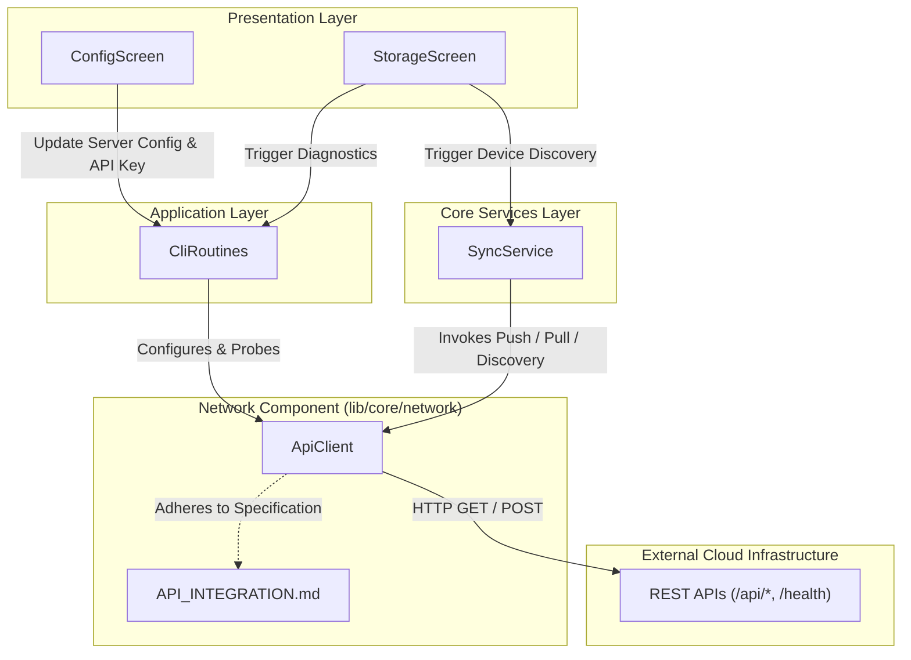

# C4 Component: Network

## 1. Overview Section
- **Name:** Network Core Module
- **Description:** Encapsulates all HTTP-based networking operations required by the mobile application, acting as the bridge between local core services and remote backend servers.
- **Type:** Core Service Component
- **Technology:** Dart, HTTP (`package:http/http.dart`)

## 2. Purpose Section
The Network Component provides a unified communication interface for interacting with the self-hosted TFM telemetry/sync server, LoRaWAN gateways, and cloud inference/model repositories. It abstracts the complexity of HTTP requests, payload serialization/deserialization, error handling, connection probing, and endpoint fallback configuration from the rest of the application.

## 3. Software Features Section
- **Telemetry Synchronization:** Bi-directional transfer of sensor telemetry and prediction data (`POST /api/sync`, `GET /api/sync`).
- **Device Discovery & Registration:** Querying cloud servers for registered field stations (Pico devices) with automatic endpoint fallback probing.
- **Station Metadata Management:** Updating and fetching station coordinates, UTC offsets, and metadata.
- **Machine Learning Model Distribution:** Fetching Random Forest and TFLite models for local inference.
- **Shared File Storage:** Binary file upload, download, and listing.
- **Cloud Emulation:** Requesting cloud-side irrigation recommendations.
- **Connection Diagnostics:** Fast multi-endpoint probing to verify reachability and authentication health before executing data pipelines.
- **Dynamic Endpoint Reconfiguration:** Updating API endpoints seamlessly at runtime to handle transitions between LAN IPs, cloud hosts, and local emulators.

## 4. Code Elements Section
The underlying code-level architecture for this component is detailed in:
- [c4-code-lib-core-network.md](file:///C:/Users/CrackoPattt88/Proyectos/tfm_app/C4-Documentation/c4-code-lib-core-network.md)

These documents describe the internal classes, primarily the `ApiClient` inside `lib/core/network/cloud_api.dart`, and the server-side protocol definitions in `API_INTEGRATION.md`.

## 5. Interfaces Section
- **Protocols:** REST (HTTP/HTTPS) using JSON payloads for data and raw Octet-Stream for files/models. Standard Bearer token authorization is used for protected routes.
- **Operations:**
  - **Telemetry:** `syncTelemetryPull`, `syncTelemetryPush`, `syncPredictionsPull`, `syncPredictionsPush`
  - **Devices:** `getRegisteredDevices`, `getStationStatus`, `updateStationMetadata`
  - **Files/Models:** `listFiles`, `downloadFile`, `uploadFile`, `deleteSharedFile`, `listTfliteModels`, `downloadModel`, `uploadModel`, `getAvailableRfModels`, `downloadRfModel`
  - **Diagnostics/Setup:** `testConnection`, `emulateCloudRecommendation`, `updateEndpoint`

## 6. Dependencies Section
- **External Frameworks/Libraries:** 
  - `dart:convert`, `dart:async` (Dart Core SDK)
  - `http: ^1.6.0` (High-level HTTP client library)
- **Internal Callers (Consumers):**
  - `CliRoutines` (Application Facade Layer)
  - `SyncService` (Core Services Layer)
  - `StorageScreen`, `ConfigScreen` (Presentation Layer)
- **External Upstream Dependencies:**
  - Remote Cloud Server (TFM Sync API)
  - LoRaWAN Gateways (ChirpStack / TTN)
  - Cloud Machine Learning Model Catalogs

## 7. Component Diagram

