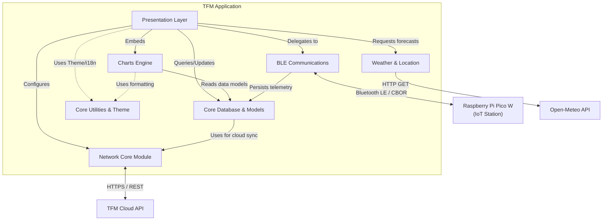

# C4 Component Architecture: Master Index

This document provides a comprehensive overview of all architectural components within the TFM Predictive Irrigation System.

## 1. System Components

| Component | Description | Documentation |
| :--- | :--- | :--- |
| **Presentation Layer** | The outer Flutter UI shell, including main screens, widgets, and the central orchestration facade (`CliRoutines`). | [c4-component-presentation.md](file:///C:/Users/CrackoPattt88/Proyectos/tfm_app/C4-Documentation/c4-component-presentation.md) |
| **Charts Engine** | Core graphical telemetry engine responsible for translating sensor and prediction data into interactive visual charts. | [c4-component-charts.md](file:///C:/Users/CrackoPattt88/Proyectos/tfm_app/C4-Documentation/c4-component-charts.md) |
| **BLE Communications** | Hardware abstraction layer for BLE communication, cryptography, and CBOR serialization with the field station. | [c4-component-ble-comms.md](file:///C:/Users/CrackoPattt88/Proyectos/tfm_app/C4-Documentation/c4-component-ble-comms.md) |
| **Weather & Location** | Environmental context engine that fetches and normalizes meteorological data from Open-Meteo APIs. | [c4-component-weather-location.md](file:///C:/Users/CrackoPattt88/Proyectos/tfm_app/C4-Documentation/c4-component-weather-location.md) |
| **Core Database & Models** | Domain models and local persistence layer using Isar NoSQL, along with data synchronization pipelines. | [c4-component-database.md](file:///C:/Users/CrackoPattt88/Proyectos/tfm_app/C4-Documentation/c4-component-database.md) |
| **Network Core** | Unified HTTP client bridging the local application with the cloud API backend, file storage, and ML model distribution. | [c4-component-network.md](file:///C:/Users/CrackoPattt88/Proyectos/tfm_app/C4-Documentation/c4-component-network.md) |
| **Core Utilities & Theme** | Immutable infrastructure providing visual design tokens (Material 3), localization (i18n), and temporal formatting tools. | [c4-component-core-utils.md](file:///C:/Users/CrackoPattt88/Proyectos/tfm_app/C4-Documentation/c4-component-core-utils.md) |

## 2. Component Relationships Diagram

The following diagram illustrates how the architectural components interact with each other and with external systems.

