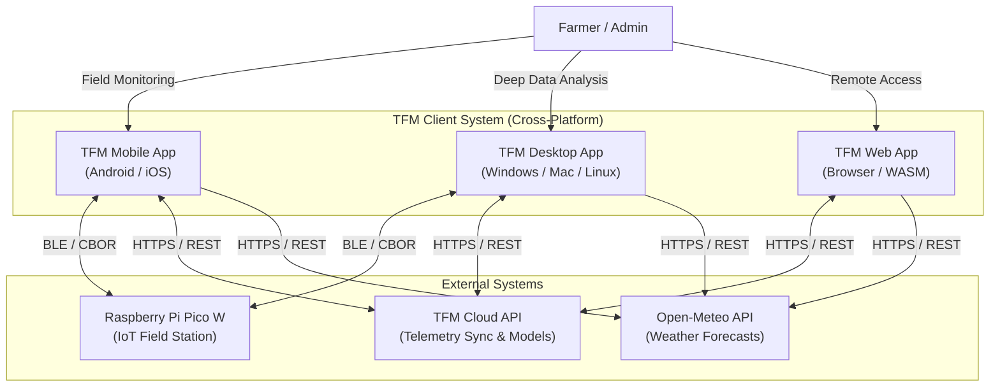

# C4 Container-Level Documentation

## 1. Containers Section

### TFM Mobile Application
- **Name:** TFM Mobile Application
- **Description:** Provides the on-the-go interface for farmers to monitor telemetry, connect to field stations via BLE, and receive ML predictions directly in the field.
- **Type:** Mobile Application
- **Technology:** Flutter, Dart, C++, Swift, Kotlin. Embedded Isar NoSQL.
- **Deployment:** Packaged as APK/AAB for Android (`android/app/build.gradle`) and IPA for iOS (`ios/Runner.xcodeproj`).

### TFM Web Application
- **Name:** TFM Web Application
- **Description:** A web-based dashboard allowing remote monitoring of aggregated telemetry and cloud synchronization operations from any standard web browser.
- **Type:** Single Page Application (SPA)
- **Technology:** Flutter Web, HTML5, CSS, WebAssembly (WASM). Embedded Isar Web/IndexedDB.
- **Deployment:** Compiled to static web assets (`web/index.html`) deployed via Web Server or CDN.

### TFM Desktop Application
- **Name:** TFM Desktop Application
- **Description:** A robust local desktop client for detailed offline analysis, extensive charting, and bulk data synchronization.
- **Type:** Desktop Application
- **Technology:** Flutter, Dart, C++. Embedded Isar NoSQL.
- **Deployment:** Compiled to native executables for Windows (`windows/runner/`), macOS (`macos/Runner/`), and Linux (`linux/`).

---

## 2. Purpose Section

### TFM Mobile Application
To empower field workers with a portable tool capable of directly interfacing with IoT hardware via BLE without internet access, visualizing real-time metrics, executing local ML models, and syncing data to the cloud post-collection.

### TFM Web Application
To serve as a zero-install, globally accessible portal for administrators and users to view historical charts, access weather forecasts, and check cloud-aggregated sensor data from any device.

### TFM Desktop Application
To provide a high-performance, persistent management console tailored for deep data analysis, allowing farmers to review extensive historical telemetry offline on larger screens.

---

## 3. Components Section

### TFM Mobile Application
- **Presentation Layer:** Outer UI shell and CLI routing.
- **Charts Engine:** Data visualization for sensor metrics.
- **BLE Communications:** Hardware abstraction and CBOR over GATT.
- **Weather & Location:** Geolocation and Open-Meteo integration.
- **Core Database & Models:** Isar NoSQL local persistence layer.
- **Network Core:** API client for cloud syncing.
- **ML Inference:** Native TensorFlow Lite inference engine.
- **Core Utilities & Theme:** Theming, i18n, formatting.

### TFM Web Application
- **Presentation Layer:** Responsive UI shell.
- **Charts Engine:** WebGL/CanvasKit rendering.
- **Weather & Location:** Browser Geolocation and Open-Meteo.
- **Core Database & Models:** IndexedDB-backed Isar persistence.
- **Network Core:** Web-compatible HTTP API client.
- **ML Inference:** TensorFlow.js / tflite_web inference engine.
- **Core Utilities & Theme:** Theming, i18n, formatting.
*(Note: BLE Communications is excluded/mocked due to Web browser GATT limitations).*

### TFM Desktop Application
- **Presentation Layer:** Desktop-optimized UI.
- **Charts Engine:** Data visualization for large datasets.
- **BLE Communications:** OS-level Bluetooth stack bindings.
- **Weather & Location:** Open-Meteo integration.
- **Core Database & Models:** Isar NoSQL local persistence layer.
- **Network Core:** API client for cloud syncing.
- **ML Inference:** Native TensorFlow Lite inference engine.
- **Core Utilities & Theme:** Theming, i18n, formatting.

---

## 4. Interfaces Section

### TFM Mobile Application
- **Inbound:** User interface interactions (Touch/Gestures).
- **Outbound:** 
  - BLE GATT Client (connecting to IoT Stations).
  - HTTP/REST to Cloud API and Open-Meteo.
  - OS File System for Isar DB.

### TFM Web Application
- **Inbound:** User interface interactions (Mouse/Keyboard/Touch).
- **Outbound:** 
  - HTTP/REST to Cloud API and Open-Meteo.
  - Browser IndexedDB API for local storage.

### TFM Desktop Application
- **Inbound:** User interface interactions (Mouse/Keyboard).
- **Outbound:** 
  - BLE GATT Client (via OS Bluetooth APIs).
  - HTTP/REST to Cloud API and Open-Meteo.
  - OS File System for Isar DB.

---

## 5. API Specifications

*(Note: No OpenAPI specifications were generated because the Client Application containers operate strictly as consumers of external APIs and BLE GATT servers. They do not expose inbound HTTP endpoints themselves.)*

---

## 6. Dependencies Section

### External Systems
- **TFM Cloud API:** Central backend server handling bidirectional telemetry sync, file storage, and ML model distribution.
- **Raspberry Pi Pico W (IoT Station):** Agronomical field station acting as a BLE GATT Server, providing local sensor telemetry.
- **Open-Meteo API:** Third-party HTTP service delivering localized weather forecasts and historical climate data.

### Communication Protocols
- **BLE (Bluetooth Low Energy) / CBOR:** Used by Mobile and Desktop for low-power hardware communication and binary serialization.
- **HTTPS / REST (JSON):** Secure transport for data sync and Open-Meteo requests.
- **Octet-Stream:** Used over HTTP for downloading binary TFLite models.

---

## 7. Infrastructure Section

### TFM Mobile Application
- **Deployment Config:** `android/app/build.gradle` (Android), `ios/Runner.xcodeproj` (iOS).
- **Scaling Strategy:** Distributed infinitely via Google Play Store / Apple App Store. Scales entirely client-side.
- **Resource Requirements:** Minimal CPU footprint, ~50MB storage, Android 6.0+ / iOS 12+.

### TFM Web Application
- **Deployment Config:** `web/index.html` (Flutter Web build pipeline).
- **Scaling Strategy:** Hosted on a CDN (e.g., Firebase Hosting, AWS CloudFront) ensuring low-latency delivery globally.
- **Resource Requirements:** Modern web browser with WebGL and WebAssembly (WASM) support.

### TFM Desktop Application
- **Deployment Config:** `windows/runner/`, `macos/Runner/`, `linux/`.
- **Scaling Strategy:** Manual distribution of binaries or OS-specific package managers (Snap, Flatpak, MSIX).
- **Resource Requirements:** Standard x86_64 or ARM64 multi-core CPU, ~100MB storage.

---

## 8. Container Diagram

