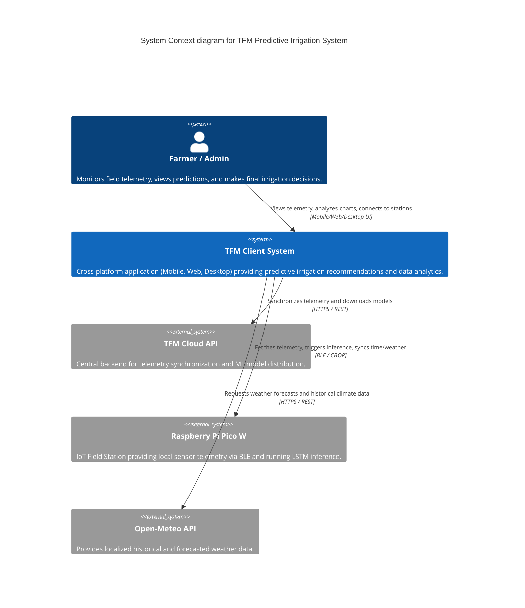

# C4 Context-Level Documentation

## 1. System Overview Section
### Short Description
The TFM Predictive Irrigation System is an intelligent, cross-platform agricultural application that combines local weather data, real-time IoT soil telemetry, and edge-based Machine Learning to provide predictive irrigation recommendations directly to farmers.

### Long Description
The system is built around a cross-platform application (Mobile, Web, and Desktop) that acts as the central hub. It connects with field IoT stations (Raspberry Pi Pico W) via BLE (Bluetooth Low Energy) to gather real-time environmental and soil humidity data. By retrieving meteorological forecasts from Open-Meteo, it provides environmental context to the local edge ML models. The system employs cross-inference: the IoT station runs an LSTM model to predict future soil moisture, while the client application evaluates this prediction alongside solar radiation using a Random Forest model to generate an actionable irrigation verdict. The user is ultimately responsible for the final irrigation decision. It is designed to work fully offline in the field (Mobile/Desktop) and sync data when internet access is available, ensuring resilient agricultural management.

## 2. Personas Section
- **Farmer / Agronomist (Human):** The primary user who operates the mobile application in the field to connect to IoT stations, view historical and predictive soil data, and make final informed decisions about when to irrigate crops.
- **System Administrator (Human):** Manages the cloud infrastructure, monitors system health via the Web dashboard, and updates the core Machine Learning models (TFLite) distributed to the applications.
- **TFM Cloud API (Programmatic):** The backend system that aggregates data from multiple client devices, synchronizes telemetry, and serves updated ML models.
- **Raspberry Pi Pico W (IoT Station) (Programmatic):** The field hardware equipped with sensors that collects soil telemetry, runs edge LSTM models, and acts as a BLE GATT Server.

## 3. System Features Section
- **Offline Field Monitoring:** Ability to connect securely (HMAC-SHA256) to IoT stations via BLE in remote agricultural areas with no internet coverage.
- **Predictive Irrigation Modeling:** Employs an LSTM model (on the IoT station) for soil moisture prediction and a Random Forest model (on the application) for combining predictions with solar radiation to generate irrigation recommendations.
- **Environmental Context Integration:** Fetches localized 24h historical and 48h forecasted weather data (including solar radiation and temperature) from Open-Meteo via automatic GPS or manual mapping.
- **Multi-Platform Analytics Dashboard:** Provides an interactive, scrollable analytical chart visualizing historical moisture, LSTM predictions, and radiation forecasts across Mobile, Web, and Desktop clients.
- **Data Synchronization:** Supports local Realm/Isar DB storage with batch writes and automatic cloud synchronization when network connectivity is restored.

## 4. User Journeys Section
### Journey 1: Field Data Collection & Irrigation Decision (Farmer - Mobile App)
1. The Farmer arrives at the field with no internet connection and opens the TFM Mobile App.
2. The app scans for nearby IoT Stations via BLE.
3. The Farmer connects to a specific Raspberry Pi Pico W station. The app performs secure HMAC authentication and synchronizes the time.
4. The app uploads the latest cached 24h temperature forecast to the station.
5. The app downloads the raw telemetry and triggers the LSTM inference on the station to get predicted moisture.
6. The app executes the local Random Forest model (TFLite), combining the predicted moisture and solar radiation.
7. The Farmer reviews the interactive analytical chart and the "Irrigation Needed" / "Irrigation Avoidable" verdict to make the final watering decision.

### Journey 2: Remote Aggregated Monitoring (Farmer / Admin - Web/Desktop App)
1. The Farmer or Admin logs into the TFM Web Application (or opens the Desktop App) from an office with internet access.
2. The application syncs with the TFM Cloud API to download the latest aggregated telemetry data from all field stations.
3. The user views comprehensive historical charts and weather forecasts for the upcoming 48 hours.
4. The Admin can verify the latest TFLite models are distributed properly to all clients.

## 5. External Systems and Dependencies Section
- **TFM Cloud API:** The central backend REST API used for telemetry synchronization, file storage, and Machine Learning model distribution.
- **Raspberry Pi Pico W (IoT Station):** The physical hardware in the field acting as a BLE GATT Server, collecting sensor data and executing local LSTM predictions.
- **Open-Meteo API:** A third-party HTTP service that provides localized 24-hour historical weather data and 48-hour forecasts, crucial for the environmental context.

## 6. System Context Diagram

## 7. Related Documentation Section
- [Container-Level Documentation](file:///C:/Users/CrackoPattt88/Proyectos/tfm_app/C4-Documentation/c4-container.md)
- [Component-Level Documentation](file:///C:/Users/CrackoPattt88/Proyectos/tfm_app/C4-Documentation/c4-component.md)
