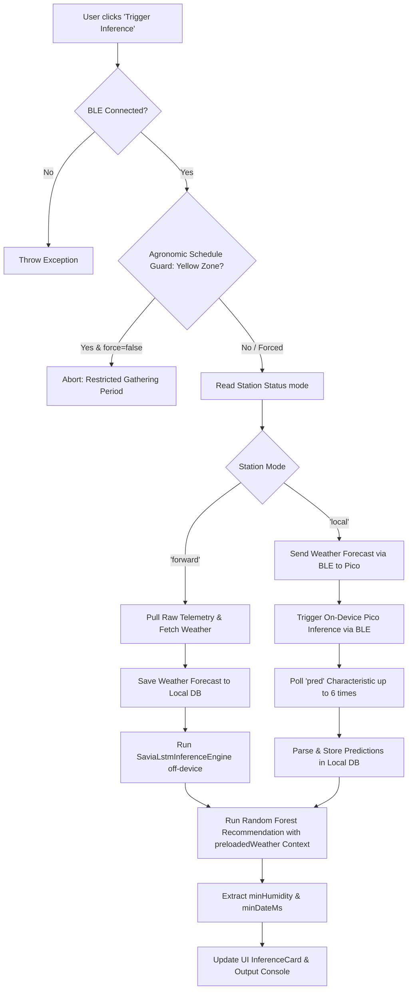

# Inference Entry Points Procedure Audit & Architecture Specifications

## Executive Summary

This document presents an architectural, logical, and verification audit of the three inference entry points within the application:
1. **Home Screen Entry Point** (`HomeScreen` via `triggerStationInference`)
2. **Storage Screen - Local DB Entry Point** (`StorageScreen` via `_handleLocalInference`)
3. **Storage Screen - Cloud Emulation Entry Point** (`StorageScreen` via `_handleCloudEmulation`)

The system relies on a two-stage hybrid machine learning pipeline:
- **Stage 1 (LSTM Soil Moisture Forecast)**: Predicts the 24-hour volumetric water content ($HS_{30}$) trajectory based on historical soil moisture and air temperature ($T_A$) forecasts.
- **Stage 2 (Random Forest Decision Classifier)**: Evaluates whether irrigation is needed (`IRRIGATION NEEDED`) or can be skipped (`IRRIGATION AVOIDABLE`) based on 48-hour accumulated shortwave solar radiation ($radSum$) and predicted soil moisture at $T_{24}$ ($predHum$).

---

## Applied Architectural Enhancements

Following an in-depth audit of the codebase, four critical enhancements were implemented across the inference pipeline:

1. **Network Redundancy Elimination (Zero-Roundtrip Context Sharing)**:
   - In `HomeScreen` (forward mode), Open-Meteo weather data fetched during Stage 1 is now cached as `preloadedWeatherData` and passed directly into Stage 2 (`runLocalInference`), eliminating duplicate HTTP calls.
2. **Dry-Run Mode for Auditing (`persistResults`)**:
   - `runLocalInference` now accepts `bool persistResults` (defaulting to `true`).
   - Local DB inspections on `StorageScreen` invoke inference with `persistResults: false`, enabling instant local evaluation without polluting the database or setting `isSynced = false`.
3. **Offline Solar Radiation Fallback (`HistoricalSolarModel`)**:
   - If network connectivity is unavailable during Stage 2, the pipeline queries local DB radiation telemetry records over $[T_{ref}-48h, T_{ref}]$.
   - If no telemetry exists, [`HistoricalSolarModel.estimateRadSum`](file:///C:/Users/CrackoPattt88/Proyectos/tfm_app/lib/features/ml_inference/inference_engine.dart#L11) computes a seasonal solar irradiance estimate based on latitude and solar declination, enabling 100% offline execution.
4. **Model Provenance Metadata Tagging**:
   - Predictions and evaluation payloads now return precise provenance tags:
     - `RF_DYNAMIC_V{version}`: Dynamic JSON model active.
     - `RF_LEGACY_COMPILED`: Fallback compiled Dart tree model.
     - `RF_CLOUD_EMULATED`: Pure RAM cloud emulation.

---

## 1. Entry Point Audit: Home Screen (`triggerStationInference`)

### 1.1 Trigger & Scope
- **File & Handler**: [`home_screen.dart`](file:///C:/Users/CrackoPattt88/Proyectos/tfm_app/lib/screens/home_screen.dart#L411-L418) calling [`CliRoutines.triggerStationInference()`](file:///C:/Users/CrackoPattt88/Proyectos/tfm_app/lib/cli_routines.dart#L360).
- **Primary Goal**: Immediate real-time execution triggered while connected to an active hardware module via Bluetooth Low Energy (BLE).

### 1.2 Step-by-Step Logical Procedure

1. **BLE Connection Validation**: Verifies that `bleService.isConnected` is true and extracts `devId`.
2. **Agronomic Schedule Guard**:
   - Reads `agronomicDayStart` and `agronomicDayEnd` from [`AppSettings`](file:///C:/Users/CrackoPattt88/Proyectos/tfm_app/lib/core/models/app_settings.dart).
   - If current time is within the **Yellow Zone** (gathering phase outside green operational hours) and `alwaysForceInference` is disabled, execution halts.
3. **Station Mode Branching**:
   - Reads station status via `readStationStatus()` to determine `mode` (`'forward'` vs `'local'`).
   - **`mode == 'forward'` (App-side Off-Device Inference)**:
     1. Requests 150 raw telemetry data points from BLE station (`requestStationData('raw')`).
     2. Fetches Open-Meteo weather forecast and caches it as `preloadedWeather`.
     3. Executes [`SaviaLstmInferenceEngine.runDailyInference(devId)`](file:///C:/Users/CrackoPattt88/Proyectos/tfm_app/lib/features/ml_inference/lstm_inference.dart#L70) off-device.
   - **`mode == 'local'` (On-Device Pico Station Firmware Inference)**:
     1. Transmits 48h past & 24h future temperature forecast via BLE.
     2. Triggers inference on hardware (`bleService.triggerInference()`).
     3. Polls prediction array from `pred` characteristic and saves to DB.
4. **Random Forest Classification**:
   - Invokes [`runLocalInference(devId, preloadedWeatherData: preloadedWeather, persistResults: true)`](file:///C:/Users/CrackoPattt88/Proyectos/tfm_app/lib/cli_routines.dart#L108).
   - Reuses `preloadedWeather` context to avoid extra network requests.
5. **Output Extraction & Rendering**:
   - Computes minimum predicted humidity (`minHumidity`) and timestamp (`minDateMs`).
   - Updates UI console and renders [`InferenceCard`](file:///C:/Users/CrackoPattt88/Proyectos/tfm_app/lib/screens/widgets/inference_card.dart).

---

## 2. Entry Point Audit: Storage Screen - Local DB (`_handleLocalInference`)

### 2.1 Trigger & Scope
- **File & Handler**: [`storage_screen.dart`](file:///C:/Users/CrackoPattt88/Proyectos/tfm_app/lib/screens/storage_screen.dart#L210) calling [`CliRoutines.runLocalInference(station.id, forceAllow: true, persistResults: false)`](file:///C:/Users/CrackoPattt88/Proyectos/tfm_app/lib/cli_routines.dart#L108).
- **Primary Goal**: Offline evaluation of saved telemetry and predictions stored locally without mutating sync status (`isSynced = false`).

### 2.2 Step-by-Step Logical Procedure

1. **UI State Setup**: Sets `_isInferring = true` and resets `_activeAiResult`.
2. **Dry-Run Audit Execution**: Calls `runLocalInference(station.id, forceAllow: true, persistResults: false)`.
3. **Database Pre-processing**:
   - Sanitizes corrupted future timestamps and resolves reference date $T_{ref}$.
4. **Feature Extraction**:
   - Extracts last prediction value $predHum = T_{24}$.
   - Normalizes $predHum$ to range $[0.0, 1.0]$.
   - Fetches Open-Meteo weather or activates [`HistoricalSolarModel`](file:///C:/Users/CrackoPattt88/Proyectos/tfm_app/lib/features/ml_inference/inference_engine.dart#L11) fallback if offline.
5. **Dynamic Random Forest Evaluation**:
   - Evaluates [`InferenceBridge.evaluateRecommendation(...)`](file:///C:/Users/CrackoPattt88/Proyectos/tfm_app/lib/features/ml_inference/inference_engine.dart#L175).
   - Identifies active model (`RF_DYNAMIC_V*` vs `RF_LEGACY_COMPILED`).
6. **Non-Destructive Persistence**:
   - Because `persistResults == false`, skips writing to Isar DB and maintains `isSynced` state.
7. **UI Card Construction**:
   - Renders `InferenceCard` with `source: 'LOCAL'`.

---

## 3. Entry Point Audit: Storage Screen - Cloud Emulation (`_handleCloudEmulation`)

### 3.1 Trigger & Scope
- **File & Handler**: [`storage_screen.dart`](file:///C:/Users/CrackoPattt88/Proyectos/tfm_app/lib/screens/storage_screen.dart#L264) calling [`CliRoutines.emulateCloudRecommendationInMemory(station.id)`](file:///C:/Users/CrackoPattt88/Proyectos/tfm_app/lib/cli_routines.dart#L527).
- **Primary Goal**: Complete cloud-side decision emulation in RAM with model provenance tagged as `RF_CLOUD_EMULATED`.

---

## 4. Architectural Comparison Matrix

| Audit Dimension | Home Screen (`triggerStationInference`) | Storage Screen - Local DB (`_handleLocalInference`) | Storage Screen - Cloud (`_handleCloudEmulation`) |
| :--- | :--- | :--- | :--- |
| **Execution Trigger** | Manual button (Live Device view) | Manual button (Unified Storage view) | Manual button (Unified Storage view) |
| **Hardware Requirement** | Active BLE connection required | Offline (Local Isar DB) | Offline / Cloud API reachable |
| **Persistence Default** | **Persisted** to DB (`persistResults: true`) | **Dry-Run Audit** (`persistResults: false`) | **Pure RAM** (Zero side-effects) |
| **Agronomic Guard** | Enforced (Yellow Zone blocks execution) | Bypassed (`forceAllow: true`) | Evaluated visually for presentation |
| **Weather Dependency** | Single API call (Reused context) | Local Cache $\rightarrow$ API $\rightarrow$ Historical Solar Model | Cloud API $\rightarrow$ Open-Meteo API |
| **Model Provenance Tag** | `RF_DYNAMIC_V*` / `RF_LEGACY_COMPILED` | `RF_DYNAMIC_V*` / `RF_LEGACY_COMPILED` | `RF_CLOUD_EMULATED` |
